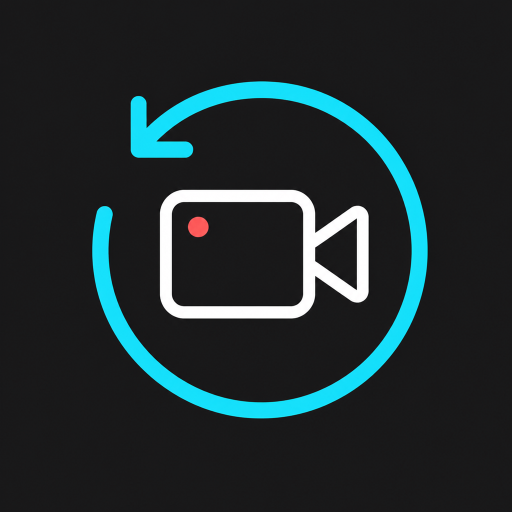
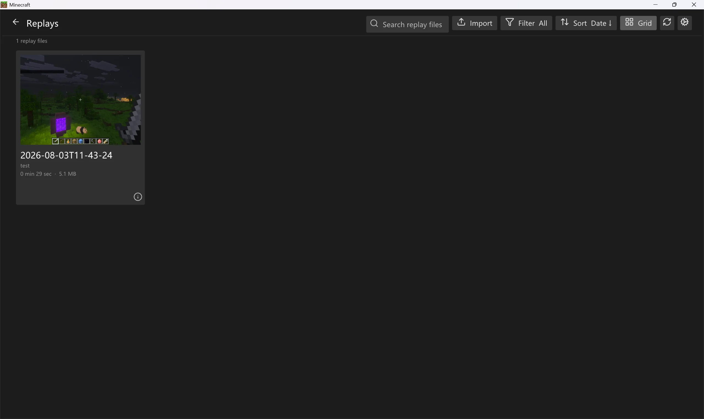
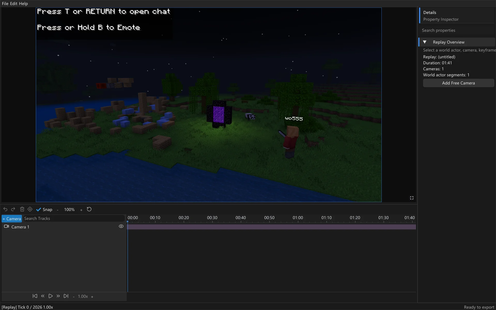

<div align="center">
  
  <h1>Playback</h1>
  <p><strong>Record, revisit, and replay Minecraft Bedrock.</strong></p>
  <p>A native LeviLamina client mod for recording, exporting, and replaying your sessions.</p>

  <p>
    <a href="https://github.com/wo55555/Playback/releases/tag/v0.1.1-mc26.10"></a>
    <a href="https://github.com/wo55555/Playback/releases/tag/v0.1.1-mc26.20"></a>
  </p>

  <p>
    <a href="https://github.com/wo55555/Playback/actions/workflows/build.yml"></a>
    <a href="LICENSE"></a>
    
  </p>

  <p>
    <a href="README.md"><strong>English</strong></a>
    ·
    <a href="README_ZH.md">简体中文</a>
  </p>

  <p>
    <a href="#features">Features</a>
    ·
    <a href="#showcase">Showcase</a>
    ·
    <a href="#quick-start">Quick Start</a>
    ·
    <a href="#build-from-source">Build</a>
    ·
    <a href="#development-status-and-roadmap">Roadmap</a>
    ·
    <a href="#contributing">Contributing</a>
  </p>
</div>

Playback is built on [LeviLamina](https://github.com/LiteLDev/LeviLamina). Its replay architecture is inspired by the Java Edition [Flashback](https://github.com/Moulberry/Flashback) mod and adapted to the Bedrock client lifecycle.

> [!WARNING]
> Playback is still in an early stage of development. All currently published releases are test builds. Keep backups of important worlds and recordings; replay compatibility is not guaranteed across Minecraft, LeviLamina, or Playback version changes.

## Showcase

<p align="center">
  <strong>Main menu integration</strong><br>
  
</p>

<p align="center">
  <strong>Native replay browser</strong><br>
  
</p>

<p align="center">
  <strong>In-game timeline editor</strong><br>
  
</p>

## Features

- **Session capture** — Records loaded chunks, block actors, entity movement, player state, time, and selected client-safe game packets.
- **Low-impact recording** — Writes replay snapshots and timeline data asynchronously to reduce recording stalls.
- **Portable archives** — Exports recordings as replay files that are easy to store and share.
- **Isolated playback** — Opens recordings from a native main-menu browser in a dedicated local replay world.
- **Timeline controls** — Supports play, pause, seek, speed control, and quick navigation during replay.
- **Bilingual UI** — Localizes commands, the replay editor, and the resource-pack UI in English and Simplified Chinese.

## Compatibility

Playback maintains parallel release lines for different Minecraft and LeviLamina versions. These releases contain the same Playback feature version; neither supersedes the other.

| Minecraft / LeviLamina | Playback release | Status |
| --- | --- | --- |
| `26.10.*` | [`v0.1.1-mc26.10`](https://github.com/wo55555/Playback/releases/tag/v0.1.1-mc26.10) | Maintained |
| `26.20.*` | [`v0.1.1-mc26.20`](https://github.com/wo55555/Playback/releases/tag/v0.1.1-mc26.20) | Maintained |

Both release lines target Minecraft Bedrock for Windows x64 and are distributed as client-only mods.

> [!TIP]
> Playback is a client-only mod that can record sessions in both local worlds and multiplayer servers.

## Quick Start

> [!IMPORTANT]
> When installing or testing Playback for the first time, use a clean LeviLamina instance without other third-party mods whenever possible. Other mods may conflict with Playback, and broad mod compatibility is not currently guaranteed. Compatibility with other mods will be tested and improved as development continues.

### Install with LeviLauncher and Lip (recommended)

The screenshots below use a `26.10` instance. For `26.20`, follow the same steps with the matching Minecraft and LeviLamina version. Labels and available test releases may change over time.

1. Select **Download** in the left sidebar, find the Minecraft version you want, and use its install menu to create an instance with the **LeviLamina** loader.

<p align="center">
  
</p>

2. Select **Instances** in the left sidebar, open the new instance's settings, and confirm under **Loader** that the matching LeviLamina version is installed.

<p align="center">
  
</p>

3. Select **Launch** in the left sidebar to return to the main page. Choose the target instance, then select **lip** under **Content Download**.

<p align="center">
  
</p>

4. Search for **Playback**, then open the Playback package published by `wo55555`.

<p align="center">
  
</p>

5. On the package page, manually choose the release whose **LL Requirement** and **Game Versions** match your instance, then use **Install** in that version's row. Lip does not select a Playback version based on the installed LeviLamina version. Launch or restart the game after installation.

<p align="center">
  
</p>

The **Playback** button should now appear on the Minecraft main menu. The UI resource pack is bundled with the mod and loads automatically.

### Install with the Lip CLI

From the root directory of the target LeviLamina instance, install the release that matches its Minecraft and LeviLamina version:

```powershell
# Minecraft / LeviLamina 26.10
lip install github.com/wo55555/Playback@0.1.1-mc26.10#client

# Minecraft / LeviLamina 26.20
lip install github.com/wo55555/Playback@0.1.1-mc26.20#client
```

> [!NOTE]
> The `#client` variant is required. If `@version` is omitted, Lip installs the latest available Playback release; it does not automatically choose a version based on the installed LeviLamina version. Always specify and verify the matching release before launching the game.

### Manual installation

If you cannot use Lip, download `Playback-client-windows-x64.zip` from the matching release:

- [`v0.1.1-mc26.10`](https://github.com/wo55555/Playback/releases/tag/v0.1.1-mc26.10) for `26.10.*`
- [`v0.1.1-mc26.20`](https://github.com/wo55555/Playback/releases/tag/v0.1.1-mc26.20) for `26.20.*`

Extract the archive's `playback` directory into the LeviLamina instance's `mods` directory, then restart the client. Each release also provides `playback-ui.mcpack` for standalone manual import; it is not required when installing the complete mod ZIP.

### Record

Join a world, open the client command console, and use:

```text
record start
record pause
record stop
```

`record start` begins or resumes recording, `record pause` pauses capture, and `record stop` finishes and exports the replay. Exported `.zip` files are stored in Playback's `data/replays` directory.

### Replay

1. Return to the main menu and select **Playback**.
2. Choose a `.playback` or compatible `.zip` replay from the browser.
3. Wait for the isolated replay world and initial chunks to finish loading.
4. Use the bottom timeline to play, pause, seek, change speed, or jump to either end. Use **File > Exit Replay** to leave.

## Build From Source

Requirements:

- Visual Studio 2022 with the MSVC C++ toolchain
- [xmake](https://xmake.io/)
- Git

Configure and build a clean Release client target:

```powershell
xmake f -y -p windows -a x64 -m release --target_type=client
xmake -r -y
```

The packaged mod is written to `bin/playback/`, including translations under `bin/playback/lang/` and the automatically loaded UI pack under `bin/playback/resource_packs/playback-ui/`. The build also generates `bin/playback-ui.mcpack` as a standalone resource-pack asset.

If prelink reports that `bedrock_runtime_data` cannot be found, refresh the package configuration and rebuild:

```powershell
xmake repo -u
xmake f -c -y -p windows -a x64 -m release --target_type=client
xmake -r -y
```

## Commands

| Command | Description |
| --- | --- |
| `playback version` | Show the loaded Playback version. |
| `record start` | Start or resume recording the current world. |
| `record pause` | Pause the active recording. |
| `record stop` | Stop recording and export the replay. |

## Languages

Playback currently includes English (`en_US`) and Simplified Chinese (`zh_CN`) translations. Command and replay-editor translations are stored in `src/lang/`; resource-pack UI translations are stored in `resources/texts/`.

## Development Status and Roadmap

- The recording, export, and replay GUIs are under active development and optimization.
- Multiplayer server recording and replay will receive further debugging; testing and feedback are welcome.
- Planned features include camera movement, video rendering, and video export.

## Known Limitations

- The replay format is still under development and may change during Alpha releases.
- Playback reconstructs recorded client-visible state; it is not a deterministic copy of the original server simulation.
- Pending scheduled ticks and server-owned systems such as villages, raids, and POI state are not currently persisted as authoritative simulation state.
- Compatibility must be checked again after updating Minecraft or LeviLamina.

Please report reproducible problems with logs, versions, and a minimal replay where possible.

See the [changelog](CHANGELOG.md) for release history, or [open an issue](https://github.com/wo55555/Playback/issues) to report a reproducible problem.

## Contributing

See [CONTRIBUTING.md](CONTRIBUTING.md) for the build, formatting, and pull request workflow.

For questions and project discussion, join the [Discord server](https://discord.gg/mUhRUD8AM) or the [QQ group](https://qm.qq.com/q/ufJatMDcha).

Report security issues privately by following [SECURITY.md](SECURITY.md). Do not open a public issue for a security vulnerability.

## Acknowledgements

Special thanks to the [LeviLamina](https://github.com/LiteLDev/LeviLamina) maintainers and community for providing the native modding platform and tooling that make Playback possible, and to the [Flashback](https://github.com/Moulberry/Flashback) project and its contributors for the replay concepts and architecture that inspired Playback.

## License

Copyright (C) 2026 [wo555](https://github.com/wo55555)

Playback is released under the [GNU Affero General Public License v3.0](LICENSE). Distributed modifications must remain under AGPL-3.0 and provide their corresponding source code. Third-party components retain their own licenses; see [THIRD_PARTY_NOTICES.md](THIRD_PARTY_NOTICES.md) and the `licenses/` directory.
