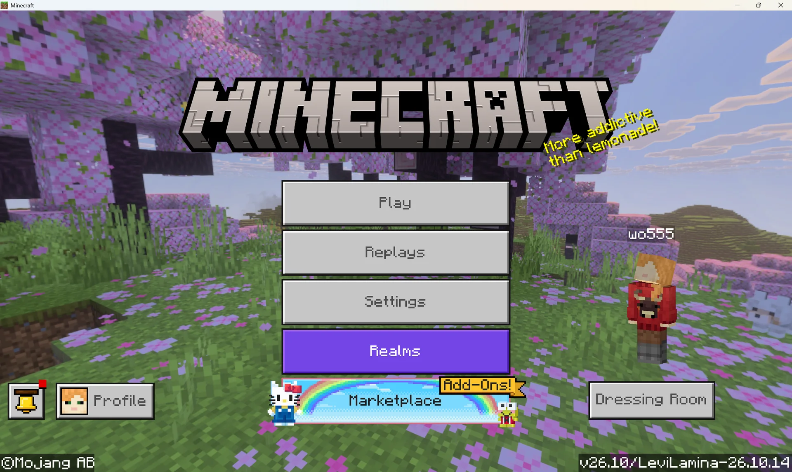
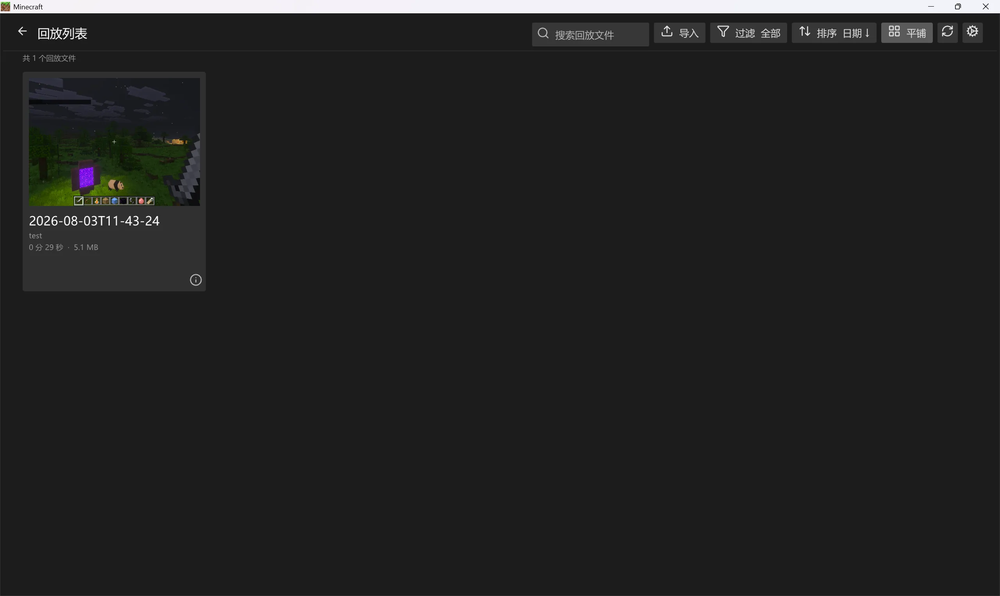
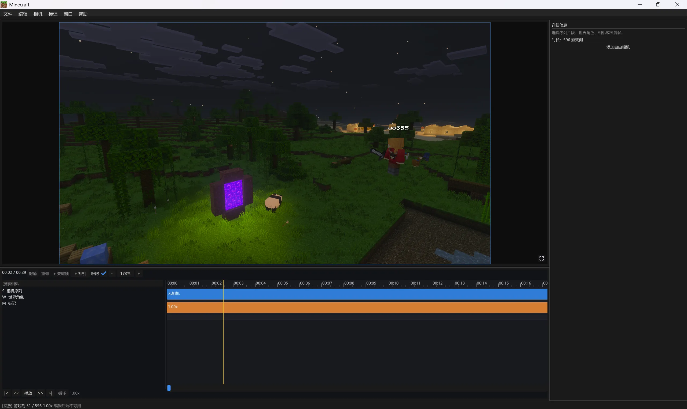

<div align="center">
  
  <h1>Playback</h1>
  <p><strong>录下此刻，再现世界。</strong></p>
  <p>用于录制、导出和回放 Minecraft 基岩版游戏过程的 LeviLamina 客户端原生模组。</p>

  <p>
    <a href="https://github.com/wo55555/Playback/releases/tag/v0.1.1-mc26.10"></a>
    <a href="https://github.com/wo55555/Playback/releases/tag/v0.1.1-mc26.20"></a>
  </p>

  <p>
    <a href="https://github.com/wo55555/Playback/actions/workflows/build.yml"></a>
    <a href="LICENSE"></a>
    
  </p>

  <p>
    <a href="README.md">English</a>
    ·
    <a href="README_ZH.md"><strong>简体中文</strong></a>
  </p>

  <p>
    <a href="#功能">功能</a>
    ·
    <a href="#运行展示">运行展示</a>
    ·
    <a href="#快速开始">快速开始</a>
    ·
    <a href="#从源码构建">构建</a>
    ·
    <a href="#开发状态与计划">开发计划</a>
    ·
    <a href="#参与贡献">参与贡献</a>
  </p>
</div>

Playback 基于 [LeviLamina](https://github.com/LiteLDev/LeviLamina) 构建。回放架构参考了 Java 版 [Flashback](https://github.com/Moulberry/Flashback) 模组，并针对基岩版客户端生命周期进行了适配。

> [!WARNING]
> Playback 目前仍处于早期开发阶段，现有公开版本均为测试版本。请备份重要世界和录制文件；在 Minecraft、LeviLamina 或 Playback 版本发生变化后，不保证旧回放仍然兼容。

## 运行展示

<p align="center">
  <strong>主菜单入口</strong><br>
  
</p>

<p align="center">
  <strong>原生回放浏览器</strong><br>
  
</p>

<p align="center">
  <strong>游戏内时间线编辑器</strong><br>
  
</p>

## 功能

- **游戏录制** — 捕获已加载区块、方块实体、实体移动、玩家状态、时间和经过筛选的客户端安全数据包。
- **低开销写入** — 异步写入回放快照和时间线数据，减少录制过程中的卡顿。
- **便携归档** — 将录制结果导出为便于保存和分享的回放文件。
- **隔离回放** — 通过原生主菜单回放浏览器，在独立的本地回放世界中打开录制内容。
- **时间线控制** — 支持播放、暂停、跳转、倍速调整和快速定位。
- **双语界面** — 为命令、回放编辑器和资源包 UI 提供英文及简体中文本地化。

## 兼容性

Playback 针对不同 Minecraft 与 LeviLamina 版本并行维护发布。以下版本具有相同的 Playback 功能版本，仅适配的游戏版本不同，两者不存在新旧替代关系。

| Minecraft / LeviLamina | Playback 版本 | 状态 |
| --- | --- | --- |
| `26.10.*` | [`v0.1.1-mc26.10`](https://github.com/wo55555/Playback/releases/tag/v0.1.1-mc26.10) | 维护中 |
| `26.20.*` | [`v0.1.1-mc26.20`](https://github.com/wo55555/Playback/releases/tag/v0.1.1-mc26.20) | 维护中 |

两个版本均面向 Windows x64 平台的 Minecraft 基岩版，并以纯客户端模组形式发布。

> [!TIP]
> Playback 为纯客户端模组，支持客户端与服务端录制。

## 快速开始

> [!IMPORTANT]
> 首次安装或测试 Playback 时，建议尽量使用未安装其他第三方模组的独立 LeviLamina 实例，以避免潜在的模组冲突。目前暂不保证与其他模组兼容；后续开发将逐步测试并改善相关兼容性。

### 使用 LeviLauncher 和 Lip 安装（推荐）

以下截图以 `26.10` 实例为例。使用 `26.20` 时，请按照相同步骤选择与其匹配的 Minecraft 和 LeviLamina 版本。界面文字及可用测试版本可能随更新而变化。

1. 在左侧边栏选择 **Download（下载）**，找到需要的 Minecraft 版本，通过该版本的安装菜单创建使用 **LeviLamina** 加载器的实例。

<p align="center">
  
</p>

2. 在左侧边栏选择 **Instances（实例）**，打开新实例的设置，在**加载器**页面确认对应版本的 LeviLamina 已经安装。

<p align="center">
  
</p>

3. 在左侧边栏选择 **Launch（启动）**返回主页面，选中目标实例，然后在**内容下载**区域选择 **lip**。

<p align="center">
  
</p>

4. 搜索 **Playback**，然后打开由 `wo55555` 发布的 Playback 软件包。

<p align="center">
  
</p>

5. 在软件包页面手动选择 **LL 依赖**和**游戏版本**与当前实例一致的版本，然后点击该版本所在行的**安装**。Lip 不会根据已安装的 LeviLamina 版本自动选择对应的 Playback 版本。安装完成后启动或重启游戏。

<p align="center">
  
</p>

完成后，Minecraft 主菜单中应显示 **Playback** 按钮。模组已经内置 UI 资源包，无需另行导入。

### 使用 Lip 命令行安装

在目标 LeviLamina 实例的根目录中，根据其 Minecraft 和 LeviLamina 版本执行对应命令：

```powershell
# Minecraft / LeviLamina 26.10
lip install github.com/wo55555/Playback@0.1.1-mc26.10#client

# Minecraft / LeviLamina 26.20
lip install github.com/wo55555/Playback@0.1.1-mc26.20#client
```

> [!NOTE]
> 安装客户端变体时必须保留末尾的 `#client`。如果省略 `@版本号`，Lip 会安装当前最新的 Playback 版本，并不会根据已安装的 LeviLamina 版本自动选择兼容版本。启动游戏前，请始终明确指定并核对匹配的版本。

### 手动安装

如果无法使用 Lip，请从对应的 Release 下载 `Playback-client-windows-x64.zip`：

- `26.10.*` 使用 [`v0.1.1-mc26.10`](https://github.com/wo55555/Playback/releases/tag/v0.1.1-mc26.10)
- `26.20.*` 使用 [`v0.1.1-mc26.20`](https://github.com/wo55555/Playback/releases/tag/v0.1.1-mc26.20)

将压缩包内的 `playback` 目录解压到 LeviLamina 实例的 `mods` 目录，然后重启客户端。各 Release 仍提供独立的 `playback-ui.mcpack` 供手动导入；安装完整模组 ZIP 时无需另行导入。

### 录制

进入世界后，打开客户端命令控制台并使用：

```text
record start
record pause
record stop
```

`record start` 开始或继续录制，`record pause` 暂停录制，`record stop` 结束录制并导出回放。导出的 `.zip` 文件位于 Playback 的 `data/replays` 目录。

### 回放

1. 返回主菜单并选择 **Playback**。
2. 在回放浏览器中选择 `.playback` 或兼容的 `.zip` 回放文件。
3. 等待隔离回放世界和初始区块加载完成。
4. 使用底部时间线播放、暂停、跳转、调整倍速或跳至时间线两端；使用 **File > Exit Replay** 退出回放。

## 从源码构建

环境要求：

- 带有 MSVC C++ 工具链的 Visual Studio 2022
- [xmake](https://xmake.io/)
- Git

配置并执行干净的 Release 客户端构建：

```powershell
xmake f -y -p windows -a x64 -m release --target_type=client
xmake -r -y
```

打包后的模组位于 `bin/playback/`，翻译文件位于 `bin/playback/lang/`，自动加载的 UI 资源包位于 `bin/playback/resource_packs/playback-ui/`。构建过程还会生成 `bin/playback-ui.mcpack`，作为独立资源包资产发布。

如果 prelink 报告无法找到 `bedrock_runtime_data`，请刷新包配置并重新构建：

```powershell
xmake repo -u
xmake f -c -y -p windows -a x64 -m release --target_type=client
xmake -r -y
```

## 命令

| 命令               | 说明                           |
| ------------------ | ------------------------------ |
| `playback version` | 显示当前加载的 Playback 版本。 |
| `record start`     | 开始或继续录制当前世界。       |
| `record pause`     | 暂停当前录制。                 |
| `record stop`      | 停止录制并导出回放。           |

## 语言

Playback 目前提供英文（`en_US`）和简体中文（`zh_CN`）翻译。命令与回放编辑器的翻译文件位于 `src/lang/`，资源包 UI 的翻译文件位于 `resources/texts/`。

## 开发状态与计划

- 录制、导出和回放 GUI 正在持续构建与优化中。
- 后续将重点调试多人服务器会话的录制与回放，欢迎测试并反馈问题。
- 计划开发摄影机运动、视频渲染与导出等功能。

## 已知限制

- 回放格式仍在开发中，Alpha 版本之间可能发生变化。
- Playback 重建的是已录制的客户端可见状态，并不是原始服务器模拟过程的确定性副本。
- 当前不会将待执行计划刻和村庄、袭击、POI 等服务端系统保存为权威模拟状态。
- Minecraft 或 LeviLamina 更新后，需要重新确认兼容性。

报告可复现问题时，请尽量附带日志、相关版本和最小回放文件。

版本历史见[更新日志](CHANGELOG.md)；如需报告可复现问题，请[创建 Issue](https://github.com/wo55555/Playback/issues)。

## 参与贡献

构建、格式化和 Pull Request 流程见 [CONTRIBUTING.md](CONTRIBUTING.md)。

如需交流或讨论项目，可加入 [Discord 服务器](https://discord.gg/mUhRUD8AM)或 [QQ 群](https://qm.qq.com/q/ufJatMDcha)。

安全问题请按照 [SECURITY.md](SECURITY.md) 私下报告，不要为安全漏洞创建公开 Issue。

## 致谢

特别感谢 [LeviLamina](https://github.com/LiteLDev/LeviLamina) 的维护者与社区提供原生模组开发平台和工具，使 Playback 得以实现；同时感谢 [Flashback](https://github.com/Moulberry/Flashback) 项目及其贡献者，其回放理念与架构为 Playback 提供了重要启发。

## 许可证

Copyright (C) 2026 [wo555](https://github.com/wo55555)

Playback 采用 [GNU Affero 通用公共许可证 v3.0](LICENSE) 发布。分发修改版本时必须继续使用 AGPL-3.0，并提供对应源代码。第三方组件保留各自许可证，详情见 [THIRD_PARTY_NOTICES.md](THIRD_PARTY_NOTICES.md) 和 `licenses/` 目录。
