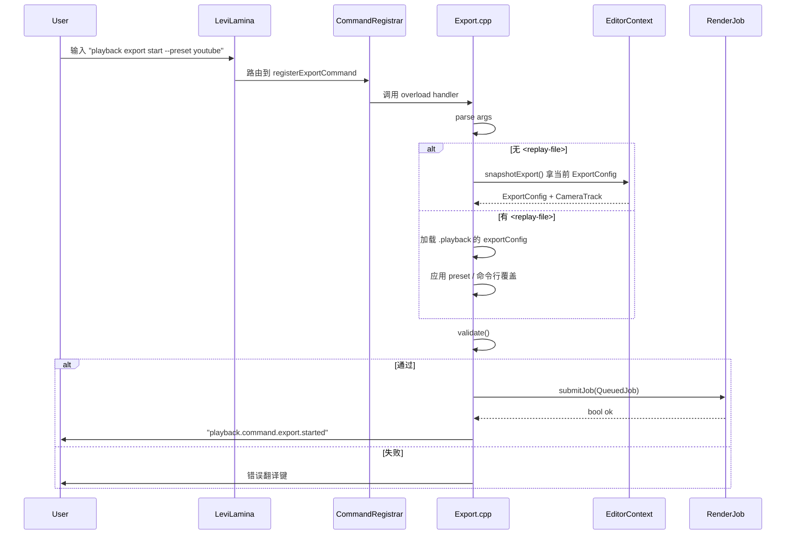

# command/export — `playback export` 命令族

> 入口：`src/playback/command/Export.{h,cpp}`
> 角色：在客户端控制台注册 `playback export` 命令族，**不依赖 ImGui**（主菜单可触发，调试也方便）。命令最终把 `ExportConfig` + `CameraTrack` 提交给 `RenderJob::getInstance().submitJob(...)`。

## 一、需求（Requirements）

### 1.1 功能性需求

| ID | 需求 | 优先级 |
|---|---|---|
| EX-1 | `playback export start` —— 用"最近一次编辑器的 ExportConfig"启动导出 | P0 |
| EX-2 | `playback export start <replay-file>` —— 指定回放文件 + 默认配置 | P0 |
| EX-3 | `playback export start --preset <name>` —— 用内置预设 | P1 |
| EX-4 | `playback export cancel` —— 取消当前 job | P0 |
| EX-5 | `playback export status` —— 打印进度 / 状态 | P0 |
| EX-6 | `playback export list-queue` —— 列出队列 | P1 |
| EX-7 | `playback export set <key> <value>` —— 命令行改 ExportConfig 字段 | P1 |
| EX-8 | `playback export preset` —— 列出 / 选预设 | P1 |

### 1.2 非功能性需求

- **不依赖 ImGui**：纯命令行可跑（主菜单不可用时调试用）。
- **错误信息清晰**：参数解析失败 / 找不到回放 / 校验失败都有翻译键。
- **可禁用**：通过 `Playback::getConfig().command.export` 控制整族启用 / 禁用。

### 1.3 与现有约束对齐

- 复用 `registerXxxCommand` 模式（[command/index.md](file:///d:/raplay/Playback/docs/command/index.md)）。
- 复用 `Playback::getConfig().command` 配置结构。
- 复用 `RenderJob::getInstance()` 提交 / 取消 / 状态查询。

## 二、架构（Architecture）

### 2.1 内部结构

```
command/
├── Command.h / .cpp               ← 现有
├── Record.cpp                     ← 现有
├── Export.h / .cpp                ← 本模块
└── ExportArgParser.h / .cpp       ← 参数解析
```

### 2.2 命令族

```text
playback export
  start
    [<replay-file>]
    [--preset <name>]
    [--aspect 16:9|9:16|1:1|4:3|21:9|custom]
    [--width <px>] [--height <px>]
    [--fps <n>]
    [--container mp4|mov|webm|mkv|png-sequence]
    [--codec h264|h265|vp9|prores|png]
    [--crf <0-51>] [--bitrate <kbps>]
    [--rc crf|cbr|vbr]
    [--in <tick>] [--out <tick>]
    [--output <path>]
    [--audio include|exclude|only]
    [--overwrite]
  cancel
  status
  list-queue
  set <key> <value>                # 当前 ExportConfig 改字段
  preset list|use <name>
```

### 2.3 数据流



### 2.4 参数解析

```cpp
// ExportArgParser.h
struct ExportArgs {
    std::string replayFile;
    std::string preset;
    AspectRatio aspect = AspectRatio::R16x9;
    int         width = 0, height = 0;  // 0 = 不改
    int         fps = 0;
    ContainerFormat container = ContainerFormat::Mp4;
    VideoCodec      codec = VideoCodec::H264;
    RateControlMode rcMode = RateControlMode::Crf;
    int         crf = -1;
    int         bitrate = -1;
    int         inTick = -1, outTick = -1;
    std::string outputPath;
    ExportConfig::AudioMode audioMode = ExportConfig::AudioMode::Include;
    bool        overwrite = false;
};

ExportArgs parseExportArgs(const std::vector<std::string>& argv);
ExportConfig applyToConfig(const ExportConfig& base, const ExportArgs& args);
```

**示例**：

```text
playback export start data/replays/2026-07-29.zip --preset youtube --fps 30
playback export start data/replays/foo.zip --aspect 9:16 --width 1080 --height 1920
playback export cancel
playback export status
```

### 2.5 命令实现骨架

```cpp
// Export.cpp
void registerExportCommand(CommandRegistrar& r) {
    auto& exportCmd = r.getOrCreateCommand("export", "playback.command.export.description"_tr());
    exportCmd.overload().text("start").execute([](const CommandOrigin&, CommandOutput& out) {
        auto args = parseExportArgs(getRemainingArgs());
        auto config = resolveConfig(args);  // preset + cli overrides
        auto cameraTracks = resolveCameraTracks(args);
        if (auto errs = config.validate(); !errs.empty()) {
            out.error(formatErrors(errs));
            return;
        }
        if (!RenderJob::getInstance().submitJob({config, cameraTracks, args.replayFile})) {
            out.error("playback.command.export.queueFull"_tr());
            return;
        }
        out.success("playback.command.export.started"_tr());
    });
    exportCmd.overload().text("cancel").execute([](const CommandOrigin&, CommandOutput& out) {
        RenderJob::getInstance().cancelCurrent();
        out.success("playback.command.export.cancelled"_tr());
    });
    exportCmd.overload().text("status").execute([](const CommandOrigin&, CommandOutput& out) {
        auto p = RenderJob::getInstance().snapshot();
        out.success(std::format("{}% ({}/{}) state={}", p.framesDone * 100 / std::max(1, p.framesTotal), p.framesDone, p.framesTotal, (int)p.state));
    });
    // ... list-queue / set / preset
}
```

### 2.6 翻译键

```text
playback.command.export.description
playback.command.export.start.started
playback.command.export.start.noReplay
playback.command.export.start.invalidArgs
playback.command.export.start.invalidConfig
playback.command.export.start.queueFull
playback.command.export.cancel.cancelled
playback.command.export.cancel.noActiveJob
playback.command.export.status.{Idle|Preparing|Encoding|Finalizing|Done|Failed|Cancelled}
playback.command.export.listQueue.empty
playback.command.export.set.invalidKey
playback.command.export.preset.list
playback.command.export.preset.notFound
```

### 2.7 配置扩展

`Playback::getConfig().command` 增：

```cpp
struct CommandConfigStruct {
    bool playback{true};
    bool record{true};
    bool export_{true};               // 新增
    std::string recordCommand{"record"};
    std::string exportCommand{"export"};  // 新增（支持改名）
};
```

`playback export` 命令族注册条件：`config.command.export_ && config.command.exportCommand` 非空。

## 三、执行（Execution）

### 3.1 任务拆分

| 步骤 | 文件 | 验证 |
|---|---|---|
| 1 | `ExportArgParser.{h,cpp}` | 单测：每种参数组合 parse 正确 |
| 2 | `applyToConfig` 覆盖逻辑 | 单测：cli 覆盖 base |
| 3 | `Export.h/.cpp` 主体 | 编译 |
| 4 | `registerExportCommand` | 手动：每条命令在控制台能调 |
| 5 | `Playback::setupCommands` 注册 | 编译 |
| 6 | `CommandConfigStruct` 增字段 | 编译 + 旧配置可读 |
| 7 | 翻译键写入 `src/lang/*.json` | 翻译可读 |
| 8 | 与 RenderJob 集成 | 手动：`playback export start` 触发 |

### 3.2 关键算法

**preset 覆盖**：

```cpp
ExportConfig resolveConfig(const ExportArgs& args) {
    ExportConfig cfg = loadBaseConfig(args);  // 1) editor 或 replayFile 的 exportConfig

    if (!args.preset.empty()) {
        // 2) 应用 preset
        for (auto& p : kBuiltin) {
            if (p.name == args.preset) { cfg = p.config; break; }
        }
    }

    // 3) 命令行覆盖
    if (args.aspect) cfg.aspect = *args.aspect;
    if (args.width > 0)  cfg.width = args.width;
    if (args.height > 0) cfg.height = args.height;
    if (args.fps > 0)    cfg.fps = args.fps;
    if (args.container)  cfg.container = *args.container;
    if (args.codec)      cfg.codec = *args.codec;
    if (args.crf >= 0)   { cfg.crf = args.crf; cfg.rcMode = RateControlMode::Crf; }
    if (args.bitrate > 0){ cfg.bitrateKbps = args.bitrate; }
    if (args.inTick >= 0) cfg.inTick = args.inTick;
    if (args.outTick > 0) cfg.outTick = args.outTick;
    if (!args.outputPath.empty()) cfg.outputPath = args.outputPath;
    cfg.audioMode = args.audioMode;
    cfg.overwrite = args.overwrite;

    return cfg;
}
```

**replayFile 解析**：

```cpp
ExportConfig loadBaseConfig(const ExportArgs& args) {
    if (args.replayFile.empty()) {
        // 用 EditorContext 当前 config
        return EditorContext::getInstance().snapshotExport().config;
    }
    // 读 .playback 的 metadata.json.exportConfig
    auto meta = PlaybackMeta::fromFile(args.replayFile);
    return meta.exportConfig.value_or(ExportConfig{});
}
```

### 3.3 关键不变量

1. **命令是 EditAction 的另一入口**：`playback export` 和 ImGui 面板**共享** `RenderJob::submitJob`；行为一致。
2. **`playback export status` 只读**：不修改 RenderJob 状态。
3. **cancel 安全**：`cancelCurrent` 可在任何状态调；幂等。
4. **错误信息必含 i18n key**：`out.error("..."_tr())` 不写硬编码字符串。

### 3.4 测试用例

| ID | 用例 | 期望 |
|---|---|---|
| EX-T1 | `playback export start` 无参 | 失败，提示缺 replay-file |
| EX-T2 | `playback export start data/r.zip --preset youtube` | 提交成功，job 跑 |
| EX-T3 | `playback export start --aspect bogus` | 失败，提示 invalid aspect |
| EX-T4 | `playback export cancel` 无 active job | 失败，提示 no active job |
| EX-T5 | `playback export status` encoding 中 | 输出 `45% (1350/3000) state=Encoding` |
| EX-T6 | `playback export set width 1280` | 当前 ExportConfig 改 width |
| EX-T7 | `playback export preset list` | 输出 6 个内置名 |

### 3.5 风险与回退

| 风险 | 缓解 |
|---|---|
| 参数解析歧义 | 严格位置参数 + `--key value` 形式 |
| 路径含空格 | 引号包路径；FFmpeg 子进程用 `argv` 不用 `cmdline` |
| 命令名冲突 | `command.exportCommand` 允许改名（与 record 同机制） |
| 多用户并发 submit | RenderJob 队列化；FIFO 串行 |

## 四、模块关系

### 被谁调用（上游）

- **LeviLamina 框架**：用户在控制台输入命令时调用对应 overload。
- **`Playback::setupCommands`**：注册命令族。

### 调用谁（下游）

- **`RenderJob::submitJob / cancelCurrent / snapshot`**：执行 / 取消 / 状态。
- **`EditorContext::snapshotExport`**：读当前 UI 配置。
- **`PlaybackMeta::fromFile`**：读 `.playback` 内 exportConfig。
- **`ExportPresets::kBuiltin`**：preset 反查。
- **`ExportConfig::validate`**：参数校验。

### 共享数据

- **`Playback::getConfig().command`**：启用 / 禁用 / 改名。
- **`EditorContext::mExportExt`**：读当前 UI 配置（无 replay-file 时）。

### 事件订阅 / 发送

- **不订阅**。在 `ClientCommandRegisterEvent` 中被 `Playback` 间接注册。

## 五、阅读顺序

1. 本文件
2. [editor/export-config.md](file:///d:/raplay/Playback/docs/editor/export-config.md)：数据模型
3. [functions/render/render-job.md](file:///d:/raplay/Playback/docs/functions/render/render-job.md)：执行方
4. [command/index.md](file:///d:/raplay/Playback/docs/command/index.md)：注册机制
