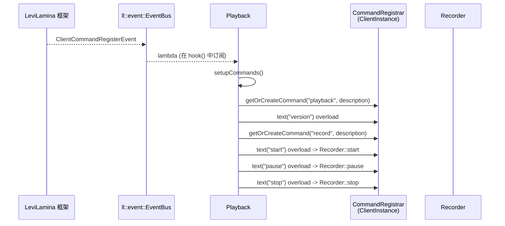

# command

## 职责

注册到 LeviLamina 客户端命令注册器的命令族。命令注册发生在 `ClientCommandRegisterEvent` 事件里，由 `Playback::setupCommands()` 触发。

当前只注册两个族：

- `playback` — 展示 mod 版本
- `record` — 录制生命周期（`start` / `pause` / `stop`）

`record` 命令族可以被禁用 / 重命名（见 [playback/config.md](../playback/config.md)）。

## 文件

| 文件 | 说明 |
| --- | --- |
| `src/playback/command/Command.h` | 两个 `registerXxxCommand` 声明 |
| `src/playback/command/Command.cpp` | `registerPlaybackCommand` |
| `src/playback/command/Record.cpp` | `registerRecordCommand` |

## 命令一览

### `playback version`

```text
playback version
```

读 `Playback::getInstance().getSelf().getManifest().version`，输出 `v<version>`；不可用时输出 `playback.command.playback.versionUnavailable` 翻译键。

### `record start`

```text
record start
```

`Recorder::getInstance().start()`。`start()` 的实际行为：

- `mState == Paused` → 切回 `Recording`，return（不重新 init）。
- `Playback::isReplayMode()` → 拒绝（mState 置 `Idle`，打 debug 日志）。
- `mState == Idle` → 调 `resetStateForNewRecording()`（分配 `AsyncReplaySaver`、清理上一会话状态、生成录制玩家 ID），然后 `hookNetwork(true)`，最后置 `Recording`。
- 其它情况 → 已是 `Recording` / `Closing`，debug 日志忽略。

成功时输出翻译键 `playback.command.record.started`。

### `record pause`

`Recorder::getInstance().pause()`。仅在 `mState == Recording` 时把状态切到 `Paused`。

### `record stop`

`Recorder::getInstance().stop()`。状态机：

- `Idle` → debug 日志忽略，return。
- `Closing` → debug 日志忽略，return。
- 其它 → 切到 `Closing`，跑一次 `endTick(true)`，打统计日志，调用 `saveRecording` → `ReplayExporter::exportReplay` → 删除临时目录。

成功时输出翻译键 `playback.command.record.stopped`。

## 注册流程



## 翻译键

i18n 键通过 `using ll::i18n_literals::operator""_tr;` 在编译期查表，对应 `src/lang/zh_CN.json` 和 `src/lang/en_US.json`：

- `playback.command.playback.description` / `playback.command.playback.versionUnavailable`
- `playback.command.record.description` / `playback.command.record.started` / `playback.command.record.paused` / `playback.command.record.stopped`

## 模块关系

### 被谁调用

- `Playback::setupCommands()` 调用 `registerPlaybackCommand` + `registerRecordCommand`。
- 用户在聊天框输入命令时由 LeviLamina 框架把 overload 调起，最终调 `Recorder` 的方法。

### 调用谁

- `Recorder::getInstance().start/pause/stop`。
- `Playback::getInstance().getSelf().getManifest()` / `getLogger()`。

### 共享数据

- 通过 `Playback::getConfig().command.record` 读 `enabled` 和命令名（仅 `Record` 族）。

### 事件

- 自身不订阅事件；只在 `ClientCommandRegisterEvent` 中被 `Playback` 间接注册。

## 扩展点

- 新增 overload：在 `registerRecordCommand` 里继续 `recordCommand.overload().text("...")`。
- 新增命令族：写一个 `registerXxxCommand(...)`（参数按需），在 `Playback::setupCommands()` 调用。
- 改命令名 / 禁用：编辑 `src/playback/Config.h` 的 `CommandConfigStruct` 默认值。
