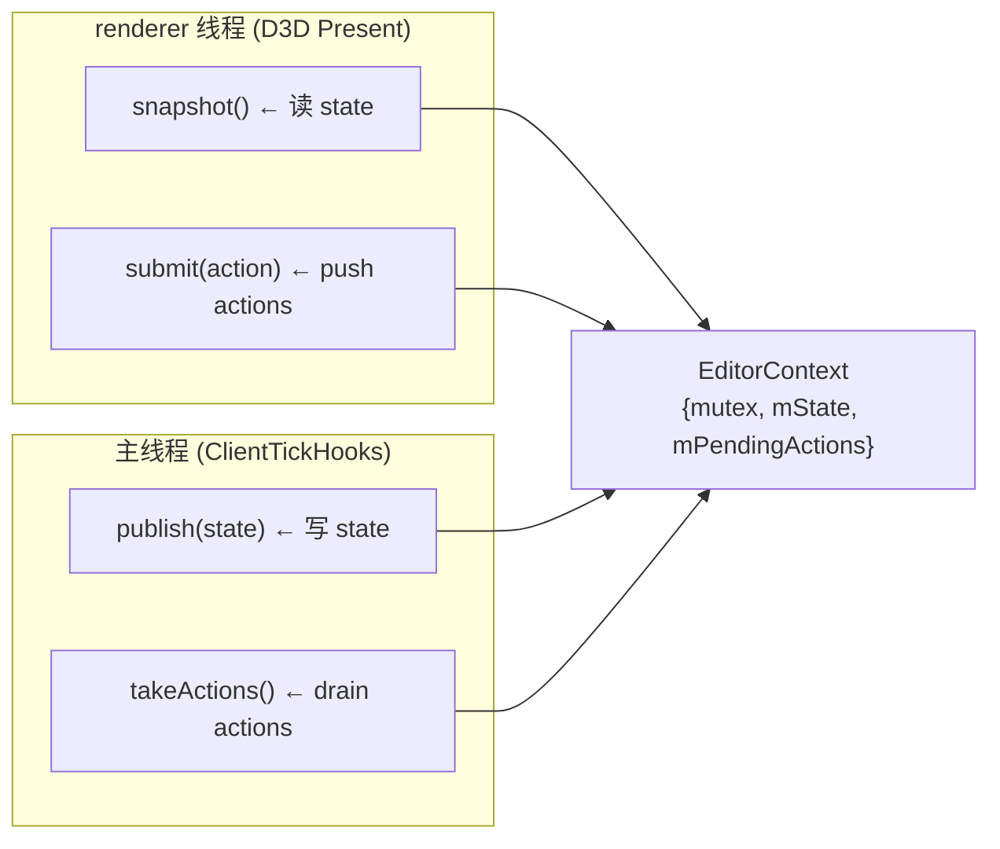

# editor/context — UI ↔ Controller 通信协议

> 入口：[`d:\raplay\Playback\src\playback\editor\context\`](file:///d:/raplay/Playback/src/playback/editor/context/)
> 角色：定义 UI 状态快照 (`EditorState`) 和 UI 指令 (`EditorAction`)，并提供线程安全的 `EditorContext` 作为 controller 与 renderer 之间的中转。

## 内部结构

```
context/
├── EditorContext.h / .cpp     ← 线程安全容器：{mutex, state, actions 队列}
├── EditorState.h              ← UI 显示用的纯数据结构
└── EditorAction.h             ← UI 想做的事：{type, tick}
```

## EditorState（UI 看到的快照）

[EditorState.h:5-12](file:///d:/raplay/Playback/src/playback/editor/context/EditorState.h#L5-L12)

```cpp
struct EditorState {
    bool  replayVisible{};       // 当前是否在回放世界（replay + 已 join 临时世界）
    bool  hudVisible{};          // 当前帧 HUD 是否可见（hud 关闭时不画）
    bool  paused{};              // 当前是否暂停
    float playbackSpeed{1.0f};   // 当前播放速率
    int   currentTick{};         // 当前位置
    int   totalTicks{};          // 总长
};
```

**设计要点**：

- **纯数据 + 简单类型**，没有指针 / 引用。`snapshot()` 一次拷贝就够，跨线程安全。
- **默认值合理**：`playbackSpeed = 1.0f` 是 Unity 编辑器侧的"自然速度"概念。
- **没有颜色 / 矩形**等 UI 细节：这些是 `ReplayUILayout` 的事。

## EditorAction（UI 想做的事）

[EditorAction.h:5-18](file:///d:/raplay/Playback/src/playback/editor/context/EditorAction.h#L5-L18)

```cpp
enum class EditorActionType {
    TogglePause,        // 空格：切换暂停
    Seek,                // 拖动：跳到指定 tick
    SkipToStart,         // 跳到开头
    SkipToEnd,           // 跳到结尾
    DecreaseSpeed,       // 减速
    IncreaseSpeed,       // 加速
    StopReplay,          // 退出回放
};

struct EditorAction {
    EditorActionType type{};
    int              tick{};     // 仅 Seek 使用
};
```

**设计要点**：

- **小枚举 + payload**：只有 `Seek` 需要 `tick`，其他枚举的 `tick` 字段被忽略。
- **控制器不携带数据**：`adjustPlaybackSpeed(±1)` 写在 controller 里，不让 UI 知道新速度是多少。
- **不直接调 ReplaySession**：UI 只产生 action，controller 负责翻译。

## EditorContext（线程安全中转）

[EditorContext.h:11-27](file:///d:/raplay/Playback/src/playback/editor/context/EditorContext.h#L11-L27)



### API

| 方法 | 线程 | 行为 |
| --- | --- | --- |
| `snapshot() → EditorState` | UI | 加锁后返回 `mState` 拷贝 |
| `publish(EditorState)` | Controller | 加锁后 `mState = state`（覆盖，不合并） |
| `submit(EditorAction)` | UI | 加锁后 `mPendingActions.push_back(action)` |
| `takeActions() → vector<EditorAction>` | Controller | 加锁后 `swap(mPendingActions)`，返回移动后的队列 |
| `reset()` | 入口 | 加锁后 `mState = {}; mPendingActions.clear()` |

### 实现细节

[EditorContext.cpp:5-31](file:///d:/raplay/Playback/src/playback/editor/context/EditorContext.cpp#L5-L31)

- **互斥用 `std::scoped_lock`**：自动解锁，对异常安全。
- **`takeActions` 用 `swap`**：避免逐元素 pop 的拷贝，也保证原队列被清空（O(1)）。
- **`snapshot` 返回值**：传值返回 = 一次拷贝；如果以后 state 变大可改成 `shared_ptr<EditorState>` 但目前没必要。
- **`reset`**：在 `hookReplayUI(false)` 时调（[ReplayUI.cpp:65](file:///d:/raplay/Playback/src/playback/editor/ReplayUI.cpp#L65)），把残留的 actions 清掉避免下次回放时旧操作被消费。

## 关键不变量

1. **`actions` 至少延迟一帧**：
   - UI 在 D3D Present 线程 `submit(action)`，主线程 `tickReplayUI` 在下一次 `endTick` 才 `takeActions()`。
   - 这是 by design：避免 D3D Present 线程直接调 ReplaySession（线程安全难维护）。

2. **`state` 总是最新的**：
   - Controller 每次 tick 都会 `publish`，所以即使 actions 队列被清空，UI snapshot 也能反映最新状态。

3. **不会出现"丢失的 action"**：
   - `swap` 是原子的，UI 在两次 `submit` 之间不会"擦掉"主线程的 `takeActions`。
   - 但若主线程停在某 tick 太久，UI 仍会持续 push actions（无丢弃），这是允许的（重放语义上"拖到哪就跳到哪"）。

4. **`reset` 只在 hook 卸载时调**：
   - 正常回放期间 `reset` 不会触发，所以 `state` 保持连续。

## 关键数据结构

| 名称 | 位置 | 大小 | 用途 |
| --- | --- | --- | --- |
| `EditorState` | `EditorState.h:5` | ~24B | UI 可见的快照 |
| `EditorAction` | `EditorAction.h:15` | 8B (4+4) | UI 指令 |
| `EditorActionType` | `EditorAction.h:5` | 4B | 7 种枚举值 |
| `mPendingActions` | `EditorContext.h:26` | vector | actions 缓冲 |

## 模块关系

### 被谁调用（上游）

- **`renderer/ImGuiRenderer`**：在 `render()` 中调 `snapshot()`（读 state）和 `submit()`（写 actions）— [ImGuiRenderer.cpp:420,497](file:///d:/raplay/Playback/src/playback/editor/renderer/ImGuiRenderer.cpp)。
- **`controller/EditorController`**：在 `tick()` 中调 `takeActions()`（读 actions）和 `publish()`（写 state）— [EditorController.cpp:14,47](file:///d:/raplay/Playback/src/playback/editor/controller/EditorController.cpp)。
- **`ReplayUI`**：构造全局 `gContext`，`hookReplayUI(false)` 时调 `reset()`。

### 调用谁（下游）

- **无**。`EditorContext` 是叶子节点，不依赖任何其他 Playback 模块。

### 共享数据

- **全局 `gContext` 单例**（[ReplayUI.cpp:14](file:///d:/raplay/Playback/src/playback/editor/ReplayUI.cpp#L14)）：整个回放 UI 期间唯一实例。

### 事件订阅 / 发送

- 无。

## 阅读顺序

- 先看本文件理解通信协议
- 然后看 [controller.md](controller.md) 理解 controller 怎么用这些 API
- 然后看 [ui.md](ui.md) 理解 UI 怎么产生 actions
- 最后看 [renderer.md](renderer.md) 理解 D3D Present 线程怎么安全地 snapshot/submit
