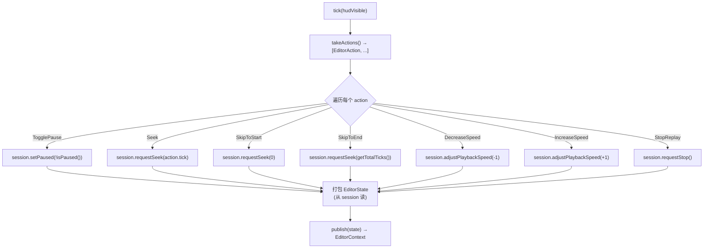

# editor/controller — Action → ReplaySession 翻译器

> 入口：[`d:\raplay\Playback\src\playback\editor\controller\EditorController.h`](file:///d:/raplay/Playback/src/playback/editor/controller/EditorController.h)
> 角色：每 tick 把 `EditorContext` 里堆积的 `EditorAction` 翻译成 `ReplaySession` 调用，并把 session 状态打包成 `EditorState` 写回 context。是 UI 与回放会话之间的"翻译官"。

## 内部结构

```
controller/
├── EditorController.h    ← 类声明（持 EditorContext&）
└── EditorController.cpp  ← tick() 主循环
```

只有一个类：`EditorController`，持 `EditorContext& mContext` 引用。

## tick() 主循环

[EditorController.cpp:11-48](file:///d:/raplay/Playback/src/playback/editor/controller/EditorController.cpp#L11-L48)



### 完整实现

```cpp
void EditorController::tick(bool hudVisible) {
    auto& session = functions::ReplaySession::getInstance();

    for (auto const action : mContext.takeActions()) {
        switch (action.type) {
        case EditorActionType::TogglePause:  (void)session.setPaused(!session.isPaused()); break;
        case EditorActionType::Seek:          session.requestSeek(action.tick); break;
        case EditorActionType::SkipToStart:   session.requestSeek(0); break;
        case EditorActionType::SkipToEnd:     session.requestSeek(session.getTotalTicks()); break;
        case EditorActionType::DecreaseSpeed: session.adjustPlaybackSpeed(-1); break;
        case EditorActionType::IncreaseSpeed: session.adjustPlaybackSpeed(+1); break;
        case EditorActionType::StopReplay:    session.requestStop(); break;
        }
    }

    EditorState state;
    state.replayVisible = session.isActive() && session.hasJoinedReplayWorld();
    state.hudVisible    = hudVisible;
    state.paused        = session.isPaused();
    state.playbackSpeed = session.getPlaybackSpeed();
    state.currentTick   = std::max(0, session.getCurrentTick());
    state.totalTicks    = std::max(0, session.getTotalTicks());
    mContext.publish(state);
}
```

## 关键设计

### 1. 顺序：先处理 actions，再 publish state

```cpp
for (auto const action : mContext.takeActions()) { ... }   // ① 改 session
EditorState state; state.x = session....                  // ② 读 session
mContext.publish(state);                                  // ③ 写回
```

- 同一 tick 内 actions 的影响在 publish 时已经反映到 state，UI 下次 snapshot 就能看到新值。
- 不会出现"按了暂停但 UI 还显示播放"的撕裂。

### 2. `replayVisible` 的双条件

```cpp
state.replayVisible = session.isActive() && session.hasJoinedReplayWorld();
```

- `isActive()` — ReplaySession 已加载完文件。
- `hasJoinedReplayWorld()` — 玩家已切到 `__playback_replay_world__` 临时世界。
- 两条件同时成立才显示 UI（[ImGuiRenderer.cpp:421-425](file:///d:/raplay/Playback/src/playback/editor/renderer/ImGuiRenderer.cpp#L421-L425) 也会用此字段决定 `shutdown`）。

### 3. `TogglePause` 用 `(void)` 显式忽略返回值

```cpp
case EditorActionType::TogglePause: (void)session.setPaused(!session.isPaused()); break;
```

- `setPaused` 返回 `bool`（成功 / 失败），但 UI 不需要知道。
- 显式 `(void)` 让编译器不报 unused-result 警告。

### 4. `currentTick` / `totalTicks` 用 `std::max(0, ...)` 截断

```cpp
state.currentTick = std::max(0, session.getCurrentTick());
state.totalTicks  = std::max(0, session.getTotalTicks());
```

- 防止 `getCurrentTick` 返回负数（idle 状态下）让 ImGui 滑块计算出错。
- 防御式编程，不依赖 ReplaySession 的契约。

### 5. `hudVisible` 是外参

```cpp
void tick(bool hudVisible);  // 由 ClientTickHooks 传入
```

- HUD 不可见时（玩家在聊天框 / 暂停菜单）UI 不画。
- 决策权交给上游，因为 controller 不直接读 `ClientInstance`。

## 调用映射表

| EditorActionType | EditorController 翻译 | ReplaySession 方法 |
| --- | --- | --- |
| `TogglePause` | 取反 | `setPaused(!isPaused())` |
| `Seek` | 透传 tick | `requestSeek(tick)` |
| `SkipToStart` | 0 | `requestSeek(0)` |
| `SkipToEnd` | 当前总长 | `requestSeek(getTotalTicks())` |
| `DecreaseSpeed` | -1 | `adjustPlaybackSpeed(-1)` |
| `IncreaseSpeed` | +1 | `adjustPlaybackSpeed(+1)` |
| `StopReplay` | — | `requestStop()` |

## 关键数据结构

| 名称 | 位置 | 用途 |
| --- | --- | --- |
| `EditorController` | `EditorController.h:7` | 单例（`gController`），持 `EditorContext&` |
| `EditorContext& mContext` | `EditorController.h:14` | 引用全局 `gContext` |

## 模块关系

### 被谁调用（上游）

- **`ReplayUI::tickReplayUI(bool)`**：[ReplayUI.cpp:70](file:///d:/raplay/Playback/src/playback/editor/ReplayUI.cpp#L70) — 每 tick 调一次。
- **`ReplayUI::hookReplayUI`**：[ReplayUI.cpp:15](file:///d:/raplay/Playback/src/playback/editor/ReplayUI.cpp#L15) — 构造全局 `gController{gContext}`。

### 调用谁（下游）

- **`functions/replay/ReplaySession`**：调 `isActive()` / `hasJoinedReplayWorld()` / `isPaused()` / `getPlaybackSpeed()` / `getCurrentTick()` / `getTotalTicks()` / `setPaused()` / `requestSeek()` / `adjustPlaybackSpeed()` / `requestStop()`。
- **`context/EditorContext`**：调 `takeActions()` 和 `publish()`。

### 共享数据

- **全局 `gContext`** + **全局 `gController`**（[ReplayUI.cpp:14-15](file:///d:/raplay/Playback/src/playback/editor/ReplayUI.cpp#L14-L15)）。

### 事件订阅 / 发送

- 无。

## 关键不变量

1. **每 tick 最多一次 `takeActions()` 和一次 `publish()`**。多次调用会重复消费 actions（但因为 `swap` 不会出错）。
2. **`publish` 总是覆盖**：`mState = state` 而非 `merge`。如果以后需要"局部更新"得加新方法。
3. **`takeActions` 总是清空**：所以如果一帧没消费，下一帧也只看到下一帧的 actions。
4. **Controller 不缓存 session 指针**：每次 `tick` 都从 `getInstance()` 取，保证不与 ReplaySession 析构/重建冲突。

## 阅读顺序

- 本文件 + [context.md](context.md) — 理解通信协议
- [replay.md](../functions/replay.md) — 理解 ReplaySession 的方法
- [ui.md](ui.md) — 理解 UI 怎么产生 action
