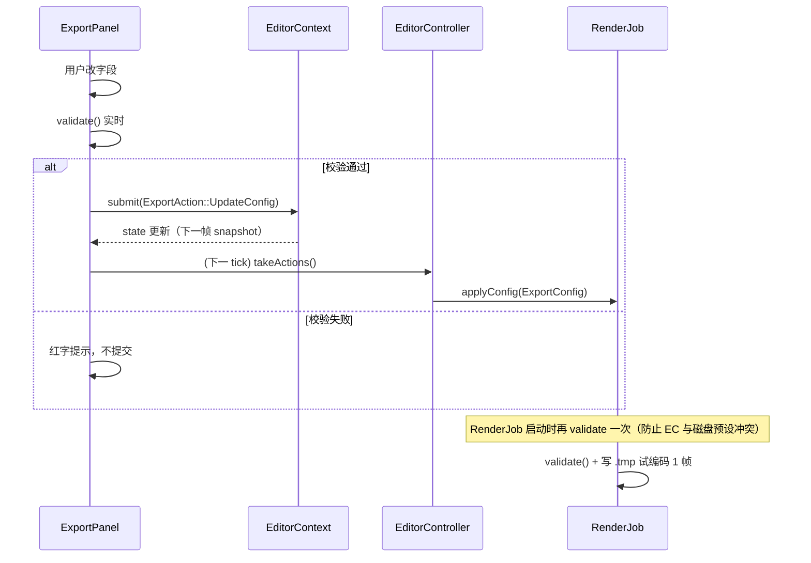

# editor/export-config — 导出配置（数据模型 + 持久化 + 校验）

> 入口：`src/playback/editor/export/`
> 角色：定义 **导出配置 `ExportConfig`** —— 用户在 ImGui 面板设置的所有"输出形态"参数，包括分辨率、比例、FPS、格式、码率、路径、范围。**与摄影机轨道（camera-track.md）解耦**：轨道管"摄像机怎么动"，本文件管"输出长什么样"。

## 一、需求（Requirements）

### 1.1 功能性需求

| ID | 需求 | 优先级 |
|---|---|---|
| EC-1 | 用户可设置**分辨率**（预设 + 自定义像素） | P0 |
| EC-2 | 用户可设置**画幅比例**（16:9 / 9:16 / 1:1 / 4:3 / 21:9 / 自定义） | P0 |
| EC-3 | 用户可设置**帧率**（24 / 30 / 60 / 120 / 自定义 1–240） | P0 |
| EC-4 | 用户可设置**输出格式**（mp4 / mov / webm / mkv / png-sequence） | P0 |
| EC-5 | 用户可设置**编码器**（H.264 / H.265 / VP9 / ProRes），并选择**编码模式**（CRF / CBR / VBR） | P0 |
| EC-6 | 用户可设置**码率**（kbps）或 **CRF 值**（0–51） | P0 |
| EC-7 | 用户可设置**导出范围**（in-tick / out-tick），默认 = 整段回放 | P0 |
| EC-8 | 用户可设置**输出路径**（默认 `data/exports/<replayName>-<timestamp>.<ext>`） | P0 |
| EC-9 | 用户可设置**音频选项**（包含 / 排除 / 仅导出音轨） | P0 |
| EC-10 | 预设可保存 / 加载（`presets/<name>.json`） | P1 |
| EC-11 | 配置随 `.playback` 一起保存（同一录制 → 同一配置） | P1 |
| EC-12 | 实时校验：分辨率 / 比例 / 码率合理性，超出范围 inline 报错 | P0 |

### 1.2 非功能性需求

- **可序列化**：JSON / 二进制双格式；JSON 调试用，二进制存盘。
- **版本兼容**：`version` 字段，缺字段时回退默认；多字段缺失不报错。
- **可校验**：所有字段有 `validate()` 函数，返回 `vector<ValidationError>`。
- **线程安全**：`RenderJob` 主线程读，UI 线程写；通过 `EditorContext` 扩展同步。

### 1.3 与现有约束对齐

- 复用 `EditorContext`（[editor/context/EditorContext.h](file:///d:/raplay/Playback/src/playback/editor/context/EditorContext.h)）的中转模式。
- 复用 nlohmann::json 序列化（项目已在用，xmake 不引新依赖）。
- **不引** ffmpeg 头文件；FFmpeg 编码参数在 `functions/render/export-presets.md` 翻译为命令行。

## 二、架构（Architecture）

### 2.1 内部结构

```
editor/export/
├── ExportConfig.h / .cpp          ← 主配置 + 校验
├── Resolution.h                   ← 分辨率/比例互转
├── ExportFormat.h                 ← 格式/编码器枚举
├── ExportPresets.h                ← 预设数据结构（用户保存的预设）
├── EditorExportExtension.h        ← EditorContext 扩展点
└── (UI 入口在 editor/ui/panels/ExportPanel.*)
```

### 2.2 主数据模型

```cpp
// ExportFormat.h
enum class ContainerFormat : uint8_t {
    Mp4 = 0, Mov, WebM, Mkv, PngSequence
};

enum class VideoCodec : uint8_t {
    H264 = 0, H265, Vp9, ProRes422, PngSequence
};

enum class RateControlMode : uint8_t {
    Crf = 0, Cbr, Vbr
};

enum class AspectRatio : uint8_t {
    R16x9 = 0, R9x16, R1x1, R4x3, R21x9, Custom
};

// ExportConfig.h
struct ExportConfig {
    // ===== 分辨率 =====
    AspectRatio aspect{AspectRatio::R16x9};
    int         width{1920};
    int         height{1080};
    bool        customResolution{false};  // true = 用 width/height 不用 aspect 派生

    // ===== 帧率 =====
    int         fps{60};
    bool        customFps{false};

    // ===== 输出格式 =====
    ContainerFormat container{ContainerFormat::Mp4};
    VideoCodec      codec{VideoCodec::H264};
    RateControlMode rcMode{RateControlMode::Crf};
    int             crf{18};        // H.264/H.265/VP9 通用
    int             bitrateKbps{12000};  // CBR/VBR
    std::string     extraFFmpegArgs{};  // 透传

    // ===== 范围 =====
    int         inTick{0};
    int         outTick{0};        // 0 = 到结尾（录制结束时由 RenderJob 解析）

    // ===== 路径 =====
    std::filesystem::path outputPath{};
    bool        overwrite{false};

    // ===== 音频 =====
    enum class AudioMode : uint8_t { Include, Exclude, OnlyAudio };
    AudioMode   audioMode{AudioMode::Include};
    int         audioBitrateKbps{192};

    // ===== 颜色 =====
    enum class ColorSpace : uint8_t { Sdr, Hdr10 };
    ColorSpace  colorSpace{ColorSpace::Sdr};
    int         hdrPeakNits{1000};

    // ===== 元数据 =====
    int         version{1};

    // === 校验 ===
    std::vector<ValidationError> validate() const;
    // === 派生 ===
    int  totalFrames() const;       // = (outTick - inTick) * fps / ticksPerSecond
    Vec2 effectiveResolution() const; // 应用 customResolution
};
```

### 2.3 分辨率与比例互转

```cpp
// Resolution.h
struct Resolution {
    int width;
    int height;

    static Resolution fromAspect(AspectRatio a, int baseHeight);
    static Vec2        aspectRatio(AspectRatio a);  // (num, den)
    static Resolution  clamp(const Resolution& r);  // 不超过 7680x4320
};

Resolution Resolution::fromAspect(AspectRatio a, int baseHeight) {
    switch (a) {
        case AspectRatio::R16x9:  return { baseHeight * 16 / 9, baseHeight };
        case AspectRatio::R9x16:  return { baseHeight * 9 / 16, baseHeight };
        case AspectRatio::R1x1:   return { baseHeight, baseHeight };
        case AspectRatio::R4x3:   return { baseHeight * 4 / 3, baseHeight };
        case AspectRatio::R21x9:  return { baseHeight * 21 / 9, baseHeight };
        case AspectRatio::Custom: return {};  // 调用方应已填 width/height
    }
}
```

> **默认 baseHeight**：1080（按所选 aspect 派生 width）。ImGui 提供"720p / 1080p / 1440p / 4K"快速切换。
>
> **Clamp**：最大 7680×4320（8K UHD），最小 64×64。超限 `validate()` 报错。

### 2.4 校验规则

| 字段 | 规则 | 错误码 |
|---|---|---|
| `width` / `height` | ∈ [64, 7680]；16 字节对齐（D3D12 要求） | `E_ResolutionOutOfRange` / `E_ResolutionNotAligned` |
| `fps` | ∈ [1, 240] | `E_FpsOutOfRange` |
| `crf` | H.264 ∈ [0,51]；H.265 ∈ [0,51]；VP9 ∈ [0,63] | `E_CrfOutOfRange` |
| `bitrateKbps` | ∈ [100, 200000] | `E_BitrateOutOfRange` |
| `inTick` < `outTick` | 0 ≤ inTick；outTick = 0 视作"到结尾" | `E_RangeInvalid` |
| `outputPath` | 父目录可写（写一个临时 .tprobe 验证） | `E_PathNotWritable` |
| `container` + `codec` | 不兼容组合（如 WebM + H.264） | `E_ContainerCodecMismatch` |

**容器-编码器兼容矩阵**（部分）：

| 容器 \ 编码器 | H.264 | H.265 | VP9 | ProRes | Png |
|---|---|---|---|---|---|
| mp4 | ✅ | ✅ | ❌ | ❌ | ❌ |
| mov | ✅ | ✅ | ❌ | ✅ | ❌ |
| webm | ❌ | ✅ | ✅ | ❌ | ❌ |
| mkv | ✅ | ✅ | ✅ | ✅ | ❌ |
| png-sequence | — | — | — | — | ✅ |

`validate()` 命中不兼容组合 → 返回 `E_ContainerCodecMismatch` 并建议合法组合。

### 2.5 与 EditorContext 的集成

```cpp
// EditorExportExtension.h
struct ExportPanelState {
    ExportConfig            config;
    std::vector<ExportPreset> presets;  // 用户保存的预设
    int                     activePresetIdx{-1};
    std::vector<ValidationError> lastErrors;
    bool                    previewing{false};
};

class EditorContextExportExt {
public:
    void submitExportAction(ExportAction a);
    ExportPanelState snapshotExport() const;

    std::vector<ExportAction> takeExportActions();
    void publishExportState(ExportPanelState s);
    void resetExport();

private:
    mutable std::mutex    mMtx;
    ExportPanelState      mState;
    std::vector<ExportAction> mActions;
};
```

集成方式同 `EditorContextCameraExt` —— 组合到 `EditorContext`，`reset()` 一并清空。

### 2.6 持久化

**用户预设**：`data/exports/presets/<name>.json`

```json
{
  "version": 1,
  "name": "YouTube 1080p",
  "config": {
    "aspect": 0, "width": 1920, "height": 1080, "customResolution": false,
    "fps": 60, "customFps": false,
    "container": 0, "codec": 0, "rcMode": 0, "crf": 18, "bitrateKbps": 12000,
    "inTick": 0, "outTick": 0, "audioMode": 0, "audioBitrateKbps": 192,
    "colorSpace": 0, "hdrPeakNits": 1000
  }
}
```

**回放绑定**：`.playback` ZIP 内 `metadata.json` 增 `exportConfig` 字段（与 `cameraTracks` 同级）：

```json
{
  "exportConfig": { ...ExportConfig... }
}
```

`PlaybackMeta::toJson()` / `fromJson()` 透传；缺字段时回退默认。

### 2.7 校验时序



## 三、执行（Execution）

### 3.1 任务拆分

| 步骤 | 文件 | 验证 |
|---|---|---|
| 1 | `editor/export/ExportFormat.h` | 编译 + 枚举值确定 |
| 2 | `editor/export/Resolution.h` | 单元测试：每种 aspect 派生正确 |
| 3 | `editor/export/ExportConfig.{h,cpp}` | 单元测试：validate 命中所有错误码 |
| 4 | `editor/export/EditorExportExtension.h` + 改 `EditorContext` | 编译通过；原行为不退化 |
| 5 | `functions/record/Recorder.h` 增 `exportConfig` JSON 字段 | 录制 → 导出 → 重读 一致 |
| 6 | `editor/export/ExportPresets.{h,cpp}` | 保存/加载用户预设 |
| 7 | `editor/ui/panels/ExportPanel.{h,cpp}` | 手动：所有字段可改可保存 |
| 8 | RenderJob 启动时 `validate()` + 试编码 1 帧 | 失败回 UI 报错 |

### 3.2 关键不变量

1. **不可变默认值**：`ExportConfig::default()` 返回的实例永远不被修改；UI 编辑时**拷贝**一份。
2. **范围一致**：`fps` / `width` / `height` 修改后必须**同时**重算 `totalFrames()`，UI 不允许两者脱钩。
3. **路径原子**：`outputPath` 必须以 `.ext` 结尾（按 `container` 自动补），UI 不允许用户改成无扩展名。
4. **预设版本**：读取预设时若 `version > ExportConfig::currentVersion` → warn + 用默认。

### 3.3 测试用例

| ID | 用例 | 期望 |
|---|---|---|
| EC-T1 | `fromAspect(R9x16, 1080)` | (608, 1080) |
| EC-T2 | `fromAspect(R16x9, 4K)` (height=2160) | (3840, 2160) |
| EC-T3 | `validate({width:7681, ...})` | 含 `E_ResolutionOutOfRange` |
| EC-T4 | `validate({width:1921, ...})`（奇数） | 含 `E_ResolutionNotAligned` |
| EC-T5 | `validate({container:WebM, codec:H264})` | 含 `E_ContainerCodecMismatch` |
| EC-T6 | 预设 round-trip | JSON 字段全部一致 |
| EC-T7 | 缺字段反序列化 | 缺字段用默认，不抛异常 |
| EC-T8 | `totalFrames(in=0, out=0, fps=60, ticksPerSec=20)` | `totalTicks * 3` |

### 3.4 风险与回退

| 风险 | 缓解 |
|---|---|
| 奇数分辨率 → 编码器拒绝 | UI 强制 16 字节对齐；自动向下取整到 16 倍数 |
| 输出路径已存在 | `overwrite=false` 时 UI 提示"文件已存在，是否覆盖" |
| 跨平台路径（macOS 客户端） | 用 `std::filesystem::path`，UI 显示时统一用 `/` |

## 四、模块关系

### 被谁调用（上游）

- **`editor/ui/panels/ExportPanel`**：读写配置（UI 入口）。
- **`editor/controller/EditorController`**：每 tick 同步 `EditorContext`。
- **`functions/render/RenderJob`**：启动时调 `validate()` 拿最终配置。
- **`functions/render/FrameEncoder`**：按 `container` / `codec` / `rcMode` 选 FFmpeg 命令模板。

### 调用谁（下游）

- **`nlohmann::json`**：JSON 序列化。
- **`EditorContextExportExt`**：状态/动作中转。
- **`PlaybackMeta::exportConfig`** JSON 字段。

### 共享数据

- `EditorContext::mExportExt`：UI 写、controller 同步、RenderJob 读。

### 事件订阅 / 发送

- 无。

## 五、阅读顺序

1. 本文件
2. [editor/camera-track.md](file:///d:/raplay/Playback/docs/editor/camera-track.md)：轨道数据
3. [functions/render/export-presets.md](file:///d:/raplay/Playback/docs/functions/render/export-presets.md)：格式预设与 FFmpeg 命令翻译
4. [functions/render/frame-encoder.md](file:///d:/raplay/Playback/docs/functions/render/frame-encoder.md)：编码器消费配置
