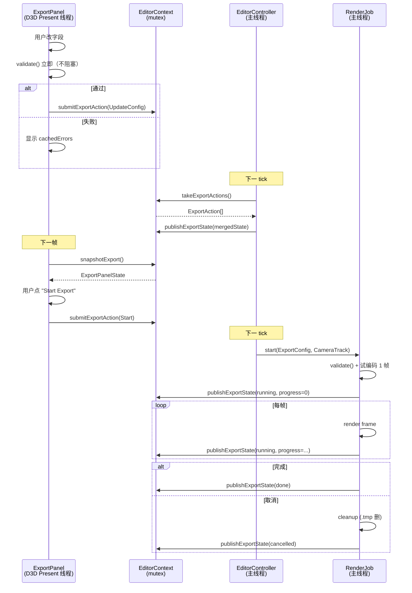

# editor/export-panel — 导出 ImGui 面板（主入口）

> 入口：`src/playback/editor/ui/panels/ExportPanel.{h,cpp}`
> 角色：把 `ExportConfig`（export-config.md）+ `CameraTrack`（camera-track.md）的状态投影成 ImGui 表单，提供"开始导出"按钮 + 进度显示。
> 渲染链路：复用 `editor/renderer/ImGuiRenderer.h` 的 ImGui 上下文，在 D3D12 Present 线程渲染。

## 一、需求（Requirements）

### 1.1 功能性需求

| ID | 需求 | 优先级 |
|---|---|---|
| EP-1 | 面板含 **6 个分组**：分辨率/比例、FPS、格式/编码器、范围、路径、音频 | P0 |
| EP-2 | 分辨率提供"720p / 1080p / 1440p / 4K / 自定义"按钮 + `aspect` 下拉 | P0 |
| EP-3 | FPS 提供预设下拉（24/30/60/120）+ 自定义输入 | P0 |
| EP-4 | 容器+编码器下拉联动（不合法组合灰显） | P0 |
| EP-5 | 码率控制模式：CRF 滑条 / CBR 输入 / VBR 输入，互斥 | P0 |
| EP-6 | 范围：in/out tick；in<out 实时校验 | P0 |
| EP-7 | 路径：默认 `data/exports/<replayName>-<timestamp>.<ext>`，可"浏览"按钮 | P0 |
| EP-8 | 实时显示 `validate()` 错误（红字） | P0 |
| EP-9 | "开始导出"按钮 → 触发 `RenderJob`；按钮禁用直到校验通过 | P0 |
| EP-10 | 导出进行中显示**进度条 + 实时 FPS + 瞬时码率 + ETA** | P0 |
| EP-11 | 导出进行中显示"取消"按钮 | P0 |
| EP-12 | 预设下拉：内置预设（YouTube/Bilibili/Twitter/X/IG-Reel/TikTok/PNG序列）+ 用户保存 | P1 |
| EP-13 | 摄影机轨道选择 + 关键帧编辑（见 [camera-track.md](file:///d:/raplay/Playback/docs/editor/camera-track.md)） | P0 |
| EP-14 | 实时预览（低帧率 5–10 FPS 的窗口内渲染） | P2 |

### 1.2 非功能性需求

- **首屏渲染 < 16ms**（1080p）：UI 100+ 控件不卡。
- **输入防抖**：连续 `slider float` 不每秒触发 60 次 `validate()`，合并到 ≤ 10 Hz。
- **多语言**：所有字符串走 i18n 翻译键（与现有 `src/lang/zh_CN.json` 一致）。

### 1.3 与现有约束的对齐

- 复用 `editor/ui/ReplayView.cpp` 的 dock 布局。
- 复用 `editor/ui/ReplayUILayout.h` 的窗口尺寸适配。
- 复用 `editor/context/EditorContext.h` + `EditorContextExportExt` 通信。
- 字体加载走 `utils/PathUtils`（已有 `msyh.ttc` 加载逻辑）。

## 二、架构（Architecture）

### 2.1 内部结构

```
editor/ui/panels/
├── ExportPanel.h / .cpp           ← 本模块：表单 + 进度
├── ExportPanelLayout.h            ← 子区域矩形计算
├── ExportPanelState.h             ← UI 局部状态（折叠/激活分组）
├── CameraTrackPanel.h / .cpp      ← 摄影机轨道编辑（见 camera-track.md）
└── PresetSelector.h / .cpp        ← 内置/用户预设选择
```

### 2.2 面板布局

```
+----------------------------------------------------------+
| [Export Panel]                                  [× Close] |
| ┌─ Preset ────────────────────────────────────────────┐ |
| │ Preset: [YouTube 1080p ▼]  [Save] [Delete]          │ |
| └─────────────────────────────────────────────────────┘ |
| ┌─ Resolution ───────────────┐  ┌─ Frame Rate ────────┐ |
| │ Aspect: [16:9 ▼]           │  │ FPS: [60 ▼]         │ |
| │ [720p][1080p][1440p][4K]   │  │ □ Custom: 60        │ |
| │ Width: 1920  Height: 1080  │  │                     │ |
| └────────────────────────────┘  └─────────────────────┘ |
| ┌─ Format & Codec ─────────────────────────────────────┐ |
| │ Container: [MP4 ▼]   Codec: [H.264 ▼]                │ |
| │ Rate: ● CRF  ○ CBR  ○ VBR                            │ |
| │ CRF: [══════●════════] 18                             │ |
| │ Bitrate: 12000 kbps (CBR/VBR)                        │ |
| └──────────────────────────────────────────────────────┘ |
| ┌─ Range ──────────────────────────────────────────────┐ |
| │ In tick: [0    ]  Out tick: [end ▼] (max 30000)     │ |
| │ Duration: 3000 ticks (150.0s @ 20 t/s)               │ |
| └──────────────────────────────────────────────────────┘ |
| ┌─ Audio ──────────────────────────────────────────────┐ |
| │ ● Include  ○ Exclude  ○ Only audio                   │ |
| │ Bitrate: 192 kbps                                     │ |
| └──────────────────────────────────────────────────────┘ |
| ┌─ Output ─────────────────────────────────────────────┐ |
| │ Path: [data/exports/2026-07-29-12-34-56.mp4 ] [Browse]│ |
| │ ☐ Overwrite existing                                 │ |
| └──────────────────────────────────────────────────────┘ |
| ⚠ E_ContainerCodecMismatch (when WebM+H264 selected)    |
| ┌──────────────────────────────────────────────────────┐ |
| │ [         Start Export         ]                     │ |
| └──────────────────────────────────────────────────────┘ |
+----------------------------------------------------------+
```

**导出进行中**：

```
+----------------------------------------------------------+
| [Exporting...]                                           |
| ████████████░░░░░░░░░░░░░░░░  45%  (1350 / 3000 frames) |
| Elapsed: 01:23  ETA: 01:32  FPS: 32.4  Bitrate: 11.8 Mbps|
| Last error: (none)                                       |
| [            Cancel Export            ]                 |
+----------------------------------------------------------+
```

### 2.3 状态管理

```cpp
// ExportPanelState.h
struct ExportPanelUiState {
    bool   showAdvanced{false};
    int    activeGroup{0};          // 折叠状态
    float  lastValidateTime{0};     // 防抖
    std::vector<ValidationError> cachedErrors;
    bool   exportInProgress{false};
    RenderJobProgress lastProgress{};
};
```

> **不**把 UI 局部状态存进 `EditorContext` —— 那是"游戏/导出共享"的数据；UI 折叠状态是单视图的事，留在 `ExportPanel` 内部成员。

### 2.4 数据流



### 2.5 关键交互

| 触发 | 行为 |
|---|---|
| Aspect 改变 | 自动按 `baseHeight` 重算 `width` |
| 分辨率预设按钮（720p 等） | 设 `baseHeight`；按当前 `aspect` 派生 `width` |
| Container 改变 | 把 `Codec` 下拉灰显不兼容项 |
| Rate Mode 改变 | 切 CRF/CBR/VBR 控件可见性 |
| Out tick 改变 | 实时显示 "Duration: X.Xs" |
| "Start Export" | 1) `validate()` 通过 2) 路径可写 3) `submitExportAction(Start)` |
| "Cancel" | `submitExportAction(Cancel)` → RenderJob 收到 `stopToken.cancel()` |

### 2.6 进度显示数据源

`RenderJob` 写 `EditorContext.mExportExt.mState.lastProgress`：

```cpp
struct RenderJobProgress {
    int     framesDone{0};
    int     framesTotal{0};
    float   currentFps{0};
    float   currentBitrateKbps{0};
    float   elapsedSec{0};
    float   etaSec{0};
    std::string lastError{};
    JobState state{JobState::Idle};  // Idle/Running/Paused/Done/Failed/Cancelled
};
```

UI 每帧 `snapshot()` 读最新值；不做插值（避免显示抖动用瞬时值即可）。

### 2.7 i18n 翻译键

```text
playback.editor.export.title
playback.editor.export.preset
playback.editor.export.resolution
playback.editor.export.frameRate
playback.editor.export.format
playback.editor.export.rateControl.crf
playback.editor.export.rateControl.cbr
playback.editor.export.rateControl.vbr
playback.editor.export.range
playback.editor.export.audio
playback.editor.export.output
playback.editor.export.start
playback.editor.export.cancel
playback.editor.export.progress          (= "{percent}% ({done}/{total} frames)")
playback.editor.export.progressEta       (= "Elapsed: {e}  ETA: {eta}  FPS: {fps}  Bitrate: {br} Mbps")
playback.editor.export.errors.{E_xxx}
playback.editor.export.preset.builtin.youtube
playback.editor.export.preset.builtin.bilibili
playback.editor.export.preset.builtin.twitter
...
```

## 三、执行（Execution）

### 3.1 任务拆分

| 步骤 | 文件 | 验证 |
|---|---|---|
| 1 | `ExportPanelLayout.h` | 单测：不同窗口尺寸下矩形不重叠 |
| 2 | `ExportPanelState.h` | 编译 |
| 3 | `ExportPanel.{h,cpp}` 主体（不含 RenderJob 联动） | 手动：所有字段可改可保存 |
| 4 | 联动 `EditorContextExportExt` | 单测：submit → snapshot 链路 |
| 5 | `PresetSelector.{h,cpp}` + 内置 6 个预设 | 手动：选预设字段自动填 |
| 6 | `CameraTrackPanel`（[camera-track.md](file:///d:/raplay/Playback/docs/editor/camera-track.md) 引用） | 手动：增删关键帧 |
| 7 | 联动 `RenderJob`（[render-job.md](file:///d:/raplay/Playback/docs/functions/render/render-job.md)） | 手动：开始导出 → 进度 → 完成 |
| 8 | 取消按钮 | 手动：导出 50% 取消 → .tmp 删 |
| 9 | i18n 翻译键写入 `src/lang/zh_CN.json` + `en_US.json` | 编译过 + 翻译可读 |

### 3.2 关键算法

**防抖 validate**：

```cpp
void ExportPanel::onConfigChange() {
    float now = ImGui::GetTime();
    if (now - mUiState.lastValidateTime < 0.1f) return;  // 10 Hz
    mUiState.lastValidateTime = now;
    mUiState.cachedErrors = mConfig.validate();
}
```

**进度格式化**：

```cpp
std::string formatProgress(const RenderJobProgress& p) {
    float pct = p.framesTotal ? 100.0f * p.framesDone / p.framesTotal : 0;
    return std::format("{}% ({}/{} frames)", (int)pct, p.framesDone, p.framesTotal);
}
std::string formatEta(const RenderJobProgress& p) {
    return std::format("Elapsed: {}  ETA: {}  FPS: {:.1f}  Bitrate: {:.1f} Mbps",
                       fmtTime(p.elapsedSec), fmtTime(p.etaSec), p.currentFps, p.currentBitrateKbps/1000);
}
```

### 3.3 关键不变量

1. **校验是单向的**：UI 的 `cachedErrors` 永远 = `mConfig.validate()`；用户改字段 → 重新 validate。
2. **进度写者唯一**：`RenderJob` 是 `EditorContext.mExportExt.mState.lastProgress` 唯一写者；UI 只读。
3. **按钮互斥**：`Start` / `Cancel` 同一时间只有一个 enabled。
4. **配置在 Start 时快照**：开始导出后用户改 `ExportConfig` 不影响当前 job；job 跑完才允许再次改。

### 3.4 测试用例

| ID | 用例 | 期望 |
|---|---|---|
| EP-T1 | 改 aspect=9:16, height=1080 | width 自动 = 608 |
| EP-T2 | 选 WebM + H.264 | Codec 下拉 H.264 灰显 |
| EP-T3 | CRF 滑条 H.264 | 范围 [0, 51] |
| EP-T4 | Out tick < In tick | 显示 `E_RangeInvalid`，Start 灰 |
| EP-T5 | 导出中改 config | 按钮灰（job 快照） |
| EP-T6 | 取消 → .tmp 不存在 | 文件系统检查 |
| EP-T7 | 内置 YouTube 预设 | 字段自动填 1920x1080, 60fps, MP4/H264, CRF 18 |

### 3.5 风险与回退

| 风险 | 缓解 |
|---|---|
| 控件太多首屏卡 | 按"高级"折叠；常用 4 个分组默认显示 |
| 进度显示跳变 | 进度条用 `ImGui::ProgressBar` 自带平滑；FPS/码率用 1s 窗口平均 |
| i18n 缺键 | 编译期 `_tr` 缺失会 fall-through 显示键名，不崩；用 CI 校验 |
| 摄影机编辑与导出共用 tick | 同一 `EditorContext`，同一 lock，避免脱钩 |

## 四、模块关系

### 被谁调用（上游）

- **`editor/ui/ReplayView.cpp`**：在 dock 内嵌入 `ExportPanel`。
- **`editor/renderer/ImGuiRenderer.cpp`**：在 D3D Present 线程调 `ExportPanel::draw()`。

### 调用谁（下游）

- **`EditorContextExportExt`**：读写 `ExportConfig` / `RenderJobProgress`。
- **`editor/camera-track/EditorContextCameraExt`**：读 `CameraTrack`。
- **`functions/render/RenderJob`**：通过 `ExportAction::Start/Cancel` 触发。

### 共享数据

- `EditorContext::mExportExt`：UI 写、controller 同步、RenderJob 读。
- `EditorContext::mCameraExt`：UI 写、RenderJob 读（采样）。

### 事件订阅 / 发送

- 无（全部走 `EditorContext` 中转）。

## 五、阅读顺序

1. 本文件
2. [editor/export-config.md](file:///d:/raplay/Playback/docs/editor/export-config.md)：数据模型
3. [editor/camera-track.md](file:///d:/raplay/Playback/docs/editor/camera-track.md)：摄影机编辑
4. [functions/render/render-job.md](file:///d:/raplay/Playback/docs/functions/render/render-job.md)：消费方
