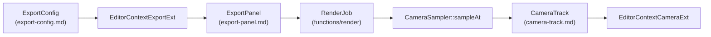
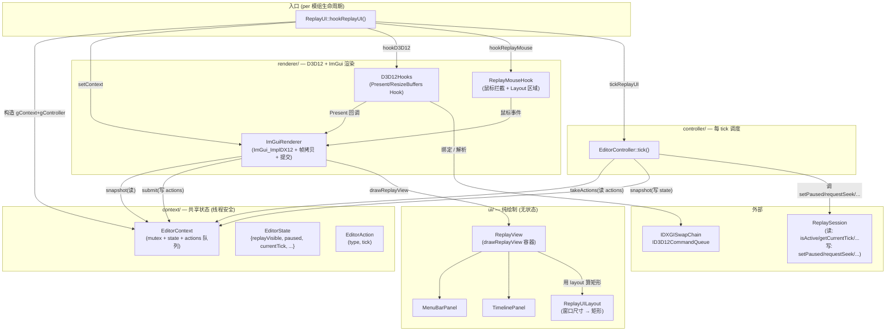
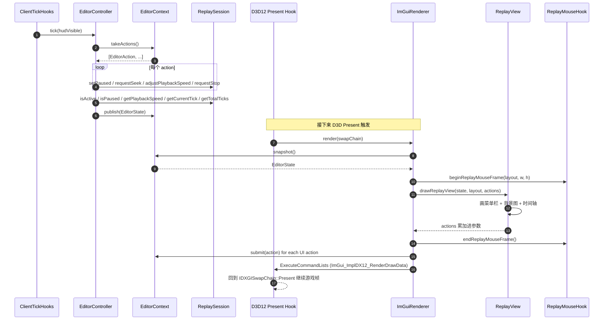

# editor — 回放编辑器（ImGui 时间轴 UI）

> 入口：[`d:\raplay\Playback\src\playback\editor\`](file:///d:/raplay/Playback/src/playback/editor/)
> 角色：在游戏中渲染一个 ImGui 时间轴 UI（菜单栏 + 时间轴 + 控制按钮），让玩家在回放世界内暂停/seek/变速。**只读** `ReplaySession` 状态，**只发** `EditorAction`。

## 视频编辑扩展（新增）

`editor/` 在回放时间轴基础上扩展视频编辑能力，新增 3 个子模块：

| 子模块 | 文档 | 角色 |
| --- | --- | --- |
| `editor/camera-track/` | [camera-track.md](camera-track.md) | 摄影机轨道数据模型 + 关键帧插值 + ImGui 编辑 |
| `editor/export/` | [export-config.md](export-config.md) | 导出配置（分辨率/比例/FPS/格式/码率/路径）数据模型 + 校验 |
| `editor/ui/panels/ExportPanel` | [export-panel.md](export-panel.md) | 导出 ImGui 面板（主入口 + 进度 + 取消） |

数据关系：



## 内部结构

```
editor/
├── ReplayUI.h / .cpp               ← 编辑器入口：组装 + 挂卸所有 hook
├── context/
│   ├── EditorContext.h / .cpp      ← 线程安全的状态/动作队列（state + actions）
│   ├── EditorState.h               ← UI 状态结构（replayVisible/paused/...）
│   ├── EditorAction.h              ← UI → 控制器的指令枚举
│   ├── EditorContextCameraExt.*    ← 摄影机轨道扩展（新增）
│   └── EditorContextExportExt.*    ← 导出配置扩展（新增）
├── camera-track/                   ← 新增
│   ├── CameraTrack.h / .cpp        ← 关键帧 + easing 数据模型
│   └── CameraSampler.h / .cpp      ← 确定性 tick 采样
├── export/                         ← 新增
│   ├── ExportConfig.h / .cpp       ← 导出配置 + 校验
│   ├── Resolution.h                ← 分辨率/比例互转
│   ├── ExportFormat.h              ← 格式/编码器枚举
│   └── ExportPresets.h             ← 用户预设
├── controller/
│   └── EditorController.h / .cpp   ← 每 tick 把 action 转成 ReplaySession 调用
├── renderer/
│   ├── D3D12Hooks.h / .cpp         ← Hook IDXGISwapChain::Present + 队列绑定
│   ├── D3D12Compat.h               ← D3D12 / DXGI 头兼容
│   ├── ImGuiRenderer.h / .cpp      ← ImGui + ImGui_ImplDX12 初始化 + 帧渲染
│   └── ReplayMouseHook.h / .cpp    ← 鼠标输入拦截（让 ImGui 收到点击）
└── ui/
    ├── ReplayUILayout.h            ← 根据窗口尺寸计算 layout
    ├── ReplayView.h / .cpp         ← 整体 UI 容器：菜单栏 + 背景图 + 时间轴
    ├── FormatUtils.h               ← tick ↔ 时分秒格式
    └── panels/
        ├── MenuBarPanel.h / .cpp   ← 顶栏（标题 + 速度/退出按钮）
        ├── TimelinePanel.h / .cpp  ← 时间轴 + seek 滑块 + 播放/暂停/跳进退
        ├── CameraTrackPanel.*      ← 摄影机轨道编辑（新增）
        └── ExportPanel.*           ← 导出面板（新增）
```

## 子模块关系图



## 数据流（一次 tick）



**关键不变量**：

- `EditorContext` 是**唯一**线程间共享的可变状态。
- `EditorController` 在主线程调 `ReplaySession`；`ImGuiRenderer` 在 D3D Present 线程读 `EditorContext` snapshot。
- `ImGuiRenderer` 在 UI 帧内 `submit(actions)`；下一帧 `EditorController` 才会 `takeActions()`，所以 actions 至少延迟一帧。

## 子模块索引

| 子模块 | 头文件入口 | 一句话 |
| --- | --- | --- |
| ReplayUI | [editor/ReplayUI.h](file:///d:/raplay/Playback/src/playback/editor/ReplayUI.h) | 组装入口：`hookReplayUI` 装/卸所有 hook；`tickReplayUI` 每 tick 调 controller。 |
| context | [editor/context/EditorContext.h](file:///d:/raplay/Playback/src/playback/editor/context/EditorContext.h) | 状态 + 动作队列的线程安全容器。 |
| controller | [editor/controller/EditorController.h](file:///d:/raplay/Playback/src/playback/editor/controller/EditorController.h) | 把 UI action 翻译成 `ReplaySession` 调用，并把 session 状态打包成 UI state。 |
| renderer | [editor/renderer/D3D12Hooks.h](file:///d:/raplay/Playback/src/playback/editor/renderer/D3D12Hooks.h) | 钩 D3D12 + 跑 ImGui。详见 [renderer.md](renderer.md)。 |
| ui | [editor/ui/ReplayView.h](file:///d:/raplay/Playback/src/playback/editor/ui/ReplayView.h) | 纯绘制：菜单栏 + 背景图 + 时间轴。详见 [ui.md](ui.md)。 |
| **camera-track**（新）| [editor/camera-track/CameraTrack.h](file:///d:/raplay/Playback/src/playback/editor/camera-track/CameraTrack.h) | 摄影机轨道（关键帧 + easing + 持久化）。详见 [camera-track.md](camera-track.md)。 |
| **export**（新）| [editor/export/ExportConfig.h](file:///d:/raplay/Playback/src/playback/editor/export/ExportConfig.h) | 导出配置（分辨率/比例/FPS/格式/校验）。详见 [export-config.md](export-config.md)。 |
| **ExportPanel**（新）| [editor/ui/panels/ExportPanel.h](file:///d:/raplay/Playback/src/playback/editor/ui/panels/ExportPanel.h) | 导出 ImGui 面板（主入口 + 进度 + 取消）。详见 [export-panel.md](export-panel.md)。 |

## 关键设计

1. **状态/动作分离**：`EditorState`（UI 看到的快照）vs `EditorAction`（UI 想做的）。UI 永远只读 state + 写 action，**不直接**调 `ReplaySession`。
2. **线程边界**：D3D Present 线程写 action，主线程（`ClientTickHooks`）读 action、写 state。两边不直接共享 D3D 资源。
3. **Hook 失败不致命**：`hookReplayUI` 三个 hook 任意一个失败都 `warn` 继续，UI 可能缺功能但模组其他部分不受影响（[ReplayUI.cpp:34-43](file:///d:/raplay/Playback/src/playback/editor/ReplayUI.cpp#L34-L43)）。
4. **layout 自适应**：`calculateReplayUILayout(width, height)` 按窗口尺寸算 menuBarHeight / timelineHeight / gameViewport 矩形（[ReplayUILayout.h:17-43](file:///d:/raplay/Playback/src/playback/editor/ui/ReplayUILayout.h#L17-L43)）。

## 模块关系

### 被谁调用（上游）

- **`Playback`**：`enable()` 调 `hookReplayUI(true)`；`disable()` 调 `hookReplayUI(false)`。
- **`tick/ClientTickHooks`**：每 tick 调 `tickReplayUI(hudVisible)`。

### 调用谁（下游）

- **`functions/replay/ReplaySession`**：controller 直接调它的状态查询和播放控制方法。
- **D3D12 / DXGI / ImGui**：渲染层直接调 Win32 + D3D12 + ImGui_ImplDX12。
- **`utils/PathUtils`**：ImGui 初始化用 `GetWindowsDirectoryW()` 加载中文字体 `msyh.ttc`。

### 共享数据

- **`EditorContext` 单例（gContext）**：整个回放 UI 期间唯一共享状态。
- **`ImGuiRenderer::gImGuiRenderer` 单例**：复用 D3D 资源。

### 事件订阅 / 发送

- **不订阅 LeviLamina 事件总线**。所有逻辑在 D3D Present hook + ClientTick 内部完成。

## 阅读顺序

- 先看本文件 + [renderer.md](renderer.md)（理解 D3D hook + ImGui 怎么跑起来）
- 然后 [context.md](context.md)（理解 UI ↔ controller 的通信协议）
- 然后 [controller.md](controller.md)（理解 controller 怎么把 action 翻译成 ReplaySession 调用）
- 最后 [ui.md](ui.md)（理解具体画什么）
