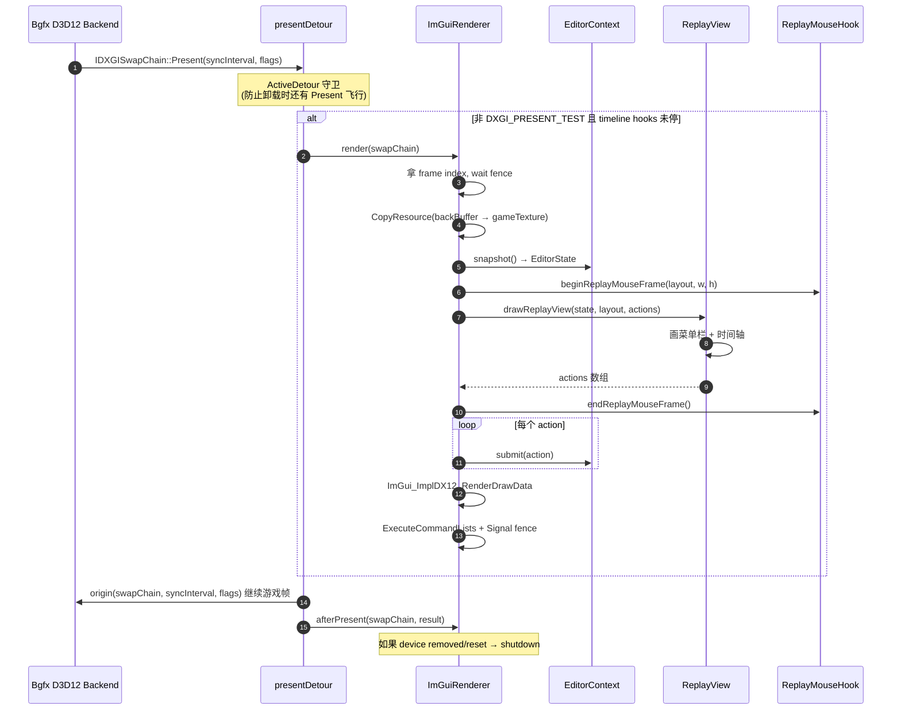
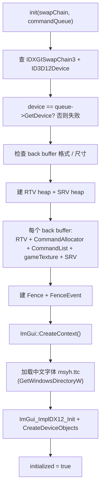
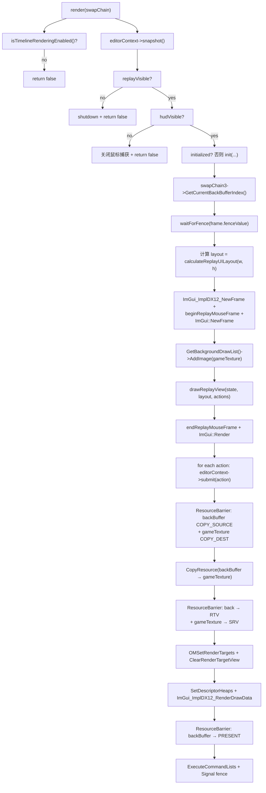
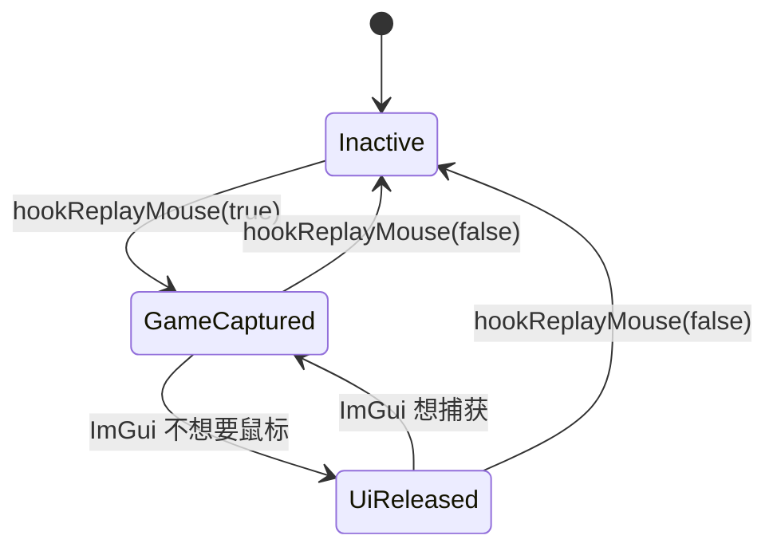

# editor/renderer — D3D12 Hook + ImGui 渲染

> 入口：[`d:\raplay\Playback\src\playback\editor\renderer\`](file:///d:/raplay/Playback/src/playback/editor/renderer/)
> 角色：钩 IDXGISwapChain 的 Present / ResizeBuffers / CreateSwapChain 虚函数，注入 ImGui 渲染管线，让 ImGui 画到游戏帧上面。同时拦鼠标事件，让 ImGui 能收到点击。

## 需求

1. ImGui 必须根据目标 SwapChain 的 Device 类型选择原生 D3D11 或 D3D12 后端。
2. D3D12 命令必须提交到创建目标 SwapChain 的真实 Direct Queue，禁止临时新建 Queue 绘制 back buffer。
3. Present / Resize 核心 Hook 可独立工作；D3D12 Queue / CreateSwapChain 捕获 Hook 失败时记录降级状态，不回滚核心 Hook。
4. 已存在的 D3D12 SwapChain 只允许使用“该 Device 唯一捕获的 Direct Queue”回退；捕获到多个 Direct Queue 时必须拒绝推断。
5. 回放世界已进入或编辑器已打开时，不应仅因 `HudScene` 位缺失而阻断 UI；加载和进度界面仍须阻断。
6. 运行日志必须能区分 Hook 安装、后端选择、Queue 捕获、可见性门控、初始化、首帧提交六个阶段。
7. 字体图集必须在对应 ImGui 图形后端创建字体纹理前一次性完成，运行帧内不得再次修改图集。

## 架构

- **核心 Hook**：`Present`、`Present1`、`ResizeBuffers`、`ResizeBuffers1`，为两种图形 API 提供统一渲染入口。
- **后端分派**：Present 时分别探测 `ID3D11Device` 和 `ID3D12Device`，选择对应的独立 ImGui context 与后端资源。
- **D3D11 后端**：使用 Immediate Context、back buffer RTV 和游戏帧副本 SRV，通过 `imgui_impl_dx11` 提交。
- **D3D12 捕获 Hook**：四个 `CreateSwapChain*` 和 `CreateCommandQueue`，负责建立精确的 `SwapChain → Direct Queue` 绑定。
- **D3D12 安全回退**：按 Device 记录第一个 Direct Queue；若出现第二个不同 Direct Queue，将该 Device 标记为 ambiguous，不再用于推断。
- **字体生命周期**：每个后端初始化时加载系统文本字体和模组 Lucide 字体，再创建对应后端的字体纹理。

## 执行

1. 在 bgfx renderer init 前安装 Present / Resize 及 D3D12 Queue / SwapChain 捕获 Hook。
2. Present 命中后先识别 SwapChain Device 类型；D3D11 直接初始化 Immediate Context，D3D12 进入 Queue 解析流程。
3. D3D12 Queue Hook 仅接受 `D3D12_COMMAND_LIST_TYPE_DIRECT`，并检测同 Device 多 Queue 歧义。
4. D3D12 SwapChain 创建成功后，将传入的真实 Queue 写入 DXGI private data 和保留映射。
5. 回放活跃时综合世界进入状态、编辑器打开状态和加载界面状态计算 HUD 可见性。
6. Resize、设备移除和模组卸载时销毁当前后端资源；另一后端资源保持独立。
7. 首次经过各阶段时写入 `mods/playback/debug_log.txt`，用于比较修复前后的运行路径。

## 内部结构

```
renderer/
├── D3D12Compat.h            ← D3D12 / DXGI 头兼容
├── D3D12Hooks.h / .cpp      ← 虚函数表 hook (Present/ResizeBuffers/CreateSwapChain)
├── ImGuiRenderer.h / .cpp   ← ImGui 上下文 + 帧渲染 + 帧拷贝
└── ReplayMouseHook.h / .cpp ← 鼠标事件拦截（LL 事件 + 主动 cursor 切换）
```

## 总流程（D3D Present 一次）



## D3D12Hooks — 虚函数表 hook

实现见 [D3D12Hooks.cpp:135-174](file:///d:/raplay/Playback/src/playback/editor/renderer/D3D12Hooks.cpp#L135-L174)。

### Hook 入口表

[D3D12Hooks.h:36-43](file:///d:/raplay/Playback/src/playback/editor/renderer/D3D12Hooks.h#L36-L43)

| 虚表下标 | 函数 | Detour |
| --- | --- | --- |
| 8 | `IDXGISwapChain::Present` | `presentDetour` |
| 22 | `IDXGISwapChain1::Present1` | `present1Detour` |
| 13 | `IDXGISwapChain::ResizeBuffers` | `resizeBuffersDetour` |
| 39 | `IDXGISwapChain3::ResizeBuffers1` | `resizeBuffers1Detour` |
| 10 | `IDXGIFactory::CreateSwapChain` | `createSwapChainDetour` |
| 15 | `IDXGIFactory2::CreateSwapChainForHwnd` | `createSwapChainForHwndDetour` |
| 16 | `IDXGIFactory2::CreateSwapChainForCoreWindow` | `createSwapChainForCoreWindowDetour` |
| 24 | `IDXGIFactory2::CreateSwapChainForComposition` | `createSwapChainForCompositionDetour` |

**为什么 hook CreateSwapChain**：Minecraft 在窗口尺寸变化 / 切全屏时会重新创建 swap chain，要在新 swap chain 上重新初始化 ImGui。

### 守卫机制

[D3D12Hooks.cpp:54-74](file:///d:/raplay/Playback/src/playback/editor/renderer/D3D12Hooks.cpp#L54-L74)

```cpp
std::atomic<uint32_t> gActiveDetours{};
std::mutex            gActiveDetoursMutex;
std::condition_variable gActiveDetoursChanged;

class ActiveDetour {
public:
    ActiveDetour() { gActiveDetours.fetch_add(1, std::memory_order_acq_rel); }
    ~ActiveDetour() {
        if (gActiveDetours.fetch_sub(1, std::memory_order_acq_rel) == 1) gActiveDetoursChanged.notify_all();
    }
};
```

- 每个 detour 入口构造一个 `ActiveDetour`（RAII），退出析构。
- `hookD3D12(false)` 等待所有 `gActiveDetours == 0` 再卸 hook（`waitForActiveDetours()`）。
- 防止"正在执行 Present 时被卸 hook"导致崩溃。

### Present Detour 关键点

[present1Detour, D3D12Hooks.cpp:145-174](file:///d:/raplay/Playback/src/playback/editor/renderer/D3D12Hooks.cpp#L145-L174)

```cpp
bool timelineRendered = false;
if ((flags & DXGI_PRESENT_TEST) == 0 && !gTimelineHooksStopping.load()) {
    timelineRendered = gImGuiRenderer.render(swapChain);
}

DXGI_PRESENT_PARAMETERS fullSurfacePresent{};
if (timelineRendered && parameters) {
    fullSurfacePresent = *parameters;
    fullSurfacePresent.DirtyRectsCount = 0;
    fullSurfacePresent.pDirtyRects     = nullptr;
    fullSurfacePresent.pScrollRect     = nullptr;
    fullSurfacePresent.pScrollOffset   = nullptr;
    // 把 partial-present 降级为 full-surface-present
    // 否则 Bgfx 可能用 dirty rect 只更新游戏区域，跳过我们的覆盖
}
```

- **`DXGI_PRESENT_TEST` 跳过**：DXGI 在不真正 Present 时会传这个 flag，只画不显示。
- **partial → full surface**：因为我们改了整张 back buffer 的内容，必须告诉 DXGI "整张都要提交"。

## ImGuiRenderer — 帧渲染

实现见 [ImGuiRenderer.cpp](file:///d:/raplay/Playback/src/playback/editor/renderer/ImGuiRenderer.cpp)。

### 资源初始化（init）

[ImGuiRenderer.cpp:146-358](file:///d:/raplay/Playback/src/playback/editor/renderer/ImGuiRenderer.cpp#L146-L358)



**关键点**：

- **每 back buffer 一组资源** (`frames[N]`)，用 `swapChain3->GetCurrentBackBufferIndex()` 索引。
- **`gameTexture` 是独立 SRV**：先把 back buffer `CopyResource` 到 gameTexture，再把 gameTexture 当 ImGui 全屏背景画（[ImGuiRenderer.cpp:489-493](file:///d:/raplay/Playback/src/playback/editor/renderer/ImGuiRenderer.cpp#L489-L493)），让时间轴 / 菜单栏看起来"在游戏画面上面"。
- **中文字体 fallback**：`Windows\Fonts\msyh.ttc` 加载失败时降级用 `AddFontDefault`（[ImGuiRenderer.cpp:289-310](file:///d:/raplay/Playback/src/playback/editor/renderer/ImGuiRenderer.cpp#L289-L310)）。

### 帧渲染（render）

[ImGuiRenderer.cpp:414-560](file:///d:/raplay/Playback/src/playback/editor/renderer/ImGuiRenderer.cpp#L414-L560)



**关键资源屏障序列**（D3D12 资源状态机）：

```
backBuffer: PRESENT → COPY_SOURCE → RENDER_TARGET → PRESENT
gameTexture: PIXEL_SHADER_RESOURCE → COPY_DEST → PIXEL_SHADER_RESOURCE
```

**多缓冲同步**：

- `fenceValue` 记录每个 back buffer 上次 Signal 的值。
- `waitForFence(value, fence, event)` 阻塞等到 GPU 完成。
- 防止"上一帧的 command list 还没执行完，CPU 又开始改同一 back buffer"。

### 关停与恢复

[ImGuiRenderer.cpp:562-585](file:///d:/raplay/Playback/src/playback/editor/renderer/ImGuiRenderer.cpp#L562-L585)

- **`beforeResize(swapChain)`** — ResizeBuffers 之前调，shutdown 当前 swap chain 的资源，让 Resize 后 `init` 重新走。
- **`afterPresent(swapChain, result)`** — Present 之后调，如果 `result == DXGI_ERROR_DEVICE_REMOVED / DEVICE_RESET` → shutdown 并 unbind 队列。
- **`shutdown()`** — 等待 GPU 完成 → 销毁 ImGui context → 释放 D3D 资源。

## ReplayMouseHook — 鼠标事件拦截

实现见 [ReplayMouseHook.cpp](file:///d:/raplay/Playback/src/playback/editor/renderer/ReplayMouseHook.cpp)。

**两套机制**：

1. **LL 事件总线** [ReplayMouseHook.cpp:66-67](file:///d:/raplay/Playback/src/playback/editor/renderer/ReplayMouseHook.cpp#L66-L67)：
   ```cpp
   ll::event::ListenerPtr gMouseInputListener;  // 订阅 MouseInputEvent
   ll::event::ListenerPtr gKeyInputListener;    // 订阅 KeyInputEvent
   ```
   - 当 ImGui 想"捕获鼠标"（`gWantCaptureMouse = true`）时，listener 阻止事件传递给游戏。
   - 当 ImGui "释放"鼠标时，正常透传。

2. **主动 cursor 切换** [ReplayMouseHook.cpp:60-77](file:///d:/raplay/Playback/src/playback/editor/renderer/ReplayMouseHook.cpp#L60-L77)：
   ```cpp
   std::atomic<bool> gCaptureRequested{};
   std::atomic<bool> gReleaseRequested{};
   ```
   - 在 `beginReplayMouseFrame` 时根据 layout 决定"把 cursor 锁进游戏视口矩形"还是"释放到全屏"。

**核心状态机**：



**API**（[ReplayMouseHook.h:11-18](file:///d:/raplay/Playback/src/playback/editor/renderer/ReplayMouseHook.h#L11-L18)）：

| 函数 | 调用方 | 作用 |
| --- | --- | --- |
| `hookReplayMouse(bool)` | `ReplayUI::hookReplayUI` | 启停 LL 事件订阅 + 状态机 |
| `setReplayMouseInputActive(bool)` | `ImGuiRenderer` | 通知 mouse hook 接管 / 释放 |
| `setReplayUIActive(bool)` | `ReplayUI::hookReplayUI` | 整 UI 启停（与 mouse 联锁） |
| `beginReplayMouseFrame(layout, w, h)` | `ImGuiRenderer::render` | 每帧开头：根据 layout 决定 cursor 矩形 |
| `endReplayMouseFrame()` | `ImGuiRenderer::render` | 每帧结尾：commit cursor 状态 |

## 关键设计

1. **全屏背景画游戏画面**：`CopyResource` + `AddImage` 让玩家在时间轴/菜单栏里也能看到游戏画面，是"游戏中 UI"的常见做法。
2. **延迟初始化**：ImGui 资源只在第一次有 `replayVisible + hudVisible` 的帧才创建；replay 退出时 `shutdown`，下次回放再 init。
3. **多缓冲 fence 同步**：用 `fenceValue` 数组跟踪每 buffer 的 GPU 完成点，避免"back buffer 被复写"导致画面撕裂。
4. **Hook 失败不致命**：`hookD3D12` / `hookReplayMouse` 失败时 `ReplayUI` 只 warn 不 error，模组主流程继续跑（[ReplayUI.cpp:34-43](file:///d:/raplay/Playback/src/playback/editor/ReplayUI.cpp#L34-L43)）。

## 关键常量

| 名称 | 值 | 位置 | 用途 |
| --- | --- | --- | --- |
| `SrvDescriptorCount` | 32 | `D3D12Hooks.h:17` | SRV heap 上限 |
| `GpuWaitTimeoutMs` | 2000 | `D3D12Hooks.h:18` | fence wait 超时 |
| `DetourWaitTimeoutMs` | 2000 | `D3D12Hooks.h:19` | hook 卸等待超时 |
| `SwapChainReplacementDelay` | 500ms | `ImGuiRenderer.cpp:58` | swap chain 替换后最小等待 |

## 模块关系

### 被谁调用（上游）

- **`ReplayUI::hookReplayUI`**：调 `hookRendererInit` / `hookD3D12` / `hookReplayMouse`。
- **`EditorController` / `ReplayUI::tickReplayUI`**：无直接调用。
- **`D3D12 Present`**：自动触发 `presentDetour` / `present1Detour`。

### 调用谁（下游）

- **`context/EditorContext`**：调 `snapshot()` / `submit()`。
- **`ui/ReplayView` / `ReplayUILayout` / `MenuBarPanel` / `TimelinePanel`**：ImGui 帧内调 `drawReplayView`。
- **LL 事件总线**：`ReplayMouseHook` 订阅 `MouseInputEvent` / `KeyInputEvent`。
- **D3D12 / DXGI / ImGui / ImGui_ImplDX12**：直接调 Win32 + DXGI + D3D12 + ImGui。

### 共享数据

- **全局 `gImGuiRenderer`**（[ImGuiRenderer.cpp:403](file:///d:/raplay/Playback/src/playback/editor/renderer/ImGuiRenderer.cpp#L403)）：跨函数共享 ImGui 资源。
- **全局 `gOriginalPresent` 等 8 个 `FuncPtr`**（[D3D12Hooks.cpp:46-53](file:///d:/raplay/Playback/src/playback/editor/renderer/D3D12Hooks.cpp#L46-L53)）：保存原始函数指针。
- **D3D12 句柄**（device / commandQueue / swapChain3 / RTV heap / SRV heap / fence）存在 `ImGuiRenderer::Impl` 里。
- **`gSwapChainQueue` 映射**：[D3D12Hooks.h:37-41](file:///d:/raplay/Playback/src/playback/editor/renderer/D3D12Hooks.h#L37-L41) — swap chain → 它的 command queue，ImGui init 用。

### 事件订阅 / 发送

- **订阅** `ll::event::MouseInputEvent` / `KeyInputEvent`（[ReplayMouseHook.cpp:66-67](file:///d:/raplay/Playback/src/playback/editor/renderer/ReplayMouseHook.cpp#L66-L67)）。
- **不发送**。

## 阅读顺序

- 本文件先看 D3D 钩子表（虚函数下标）+ Present 流程。
- 然后 [ImGuiRenderer.cpp:414-560](file:///d:/raplay/Playback/src/playback/editor/renderer/ImGuiRenderer.cpp#L414-L560) 看帧渲染。
- 最后 [ReplayMouseHook.cpp](file:///d:/raplay/Playback/src/playback/editor/renderer/ReplayMouseHook.cpp) 看鼠标拦截状态机。
