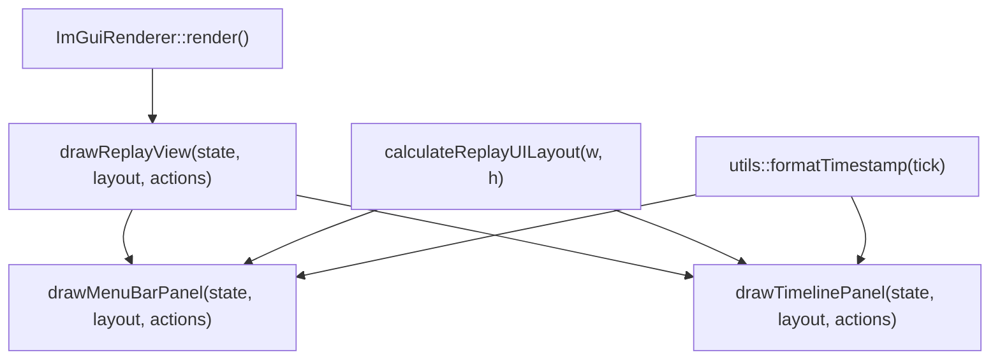
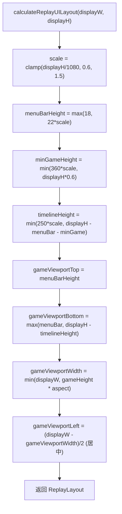
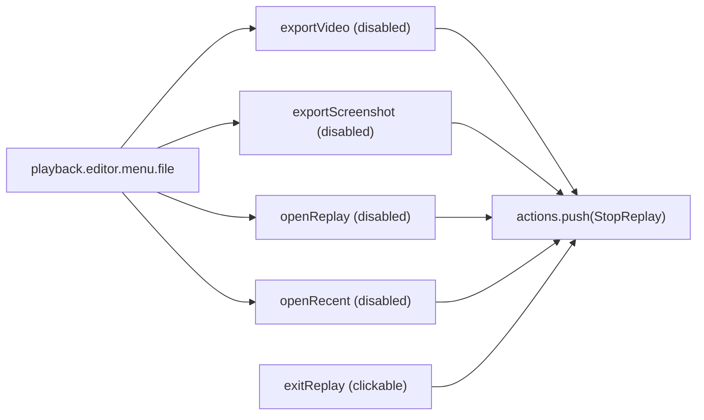
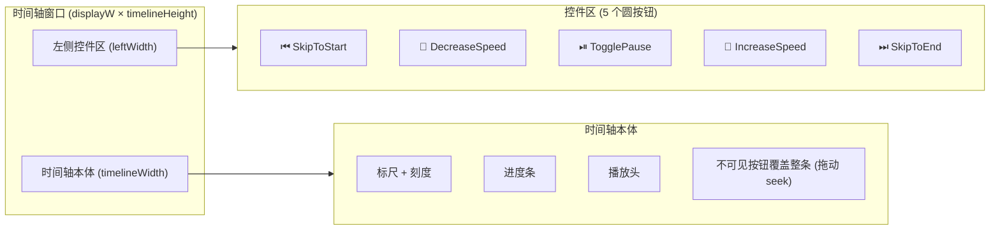
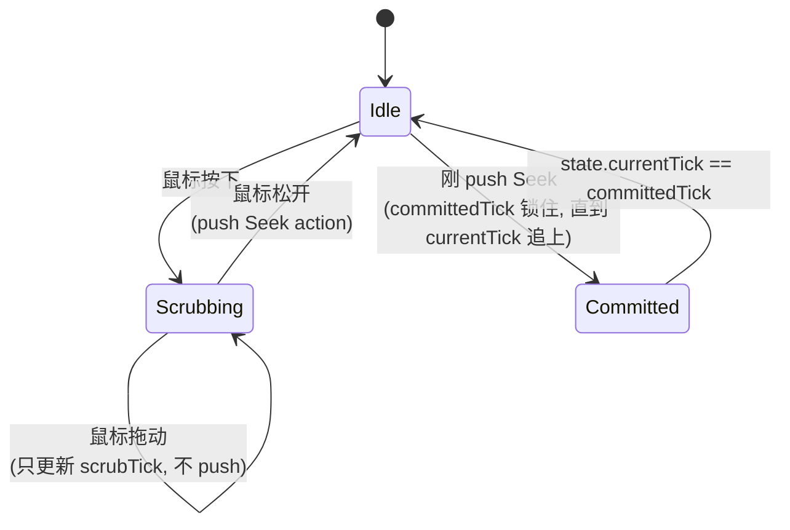

# editor/ui — 纯绘制层（无状态）

> 入口：[`d:\raplay\Playback\src\playback\editor\ui\`](file:///d:/raplay/Playback/src/playback/editor/ui/)
> 角色：在每帧的 ImGui 上下文中画菜单栏 + 时间轴，**只读** `EditorState` + **只写** `vector<EditorAction>&`。**不持有任何状态**，不调任何 Playback 业务逻辑。

## 内部结构

```
ui/
├── ReplayView.h / .cpp        ← 容器：调 MenuBar + Timeline
├── ReplayUILayout.h           ← 窗口尺寸 → 矩形 / 比例
├── FormatUtils.h              ← tick ↔ 时分秒
└── panels/
    ├── MenuBarPanel.h / .cpp  ← 顶栏（菜单 + 状态信息）
    └── TimelinePanel.h / .cpp ← 时间轴（控制按钮 + 进度条 + 标尺）
```

## 调用关系



**调用顺序固定**：先菜单栏（顶），后时间轴（底），中间是游戏画面背景（由 ImGuiRenderer 的 `AddImage` 画）。

## ReplayView（容器）

[ReplayView.cpp:8-11](file:///d:/raplay/Playback/src/playback/editor/ui/ReplayView.cpp#L8-L11)

```cpp
void drawReplayView(EditorState const& state, ReplayUILayout const& layout, std::vector<EditorAction>& actions) {
    drawMenuBarPanel(state, layout, actions);
    drawTimelinePanel(state, layout, actions);
}
```

3 行代码，仅组合。actions 用引用传，两个 panel 各自 push_back 自己的 action。

## ReplayUILayout（窗口尺寸计算）

[ReplayUILayout.h:17-43](file:///d:/raplay/Playback/src/playback/editor/ui/ReplayUILayout.h#L17-L43)



**关键不变量**：

- `menuBarHeight + minGameHeight + timelineHeight ≤ displayHeight`（timelineHeight 可能为 0，如果窗口太小）。
- `gameViewportWidth` 按宽高比约束，**游戏画面保持原比例**居中显示。
- `scale` 同时影响 `ImGui::GetIO().FontGlobalScale = max(0.85, layout.scale)`（[ImGuiRenderer.cpp:481](file:///d:/raplay/Playback/src/playback/editor/renderer/ImGuiRenderer.cpp#L481)）。

## MenuBarPanel（顶栏）

[MenuBarPanel.cpp:24](file:///d:/raplay/Playback/src/playback/editor/ui/panels/MenuBarPanel.cpp#L24)

### 内容布局



**菜单项**（按 MenuBarPanel.cpp:55-94 顺序）：

| i18n key | enabled? | 触发 |
| --- | --- | --- |
| `playback.editor.menu.file` (submenu) | — | — |
| `playback.editor.menu.exportVideo` | ❌ (false) | 暂未实现 |
| `playback.editor.menu.exportScreenshot` | ❌ | 暂未实现 |
| `playback.editor.menu.openReplay` | ❌ | 暂未实现 |
| `playback.editor.menu.openRecent` | ❌ | 暂未实现 |
| `playback.editor.menu.exitReplay` | ✅ | `StopReplay` action |
| `playback.editor.menu.preferences` | ❌ | 暂未实现 |
| `playback.editor.menu.playerList` | ❌ | 暂未实现 |
| `playback.editor.menu.movement` | ❌ | 暂未实现 |
| `playback.editor.menu.renderFilter` | ❌ | 暂未实现 |
| `playback.editor.menu.keybinds` | ❌ | 暂未实现 |
| `playback.editor.menu.hideReplayUi` | ❌ | 暂未实现 |

> 大量菜单项是占位（`MenuItem(..., false, false)`），未来扩展用。

### 状态栏

[MenuBarPanel.cpp:77-83](file:///d:/raplay/Playback/src/playback/editor/ui/panels/MenuBarPanel.cpp#L77-L83)

```
Playback  |  <paused/playing>  |  <HH:MM:SS> / <HH:MM:SS>
```

- `formatTimestamp(currentTick)` 把 tick 换算成时:分:秒（20 tick = 1 秒）。
- 居右对齐。

## TimelinePanel（时间轴）

[TimelinePanel.cpp:100-...](file:///d:/raplay/Playback/src/playback/editor/ui/panels/TimelinePanel.cpp#L100)

### 布局



**自适应**：

- `leftWidth = clamp(160*scale, 240*scale, displayW*0.42)` — 太小就 5 个按钮变 3 个。
- `leftWidth < 200*scale` 时只画标尺/进度条，不画控件按钮（[TimelinePanel.cpp:188](file:///d:/raplay/Playback/src/playback/editor/ui/panels/TimelinePanel.cpp#L188)）。

### Scrubbing（拖动 seek）

[TimelinePanel.cpp:152-171](file:///d:/raplay/Playback/src/playback/editor/ui/panels/TimelinePanel.cpp#L152-L171)

```cpp
static bool scrubbing{};
static int  scrubTick{};
static int  committedTick{-1};

ImGui::InvisibleButton("##PlaybackTimelineScrub", ImVec2(timelineWidth, bodyHeight));
if (ImGui::IsItemActive()) {
    float const ratio = clamp((io.MousePos.x - timelineLeft) / timelineWidth, 0, 1);
    scrubTick = clamp(lround(ratio * totalTicks), 0, state.totalTicks);
}
if (scrubbing && !ImGui::IsItemActive()) {
    committedTick = scrubTick;
    actions.push_back({EditorActionType::Seek, scrubTick});
}
scrubbing = ImGui::IsItemActive();
int const shownTick = scrubActive ? scrubTick : (committedTick >= 0 ? committedTick : state.currentTick);
```

**3 状态**：



- **`scrubTick`**：拖动时实时算的 tick（**不** push action，避免每帧 push 几十个）。
- **`committedTick`**：拖动结束才 push 一次，UI 暂时显示这个值直到 `currentTick` 真正追上来。
- **`scrubbing`**：用 static 变量记录"上一帧是否在拖"，检测"鼠标松开"边界（`scrubbing && !active`）。

### 标尺刻度（chooseTimelineScale）

[TimelinePanel.cpp:16-22](file:///d:/raplay/Playback/src/playback/editor/ui/panels/TimelinePanel.cpp#L16-L22)

```cpp
TimelineScale chooseTimelineScale(int totalTicks, float timelineWidth) {
    float const targetTicksPerMajor = max(1, totalTicks) * 60.0f / max(1.0f, timelineWidth);
    if (targetTicksPerMajor < 5.0f)  return {1, 5, true};
    if (targetTicksPerMajor < 8.0f)  return {2, 5, true};
    return {max(5, ceil(targetTicksPerMajor / 20.0f) * 5), 4, false};
}
```

| 目标主刻度 tick 数 | `ticksPerMinor` | `minorsPerMajor` | `showSubSeconds` |
| --- | --- | --- | --- |
| `< 5` | 1 (1 tick 1 minor) | 5 | ✅ |
| `< 8` | 2 | 5 | ✅ |
| `≥ 8` | `(⌈target/20⌉)*5` | 4 | ❌ |

**`showSubSeconds`**：画 0.25/0.5/0.75 秒的小刻度线（每 5/10 tick）。

## 自定义绘制原语

[TimelinePanel.cpp:24-98](file:///d:/raplay/Playback/src/playback/editor/ui/panels/TimelinePanel.cpp#L24-L98)

| 函数 | 形状 | 用途 |
| --- | --- | --- |
| `drawSkipControl` | 左/右双三角 + 矩形 | ⏮ / ⏭ 跳到头/尾 |
| `drawRateControl` | 半个三角 (▶ or ◀) | 🐢 / 🐰 减速/加速 |
| `drawPlaybackAction` | 单三角 (▶) 或 双竖 (⏸) | ⏯ 播放/暂停 |
| `drawCenteredFittedText` | 自动缩放居中 | 长文本不溢出 |

## FormatUtils（tick ↔ 时间）

[FormatUtils.h:9-22](file:///d:/raplay/Playback/src/playback/editor/ui/FormatUtils.h#L9-L22)

```cpp
inline std::string formatTimestamp(int ticks) {
    ticks = max(0, ticks);
    int const seconds = ticks / 20;       // 20 tick = 1 秒
    int const minutes = seconds / 60;
    int const hours   = minutes / 60;
    if (hours > 0) snprintf("%02d:%02d:%02d", hours, minutes % 60, seconds % 60);
    else           snprintf("%02d:%02d", minutes, seconds % 60);
    return string;
}
```

- 20 tick/秒 是 Minecraft 标准。
- 不足 1 小时省略小时位。
- 用于菜单栏状态栏 + scrubbing tooltip。

## 关键设计

1. **完全无状态**：所有面板只接收 `EditorState` + `ReplayUILayout` + `actions&`，不持任何成员变量（除几个 static 缓存如 `scrubbing` / `committedTick`）。
2. **i18n 集成**：所有菜单文字用 `"playback.editor.menu.xxx"_tr()` 走 LeviLamina i18n。
3. **scale 自适应**：`layout.scale` 同时影响字体 / 按钮 / 间距，1080p 基准最大 1.5x、4K 不再放大，720p 最小 0.6x。
4. **scrubbing 降频**：拖动时只更新本地 `scrubTick`，松手才 push **一次** Seek action，避免 60 Hz 拖动产生几十个 Seek 请求压垮 ReplaySession。
5. **菜单占位策略**：大量菜单项是 disabled 状态（`MenuItem(..., false, false)`），方便以后扩展但当前不误导用户。

## 关键数据结构

| 名称 | 位置 | 用途 |
| --- | --- | --- |
| `ReplayUILayout` | `ReplayUILayout.h:7` | 矩形 / 比例缓存，6 个 float |
| `TimelineScale` | `TimelinePanel.h:31` | `{ticksPerMinor, minorsPerMajor, showSubSeconds}` |
| 常量 | `MenuBarPanel.cpp:16-20` | 菜单栏 5 种颜色 |

## 模块关系

### 被谁调用（上游）

- **`renderer/ImGuiRenderer::render`**：调 `drawReplayView(state, layout, actions)` — [ImGuiRenderer.cpp:495](file:///d:/raplay/Playback/src/playback/editor/renderer/ImGuiRenderer.cpp#L495)。

### 调用谁（下游）

- **`context/EditorContext`**：通过 `actions` 引用间接写入，ImGuiRenderer 在帧末统一 `submit`。
- **ImGui**：直接调 `ImGui::Begin/End/InvisibleButton/MenuItem/SetTooltip` 等。
- **LL i18n**：用 `"..."_tr()` 取本地化字符串。
- **`utils::formatTimestamp`**：tick → 时分秒。

### 共享数据

- **无**。面板本身不持任何状态（仅 static 局部缓存）。

### 事件订阅 / 发送

- 无。鼠标事件由 ImGui 内部处理，UI 只看 `io.MousePos` / `IsItemClicked`。

## 阅读顺序

- 本文件理解整体布局。
- [ReplayUILayout.h:17-43](file:///d:/raplay/Playback/src/playback/editor/ui/ReplayUILayout.h#L17-L43) 理解自适应矩形。
- [TimelinePanel.cpp:100-...](file:///d:/raplay/Playback/src/playback/editor/ui/panels/TimelinePanel.cpp#L100) 看 scrubbing 状态机。
- [MenuBarPanel.cpp:24-...](file:///d:/raplay/Playback/src/playback/editor/ui/panels/MenuBarPanel.cpp#L24) 看菜单结构。
