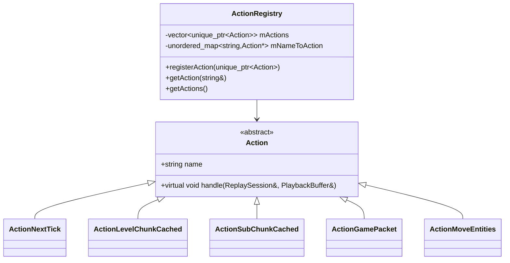

# action — 协议层

`action/` 是录制 / 回放共用的"事件协议"。它把游戏里各种离散事件抽象成 5 个 `Action` 子类，通过 `ActionRegistry` 集中注册，再由 `ReplayWriter` 编码、`ReplayReader` 解码。

## 关键类型

| 类型 | 角色 |
| --- | --- |
| `Action` | 抽象基类，每个 Action 有名字 + `handle(ReplaySession&, PlaybackBuffer&)` |
| `ActionRegistry` | 单例；通过 `name` 索引 `Action*` |
| `ActionNextTick` | "下一个 tick" 标记（无 payload） |
| `ActionLevelChunkCached` | 引用 `mChunkPackets[index]` |
| `ActionSubChunkCached` | 引用 `mChunkPackets[index]` |
| `ActionGamePacket` | 普通包：`VarInt packetId` + 原始 payload |
| `ActionMoveEntities` | 实体位姿增量（特化格式，详见下文） |



## 注册表写入顺序敏感

`Playback::registerActions()` 在 mod 启动时按以下顺序写入：

```cpp
registry.registerAction(std::make_unique<functions::ActionNextTick>());          // id 0
registry.registerAction(std::make_unique<functions::ActionLevelChunkCached>());  // id 1
registry.registerAction(std::make_unique<functions::ActionSubChunkCached>());    // id 2
registry.registerAction(std::make_unique<functions::ActionGamePacket>());        // id 3
registry.registerAction(std::make_unique<functions::ActionMoveEntities>());      // id 4
```

`ReplayWriter::writeHeader()` 把 `mActionNameToId[name] = i`（`i` 是注册顺序），把名字列表写入文件头。`ReplayReader` 读回时按相同顺序建立 `id -> Action*` 映射。

> **重要**：不要在不向后兼容的情况下改这个顺序，否则老回放文件读不出来。

## 二进制协议

`AsyncReplaySaver` 写入的每个 chunk 二进制结构（`[ReplayWriter.cpp]`）：

```
[header]
  VarInt MAGIC_NUMBER ("LLPB")
  VarInt actionCount = N
  N 次：String actionName[i]      // 顺序由 ActionRegistry 决定

[snapshot 区]
  UInt32 snapshotSize            // 由 startSnapshot/endSnapshot 写回
  N 个 action：
    VarInt  actionId
    UInt32  actionSize           // 由 startAction/finishAction 写回
    Bytes   actionData           // Action 子类决定格式

[timeline 区（紧接 snapshot 之后）]
  N 个 action：
    VarInt  actionId
    UInt32  actionSize
    Bytes   actionData
```

写入约束：

- `startAndFinishAction(Action&)`：用于"没有 payload"的 Action（如 `ActionNextTick`），省略 size 占位。
- `startAction` / `finishAction`：必须配对使用，size 在 `finishAction` 时回填。
- `writeHeader` / `popBuffer` 配对：`popBuffer` 写完一个 chunk 后会重新 `writeHeader`，意味着每个 `chunk_N.bin` 都有完整 header。

## 各 Action 的 payload 格式

### `ActionNextTick`（id 0）

无 payload。`handle` 调 `session.handleNextTick()`：`mCurrentTick++`，如果是回放世界并有 `mReplayTime`，会同步 `level.setTime(*mReplayTime)`。

### `ActionLevelChunkCached`（id 1）

```
VarInt  index   // mChunkPackets[index] 是 FullChunkData payload
```

`handle` 调 `session.handleLevelChunkCached(index)`：把 index 入 `mPendingLevelChunkIndices` 队列，触发 chunk 注入计划重新准备。

### `ActionSubChunkCached`（id 2）

同 `ActionLevelChunkCached`，但 `mChunkPackets[index]` 是 `SubChunkPacket` payload，handle 入 `mPendingSubChunkIndices`。

### `ActionGamePacket`（id 3）

```
VarInt  packetId
Bytes   payload
```

`handle` 调 `session.handleGamePacket(data)`：
- 处理中若 `mIsProcessingSnapshot`，`DimensionDataPacket` / `SetTime` 立即应用；其它入 `mPendingSnapshotGamePackets`。
- 否则直接 `session.applyGamePacket(packetId, payload)`。

### `ActionMoveEntities`（id 4）

支持两种格式（marker 决定）：

**新版（精确位姿）**：
```
VarInt  marker = 0
VarInt  version = 1
VarInt  count
count 次：
  VarInt64  actorUniqueId
  Float     x, y, z
  Float     pitch, yaw
  Float     headYaw, bodyYaw
  Bool      onGround
```

**旧版（量化位姿）**：
```
VarInt  count  // 非 0 直接走这里
count 次：
  VarInt64  actorUniqueId
  Bool      isPlayer
  if (isPlayer):
    Float x, y, z, pitch, yaw, headYaw
    Bool  onGround
  else:
    Byte  header
    Byte  rotX, rotY, headRotY, bodyRotY
    Float x, y, z
```

handle 把"是否在 seek 期间"作为 `snapMovement` 标志位，决定 `MovePlayerPacket` 的 `mResetPosition`（`Normal` / `Teleport`）以及骑乘时的 `RotPrev` 处理。`isRiding()` 的 actor 不发包，直接改组件字段（`ActorRotationComponent` / `ActorHeadRotationComponent` / `MobBodyRotationComponent` / `OnGroundFlagComponent`）。

## `mInjectingPacket` 自识别

`ReplaySession` 用一个 `std::atomic<Packet const*>` 标记"当前是我自己注入的包"。`applyGamePacket` 在 `origin` 前写这个指针、析构时清。`NetworkHooks` 看到 `mInjectingPacket == packet.get()` 时跳过录制 / 不抑制，避免回放自己的包被录两遍。

## 模块关系

### 被谁调用

- `Playback::registerActions()` → `ActionRegistry::registerAction`。
- `ReplayWriter::writeHeader` → `ActionRegistry::getActions()`（按顺序生成 name 表）。
- `ReplayReader` 构造时 → `ActionRegistry::getAction(name)`（反查 name → Action*）。
- `ReplaySession::handleNextAction` / `handleSnapshot` → `Action::handle`。
- `Recorder::writeTickBoundary` → `ActionNextTick::getInstance()`。
- `AsyncReplaySaver::writeGamePackets` → `ActionLevelChunkCached` / `ActionSubChunkCached` / `ActionGamePacket` 写时引用。

### 调用谁

- `Action::handle` 调 `ReplaySession` 的 `handleNextTick` / `handleLevelChunkCached` / `handleSubChunkCached` / `handleGamePacket` / `handleMoveEntities`。

### 共享数据

- `ActionRegistry::getInstance()`：进程内唯一。
- `ReplaySession::mChunkPackets`：`ActionLevelChunkCached` / `ActionSubChunkCached` 引用此数组的 index。

### 事件

- 协议层不订阅 / 发送任何事件。

## 扩展点

- 新增 Action：
  1. 在 `Action.h` 加 `struct XxxAction : Action { ... getInstance(); }`。
  2. 在 `Action.cpp` 实现 `XxxAction::handle`。
  3. 在 `Playback::registerActions()` 末尾 `registry.registerAction(...)`（**注意不要改中间顺序，否则破坏兼容**）。
  4. 如果有 payload，加进 `ReplayerWriter` / `ReplayReader` 相应的写入/读取路径。
  5. 在 `ReplaySession` 加对应的 `handleXxx` 方法。
- 改 Action 协议：保持 `id` 不变是兼容的；改 payload 长度或字段顺序需要写新版本的 reader。
