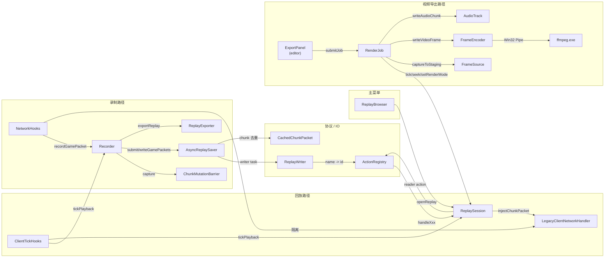

# functions 总览

`functions/` 是 mod 的核心功能层。涵盖录制（`record`）、回放（`replay`）、协议（`action`）、IO（`io`）、客户端 tick（`tick`）五个子目录。

## 子模块与定位

| 子目录 | 头文件 | 角色 |
| --- | --- | --- |
| `action/` | `Action.h` | 录制 / 回放共用的"事件协议"——把游戏事件抽象成离散 `Action`，`ActionRegistry` 集中注册 |
| `record/` | `Recorder.h` | 录制主循环：状态机 + 玩家 ID 重映射 + snapshot 采集 + 玩家状态写盘 + 导出 |
| `record/` | `ChunkMutationBarrier.h` | 录制 snapshot 时的 chunk 写互斥屏障 |
| `record/` | `NetworkHooks.cpp` | LL_TYPE_INSTANCE_HOOK 抓包 + 在回放世界抑制原生 chunk |
| `record/` | `ReplayExporter.cpp` | 把临时目录 zip 成 `data/replays/<timestamp>.zip` |
| `io/` | `AsyncReplaySaver.h` | 异步写盘：后台 writer 线程 + snappy 压缩 + chunk 缓存 |
| `io/` | `ReplayReader.cpp` / `ReplayWriter.cpp` | 二进制回放文件读写 |
| `io/cache/` | `CachedChunkPacket.h` | `FullChunkData` / `SubChunkPacket` 的去重结构 |
| `replay/` | `ReplaySession.h` | 回放主循环：状态机 + chunk 流式注入 + 时间轴控制 + 世界清理 |
| `tick/` | `ClientTickHooks.h` | 钩 `MultiPlayerLevel::_subTick` + `ClientInstance::update`，按 `PlaybackMode` 分发 |

## 子模块关系图

## 关键设计

1. **Action 是协议层，不是 IO 层**。`Action` 决定"录制什么事件 / 回放怎么重放"，IO 层只管"字节怎么写 / 怎么读"。改协议改 `Action.h` + 各自的 `handle`，不碰 IO。
2. **Recorder / ReplaySession 都是单例**。`Recorder::getInstance()` 和 `ReplaySession::getInstance()`。
3. **AsyncReplaySaver 是生产者-消费者**。录制主线程 `submit(WriteTask)` 入队，后台线程 `pop + execute`。`finish()` 关闭、`cancel()` 删目录。
4. **ChunkMutationBarrier 是"tick 边界 + 互斥锁"组合**。在 `_subTick` 末尾进入"边界"，所有 chunk 写都延后；`capture` 等待进入边界。
5. **ClientTickHooks 是"调度器"**。它在 `_subTick` 中按 `PlaybackMode` 决定调 `Recorder::endTick(false)` 还是 `ReplaySession::tick()`；在 `ClientInstance::update` 中调 `tickReplayUI` 和 `tryFinalizeWorldCleanup`。

## 阅读顺序建议

- 想看协议：[action.md](action.md)
- 想看录制：[record.md](record.md) → [io.md](io.md)
- 想看回放：[replay.md](replay.md) → [action.md](action.md) → [io.md](io.md)（reader 部分）
- 想看 tick 调度：[tick.md](tick.md)
- 想看视频导出（新增）：
  - [render/render-job.md](render/render-job.md)（中心）
  - [render/frame-source.md](render/frame-source.md)（帧源）
  - [render/frame-encoder.md](render/frame-encoder.md)（编码）
  - [render/audio-track.md](render/audio-track.md)（音频）
  - [render/export-presets.md](render/export-presets.md)（预设 / FFmpeg）
