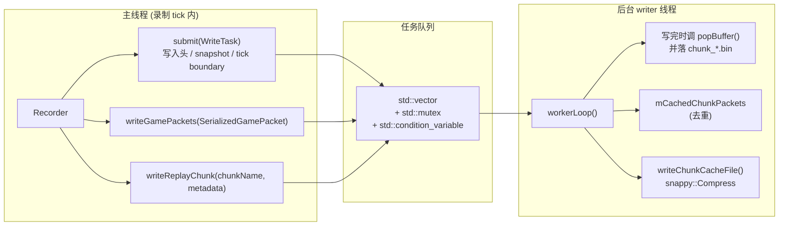
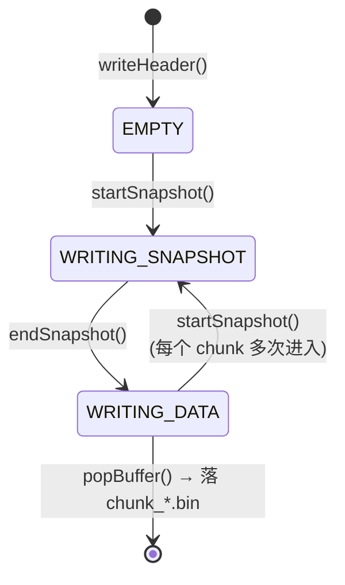
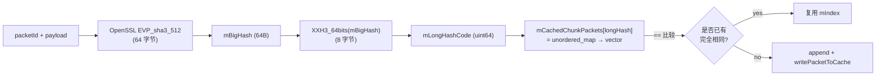

# functions/io — 异步落盘 + 二进制协议 + 区块去重

> 入口：[`d:\raplay\Playback\src\playback\functions\io\`](file:///d:/raplay/Playback/src/playback/functions/io/)
> 角色：把 `Recorder` 提交的"写任务"异步落盘，并提供 `ReplayReader` 给回放端消费。是 `record` 和 `replay` 共用的"字节层"。

## 内部结构

```
io/
├── AsyncReplaySaver.h / .cpp    ← 后台 writer 线程 + 任务队列 + chunk 缓存 + 压缩
├── ReplayWriter.cpp             ← 写入文件头 / snapshot 块 / action 帧
├── ReplayReader.cpp             ← 读取文件头 / 解析 snapshot / 顺序读 action
└── cache/
    └── CachedChunkPacket.h / .cpp ← LevelChunk / SubChunk 包的两级哈希去重
```

| 类 | 头文件 | 角色 |
| --- | --- | --- |
| `PlaybackBuffer` | `AsyncReplaySaver.h:39` | 继承 `BinaryStream`，增加 `getWritePointer()` / `writeAt(pos, value)`，用于回填"大小字段"。 |
| `ReplayWriter` | `AsyncReplaySaver.h:63` | 状态机：写头 / 写 snapshot / 写 actions。**所有方法都假设在 saver 后台线程调用**。 |
| `ReplayReader` | `AsyncReplaySaver.h:98` | 解析单 chunk 文件：头 / snapshot 区 / actions 区。 |
| `AsyncReplaySaver` | `AsyncReplaySaver.h:124` | 生产者-消费者：主线程 `submit(WriteTask)`，后台线程 `workerLoop()` 串行执行。 |
| `CachedChunkPacket` | `cache/CachedChunkPacket.h:9` | chunk 包去重：64B SHA3-512 大哈希 + 8B XXH3 长哈希。 |
| `MAGIC_NUMBER` | `AsyncReplaySaver.h:27` | `0x4C4C5042` ("LLPB")，文件魔数。 |
| `CHUNK_CACHE_SIZE` | `AsyncReplaySaver.h:28` | 10000 — 单个 chunk cache 文件最大条目数。 |

## 文件结构

`replays/{timestamp}.zip` 内：

```
zip
├── metadata.json                        ← PlaybackMeta 的 JSON 序列化
├── chunk_0.bin                          ← 第 1 个时间片（含 snapshot + actions）
├── chunk_1.bin
├── ...
├── chunk_N.bin                          ← 最后一个时间片
└── level_chunk_caches/
    ├── 0.bin                            ← Snappy 压缩后的 LevelChunk/SubChunk 缓存
    ├── 1.bin
    └── ...
```

每个 `chunk_*.bin` 内部：

```
[文件头  VarInt MAGIC + VarInt actionCount + {actionName  String} × N]
[VarInt  snapshotSize]
[snapshot 区: action 帧序列]
[actions 区: action 帧序列]
```

**chunk 文件用 LRU 切割**：每 `RECORD_CHUNK_TICKS = 5*60*20` tick 旋转一次，方便 seek 时跳到对应 chunk 再顺序读。

## AsyncReplaySaver（生产者-消费者）

实现见 [AsyncReplaySaver.cpp](file:///d:/raplay/Playback/src/playback/functions/io/AsyncReplaySaver.cpp)。



**生命周期**：

1. **构造** [AsyncReplaySaver.cpp:40-55](file:///d:/raplay/Playback/src/playback/functions/io/AsyncReplaySaver.cpp#L40-L55)：`PathUtils::createTemp(uuid)` 创建临时目录 → `mReplayWriter.writeHeader()` → `mWorkerThread = std::thread(workerLoop)`。
2. **运行**：主线程通过 `submit()` / `writeGamePackets()` / `writeReplayChunk()` 提交任务到 `mQueue`，后台线程 `wait + take + execute`。
3. **完成** `finish()` [AsyncReplaySaver.cpp:141-157](file:///d:/raplay/Playback/src/playback/functions/io/AsyncReplaySaver.cpp#L141-L157)：置 `mRunning = false` + `notify_all` + `join`。
4. **取消** `cancel()` [AsyncReplaySaver.cpp:159-190](file:///d:/raplay/Playback/src/playback/functions/io/AsyncReplaySaver.cpp#L159-L190)：同上，但额外 `remove_all(mRecordPath)` 删临时目录。

**关键设计**：

- **写任务用 lambda 闭包**：`using WriteTask = std::function<void(ReplayWriter&)>`。主线程不知道"现在写到文件的哪"，后台线程独占 `mReplayWriter` 状态。
- **chunk 缓存与 actions 分离**：包数据太大（区块可上 MB）不能进 action 帧，所以走独立的 `level_chunk_caches/*.bin`（Snappy 压缩）。action 帧里只写 `VarInt cacheIndex`。
- **chunk cache 滚动** [AsyncReplaySaver.cpp:202-291](file:///d:/raplay/Playback/src/playback/functions/io/AsyncReplaySaver.cpp#L202-L291)：每 `CHUNK_CACHE_SIZE = 10000` 条目切一个文件，靠 `mCurrentChunkCacheIndex` 跟踪。
- **错误传播** `recordError()`：把首个错误存进 `mError`，置 `mRunning = false`，清空队列。`getError()` 给主线程查。

## ReplayWriter（写入协议）

实现见 [ReplayWriter.cpp](file:///d:/raplay/Playback/src/playback/functions/io/ReplayWriter.cpp)。

**状态机** [AsyncReplaySaver.h:64-66](file:///d:/raplay/Playback/src/playback/functions/io/AsyncReplaySaver.h#L64-L66)：



**写入帧格式**（每个 action 帧）：

```
VarInt  actionId        // 由 ActionRegistry 的写入顺序决定
UInt32  dataSize        // 回填：startAction 时占位，finishAction 时 writeAt
Bytes   actionPayload   // 由 Action::handle 的反向逻辑（即 read 端）决定
```

**写入帧的层级**：

- `startAndFinishAction(action)` — 简单帧，无 payload（如 `ActionNextTick`）。
- `startAction(action) + writeXxx + finishAction(action)` — 复合帧，payload 任意字节（如 `ActionGamePacket` / `ActionMoveEntities`）。
- `startSnapshot() / endSnapshot()` — 包裹一段"snapshot 区"，size 字段回填。

**关键写入路径**（被 `AsyncReplaySaver::writeGamePackets` 间接调用，[AsyncReplaySaver.cpp:202-291](file:///d:/raplay/Playback/src/playback/functions/io/AsyncReplaySaver.cpp#L202-L291)）：

```cpp
if (MinecraftPacketIds::FullChunkData) {
    // 走 chunk cache
    auto cached = CachedChunkPacket(packetId, payload, -1);
    if (existing in mCachedChunkPackets[longHashCode]) {
        index = existing.mIndex;            // 命中：复用
    } else {
        index = writePacketToCache(payload); // 未命中：写入 mChunkCacheOutput
        mCachedChunkPackets[longHashCode].push_back(cached);
    }
    writer.startAction(ActionLevelChunkCached::getInstance());
    writer.mStream.writeVarInt(index, nullptr, nullptr);
    writer.finishAction(ActionLevelChunkCached::getInstance());
} else if (MinecraftPacketIds::SubChunkPacket) {
    // 同上但走 ActionSubChunkCached
} else {
    // 普通网络包：原样进 actions
    writer.startAction(ActionGamePacket::getInstance());
    writer.mStream.writeVarInt(packetId, nullptr, nullptr);
    writer.mStream.write(payload);
    writer.finishAction(ActionGamePacket::getInstance());
}
```

## ReplayReader（解析协议）

实现见 [ReplayReader.cpp](file:///d:/raplay/Playback/src/playback/functions/io/ReplayReader.cpp)。

**构造时** [ReplayReader.cpp:15-42](file:///d:/raplay/Playback/src/playback/functions/io/ReplayReader.cpp#L15-L42)：
1. 校验 `MAGIC_NUMBER = 0x4C4C5042`。
2. 读 `actionCount` 个 action 名，按写入顺序建 `mActionMap: id → Action*`。
3. 读 `snapshotSize`，记录 `mSnapshotOffset` / `mActionsOffset`。

**`handleSnapshot(ReplaySession&)`** [ReplayReader.cpp:44-78](file:///d:/raplay/Playback/src/playback/functions/io/ReplayReader.cpp#L44-L78)：从 `mSnapshotOffset` 顺序读 actions 直到 `mActionsOffset`，每个 action 通过 `action->handle(session, stream)` 让 `ReplaySession` 处理。

**`handleNextAction(ReplaySession&)`** [ReplayReader.cpp:80-115](file:///d:/raplay/Playback/src/playback/functions/io/ReplayReader.cpp#L80-L115)：单步读一个 action 并分发。

**严格性检查**：
- 包读完后必须 `mReadPointer == mStream.getWritePointer()`，否则抛异常（防协议不一致）。
- 包 size 不能跨过 `mActionsOffset`。
- 未知 `actionId` 抛 `Unknow action id`（用 `mLastActionName` 增强错误信息）。

## CachedChunkPacket（chunk 去重）

实现见 [CachedChunkPacket.cpp](file:///d:/raplay/Playback/src/playback/functions/io/cache/CachedChunkPacket.cpp)。



**两级哈希**：

- **`mBigHash`**：64 字节 SHA3-512，碰撞概率 ~2⁻²⁵⁶，可信度高。
- **`mLongHashCode`**：8 字节 XXH3，第一级快速过滤。

**operator==** [CachedChunkPacket.cpp:48-51](file:///d:/raplay/Playback/src/playback/functions/io/cache/CachedChunkPacket.cpp#L48-L51)：

```cpp
bool operator==(const CachedChunkPacket& other) const {
    if (this->mLongHashCode != other.mLongHashCode) return false; // 快速失败
    return mBigHash == other.mBigHash;                              // 慢但精确
}
```

**为什么不用 `unordered_set`**：因为 `CachedChunkPacket` 含 64B 数组 + index，`std::hash` 算 64B 太慢；`unordered_map<uint64, vector<>>` 让"长哈希相同的桶"用全 64B 比较，兼顾速度和精度。

## 关键常量

| 名称 | 值 | 位置 | 用途 |
| --- | --- | --- | --- |
| `MAGIC_NUMBER` | `0x4C4C5042` | `AsyncReplaySaver.h:27` | "LLPB" 文件魔数 |
| `CHUNK_CACHE_SIZE` | 10000 | `AsyncReplaySaver.h:28` | 单个 chunk cache 文件最大条目数 |
| `MAX_STRING_LENGTH` | 65536 | `ReplayReader.cpp:13` | 读 action 名时最大长度 |

## 模块关系

### 被谁调用（上游）

- **`record/Recorder`**：通过 `submit()` / `writeGamePackets()` / `writeReplayChunk()` / `finish()` 推任务。
- **`replay/ReplaySession`**：每个 chunk 通过 `ReplayReader` 解析，触发 `Action::handle` 把 `ActionLevelChunkCached` 等还原为世界包。
- **`record/ReplayExporter`**：读 `metadata.json` 用的 `PlaybackMeta::fromJson()`（[Recorder.cpp:362-365](file:///d:/raplay/Playback/src/playback/functions/record/Recorder.cpp#L362-L365)），但该方法本身在 `record/`，不在 `io/`。

### 调用谁（下游）

- **`action/ActionRegistry`**：写时按顺序建 `name → id` 映射；读时按 `id → Action*` 反查。
- **`utils/PathUtils`**：构造时调 `createTemp(uuid)`，saver 文件存到 `dataDir/temp/{uuid}/`。
- **snappy**：通过 `snappy::Compress()` 压缩 chunk cache。
- **OpenSSL**：`CachedChunkPacket` 用 `EVP_sha3_512`。
- **xxHash**：`CachedChunkPacket` 用 `XXH3_64bits`。
- **BDS `BinaryStream`**：通过 `PlaybackBuffer` 间接使用。

### 共享数据

- **`ActionRegistry` 单例** — 写读两端共用，是协议稳定性的关键。
- **临时目录** — `PathUtils::getTempPath(uuid)` 与 `PathUtils::getReplaysDir()` 配合：先写临时目录，`Recorder::saveRecording` 再 zip 到 `replays/`。

### 事件订阅 / 发送

- **不订阅 LeviLamina 事件**。纯后台线程 + 条件变量驱动。

## 阅读顺序

- 总体：先看本文件 + [io.md 兄弟文件](action.md)（理解 Action 协议）
- 异步细节：[AsyncReplaySaver.cpp:40-157](file:///d:/raplay/Playback/src/playback/functions/io/AsyncReplaySaver.cpp#L40-L157)
- 写入协议：[ReplayWriter.cpp](file:///d:/raplay/Playback/src/playback/functions/io/ReplayWriter.cpp)
- 读取协议：[ReplayReader.cpp](file:///d:/raplay/Playback/src/playback/functions/io/ReplayReader.cpp)
- 去重：[CachedChunkPacket.cpp](file:///d:/raplay/Playback/src/playback/functions/io/cache/CachedChunkPacket.cpp)
- 上游：[record.md](record.md)
- 下游：[replay.md](replay.md)
