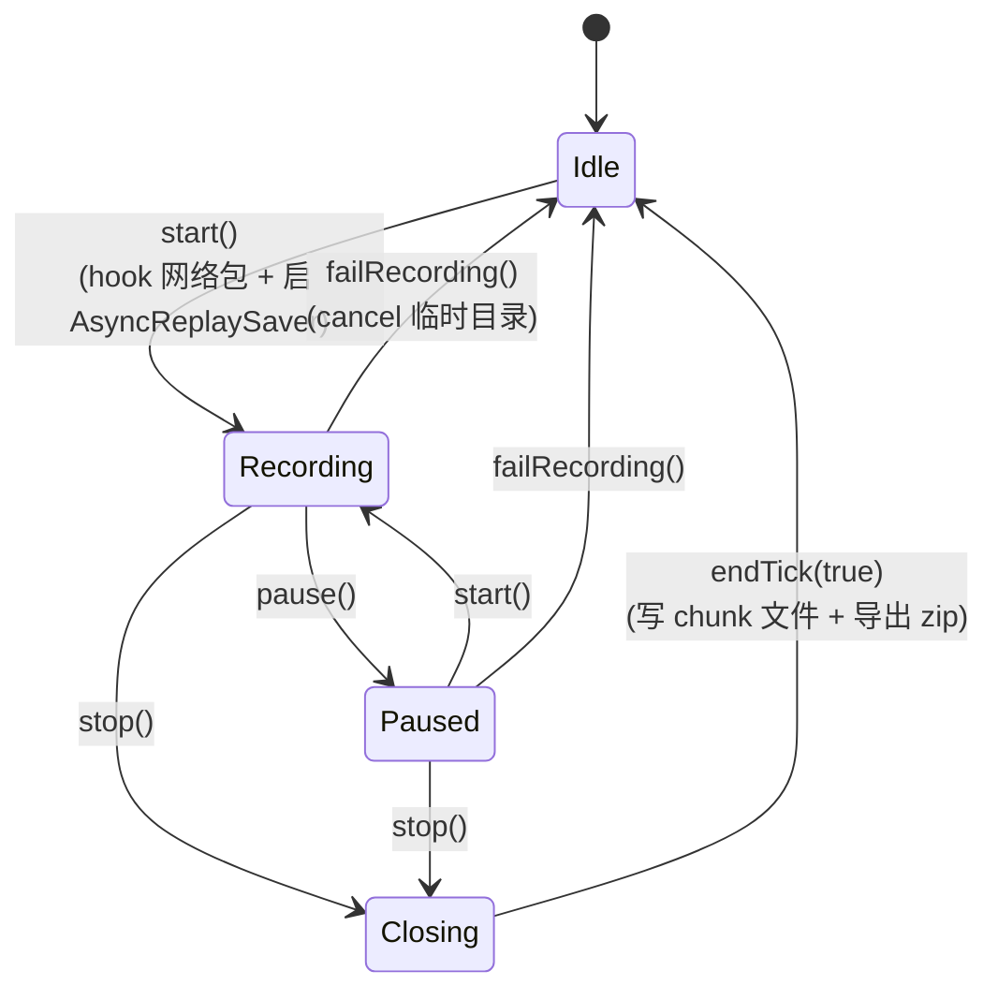
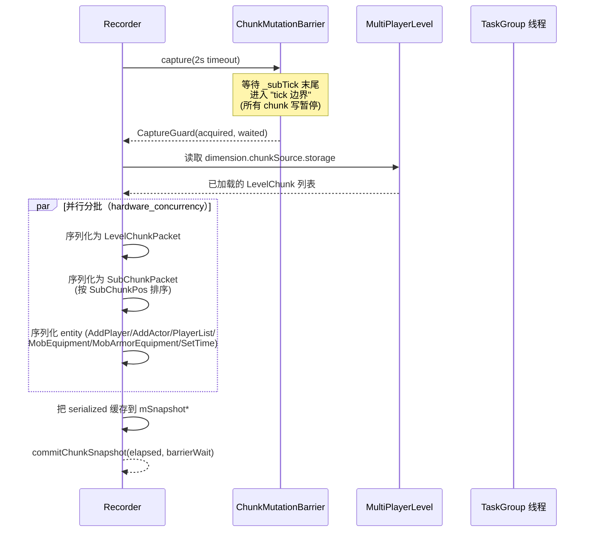
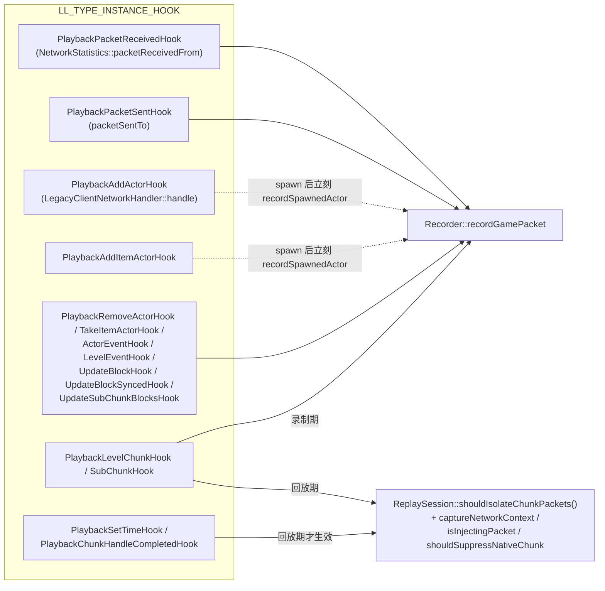
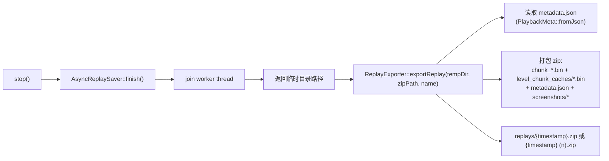

# functions/record — 录制主循环

> 入口：[`d:\raplay\Playback\src\playback\functions\record\`](file:///d:/raplay/Playback/src/playback/functions/record/)
> 角色：把客户端可见的"游戏事件 + 区块状态"采集成 `Action` 流，交给 `io` 层落盘成可移植回放文件。

## 内部结构

```
record/
├── Recorder.h / .cpp           ← 单例：录制状态机 + 写盘协调器
├── NetworkHooks.cpp            ← LL_TYPE_INSTANCE_HOOK 抓包
├── ChunkMutationBarrier.h/.cpp ← tick 边界互斥屏障
└── ReplayExporter.cpp          ← 临时目录 → .zip 打包（声明在 Recorder.h）
```

| 类 | 头文件 | 角色 |
| --- | --- | --- |
| `Recorder` | `Recorder.h:52` | 单例。状态机：Idle / Recording / Paused / Closing。统筹网络包、snapshot、entity movement、tick 边界。 |
| `ChunkMutationBarrier` | `ChunkMutationBarrier.h:9` | 互斥屏障：保证 snapshot 只在 tick 间隙采集，不与 chunk 写入并发。 |
| `ReplayExporter` | `Recorder.h:155` | 静态类，把临时目录压缩成 `replays/<timestamp>.zip` 并写入 `metadata.json`。 |
| `hookNetwork(bool)` | `Recorder.h:167` | 挂/卸所有 `NetworkHooks` + `ChunkMutationBarrier`。 |

## Recorder 状态机



实现见 [Recorder.cpp:375-440](file:///d:/raplay/Playback/src/playback/functions/record/Recorder.cpp#L375-L440)（start/pause/stop）、[Recorder.cpp:1450-1474](file:///d:/raplay/Playback/src/playback/functions/record/Recorder.cpp#L1450-L1474)（failRecording/cancelRecording）。

## 录制主循环（endTick）

`endTick(bool close)` 在每个客户端 tick 末尾被 `ClientTickHooks` 触发，是录制所有"边界处理"的统一入口。其内部按顺序执行：

1. `flushGamePackets()` — 把 `mPendingGamePackets` 队列里的网络包写到 `AsyncReplaySaver`。
2. `writeEntityMovements()` — 对比上一帧 actor 状态，写出变化的 `ActionMoveEntities`。
3. `writeTickBoundary()` — 写一个 `ActionNextTick`，并标记 `mOpenChunkHasData = true`。
4. 若达到 `RECORD_CHUNK_TICKS = 20*60*5`（5 分钟）→ 触发 `captureChunkSnapshot()` + `writeSnapshot()` + `commitChunkSnapshot()`，旋转 chunk。
5. 维度变化 / `close=true` → 调 `finishCurrentChunk(close)` 写 chunk 文件 + metadata。
6. 首次录制 → 调 `writeInitialSnapshotIfNeeded()` 在第一个 tick 边界采集首帧 snapshot。

实现见 [Recorder.cpp:535-597](file:///d:/raplay/Playback/src/playback/functions/record/Recorder.cpp#L535-L597)。

## Snapshot 采集（captureChunkSnapshot）

**为什么需要它**：世界 chunk 在客户端线程 + 后台 `SubChunk Insert Task Group` 线程同时可能被改；采集时如果不等写入方让开，会读到撕裂的 chunk。

**关键流程**（实现见 [Recorder.cpp:607-1017](file:///d:/raplay/Playback/src/playback/functions/record/Recorder.cpp#L607-L1017)）：



**关键设计**：

- **入口校验** `ChunkMutationBarrier::capture` 返回 `bool`，失败就放弃本帧 snapshot 而不是崩溃。
- **玩家身份改写** `mRecordedLocalPlayerId/RuntimeId/Uuid` 用三个 `numeric_limits` / 偏移常量作为"虚拟玩家 ID"，让回放世界里本地玩家和原 ID 隔离。
- **packet 重映射** `remapRecordedPlayerReferences` 处理 16 种会引用玩家 ID 的包（AddPlayer/PlayerList/RemoveActor/Animate/...），让重映射后回放时仍能匹配正确的 actor。
- **平行序列化** 按 `hardware_concurrency` 分批，每批独立 `SaveContextFactory::createNetworkSaveContext`，避免重复构造。

## NetworkHooks（包捕获）

实现见 [NetworkHooks.cpp:73-264](file:///d:/raplay/Playback/src/playback/functions/record/NetworkHooks.cpp#L73-L264)。



**两类钩子并存**：

- **抓包钩子**（recording 时活跃）：所有 hook 都最终调用 `Recorder::recordGamePacket(packet)`，把包原样 push 到 `mPendingGamePackets`。
- **回放隔离钩子**（replay 时活跃）：当 `ReplaySession::shouldIsolateChunkPackets()` 返回 true，钩子会**过滤**掉非回放注入的 chunk 包，避免与回放世界冲突。
- **状态机** `NetworkHookState`（[NetworkHooks.cpp:38-64](file:///d:/raplay/Playback/src/playback/functions/record/NetworkHooks.cpp#L38-L64)）记录 15 个 hook 的安装/卸载状态，`hookNetwork(true/false)` 原子切换。

**`recordGamePacket` 关键过滤**（[Recorder.cpp:1329-1408](file:///d:/raplay/Playback/src/playback/functions/record/Recorder.cpp#L1329-L1408)）：

| 条件 | 行为 |
| --- | --- |
| `AddActor.mEntityData == nullptr` | 跳过（半成品） |
| `AddItemActor.mEntityData == nullptr` | 跳过 |
| `FullChunkData.mCacheEnabled == true` | 跳过（已缓存的不重复写） |
| `SubChunkPacket.mCacheEnabled == true` | 跳过 |
| `MoveAbsoluteActor / MovePlayer / NetworkChunkPublisherUpdate / ChunkRadiusUpdated` | 跳过（不参与回放，snapshot 已经包含实体位置） |
| `DimensionDataPacket` | 始终记录（即使 Idle 状态也要记到 mDimensionDataPayload） |
| 包引用本地玩家 ID | 用 `remapRecordedPlayerReferences` 改写 |

## ChunkMutationBarrier（tick 边界互斥）

实现见 [ChunkMutationBarrier.cpp](file:///d:/raplay/Playback/src/playback/functions/record/ChunkMutationBarrier.cpp)。

**三组机制**：

1. **`TickBoundaryGuard`**：在 `MultiPlayerLevel::_subTick` 末尾进入 / 离开时构造/析构。`tickBoundaryLevel` 线程局部变量记录"当前线程是否在边界内"。
2. **`CaptureGuard`**：`capture(2s timeout)` 用 `std::timed_mutex` 阻塞等待；返回 `{acquired, waited}`。
3. **后台写入拦截**：hook `TaskGroup` 的 vtable，发现属于 `SubChunk Insert Task Group` 的后台线程在写 chunk 时，**延后**到下一个 tick 边界。

```cpp
// Recorder.cpp 简化片段
auto mutationGuard = ChunkMutationBarrier::capture();
if (!mutationGuard) { failRecording("...barrier"); return; }
auto* guardedPlayer = clientInstance->getLocalPlayer();
if (guardedPlayer != localPlayer || ...) { failRecording("player/dim changed"); return; }
// 此处：tick 已切换完，chunk 写入线程被挡住，可以安全地遍历 storage
```

## ReplayExporter（导出 zip）

实现见 [Recorder.cpp:155-165](file:///d:/raplay/Playback/src/playback/functions/record/Recorder.cpp) 声明 + [ReplayExporter.cpp](file:///d:/raplay/Playback/src/playback/functions/record/ReplayExporter.cpp) 实现。



**关键点**：

- 文件名生成 `findAvailableReplayName(replayDir, currentReplayTimestampName())`：先尝试 `2026-07-29T12-34-56.zip`，冲突则 `2026-07-29T12-34-56 (1).zip`，最多 10000 次，最后兜底用 UUID。
- `metadata.json` 由 `PlaybackMeta::toJson()`（[Recorder.cpp:295-321](file:///d:/raplay/Playback/src/playback/functions/record/Recorder.cpp#L295-L321)）序列化：`name` / `worldName` / `duration` / `totalTicks` / `initialView{x,y,z,yaw,pitch}` / `chunks: { chunkName -> chunkMeta }`。`chunks` 字段用 `LinkedHashMap` 保序。

## 关键数据结构

| 名称 | 位置 | 用途 |
| --- | --- | --- |
| `PlaybackView` | `Recorder.h:30` | 玩家视角 (x,y,z,yaw,pitch)，作为初始视角 / chunk 起点 |
| `PlaybackMeta` | `Recorder.h:38` | 回放元数据 + 嵌套的 chunk 元数据树 |
| `PlaybackSerializedGamePacket` | `AsyncReplaySaver.h:34` | 已序列化的网络包 `{packetId, payload}`，跨线程传递 |
| `State` 枚举 | `Recorder.h:54` | Idle / Recording / Paused / Closing |
| 常量 | `Recorder.h:93` | `RECORD_CHUNK_TICKS = 20*60*5` = 5 分钟一个 chunk |
| 常量 | `Recorder.cpp:87-88` | 录制玩家的虚拟 ID（避免与原 ID 冲突） |

## 模块关系

### 被谁调用（上游）

- **`command::record`**：调 `start()` / `pause()` / `stop()`。
- **`Playback::isReplayMode()`**：`start()` 里检查，回放世界不允许开始录制。
- **`ClientTickHooks`**：每 tick 调 `endTick(false)`，stop 时调 `endTick(true)`。

### 调用谁（下游）

- **`functions::action::ActionRegistry`**：通过 `ActionNextTick` / `ActionGamePacket` / `ActionMoveEntities` / `ActionLevelChunkCached` / `ActionSubChunkCached` 的 `startAndFinishAction` / `startAction` 写入。
- **`functions::io::AsyncReplaySaver`**：调 `submit()` / `writeGamePackets()` / `writeReplayChunk()`，并最终调 `finish()`。
- **`utils::PathUtils`**：调 `getReplaysDir()` 决定 zip 存放位置；`createTemp` 给 saver 用。
- **`functions::replay::ReplaySession`**：`NetworkHooks` 在回放期通过 `shouldIsolateChunkPackets()` / `shouldSuppressNativeChunk()` / `isInjectingPacket()` / `onLevelChunkHandled()` 与 ReplaySession 双向通信。
- **MinecraftPackets / NetworkStatistics / ClientInstance / LocalPlayer / Dimension / SubChunk** 等 BDS 内部类型（深度耦合）。

### 共享数据

- **`ActionRegistry` 单例** — 录制时写入，回放时读取。
- **`mAsyncReplaySaver` 唯一实例** — 通过 `submit` 闭包把 lambda 跨线程传到后台 writer 线程。
- **`mRecordedLocalPlayerId/RuntimeId/Uuid`** — 录制时设置的虚拟 ID，序列化时把原包里的玩家 ID 改写为虚拟 ID；回放世界重启时回放端会用相同 ID 重建。

### 事件订阅 / 发送

- **不订阅 LeviLamina 事件总线**。所有捕获完全靠 LL_TYPE_INSTANCE_HOOK 拦截 NetworkStatistics + LegacyClientNetworkHandler + ClientNetworkHandler + MultiPlayerLevel 的虚函数。

## 阅读顺序

- 状态机骨架：先看本文件 + [Recorder.cpp:375-597](file:///d:/raplay/Playback/src/playback/functions/record/Recorder.cpp#L375-L597)
- snapshot 细节：本文件 + [Recorder.cpp:607-1017](file:///d:/raplay/Playback/src/playback/functions/record/Recorder.cpp#L607-L1017)
- 包抓取：本文件 + [NetworkHooks.cpp](file:///d:/raplay/Playback/src/playback/functions/record/NetworkHooks.cpp)
- 互斥屏障：本文件 + [ChunkMutationBarrier.cpp](file:///d:/raplay/Playback/src/playback/functions/record/ChunkMutationBarrier.cpp)
- 异步落盘：[io.md](io.md)
- Action 协议：[action.md](action.md)
- tick 调度：[tick.md](tick.md)
