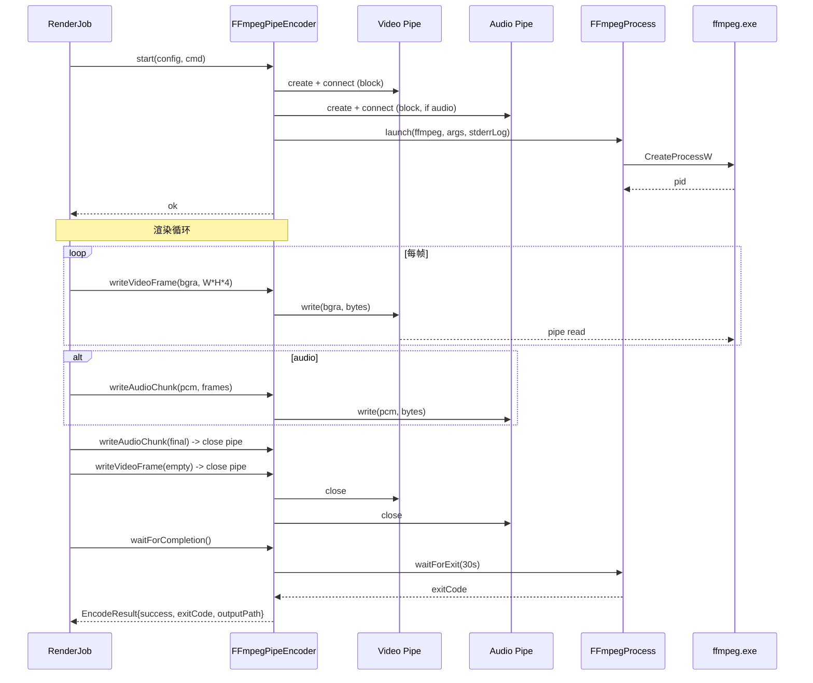

# functions/render/frame-encoder — FFmpeg 子进程编码器封装

> 入口：`src/playback/functions/render/FrameEncoder.{h,cpp}`
> 角色：把 `RenderJob` 喂的 BGRA 帧和 PCM 音频流通过 **Windows 命名管道** 喂给 FFmpeg 子进程，FFmpeg 编码 + 封装为最终视频文件。
> 替代方案是 libavcodec 直接调；本设计选子进程是为 **不入 lib**、**FFmpeg 升级零成本**、**格式/编码器扩展零编译**。

## 一、需求（Requirements）

### 1.1 功能性需求

| ID | 需求 | 优先级 |
|---|---|---|
| FE-1 | 启动 FFmpeg 子进程，传入 `ExportPresets` 生成的参数 | P0 |
| FE-2 | 创建两个 **Windows 命名管道**：`playback_video_<uuid>`（BGRA 帧）和 `playback_audio_<uuid>`（PCM 音频） | P0 |
| FE-3 | `writeVideoFrame(BGRA*, size)` → 写入视频 pipe | P0 |
| FE-4 | `writeAudioChunk(PCM*, size)` → 写入音频 pipe（可选） | P0 |
| FE-5 | `waitForCompletion()`：阻塞到 FFmpeg 退出 + 验证输出文件 | P0 |
| FE-6 | 解析 FFmpeg stderr：抓最后 200 行 + 错误码 → 写到 `lastError` | P0 |
| FE-7 | 取消：`killProcess()` 强制结束 FFmpeg + 删 .tmp | P0 |
| FE-8 | PNG 序列：跳过 FFmpeg，直接 `writePngSequence` 写 `frame_000001.png` 等 | P0 |
| FE-9 | 实时统计：累计写字节数 → `currentBitrateKbps` | P0 |

### 1.2 非功能性需求

- **背压保护**：pipe buffer 默认 64KB；写超 64KB 时阻塞 → 同步 FFmpeg 消费速度。
- **错误可见**：FFmpeg 启动失败 → `lastError` 包含 stderr 末 200 行 + exit code。
- **可移植**：Windows 实现，命名管道 + `CreateProcessW`；接口留好未来移植到 Unix domain socket。
- **资源释放**：RAII；析构时确保子进程 join + pipe 关闭。

### 1.3 与现有约束对齐

- 复用 `ExportPresets` 生成的 `FFmpegCommand`（[export-presets.md](file:///d:/raplay/Playback/docs/functions/render/export-presets.md)）。
- 复用 `AtomicFileWriter`（[render-job.md §2.7](file:///d:/raplay/Playback/docs/functions/render/render-job.md)）做原子提交。
- 复用 `utils/PathUtils` 找 `ffmpeg.exe`。

## 二、架构（Architecture）

### 2.1 内部结构

```
functions/render/
├── FrameEncoder.h / .cpp          ← 本模块
├── FFmpegProcess.{h,cpp}          ← 子进程封装（启 / 写 / 收 stderr / 杀）
├── NamedPipe.{h,cpp}              ← Windows 命名管道封装
├── PngSequenceWriter.{h,cpp}      ← PNG 序列直写
└── PcmPipeWriter.h                ← 音频 pipe 写入（无 ffmpeg 头依赖）
```

### 2.2 主类

```cpp
// FrameEncoder.h
class FrameEncoder {
public:
    virtual ~FrameEncoder() = default;

    virtual bool start(const ExportConfig& cfg, const FFmpegCommand& cmd) = 0;
    virtual void writeVideoFrame(const uint8_t* bgra, size_t bytes) = 0;
    virtual void writeAudioChunk(const int16_t* pcm, size_t frames) = 0;
    virtual EncodeResult waitForCompletion() = 0;
    virtual void cancel() = 0;

    // 统计
    virtual size_t bytesWritten() const = 0;
    virtual float  currentBitrateKbps(float elapsedSec) const = 0;
};

struct EncodeResult {
    bool        success{false};
    int         exitCode{-1};
    std::string lastError;
    size_t      outputBytes{0};
    std::filesystem::path outputPath;
};

// 实现
class FFmpegPipeEncoder : public FrameEncoder { ... };
class PngSequenceEncoder : public FrameEncoder { ... };
```

### 2.3 子进程封装

```cpp
// FFmpegProcess.h
class FFmpegProcess {
public:
    bool launch(const std::filesystem::path& binary,
                const std::vector<std::string>& args,
                const std::filesystem::path& stderrLog);
    bool isRunning() const;
    int  waitForExit(int timeoutMs = 30000);
    void kill();
    std::string readStderrTail(size_t maxLines = 200) const;

private:
    HANDLE mHProcess{nullptr};
    HANDLE mHThread{nullptr};
    HANDLE mStderrRd{nullptr};  // pipe read end
    HANDLE mStderrWr{nullptr};
    std::thread mStderrReader;
    std::string mStderrBuf;  // 行缓冲
};
```

**stderr 读取**：

```cpp
void FFmpegProcess::startStderrReader() {
    mStderrReader = std::thread([this] {
        std::array<char, 4096> buf;
        std::string line;
        while (mStderrRd != INVALID_HANDLE_VALUE) {
            DWORD n = 0;
            if (!ReadFile(mStderrRd, buf.data(), buf.size(), &n, nullptr) || n == 0) break;
            line.append(buf.data(), n);
            size_t pos;
            while ((pos = line.find('\n')) != std::string::npos) {
                mStderrBuf.push_back(line[pos]);
                if (mStderrBuf.size() > 200 * 200) mStderrBuf.erase(0, 200);  // 保留末 200 行
                line.erase(0, pos + 1);
            }
        }
    });
}
```

### 2.4 命名管道

```cpp
// NamedPipe.h
class NamedPipe {
public:
    NamedPipe(const std::wstring& name);
    ~NamedPipe();
    bool create();
    bool connect(DWORD timeoutMs = 5000);
    bool write(const void* data, size_t bytes, DWORD timeoutMs = 5000);
    void close();

private:
    HANDLE mHandle{INVALID_HANDLE_VALUE};
    std::wstring mName;
};
```

**创建**：

```cpp
bool NamedPipe::create() {
    mHandle = CreateNamedPipeW(
        mName.c_str(),
        PIPE_ACCESS_OUTBOUND | FILE_FLAG_OVERLAPPED,
        PIPE_TYPE_BYTE | PIPE_WAIT,
        1,                            // 单实例
        64 * 1024,                    // out buffer 64KB
        0,                            // in buffer
        0,                            // default timeout
        nullptr                       // default security
    );
    return mHandle != INVALID_HANDLE_VALUE;
}
```

**写**（背压友好）：

```cpp
bool NamedPipe::write(const void* data, size_t bytes, DWORD timeoutMs) {
    OVERLAPPED ov = {};
    ov.hEvent = CreateEvent(nullptr, TRUE, FALSE, nullptr);
    DWORD written = 0;
    if (!WriteFile(mHandle, data, (DWORD)bytes, &written, &ov)) {
        if (GetLastError() != ERROR_IO_PENDING) { CloseHandle(ov.hEvent); return false; }
        if (WaitForSingleObject(ov.hEvent, timeoutMs) != WAIT_OBJECT_0) {
            CancelIo(mHandle);
            CloseHandle(ov.hEvent);
            return false;
        }
        GetOverlappedResult(mHandle, &ov, &written, FALSE);
    }
    CloseHandle(ov.hEvent);
    return written == bytes;
}
```

**管道名**：

```cpp
std::wstring makePipeName(const std::string& suffix) {
    auto uuid = genUuid();
    return L"\\\\.\\pipe\\playback_" + std::wstring(suffix.begin(), suffix.end())
           + L"_" + utf8ToUtf16(uuid);
}
```

### 2.5 启动流程



### 2.6 FFmpeg 命令适配

`ExportPresets::buildCommand` 生成的命令有两个 `pipe:` 输入。我们把它替换成 Windows 命名管道路径：

```cpp
// FFmpegPipeEncoder::start
FFmpegCommand FFmpegPipeEncoder::adaptCommand(const FFmpegCommand& cmd) {
    FFmpegCommand adapted = cmd;
    for (auto& a : adapted.args) {
        if (a == "<VIDEO_PIPE>") a = utf8ToUtf16(mVideoPipeName);
        if (a == "<AUDIO_PIPE>") a = utf8ToUtf16(mAudioPipeName);
    }
    return adapted;
}
```

> `ExportPresets::buildCommand` 需要预留两个占位符（见 [export-presets.md §2.6](file:///d:/raplay/Playback/docs/functions/render/export-presets.md) 的修改）。

### 2.7 PNG 序列（无 FFmpeg）

```cpp
// PngSequenceWriter.h
class PngSequenceWriter : public FrameEncoder {
public:
    bool start(const ExportConfig& cfg, const FFmpegCommand&) override {
        mDir = cfg.outputPath;
        mDir.replace_extension("");  // strip .png
        mDir += "_frames";
        std::filesystem::create_directories(mDir);
        mIndex = 0;
        return true;
    }
    void writeVideoFrame(const uint8_t* bgra, size_t) override {
        auto path = mDir / std::format("frame_{:06d}.png", ++mIndex);
        stbi_write_png(path.string().c_str(), mWidth, mHeight, 4, bgra, mWidth * 4);
    }
    // audio / waitForCompletion no-op
private:
    int mIndex{0};
    std::filesystem::path mDir;
    int mWidth, mHeight;
};
```

> `stbi_write_png` 由 [stb](https://github.com/nothings/stb) 提供，**单头文件**，可直接 include 进项目（[xmake.lua](file:///d:/raplay/Playback/xmake.lua) 加 `add_files`）。

### 2.8 错误处理

```cpp
EncodeResult FFmpegPipeEncoder::waitForCompletion() {
    EncodeResult r;
    r.outputPath = mCmd.outputPath();

    // 1) 优雅关闭 pipe（让 FFmpeg 收尾）
    mVideoPipe->close();
    if (mAudioPipe) mAudioPipe->close();

    // 2) 等 FFmpeg 退出
    int code = mProcess->waitForExit(mTimeoutMs);
    r.exitCode = code;
    r.outputBytes = std::filesystem::exists(r.outputPath)
                    ? std::filesystem::file_size(r.outputPath) : 0;
    r.lastError = mProcess->readStderrTail(200);

    // 3) 成功判定
    r.success = (code == 0) && (r.outputBytes > 0);
    if (!r.success && r.lastError.empty()) {
        r.lastError = "FFmpeg exited with code " + std::to_string(code);
    }
    return r;
}
```

## 三、执行（Execution）

### 3.1 任务拆分

| 步骤 | 文件 | 验证 |
|---|---|---|
| 1 | `NamedPipe.{h,cpp}` | 单测：create + connect + write + close |
| 2 | `FFmpegProcess.{h,cpp}` | 单测：launch + kill + readStderrTail |
| 3 | `PngSequenceWriter.{h,cpp}` | 单测：写 3 帧；PNG 可读 |
| 4 | `FFmpegPipeEncoder` 主类 | 手动：跑 1 帧导出 |
| 5 | 适配 `ExportPresets::buildCommand` 加占位符 | 编译 |
| 6 | `waitForCompletion` + 错误处理 | 手动：故意把 ffmpeg 改成 notepad |
| 7 | 取消路径 | 手动：导出中 cancel |
| 8 | 性能：1080p 60fps 写 pipe < 4ms | perf marker |

### 3.2 关键不变量

1. **pipe 必须在 ffmpeg 启动前创建**：否则 ffmpeg 找不到 `<VIDEO_PIPE>`。
2. **pipe 关闭顺序**：先关 video pipe（让 ffmpeg 知道 video 流结束）→ 再关 audio pipe。
3. **stderr 必须读**：否则管道 buffer 满后 ffmpeg 会阻塞。
4. **资源 RAII**：pipe / process / thread 析构时必释放。
5. **PNG 序列不走 FFmpeg**：`container == PngSequence` 时构造 `PngSequenceWriter` 而非 `FFmpegPipeEncoder`。

### 3.3 测试用例

| ID | 用例 | 期望 |
|---|---|---|
| FE-T1 | 启动 ffmpeg + 写 10 帧 + 关闭 pipe | ffmpeg 退出码 0，mp4 文件存在 |
| FE-T2 | ffmpeg 路径错 | `lastError` 含 "系统找不到指定的文件" |
| FE-T3 | 写 pipe 阻塞（pipe buffer 满） | waitForCompletion 超时 → cancel |
| FE-T4 | 取消 | ffmpeg 进程被 kill，.tmp 删 |
| FE-T5 | PNG 序列 | 5 帧 PNG 文件 + 文件名 `frame_000001.png` |
| FE-T6 | stderr 含 ERROR 行 | `lastError` 含该行 |
| FE-T7 | 4K 60fps 写 pipe | 平均延迟 < 4ms/frame |

### 3.4 风险与回退

| 风险 | 缓解 |
|---|---|
| FFmpeg 死锁 | pipe buffer 调大（1MB）+ 超时 kill |
| Pipe 创建权限 | `CreateNamedPipeW` 默认当前用户权限足够 |
| 8K pipe 带宽 | pipe buffer 调到 4MB |
| 多 job 冲突 | pipe 名加 UUID，每次 job 唯一 |
| stb 编译警告 | `#pragma warning(push)` + 限定 set |

## 四、模块关系

### 被谁调用（上游）

- **`functions/render/RenderJob`**：每帧调 `writeVideoFrame` + `writeAudioChunk`；终结调 `waitForCompletion`。

### 调用谁（下游）

- **`FFmpegProcess`**：子进程管理。
- **`NamedPipe`**：Windows 命名管道。
- **`PngSequenceWriter`**：无 FFmpeg 路径。
- **`stb_image_write.h`**：PNG 写入（PNG 序列模式）。
- **`ExportPresets::buildCommand`**：拿 FFmpeg 命令。

### 共享数据

- 无（RenderJob 独占）。

### 事件订阅 / 发送

- 无。

## 五、阅读顺序

1. 本文件
2. [functions/render/render-job.md](file:///d:/raplay/Playback/docs/functions/render/render-job.md)
3. [functions/render/export-presets.md](file:///d:/raplay/Playback/docs/functions/render/export-presets.md)
