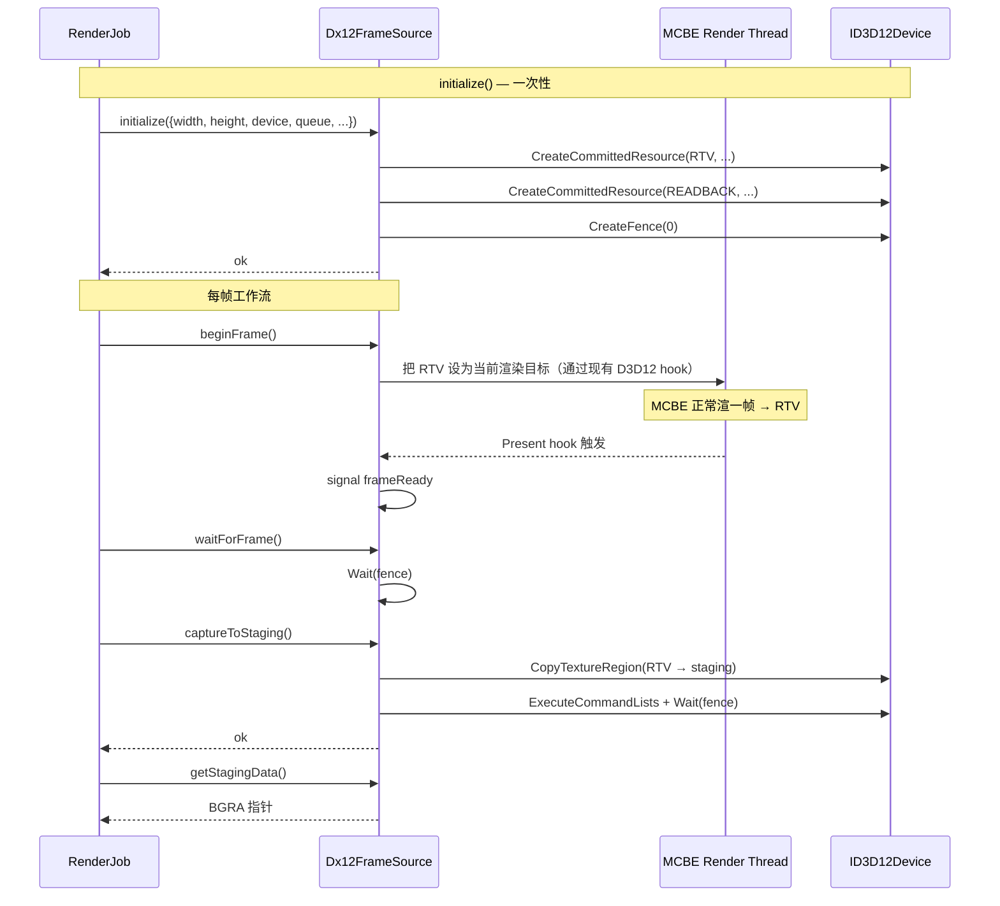

# functions/render/frame-source — DX12 离屏 RenderTarget 帧源

> 入口：`src/playback/functions/render/FrameSource.{h,cpp}`
> 角色：抽象出"任意分辨率 / 任意比例 / 任意像素格式"的帧源。当前实现是 **DX12 离屏 RenderTarget + IDXGISwapChain1 hook**；未来可替换为"窗口捕获"或"headless 渲染"而不动 RenderJob。

## 一、需求（Requirements）

### 1.1 功能性需求

| ID | 需求 | 优先级 |
|---|---|---|
| FS-1 | 创建 N×M 分辨率的 DX12 离屏 RTV（与 MCBE 设备共享） | P0 |
| FS-2 | 帧完成信号：等待"一帧渲染结束"，把纹理拷到 staging | P0 |
| FS-3 | 提供 `getStagingData()` 拿到 BGRA 像素的 CPU 指针 | P0 |
| FS-4 | 支持动态 resize（中途切分辨率） | P1 |
| FS-5 | 多线程安全：仅 RenderJob worker 调 | P0 |
| FS-6 | 资源 RAII：`FrameSource` 析构时释放 RTV / staging / fence | P0 |

### 1.2 非功能性需求

- **延迟**：从"一帧渲染完成"到 `getStagingData()` < 5ms（4K）。
- **吞吐**：4K 60fps 拷帧 + 读 back < 16ms/frame。
- **GPU 资源**：RTV 池（默认 2 个 ping-pong）+ staging × 1。
- **像素格式**：固定 BGRA（FFmpeg `rawvideo -pix_fmt bgra` 直读）。

### 1.3 与现有约束对齐

- 复用 `editor/renderer/D3D12Compat.h` 的 D3D12 头兼容。
- 复用 `editor/renderer/D3D12Hooks.h` 的 `Present` hook 触发信号。
- 复用 MCBE 内部的 `ID3D12Device*` / `ID3D12CommandQueue*`（通过现有 D3D12 hook 拿到的指针）。

## 二、架构（Architecture）

### 2.1 内部结构

```
functions/render/
├── FrameSource.h                  ← 抽象接口
├── Dx12FrameSource.{h,cpp}        ← DX12 实现（本模块）
├── FrameReadySignal.h / .cpp      ← 跨线程帧完成信号
└── ColorSpaceConverter.h / .cpp   ← 颜色空间（sRGB → linear 等）
```

### 2.2 抽象接口

```cpp
// FrameSource.h
class FrameSource {
public:
    virtual ~FrameSource() = default;

    // 生命周期
    virtual bool initialize(const FrameSourceDesc& desc) = 0;
    virtual void shutdown() = 0;
    virtual bool resize(int newWidth, int newHeight) = 0;

    // 一帧工作流
    virtual void beginFrame() = 0;           // 准备 RTV（绑到 MCBE 渲染管线）
    virtual void waitForFrame() = 0;         // 阻塞到 Present 完成
    virtual bool captureToStaging() = 0;     // RTV → staging texture
    virtual const uint8_t* getStagingData() const = 0;
    virtual size_t getStagingSize() const = 0;  // bytes
    virtual int   getWidth() const = 0;
    virtual int   getHeight() const = 0;

    // 调试
    virtual bool saveLastFrameToPng(const std::filesystem::path& path) = 0;
};

struct FrameSourceDesc {
    int                       width;
    int                       height;
    ID3D12Device*             sharedDevice;     // MCBE 设备
    ID3D12CommandQueue*       sharedQueue;      // MCBE 渲染队列
    DXGI_FORMAT               rtvFormat{DXGI_FORMAT_B8G8R8A8_UNORM_SRGB};
    bool                      enableDebugCapture{false};  // dump 抽样 PNG
};
```

### 2.3 DX12 实现关键流程



### 2.4 关键代码骨架

```cpp
// Dx12FrameSource.h
class Dx12FrameSource : public FrameSource {
public:
    bool initialize(const FrameSourceDesc& desc) override;
    void shutdown() override;
    bool resize(int w, int h) override;

    void beginFrame() override;
    void waitForFrame() override;
    bool captureToStaging() override;
    const uint8_t* getStagingData() const override;
    size_t getStagingSize() const override { return mStagingSize; }
    int getWidth() const override { return mWidth; }
    int getHeight() const override { return mHeight; }

    bool saveLastFrameToPng(const std::filesystem::path& path) override;

private:
    // D3D12 资源
    ComPtr<ID3D12Device>             mDevice;
    ComPtr<ID3D12CommandQueue>       mQueue;
    ComPtr<ID3D12CommandAllocator>   mCmdAlloc;
    ComPtr<ID3D12GraphicsCommandList> mCmdList;
    ComPtr<ID3D12Resource>           mRtv;
    ComPtr<ID3D12Resource>           mStaging;
    ComPtr<ID3D12Fence>              mFence;
    HANDLE                           mFenceEvent{};

    // 描述符
    ComPtr<ID3D12DescriptorHeap>     mRtvHeap;
    D3D12_CPU_DESCRIPTOR_HANDLE      mRtvHandle{};

    // 状态
    int          mWidth{}, mHeight{};
    size_t       mStagingSize{};
    uint64_t     mFenceValue{1};
    bool         mFrameReady{false};
    std::mutex   mMtx;
    std::condition_variable mCv;
};
```

### 2.5 RTV 注入 MCBE 渲染管线

**问题**：MCBE 用自己的 RTV 渲到 swap chain；怎么让 MCBE 渲到我们的 RTV？

**方案 A：双 RTV 注入（推荐）**

在 `editor/renderer/D3D12Hooks.cpp` 的 `Present` hook 之前，插入一个 "Copy main RTV → our RTV"：

```cpp
// 在 MCBE 自己 Present 之前
ID3D12Resource* mainRtv = ...;  // MCBE 自己的 back buffer
mFrameSource->captureExternal(mainRtv);  // 拷到我们 RTV
```

**方案 B：替换 MCBE RTV**

在 `OMSetRenderTargets` hook 里把目标换成我们的 RTV；MCBE 渲完再换回来。**风险高**，MCBE 可能内部缓存 viewport。

**方案 C：DXGI Output Duplication（兜底）**

抓主窗口输出，crop 到我们分辨率。**支持任何分辨率差**但有性能开销。

> **首版实现**：方案 A，复杂度最低、性能最好。

### 2.6 帧完成信号

```cpp
// FrameReadySignal.h
class FrameReadySignal {
public:
    void notify() {
        std::lock_guard lk(mMtx);
        mReady = true;
        mCv.notify_one();
    }
    bool waitFor(int timeoutMs) {
        std::unique_lock lk(mMtx);
        return mCv.wait_for(lk, std::chrono::milliseconds(timeoutMs),
                            [this]{ return mReady; });
    }
    void reset() {
        std::lock_guard lk(mMtx);
        mReady = false;
    }
private:
    std::mutex              mMtx;
    std::condition_variable mCv;
    bool                    mReady{false};
};
```

`FrameReadySignal` 由 `D3D12Hooks::Present` 后置 hook 触发 `notify()`；RenderJob worker 在 `waitForFrame()` 阻塞。

### 2.7 颜色空间

> 当前 MCBE 输出 sRGB；`rawvideo -pix_fmt bgra` 期望 sRGB 像素直读。
> HDR 导出时（`colorSpace = Hdr10`）需要把 sRGB 转线性 → PQ：

```cpp
// ColorSpaceConverter.cpp
void convertSrgbToPqBgra(uint8_t* dst, const uint8_t* src, int width, int height) {
    for (int i = 0; i < width * height; ++i) {
        Vec3 rgb = srgbToLinear(Vec3{src[2]/255.f, src[1]/255.f, src[0]/255.f});
        Vec3 pq  = linearToPq(rgb, mPeakNits);
        dst[0] = clampU8(pq.z * 255);  // B
        dst[1] = clampU8(pq.y * 255);  // G
        dst[2] = clampU8(pq.x * 255);  // R
        dst[3] = 255;
        src += 4; dst += 4;
    }
}
```

> **首版实现**：sRGB 直通；HDR 留 stub，等 MCBE HDR 渲染就绪再开。

## 三、执行（Execution）

### 3.1 任务拆分

| 步骤 | 文件 | 验证 |
|---|---|---|
| 1 | `FrameSource.h` 抽象 | 编译 |
| 2 | `FrameReadySignal.{h,cpp}` | 单测：notify/wait |
| 3 | `Dx12FrameSource` 资源创建 | 单测：创建 1080p RTV 不崩 |
| 4 | `captureExternal()`：从 MCBE main RTV 拷帧 | 手动：dump 抽样 PNG 验证内容 |
| 5 | `waitForFrame` + 信号联动 | 手动：导出 1 帧，FFmpeg 收到有效帧 |
| 6 | `resize()` | 手动：导出 720p → 切 1080p |
| 7 | `saveLastFrameToPng` | 手动：失败诊断用 |
| 8 | 性能：4K 60fps 拷帧 < 16ms | 手动：perf marker |

### 3.2 关键算法

**Ping-pong RTV（避免读写冲突）**：

```cpp
// 简化版
void Dx12FrameSource::beginFrame() {
    mCurrentRtvIdx = (mCurrentRtvIdx + 1) % 2;  // ping-pong
    mRtvHandle = mRtvHeap->GetCPUDescriptorHandleForHeapStart();
    mRtvHandle.ptr += mCurrentRtvIdx * mRtvDescSize;
}
```

**拷帧命令记录**：

```cpp
bool Dx12FrameSource::captureToStaging() {
    mCmdAlloc->Reset();
    mCmdList->Reset(mCmdAlloc.Get(), nullptr);

    D3D12_TEXTURE_COPY_LOCATION src = { mRtv.Get(), D3D12_TEXTURE_COPY_TYPE_SUBRESOURCE_INDEX, 0 };
    D3D12_TEXTURE_COPY_LOCATION dst = { mStaging.Get(), D3D12_TEXTURE_COPY_TYPE_PLACED_FOOTPRINT,
                                        {0, {DXGI_FORMAT_B8G8R8A8_UNORM, mWidth, mHeight, 1, mStagingRowPitch}} };
    mCmdList->CopyTextureRegion(&dst, 0, 0, 0, &src, nullptr);
    mCmdList->Close();

    mQueue->ExecuteCommandLists(1, CommandListCast(mCmdList.GetAddressOf()));

    mFenceValue++;
    mQueue->Signal(mFence.Get(), mFenceValue);
    if (mFence->GetCompletedValue() < mFenceValue) {
        mFence->SetEventOnCompletion(mFenceValue, mFenceEvent);
        WaitForSingleObject(mFenceEvent, INFINITE);
    }

    // 映射 staging
    D3D12_RANGE readRange = {0, mStagingSize};
    void* mapped = nullptr;
    mStaging->Map(0, &readRange, &mapped);
    mStagingPtr = static_cast<uint8_t*>(mapped);
    return true;
}
```

### 3.3 关键不变量

1. **共享设备**：不创建新 `ID3D12Device`，用 MCBE 的（避免多设备互操作问题）。
2. **RTV 池**：默认 2 个 ping-pong；resize 时重建。
3. **staging 必须 READBACK heap**：`D3D12_HEAP_TYPE_READBACK`，否则 `Map` 失败。
4. **staging 必须 UNORM 而非 SRGB**：`B8G8R8A8_UNORM`，因为我们读原始 sRGB 值，不让 GPU 自动转。
5. **销毁顺序**：先 unmap staging，再 release RTV，最后 release fence/event。

### 3.4 测试用例

| ID | 用例 | 期望 |
|---|---|---|
| FS-T1 | 创建 1080p FrameSource | 不崩；getStagingSize = 1080*1920*4 |
| FS-T2 | 拷 1 帧 + saveLastFrameToPng | PNG 有效，像素值 ≈ MCBE 屏幕 |
| FS-T3 | resize 1080p → 4K | 资源重建，新尺寸 |
| FS-T4 | 多线程 beginFrame + capture | mutex 保护，stagingPtr 有效 |
| FS-T5 | HDR config | convertSrgbToPqBgra 像素范围 [0, 255] |
| FS-T6 | shutdown 后再 initialize | 不残留旧资源 |

### 3.5 风险与回退

| 风险 | 缓解 |
|---|---|
| MCBE 改 RTV 字段 | hook `OMSetRenderTargets` 拿最新 RTV 句柄 |
| 拷帧延迟 > 16ms | 缩到 1080p + 60fps；perf marker 卡点定位 |
| Staging 内存不足 | 限制 max 8K；UI 警告 |
| HDR 转换 CPU 太慢 | GPU compute shader 替代（次版本） |

## 四、模块关系

### 被谁调用（上游）

- **`functions/render/RenderJob`**：每帧 `beginFrame` / `waitForFrame` / `captureToStaging` / `getStagingData`。

### 调用谁（下游）

- **`editor/renderer/D3D12Hooks.cpp`**：触发 `FrameReadySignal::notify`。
- **MCBE 内部 D3D12 设备 / 队列**：共享。
- **`ColorSpaceConverter`**：HDR 转换。

### 共享数据

- 无（纯 RAII 资源）。

### 事件订阅 / 发送

- 不订阅新事件；通过 `D3D12Hooks` 间接。

## 五、阅读顺序

1. 本文件
2. [functions/render/render-job.md](file:///d:/raplay/Playback/docs/functions/render/render-job.md)
