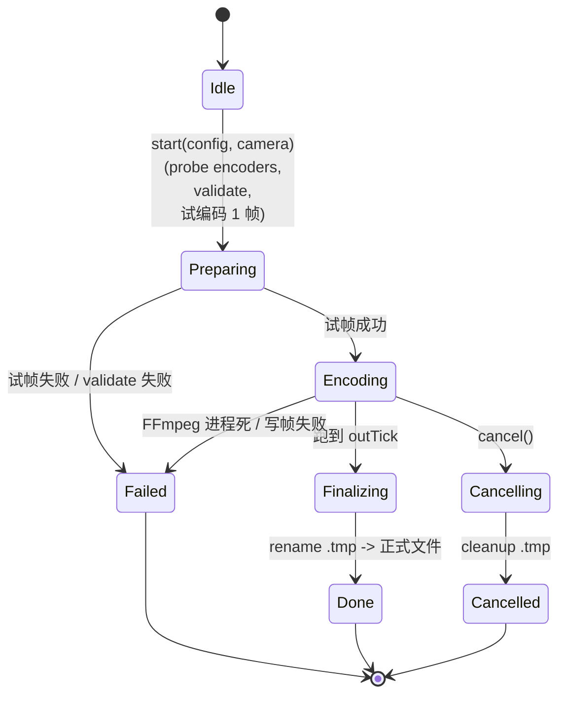

# functions/render/render-job — 渲染任务调度（中心协调器）

> 入口：`src/playback/functions/render/RenderJob.{h,cpp}`
> 角色：`RenderJob` 是 **导出流水线的中心**。它协调 `FrameSource`（抓帧）+ `CameraSampler`（轨道采样）+ `FrameEncoder`（编码）+ `AudioTrack`（音频），把 `.playback` 离线重放并输出最终视频。
> 状态：单实例（`RenderJob::getInstance()`），但**一次只跑一个 job**，其余排队。

## 一、需求（Requirements）

### 1.1 功能性需求

| ID | 需求 | 优先级 |
|---|---|---|
| RJ-1 | 接收 `ExportConfig` + `CameraTrack`，启动导出 job | P0 |
| RJ-2 | job 状态机：`Idle → Preparing → Encoding → Finalizing → Done / Failed / Cancelled` | P0 |
| RJ-3 | **离线重放** `.playback`：在隔离回放世界内，从 `inTick` 跑到 `outTick` | P0 |
| RJ-4 | 每 tick 调 `CameraSampler::sampleAt` 拿摄影机位置 / 旋转 / FOV，注入到 MCBE | P0 |
| RJ-5 | 每帧把渲染目标拷到 staging texture，写入 FFmpeg pipe | P0 |
| RJ-6 | 进度写回 `EditorContext.mExportExt.mState.lastProgress` | P0 |
| RJ-7 | 支持**取消**：检查 `stopToken`、回滚 `.tmp` 文件、回到 `Idle` | P0 |
| RJ-8 | 支持**队列**：多个 `submitJob` 按 FIFO 排队，一次只跑一个 | P1 |
| RJ-9 | **原子提交**：写到 `*.exporting.tmp`，完成后 `rename()` | P0 |
| RJ-10 | 失败时 dump 一份 `*.exporting.log` + 抽样 5 帧 PNG 便于诊断 | P0 |
| RJ-11 | 编码前**试跑 1 帧**：失败立刻报 FFmpeg 错误给 UI | P0 |

### 1.2 非功能性需求

- **稳定 FPS**：PTS 重排确保输出帧率恒定（即便游戏卡顿）。
- **不卡在线游戏**：job 在主线程跑，但每 N 帧 yield 一帧，避免完全卡死（详见 §2.6）。
- **可恢复**：崩溃后启动时扫 `*.exporting.tmp` 给用户提示"上次导出未完成，是否删除"。
- **资源上限**：分辨率 ≤ 8K（7680×4320）；单 job 内存 ≤ 2GB（staging texture × 2 + frame queue）。

### 1.3 与现有约束对齐

- 复用 `EditorContext` 中转（[editor/context/EditorContext.h](file:///d:/raplay/Playback/src/playback/editor/context/EditorContext.h)）。
- 复用 `ReplaySession` 隔离回放世界逻辑（[functions/replay/ReplaySession.h](file:///d:/raplay/Playback/src/playback/functions/replay/ReplaySession.h)）。
- 复用 `Recorder` 的 ZIP 导出（仅复用 `ReplayExporter` 路径工具）。
- 复用 `xmake.lua` 现有依赖；FFmpeg **不入 lib**，作为子进程（[export-presets.md](file:///d:/raplay/Playback/docs/functions/render/export-presets.md)）。

## 二、架构（Architecture）

### 2.1 内部结构

```
functions/render/
├── RenderJob.h / .cpp             ← 本模块：状态机 + 主循环
├── JobQueue.h / .cpp              ← FIFO 队列
├── FrameSource.h / .cpp           ← DX12 帧源（独立文档）
├── FrameEncoder.h / .cpp          ← FFmpeg 编码器封装（独立文档）
├── AudioTrack.h / .cpp            ← 音频轨道（独立文档）
├── ExportPresets.h / .cpp         ← 预设（独立文档）
├── CameraRenderer.h / .cpp        ← 把采样结果注入 MCBE CameraManager
├── AtomicFileWriter.h / .cpp      ← .tmp + rename 原子提交
├── JobProgress.h                  ← 进度结构
└── RenderJobLog.h / .cpp          ← 失败诊断日志
```

### 2.2 状态机



**实现关键**：

- 状态机用 `std::atomic<JobState>` 跨线程读（UI 也要看）。
- `Encoding → Cancelling` 是**软取消**：跑完当前帧后检查 `stopToken`，优雅退出。
- `Failed` / `Cancelled` 都走 cleanup，不留 `.tmp`。

### 2.3 Editor Render Mode（新增）

为支持"摄影机轨道覆盖"，在 `ReplaySession` 增 `RenderMode` 枚举：

```cpp
// ReplaySession.h (扩展)
enum class RenderMode {
    Live,           // 在线回放（用户手动控制摄影机）
    EditorRender   // 离线导出（RenderJob 控制摄影机）
};
void setRenderMode(RenderMode m);
```

切换条件：
- 必须在 `__playback_replay_world__`（隔离世界）才能进入 `EditorRender`。
- 进入前 `stop()` 当前回放；退出后 `start()` 正常回放。
- `RenderJob::Preparing` 时 `setRenderMode(EditorRender)`；`Finalizing` 后切回 `Live`。

**摄影机覆盖写入点**：

```cpp
// CameraRenderer.cpp
void CameraRenderer::apply(const CameraSample& s) {
    if (!s.valid) return;
    // MCBE 内部 CameraManager 字段（vtable 偏移需要在预编译时确定）
    auto* camMgr = clientInstance->getCameraManager();
    camMgr->mCurrentCameraPosition = s.position;
    camMgr->mCurrentCameraRotation = s.rotation;
    camMgr->mFov                   = s.fov;
}
```

> **风险**：MCBE 内部字段偏移会随版本变化。需在 `playback/build_configure.log` 或 `tooth.json` 记录基线版本，启动时校验签名。

### 2.4 离线重放驱动

RenderJob 不重新实现 tick 调度，而是**复用** `ReplaySession::tick()`：

```cpp
// RenderJob 主循环（简化）
void RenderJob::runEncodingLoop() {
    auto& session = ReplaySession::getInstance();
    const int startTick = mConfig.inTick;
    const int endTick   = mConfig.outTick > 0 ? mConfig.outTick : session.getTotalTicks();

    if (!session.requestSeek(startTick)) {
        fail("seek to inTick failed");
        return;
    }

    int renderedFrame = 0;
    const int totalFrames = (endTick - startTick) * mConfig.fps / 20;  // 20 t/s

    while (renderedFrame < totalFrames) {
        if (stopToken.cancelled()) { cancel(); return; }

        // 1) tick 重放（按 mConfig.fps 步进）
        for (int i = 0; i < (20 / mConfig.fps); ++i) {
            session.tick();
        }

        // 2) 采样摄影机
        CameraSample cam = CameraSampler::sampleAt(mCamera, session.getCurrentTick());
        CameraRenderer::apply(cam);

        // 3) 等一帧渲染完成（Present hook 信号）
        FrameReadySignal::wait(mFrameSource->getFrameReadyHandle());

        // 4) 拷帧到 staging，写入 pipe
        mFrameSource->captureToStaging();
        mFrameEncoder->writeVideoFrame(mFrameSource->getStagingData(),
                                       mFrameSource->getStagingSize());
        writeAudioChunkIfNeeded(renderedFrame);

        // 5) 更新进度
        ++renderedFrame;
        publishProgress(renderedFrame, totalFrames);

        // 6) 让出主线程（防卡死游戏）
        if (renderedFrame % mYieldEvery == 0) {
            std::this_thread::yield();
        }
    }

    finalize();
}
```

> **PTS 重排**：不依赖 wall clock；PTS = `frameIndex / fps`（秒）。`FrameEncoder` 内部维护 frame counter。

### 2.5 关键数据结构

```cpp
// JobProgress.h
struct RenderJobProgress {
    enum class State : uint8_t {
        Idle, Preparing, Encoding, Finalizing,
        Done, Failed, Cancelled
    };
    State        state{State::Idle};
    int          framesDone{0};
    int          framesTotal{0};
    float        currentFps{0};
    float        currentBitrateKbps{0};
    float        elapsedSec{0};
    float        etaSec{0};
    std::string  lastError{};
    std::string  outputPath{};
    size_t       outputBytes{0};
};

// JobQueue.h
struct QueuedJob {
    std::string        name;
    ExportConfig       config;
    std::vector<CameraTrack> cameraTracks;
    int                activeCameraTrackIdx{0};
};

// RenderJob.h
class RenderJob {
public:
    static RenderJob& getInstance();

    bool submitJob(QueuedJob job);  // 排队；返回 true = 入队
    void cancelCurrent();            // 软取消

    RenderJobProgress snapshot() const;
    std::vector<RenderJobProgress> queueSnapshot() const;

    // 内部（worker 线程调）
    void workerLoop();
    void runJob(QueuedJob job);
    void finalizeJob();
    void cleanupTmp();

private:
    std::atomic<JobState>          mCurrentState;
    std::mutex                     mMtx;
    std::condition_variable        mCv;
    std::deque<QueuedJob>          mQueue;
    std::atomic<bool>              mStopToken{false};
    std::thread                    mWorker;
    std::unique_ptr<FrameSource>   mFrameSource;
    std::unique_ptr<FrameEncoder>  mFrameEncoder;
    std::unique_ptr<AudioTrack>    mAudioTrack;
    RenderJobProgress              mProgress;
};
```

### 2.6 主线程让出（防卡死游戏）

**问题**：RenderJob 跑在主线程（与 MCBE tick 共享），会卡在线回放 / 主菜单。

**方案**：

```cpp
constexpr int kYieldEveryDefault = 4;  // 每 4 帧 yield 一次
int mYieldEvery{kYieldEveryDefault};
```

`mYieldEvery` 可由用户调（0=不 yield，导出会卡死游戏；4=平衡；16=导出期间游戏流畅但慢）。

**风险**：yield 期间 MCBE 可能继续推进 tick / 物理，导致离线渲染的"时间"和 MCBE 真实时间错位。**解决办法**：在 `EditorRender` 模式下，`ReplaySession` 把 `playbackSpeed` 锁为无限大，yield 期间不 tick；yield 结束后用"已渲染帧数"反算 tick。

### 2.7 原子提交

```cpp
// AtomicFileWriter.cpp
class AtomicFileWriter {
    std::filesystem::path mFinal;
    std::filesystem::path mTmp;
    std::ofstream         mOut;
public:
    AtomicFileWriter(std::filesystem::path finalPath) {
        mFinal = finalPath;
        mTmp   = finalPath;
        mTmp += ".exporting.tmp";
        mOut.open(mTmp, std::ios::binary);
    }
    ~AtomicFileWriter() { mOut.close(); }

    void commit() {
        mOut.flush(); mOut.close();
        std::filesystem::rename(mTmp, mFinal);
    }
    void abort() {
        mOut.close();
        std::filesystem::remove(mTmp);
    }

    std::ostream& stream() { return mOut; }
};
```

> **崩溃恢复**：启动时 `RenderJob::scanStaleTmp()` 扫 `data/exports/*.exporting.tmp` → UI 提示"上次导出未完成" → 用户选删除 / 保留为 .exporting.failed。

### 2.8 失败诊断 dump

```cpp
// RenderJobLog.cpp
void dumpDiagnostics(const RenderJobProgress& p) {
    auto dir = std::filesystem::path(p.outputPath).parent_path();
    auto log = dir / "export-failed.log";
    std::ofstream(log) << "Timestamp: " << now() << "\n"
                       << "Config: " << p.config.toJson().dump() << "\n"
                       << "Frames done: " << p.framesDone << "/" << p.framesTotal << "\n"
                       << "FFmpeg stderr: " << p.ffmpegStderr << "\n"
                       << "Last error: " << p.lastError << "\n";
    // 抽样 5 帧 PNG
    for (int i : {p.framesDone/4, p.framesDone/2, ...}) {
        savePng(sampleFrame(i), dir / std::format("sample_{}.png", i));
    }
}
```

## 三、执行（Execution）

### 3.1 任务拆分

| 步骤 | 文件 | 验证 |
|---|---|---|
| 1 | `JobProgress.h` + `JobQueue.{h,cpp}` | 编译 |
| 2 | `AtomicFileWriter.{h,cpp}` | 单测：commit/abort |
| 3 | `FrameSource` 骨架（实现见 frame-source.md） | 编译 |
| 4 | `FrameEncoder` 骨架（实现见 frame-encoder.md） | 编译 |
| 5 | `AudioTrack` 骨架（实现见 audio-track.md） | 编译 |
| 6 | `CameraRenderer.{h,cpp}` + `ReplaySession::setRenderMode` 扩展 | 编译 + 隔离世界内切换 |
| 7 | `RenderJob` 状态机 | 单元测试：状态转换 |
| 8 | 离线重放主循环 | 手动：1 帧导出 |
| 9 | 进度回调 + UI 显示 | 手动：进度条 |
| 10 | 取消按钮 | 手动：50% 取消 |
| 11 | 失败 dump | 手动：故意改坏 ffmpeg 路径 |
| 12 | 队列 | 手动：连续 submit 2 个 job |
| 13 | 启动时扫 stale tmp | 手动：kill mid-export |

### 3.2 关键算法

**PTS 重排**：

```cpp
// FrameEncoder.cpp
int64_t RenderJob::ptsForFrame(int frameIdx) const {
    return av_rescale_q(frameIdx, {1, mConfig.fps}, {1, AV_TIME_BASE});
}
```

**让出策略**：

```cpp
// 在 runEncodingLoop 内
if (mYieldEvery > 0 && renderedFrame % mYieldEvery == 0) {
    auto start = std::chrono::steady_clock::now();
    std::this_thread::sleep_for(std::chrono::milliseconds(1));
    // 让 MCBE 跑一个 _subTick
    while (std::chrono::steady_clock::now() - start < std::chrono::milliseconds(8)) {
        std::this_thread::yield();
    }
}
```

### 3.3 关键不变量

1. **单 worker 线程**：RenderJob 内部只启一个 worker，多 job FIFO 串行。
2. **状态机单写者**：worker 线程是 `mCurrentState` 唯一写者；UI 只读。
3. **资源必释放**：job 跑完（任何终结状态）必走析构 / cleanup 释放 FrameSource / Encoder / Audio。
4. **崩溃不污染**：crash 留下 `.exporting.tmp`；启动时扫描并提示用户。
5. **EditorRenderMode 必退出**：即便 RenderJob 异常终止，`ReplaySession::setRenderMode(Live)` 也必须在 finally 块执行。

### 3.4 测试用例

| ID | 用例 | 期望 |
|---|---|---|
| RJ-T1 | 启动导出 → 进度从 0 到 100% | 完成 + 文件存在 |
| RJ-T2 | 中途取消 | .tmp 删，状态 = Cancelled |
| RJ-T3 | FFmpeg 路径错 | 试编码 1 帧失败 → 状态 = Failed + dump |
| RJ-T4 | kill mid-export | 启动时扫到 .tmp |
| RJ-T5 | 队列 2 个 job | job1 跑完自动跑 job2 |
| RJ-T6 | 4K + 60fps + H.264 | 输出 mp4 可用 VLC 播放 |
| RJ-T7 | 8K 超限 | validate 拒绝 |

### 3.5 风险与回退

| 风险 | 缓解 |
|---|---|
| MCBE 内部字段偏移变化 | tooth.json 锁基线版本；启动时符号签名校验 |
| 让出策略导致 tick 错位 | EditorRenderMode 锁 `playbackSpeed` |
| FFmpeg 进程僵死 | worker 读 stderr 阻塞时超时 → fail + kill |
| 磁盘满 | 写前 `std::filesystem::space()` 检查；写中每 100 帧检查 |
| 8K 内存爆 | 限制 max 8K；UI 提示"超 4K 需 ≥16GB 内存" |

## 四、模块关系

### 被谁调用（上游）

- **`editor/ui/panels/ExportPanel`**：`ExportAction::Start` 触发 `submitJob`。
- **`editor/ui/panels/ExportPanel`**：`ExportAction::Cancel` 触发 `cancelCurrent`。
- **`command/Export.cpp`**：`playback export` 命令触发（见 [command/export.md](file:///d:/raplay/Playback/docs/command/export.md)）。
- **`Playback::onDisable`**：模组卸载时 join worker + cleanup。

### 调用谁（下游）

- **`FrameSource`**：抓帧。
- **`FrameEncoder`**：编码 + 写 FFmpeg pipe。
- **`AudioTrack`**：音频重采样 + 写 pipe。
- **`CameraSampler`**（[editor/camera-track.md](file:///d:/raplay/Playback/docs/editor/camera-track.md)）：采样。
- **`CameraRenderer`**：注入 MCBE CameraManager。
- **`ReplaySession::setRenderMode`**：切换摄影机模式。
- **`AtomicFileWriter`**：原子提交。

### 共享数据

- `EditorContext::mExportExt`：UI 写、worker 读 / 写。
- `ReplaySession` 单例：worker 改模式、tick、seek。
- 全局 `gRenderJob` 单例。

### 事件订阅 / 发送

- 不订阅新事件；通过 `ClientTickHooks` 间接触发。

## 五、阅读顺序

1. 本文件
2. [functions/render/frame-source.md](file:///d:/raplay/Playback/docs/functions/render/frame-source.md)
3. [functions/render/frame-encoder.md](file:///d:/raplay/Playback/docs/functions/render/frame-encoder.md)
4. [functions/render/audio-track.md](file:///d:/raplay/Playback/docs/functions/render/audio-track.md)
5. [functions/render/export-presets.md](file:///d:/raplay/Playback/docs/functions/render/export-presets.md)
