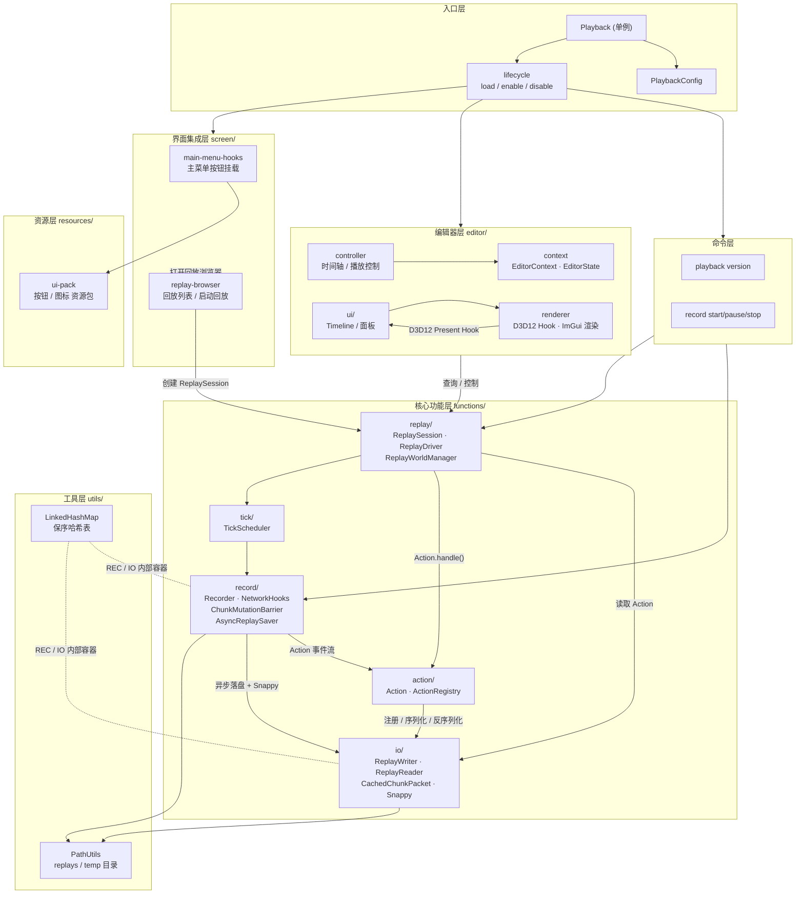
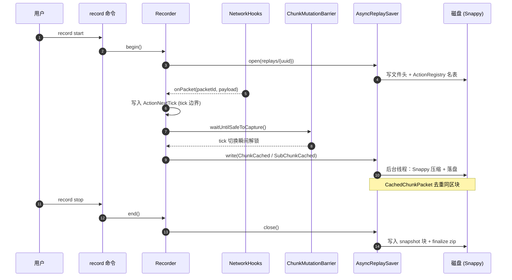
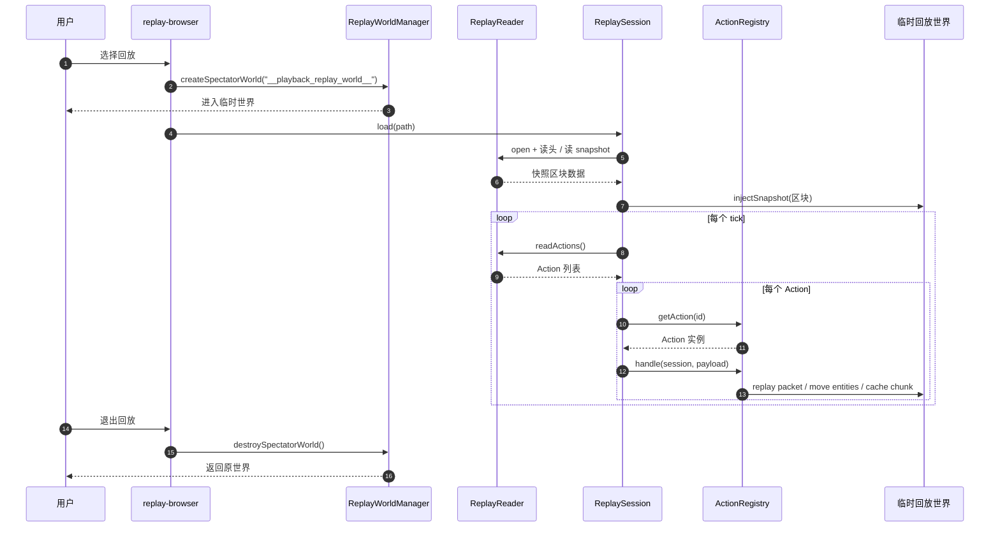

# Playback 快速解析（一页）

> 目标：用一张图看清全貌，用两张时序图看清录制与回放的关键路径。

---

## 1. 分层架构（模块关系总览）



**关键关系一句话**

- `Playback` 是一切的总开关，初始化 `ActionRegistry`、挂 D3D12 Hook、注册命令、创建主菜单按钮。
- `Recorder` 只生产 `Action`；`ReplaySession` 只消费 `Action`；两者共享 `ActionRegistry` + `io` 层的二进制协议。
- `editor/` 永远不直接动世界数据，只读 `ReplaySession` 状态 + 调控制器。
- `utils/` 是被所有上层调用的基础服务，不反向依赖任何上层。

---

## 2. 录制时序（record flow）



**要点**

- **tick 边界** 是唯一允许捕获区块快照的时刻（`ChunkMutationBarrier`）。
- **网络包** 由 `NetworkHooks` 旁路捕获，按原始 packetId 写入 `ActionGamePacket`，不做解析。
- **去重**：`CachedChunkPacket` 用 64 字节大哈希 + 64 位长哈希两级去重。
- **落盘异步**：`AsyncReplaySaver` 跑独立线程，主线程只 push 数据。

---

## 3. 回放时序（replay flow）



**要点**

- **世界隔离**：`__playback_replay_world__` 前缀的临时观察者世界，退出即销毁，不污染主存档。
- **回放不解析业务包**：`ActionGamePacket` 在 `ActionRegistry` 查表后用 LeviLamina 提供的 `sendNetworkPacket` 注入，让客户端自己解析。
- **确定性回放**：`ActionNextTick` 控制时间推进，保证 tick 序号与录制严格一致。

---

## 模块索引（速查）

| 模块 | 路径 | 一句话职责 |
|---|---|---|
| `Playback` | `playback/Playback.h` | 单例总入口，串联所有子系统 |
| `PlaybackConfig` | `playback/config.h` | 命令开关 / 重命名静态配置 |
| `command` | `playback/command/` | `playback` 与 `record` 命令注册 |
| `functions/record` | `playback/functions/record/` | 录制状态机 + 网络旁路 + 异步落盘 |
| `functions/replay` | `playback/functions/replay/` | 回放会话 / 驱动 / 临时世界管理 |
| `functions/action` | `playback/functions/action/` | 5 类 Action 协议 + 注册表 |
| `functions/io` | `playback/functions/io/` | 二进制读写 + 缓存 + Snappy |
| `functions/tick` | `playback/functions/tick/` | tick 调度（录制/回放共用） |
| `editor` | `playback/editor/` | ImGui 时间轴 UI（context / controller / renderer / ui） |
| `screen` | `playback/screen/` | 主菜单按钮 + 回放浏览器 |
| `utils` | `playback/utils/` | `PathUtils` / `LinkedHashMap` |
| `resources` | `playback/resources/` | UI 资源包（按钮 / 图标） |

---

## 依赖方向（自上而下，不允许反向）

```
playback (入口)
  ├─ command
  ├─ editor
  ├─ screen
  └─ functions/
       ├─ record ──► action ◄── replay
       │             │           │
       │             ▼           │
       └───────────  io  ◄───────┘
                    │
                    ▼
                  utils
```

- `record` 与 `replay` 是平行模块，**只通过 `action` + `io` 对接**。
- `editor` 只能依赖 `replay`（读状态 / 控播放），不能碰 `record`。
- `utils` 是叶子节点。
