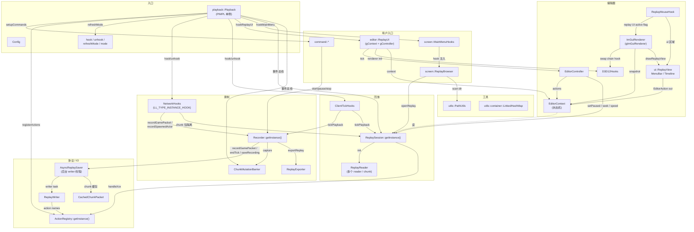

# 整体架构

## 分层视角

Playback 的代码按"层次"组织，层次之间通过 LeviLamina 事件总线 + C++ 单例 + 显式函数调用三种方式连接。从外到内大致是：

```
┌────────────────────────────────────────────────────────────────────────┐
│ 用户交互层                                                                │
│   - 客户端命令:  command/*                                                │
│   - 主菜单:       screen/* (MainMenuHooks + ReplayBrowser)                │
│   - 游戏中 UI:   editor/* (ReplayUI + EditorContext + ImGui 渲染)         │
└────────────────────────────────────────────────────────────────────────┘
                                  │
                                  ▼
┌────────────────────────────────────────────────────────────────────────┐
│ 入口 / 生命周期                                                            │
│   - playback::Playback  (PIMPL 单例)                                      │
│   - Config / hook / unhook / refreshMode / enable / disable               │
└────────────────────────────────────────────────────────────────────────┘
                                  │
            ┌─────────────────────┼─────────────────────┐
            ▼                     ▼                     ▼
┌─────────────────────┐ ┌─────────────────────┐ ┌─────────────────────┐
│ 录制路径            │ │ 回放路径             │ │ UI 渲染路径          │
│ Recorder            │ │ ReplaySession       │ │ EditorController    │
│ ReplayExporter      │ │ ReplayReader        │ │ ImGuiRenderer       │
│ NetworkHooks        │ │ ClientTickHooks     │ │ D3D12Hooks          │
│ ChunkMutationBarrier│ │ Chunk 流式注入       │ │ ReplayMouseHook     │
└─────────────────────┘ └─────────────────────┘ └─────────────────────┘
            │                     │                     │
            └──────────┬──────────┴──────────┬──────────┘
                       ▼                     ▼
        ┌────────────────────────┐ ┌──────────────────────┐
        │ 协议层: Action + IO     │ │ 工具 / 资源          │
        │ ActionRegistry          │ │ PathUtils            │
        │ AsyncReplaySaver        │ │ LinkedHashMap        │
        │ ReplayWriter / Reader   │ │ UI 资源包            │
        │ CachedChunkPacket       │ │ i18n (en_US/zh_CN)   │
        └────────────────────────┘ └──────────────────────┘
```

## 模块依赖图



## 三种"通信方式"速查

| 方式 | 用在哪里 | 例子 |
| --- | --- | --- |
| 显式调用 | 同层或下层模块 | `Recorder::getInstance().recordGamePacket(packet)` |
| LeviLamina 事件总线 | 跨生命周期阶段、与 LeviLamina 协调 | `ClientStartJoinLevelEvent` → `Playback::hook()` 注册的 lambda |
| 单例 | 跨模块共享状态 | `ActionRegistry::getInstance()`、`ReplaySession::getInstance()`、`EditorContext gContext` |
| 原子 / 共享变量 | 跨线程 / 跨 hook | `ReplaySession::mInjectingPacket`（避免回放自己注入的包再被录） |

## 设计原则

1. **Action 协议对称**。录制和回放共用同一套 `Action`（`ActionNextTick` / `ActionLevelChunkCached` / `ActionSubChunkCached` / `ActionGamePacket` / `ActionMoveEntities`），通过 `ActionRegistry` 集中注册，编码用 `ReplayWriter`，解码用 `ReplayReader`。改协议只动一处。
2. **chunk 数据走旁路**。`FullChunkData` / `SubChunkPacket` 体积大、被 `ReplayReader` 通过 `mChunkPackets` 数组按索引引用，真正字节流压缩后单独存到 `level_chunk_caches/N.bin`，靠 snappy 压缩 + 引用去重。
3. **录制异步、回放同步**。录制用 `AsyncReplaySaver` 的后台 writer 线程把字节流写到磁盘，避免主线程 stall；回放走 `ReplaySession::tick` 的客户端 tick hook，按时间预算分块注入。
4. **录制与回放互斥**。`PlaybackMode` 三态：`Unknown` / `Record` / `Replay`；`refreshMode` 根据"是否在回放世界"切换；`Recorder::start` 见到 `isReplayMode()` 直接拒绝。`NetworkHooks` 也靠 `ReplaySession::shouldIsolateChunkPackets()` 在回放模式下抑制原生 chunk 包。
5. **录制世界是"快照 + 增量"**。每个 ~5 分钟的录制段（`RECORD_CHUNK_TICKS = 20*60*5`）生成一个 `chunk_N.bin`，内含 snapshot（chunk + entity + 玩家列表）和增量 Action 序列；播放时优先复用同一份 snapshot，跳过重复的 `LevelChunk`/`SubChunk`。
6. **回放世界是隔离的 spectator 世界**。通过 `MinecraftScreenModel::startLocalServerAsync` 起一个 `__playback_replay_world__<uuid>` 的 spectator world，结束后删除。`shouldIsolateChunkPackets`/`isReplayLevel` 是一对判别函数。

## 文件位置速查

| 模块 | 头文件 | 源文件 |
| --- | --- | --- |
| 入口 | `src/playback/Playback.h`、`Config.h` | `src/playback/Playback.cpp` |
| 命令 | `src/playback/command/Command.h` | `command/Command.cpp`、`command/Record.cpp` |
| Action 协议 | `src/playback/functions/action/Action.h` | `functions/action/Action.cpp`、`ActionRegistry.cpp` |
| 录制 | `src/playback/functions/record/Recorder.h` | `Recorder.cpp`、`NetworkHooks.cpp`、`ChunkMutationBarrier.cpp`、`ReplayExporter.cpp` |
| IO | `src/playback/functions/io/AsyncReplaySaver.h` | `AsyncReplaySaver.cpp`、`ReplayReader.cpp`、`ReplayWriter.cpp`、`cache/CachedChunkPacket.h/cpp` |
| 回放 | `src/playback/functions/replay/ReplaySession.h` | `ReplaySession.cpp` |
| Tick | `src/playback/functions/tick/ClientTickHooks.h` | `ClientTickHooks.cpp` |
| 编辑器 | `src/playback/editor/ReplayUI.h` 及子目录 | `editor/ReplayUI.cpp` 及子目录 |
| 主菜单 | `src/playback/screen/MainMenuHooks.h`、`ReplayBrowser.h` | 同名 `.cpp` |
| 工具 | `src/playback/utils/PathUtils.h`、`utils/container/LinkedHashMap.h` | `utils/PathUtils.cpp` |

## 下一节

- [record-flow.md](record-flow.md)：录制时序
- [replay-flow.md](replay-flow.md)：回放时序
- [editor-flow.md](editor-flow.md)：编辑器时序
