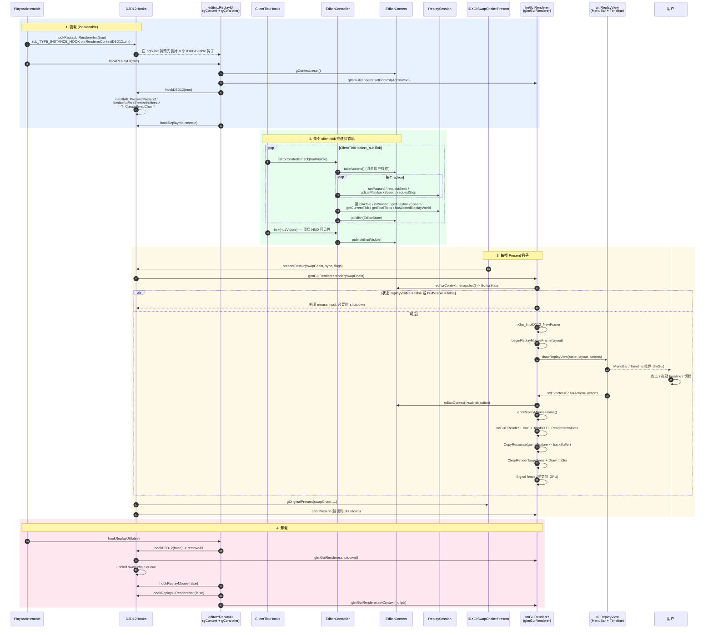

# 编辑器时序

## 总览

编辑器由 4 部分组成，本质是一个"游戏画面的 ImGui 浮层"：

| 部分 | 职责 |
| --- | --- |
| `EditorContext` | 中央状态机：保存最新 `EditorState`，收集待消费 `EditorAction` |
| `EditorController` | 每 tick 把 `EditorAction` 翻译成 `ReplaySession` 调用，再把会话状态 publish 成 `EditorState` |
| `ImGuiRenderer` + `D3D12Hooks` | 钩住 `IDXGISwapChain::Present`，把 `backBuffer` 拷到自己的 `gameTexture`，叠加 ImGui 帧 |
| `ui::ReplayView`（MenuBar + Timeline） | 渲染时间轴控件，输出 `EditorAction` 给 Context |

## 完整时序图



## 关键细节

### EditorContext：唯一的可变状态

```cpp
// snapshot() — 渲染线程用
// publish(state) — Controller 写
// submit(action) — Renderer 写
// takeActions() — Controller 读
```

互斥锁保护。Renderer 永远只读 `snapshot`，Controller 永远只 `takeActions` + `publish`，避免锁竞争。

### EditorAction 类型

```cpp
enum class EditorActionType {
    TogglePause,   Seek,           SkipToStart,
    SkipToEnd,     DecreaseSpeed,  IncreaseSpeed,
    StopReplay,
};
struct EditorAction { EditorActionType type; int tick; };
```

`Seek` 才需要 `tick`；其它只看 `type`。

### D3D12 钩子 8 个 vtable

| 钩子 | 作用 |
| --- | --- |
| `IDXGISwapChain::Present` | 主渲染入口，每帧拷贝 backBuffer |
| `IDXGISwapChain1::Present1` | Win8+ Present1，参数有 `DXGI_PRESENT_PARAMETERS` |
| `IDXGISwapChain::ResizeBuffers` | 释放资源、重新 init |
| `IDXGISwapChain3::ResizeBuffers1` | 同上但带 `IUnknown* const* presentQueues`；存 queue 给后续使用 |
| `IDXGIFactory::CreateSwapChain` | 创建时 `bindSwapChainQueue(swapChain, device)` |
| `IDXGIFactory2::CreateSwapChainForHwnd` | 同上（窗口模式） |
| `IDXGIFactory2::CreateSwapChainForCoreWindow` | 同上（UWP 模式） |
| `IDXGIFactory2::CreateSwapChainForComposition` | 同上（合成模式） |

> 注意：`hookReplayUIRendererInit` 是 `LL_TYPE_INSTANCE_HOOK` 钩 `bgfx::d3d12::RendererContextD3D12::init`，保证在 bgfx 真正初始化之前 8 个 vtable 钩子已经装好。这样后面 `CreateSwapChain` 被 bgfx 调用时能直接拿到 queue 句柄。

### ImGuiRenderer 资源

- 私有的 `device` / `commandQueue` / `rtvHeap` / `srvHeap` / `fence` / `fenceEvent`。
- 每帧：拷 `backBuffer` → `gameTexture`（PIXEL_SHADER_RESOURCE） → `Clear` → `ImGui_ImplDX12_RenderDrawData`。
- SRV 描述符从自己 32 个槽中分配（`SrvDescriptorCount = 32`）。
- 字体从 `C:\Windows\Fonts\msyh.ttc` 加载简中常用字符（`GetGlyphRangesChineseSimplifiedCommon`）。
- `SwapChainReplacementDelay = 500ms`：在 swapChain 替换时（如窗口大小改变）给旧 swapChain 500ms 收尾时间，避免 surface area 缩小时被误判。

### 鼠标钩子

`ReplayMouseHook` 独立于 ImGuiRenderer。当 `setReplayUIActive(true)` 时接管鼠标，ImGui 自己处理；时间轴区域外的事件透传给游戏。`beginReplayMouseFrame(layout, w, h)` 通知钩子"这一帧 UI 区域在哪里"。

### HUD 可见性

`ClientTickHooks::PlaybackClientUpdateHook` 判定 HUD 可见性：

```cpp
hudVisible = (topScene & SceneType::HudScene) != 0
          && isInWorldAndNotShowingAnyMenuScreens()
          && !isShowingLoadingScreen()
          && !isShowingProgressScreen();
```

只有同时满足这 4 个条件才显示 ImGui，避免在主菜单、暂停菜单、加载界面打架。

## 编辑器相关模块

- 编辑器总览：[editor/index.md](../editor/index.md)
- 状态机：[editor/context.md](../editor/context.md)
- 控制器：[editor/controller.md](../editor/controller.md)
- 渲染层（D3D12 + ImGui）：[editor/renderer.md](../editor/renderer.md)
- UI 面板：[editor/ui.md](../editor/ui.md)
- 入口与生命周期：[playback/lifecycle.md](../playback/lifecycle.md)
