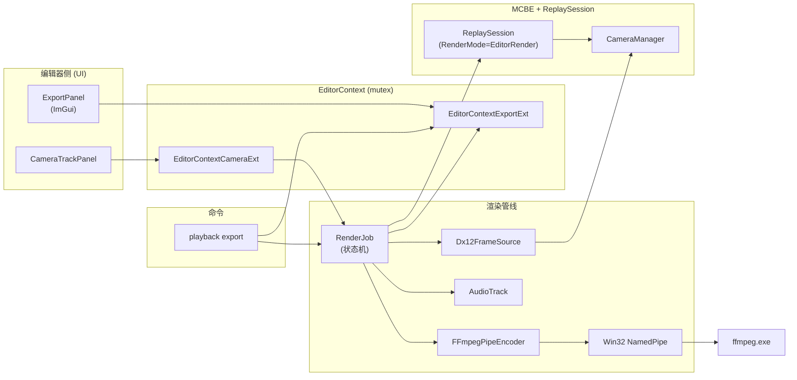
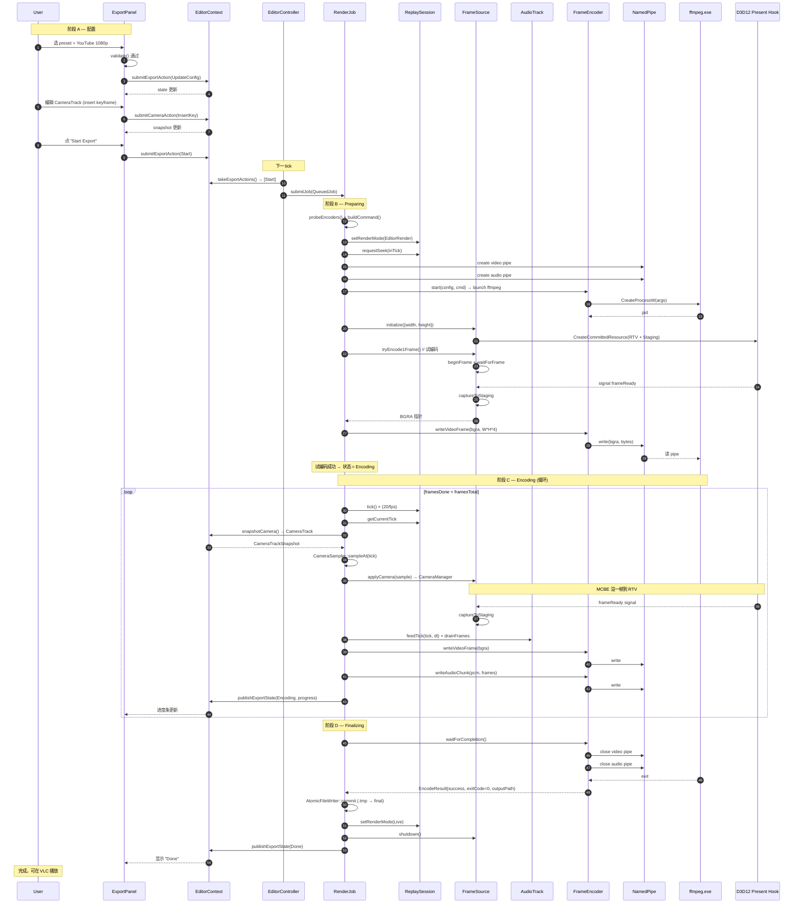
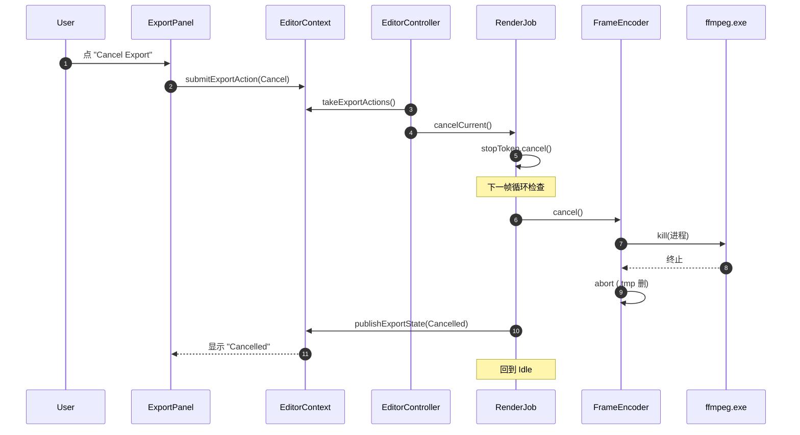
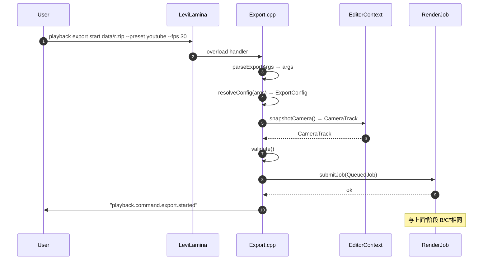

# 导出时序 — 端到端视角

> 串联 [editor/export-panel.md](file:///d:/raplay/Playback/docs/editor/export-panel.md) / [editor/camera-track.md](file:///d:/raplay/Playback/docs/editor/camera-track.md) / [editor/export-config.md](file:///d:/raplay/Playback/docs/editor/export-config.md) / [functions/render/render-job.md](file:///d:/raplay/Playback/docs/functions/render/render-job.md) / [functions/render/frame-source.md](file:///d:/raplay/Playback/docs/functions/render/frame-source.md) / [functions/render/frame-encoder.md](file:///d:/raplay/Playback/docs/functions/render/frame-encoder.md) / [functions/render/audio-track.md](file:///d:/raplay/Playback/docs/functions/render/audio-track.md) / [functions/render/export-presets.md](file:///d:/raplay/Playback/docs/functions/render/export-presets.md) / [command/export.md](file:///d:/raplay/Playback/docs/command/export.md)。

## 0. 总体视图

## 1. 时序：完整流程（成功路径）

## 2. 时序：用户取消

## 3. 时序：命令行入口

## 4. 关键不变量（端到端）

1. **数据基底唯一**：`ExportConfig` + `CameraTrack` 是唯一输入；无论 ImGui 还是命令行，提交的是同一份结构。
2. **执行唯一**：`RenderJob` 是唯一执行者；UI / 命令行都是 `submitJob` 的调用方。
3. **资源三段释放**：Encoding → Finalizing → Done 路径必走 `cleanupTmp` + `RS::setRenderMode(Live)` + `FS::shutdown`，即便异常。
4. **失败可恢复**：crash 留下 `.exporting.tmp`；启动时扫描并提示用户。
5. **PTS 严格**：音视频 PTS = `frameIndex / fps`；不允许用 wall clock 派生（避免帧率漂移）。

## 5. 阅读顺序

1. 本文件
2. 任意子模块文档
