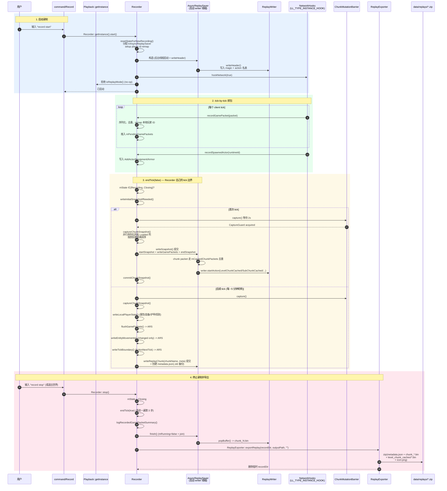

# 录制时序

## 总览

录制路径由 4 个角色组成：

| 角色 | 入口 |
| --- | --- |
| 触发方 | `command::Record`（或 `Playback::disable`/`ClientExitLevelEvent` 触发 `Recorder::stop`） |
| 抓包 | `NetworkHooks`（`PlaybackPacketReceivedHook` / `PlaybackPacketSentHook` / 各专用包 handler） |
| 汇总 | `Recorder`（状态机 + 序列化 + 玩家 ID 重映射 + 实体状态写盘） |
| 落盘 | `AsyncReplaySaver` + 后台 writer 线程 + `ReplayWriter` |
| 导出 | `ReplayExporter`（异步写完后再 zip 压缩到 `data/replays/`） |

`ChunkMutationBarrier` 不在主时序里——它是一个"快照采集时的互斥保护"，保证 Recorder 在抓 snapshot 时不会有并发写 chunk 进来。

## 完整时序图



## 关键细节

### 状态机

```
Idle ──record start──▶ Recording ──record pause──▶ Paused
                          │   │                       │
                          │   └──record start──▶ Recording
                          │   ──record stop──▶ Closing ──endTick+save──▶ Idle
                          └── ClientExitLevel / disable / fail ──▶ Idle (cancelRecording)
```

### 玩家 ID 重映射

Recorder 把"当前玩家"映射成"录制世界的固定 ID"（`RecordedPlayerUniqueId` / `RecordedPlayerRuntimeId` / 随机 UUID），在 `recordGamePacket` 里对所有可能引用玩家 ID 的包做 `remapRecordedPlayerReferences`。这样录制存的是"那次会话的稳定 ID"，回放时即使本地玩家不同也不会冲突。

### Tick 边界与 Chunk 轮转

- `RECORD_CHUNK_TICKS = 20 * 60 * 5`：每个 chunk 文件最多覆盖 5 分钟（5 * 60 * 20 = 6000 ticks）。
- `endTick` 在每个 client tick 末尾跑一次，顺序固定：`writeLocalPlayerState` → `flushGamePackets` → `writeEntityMovements` → `writeTickBoundary`。
- chunk 轮转时多一步：`captureChunkSnapshot` → `writeLocalPlayerState` → `flushGamePackets` → `writeEntityMovements` → `writeTickBoundary` → `finishCurrentChunk(false)` → `writeSnapshot` → `commitChunkSnapshot`。

### Chunk 快照采集

- `ChunkMutationBarrier::capture()`：等当前 tick 边界完成、阻塞任何新的区块写，最大等待 2s。失败时直接放弃这次轮转。
- `captureChunkSnapshot()`：遍历 `Dimension::ChunkSource` 中所有 `Loaded` 的列，按"到玩家距离"并行（`std::async`）调用 `SaveContextFactory` 序列化为 `LevelChunkPacket` / `SubChunkPacket`。
- 实体快照：单独构造 `SetTime` + `PlayerList` + 每个 actor 的 `AddPlayer/AddActor` + 玩家 `MobEquipment`/`MobArmorEquipment`。

### 异步落盘与去重

- 后台线程消费 `mQueue`（`std::function<void(ReplayWriter&)>` 队列）。
- `FullChunkData` 和 `SubChunkPacket` 走 `mCachedChunkPackets`：长哈希相同的包只在 `level_chunk_caches/<index>.bin` 写一次，`ReplayWriter` 写 `LevelChunkCached/SubChunkCached` Action 时只写一个 `index`。
- 每 10000 个 chunk packet 滚动一个 snappy 压缩文件。
- `metadata.json` 用 `.old` 备份再重写，崩溃恢复时不丢。
- `cancel()` / `~AsyncReplaySaver` 删目录，错误时只设错误状态。

## 录制相关模块

- 协议层：[functions/action.md](../functions/action.md)
- 录制主循环：[functions/record.md](../functions/record.md)
- IO 与缓存：[functions/io.md](../functions/io.md)
- 入口与生命周期：[playback/lifecycle.md](../playback/lifecycle.md)
- 命令触发：[command/index.md](../command/index.md)
