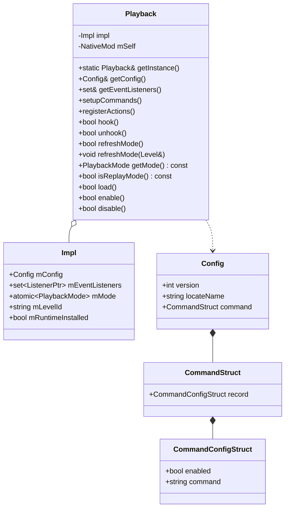

# playback 入口

## 职责

`playback::Playback` 是整个 mod 的入口与生命周期管理器：

- 持有全局 `Config`、事件监听集合、当前 `PlaybackMode`、`LevelId`。
- 集中注册 Action、注册命令、挂载/卸载 hook。
- 监听 LeviLamina 的世界生命周期事件（`ClientStartJoinLevelEvent` / `ClientJoinLevelEvent` / `ClientCancelJoinLevelEvent` / `ClientExitLevelEvent` / `ClientCommandRegisterEvent`），把内部模块和外部世界生命周期绑定。
- 通过 `getInstance()` 暴露为单例；通过 `mSelf` 暴露 `NativeMod`（给日志/i18n/资源目录使用）。

## 文件

| 文件 | 说明 |
| --- | --- |
| `src/playback/Playback.h` | 接口（PIMPL 风格） |
| `src/playback/Playback.cpp` | 实现 + LL_REGISTER_MOD 宏注册 |
| `src/playback/Config.h` | 全局 `Config` 与 `CommandConfigStruct` |

## 内部结构



`Playback::Impl` 是私有嵌套结构（PIMPL），所有可变状态都集中在这里。`mMode` 是 `std::atomic<PlaybackMode>`，允许从网络 hook / tick hook 等无锁读访问。

## 关键数据 / 状态

| 字段 | 含义 |
| --- | --- |
| `mConfig` | 启动时构造一次（默认值在 `Config.h`） |
| `mEventListeners` | 生命周期内订阅的 LeviLamina 事件监听器，unhook 时一并清空 |
| `mMode` | `Unknown` / `Record` / `Replay` 三态。`refreshMode` 写入 |
| `mLevelId` | 当前 world 的 level id，跨世界切换时清空 |
| `mRuntimeInstalled` | `hook()` 成功装上的所有运行时 hook 是否还在 |

`PlaybackMode` 三态决定了 `ClientTickHooks::tickPlayback()` 走 `Recorder::endTick(false)` 还是 `ReplaySession::tick()`：

```cpp
switch (playback::Playback::getInstance().getMode()) {
    case playback::PlaybackMode::Record:
        Recorder::getInstance().endTick(false);
        break;
    case playback::PlaybackMode::Replay:
        ReplaySession::getInstance().tick();
        break;
    case playback::PlaybackMode::Unknown:
    default:
        break;
}
```

## 关键方法

- `getInstance()`：Meyers singleton，进程内唯一。
- `getConfig()` / `getEventListeners()`：对 `Impl` 字段的只读/读写访问。
- `setupCommands()`：在 `ClientCommandRegisterEvent` 中调用，向 LeviLamina 的客户端命令注册器注册 `playback` 和 `record` 命令族。
- `registerActions()`：在 `load()` 时调用一次，向 `ActionRegistry::getInstance()` 注册 5 个 Action。
- `hook()` / `unhook()`：批量装/卸运行时 hook（`hookNetwork` / `hookClientTick` / `hookMainMenu` / `hookReplayUI`），有原子回滚逻辑。
- `refreshMode()` / `refreshMode(Level&)`：根据当前 world 是不是回放世界，决定 `mMode`。`isReplayLevel(Level const&)` 由 `ReplaySession` 提供。
- `isReplayMode()`：`mMode == PlaybackMode::Replay`，主要给 `Recorder::start()` 做拦截。
- `load()` / `enable()` / `disable()`：LeviLamina 框架要求的 3 个生命周期钩子。

## 模块关系

### 被谁调用

- `LL_REGISTER_MOD(playback::Playback, playback::Playback::getInstance())`：LeviLamina 框架启动时调用 `load()` / `enable()`，关闭时 `disable()`。
- `command::Record.cpp`（间接）：通过 `Playback::getInstance().getSelf().getLogger()` 取 logger。
- `Recorder` / `ReplaySession` / `EditorController` / `MainMenuHooks` / `NetworkHooks` 等：都通过 `Playback::getInstance().getSelf().getLogger()` 或 `getMode()` / `isReplayMode()` 引用入口。

### 调用谁

| 动作 | 调用的模块 |
| --- | --- |
| `registerActions()` | `functions::ActionRegistry::getInstance()` |
| `setupCommands()` | `command::registerPlaybackCommand` / `registerRecordCommand` |
| `hook()` / `unhook()` | `screen::hookMainMenu` / `functions::hookNetwork` / `functions::hookClientTick` / `editor::hookReplayUI` |
| `load()` | `editor::hookReplayUIRendererInit`（在 D3D12 renderer 初始化前装好钩子） |
| 事件回调 | `ReplaySession::onLevelStartJoin/Joined/Exit/JoinCancelled` / `ChunkMutationBarrier::setActiveLevel` / `Recorder::stop` |
| `refreshMode()` | `ReplaySession::isReplayLevel` |

### 共享数据

- 全局 `Config`：在 `Config.h` 中以默认值声明，运行时不变（当前实现里没暴露写）。
- `Playback::getInstance().getSelf().getSelf().getLangDir()`：被 `load()` 用于 i18n。
- `Playback::getInstance().getSelf().getDataDir()`：被 `utils::PathUtils::getInstance()` 用作 `mDataDir` 根。

### 事件订阅

`hook()` 中向 `ll::event::EventBus::getInstance()` 订阅：

| 事件 | 用途 |
| --- | --- |
| `ClientCommandRegisterEvent` | 调 `setupCommands()` |
| `ClientStartJoinLevelEvent` | `ReplaySession::onLevelStartJoin` + `ChunkMutationBarrier::setActiveLevel(nullptr)` + 清 `mLevelId` / 重置 `mMode` |
| `ClientCancelJoinLevelEvent` | `ReplaySession::onLevelJoinCancelled` |
| `ClientJoinLevelEvent` | `ChunkMutationBarrier::setActiveLevel(...)` + `ReplaySession::onLevelJoined` + `refreshMode` |
| `ClientExitLevelEvent` | `ReplaySession::onLevelExit` + 必要时 `Recorder::stop` + `ChunkMutationBarrier::setActiveLevel(nullptr)` |

## 扩展点

- 新增 Action：在 `functions/action/Action.h` 加一个 `struct XxxAction : Action` 单例（命名 `XxxAction::getInstance()`），然后在 `Playback::registerActions()` 里 `registry.registerAction(std::make_unique<...>())`。
- 新增命令族：写一个 `command::registerXxxCommand` 函数，在 `Playback::setupCommands()` 里调。
- 新增世界级 hook：先写一个 `bool hookXxx(bool)`（与 `hookNetwork` 同风格），然后在 `Playback::hook()` / `unhook()` 中维护，并加进对应的事件回调。
