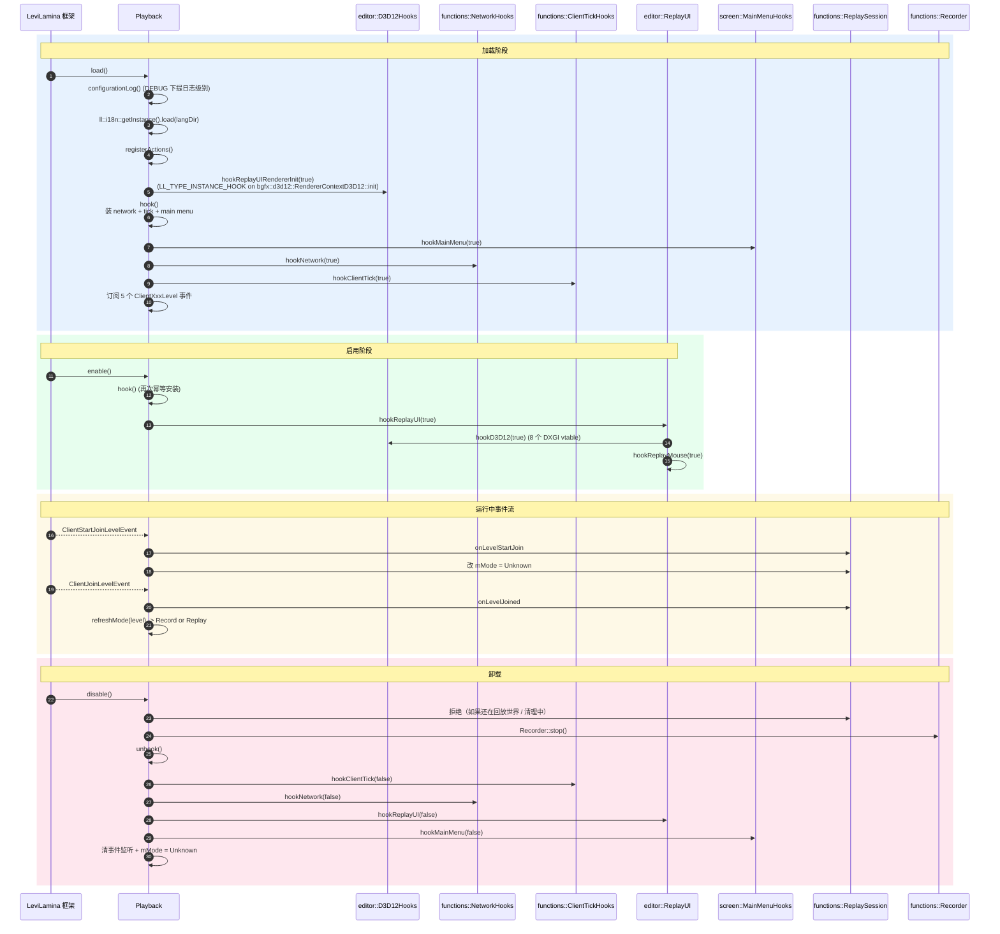

# 生命周期

Playback 在 LeviLamina 框架下走 `load` → `enable` → (`disable` / `unload`) 三段式。运行时还通过 `hook` / `unhook` 维护一组可重入的运行时钩子（network / tick / main menu / replay UI）。

## 顶层时序

## hook / unhook 状态机

`Playback::Impl::mRuntimeInstalled` 标记一组运行时 hook 是否全部到位。

`hook()` 顺序（`enable` + `load` 路径都用到）：

1. `screen::hookMainMenu(true)` — 主菜单 UI 钩子
2. `functions::hookNetwork(true)` — 网络包抓取 + 回放包隔离
3. `functions::hookClientTick(true)` — tick 边界与每 tick 调度
4. 订阅 5 个事件

`unhook()` 顺序与 `hook()` 相反：

1. `functions::hookClientTick(false)` — 先解 tick
2. `functions::hookNetwork(false)` — 再解 network
3. `editor::hookReplayUI(false)` — 再解 UI
4. `screen::hookMainMenu(false)` — 最后解主菜单
5. 清 `mEventListeners`，重置 `mMode`

任意一步失败都会触发回滚（再次装回 + 日志），保证状态不破碎。

## 关键不变量

- `mMode` 只能由 `refreshMode` 写入；`ClientStartJoinLevelEvent` 把它设回 `Unknown`；`ClientExitLevelEvent` 也设回 `Unknown`。
- `hook()` 幂等：`mRuntimeInstalled` 已为 true 时直接 return true。
- `Recorder::start` 在 `isReplayMode()` 为 true 时拒绝。`NetworkHooks` 在回放模式下抑制原生 chunk 包。两条防线共同保证"录制与回放互斥"。
- `disable()` 在 `ReplaySession::isIsolatingReplayWorld() || isReplayWorldCleanupPending()` 时直接拒绝，要求用户先退出回放世界。

## 与其它模块的关系

- `hook()` 装的是"运行时所有 hook 的并集"，由 `Playback` 集中调度。
- `hookReplayUIRendererInit` 单独由 `Playback::load()` 调用，因为它必须在 `bgfx::d3d12::RendererContextD3D12::init` 之前装好（通过 `LL_TYPE_INSTANCE_HOOK` 钩在 init 头部）。
- `hookReplayUI` 在 `Playback::enable()` 调用，因为 `load()` 时创建 DXGI factory 会触发 loader lock。
- 5 个事件订阅：见 [playback/index.md](index.md) 的"事件订阅"一节。
