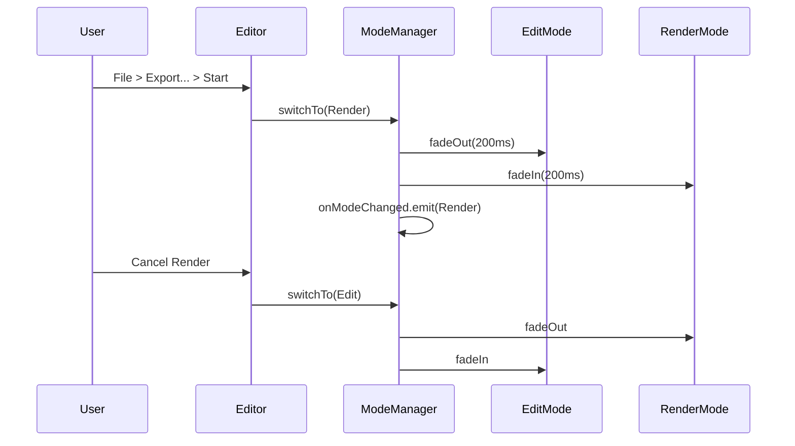
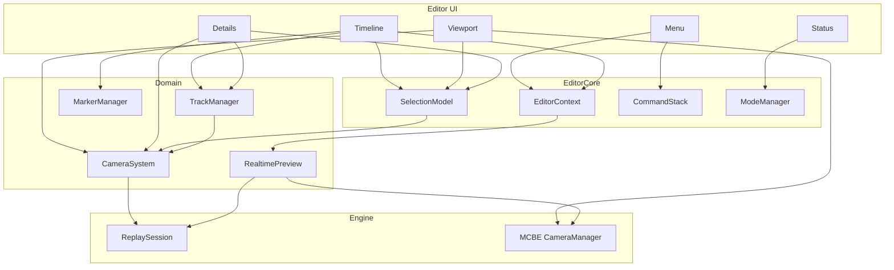

# 01 · 编辑器核心

> 入口：`src/playback/refactor/editor/`
> 角色：游戏窗口内的编辑器 UI 骨架。**Viewport / Details / Timeline / Status + 菜单栏 + 2 页面 + 2 个显式分隔条**，鼠标优先，键盘加速。**0 录制 UI**。
> 与旧文档：复用旧 [editor/context.md](../editor/context.md)（EditorContext / 状态机）+ 旧 [editor/controller.md](../editor/controller.md)（Controller）+ 旧 [editor/renderer.md](../editor/renderer.md)（D3D12 hook）+ 旧 [editor/ui.md](../editor/ui.md)（ReplayView）作为底层基础设施。
> 消费 [02](02-camera-motion.md) / [03](03-advanced-recording.md) / [04](04-video-editing.md) / [05](05-render-pipeline.md) / [06](06-data-persistence.md) 的数据。

## 一、需求（Requirements）

### 1.1 功能性需求

| ID | 需求 | 优先级 |
|---|---|---|
| EA-1 | 固定骨架布局：Menu(顶) / Viewport(上方主区域) / Details(右侧) / Timeline(下方) / Status(底)；所有面板只在游戏窗口内渲染 | P0 |
| EA-2 | 2 个显式可拖拽分隔条：右侧 Details 宽度与下方 Timeline 高度可独立大范围调节；不引入可停靠、浮动或多窗口布局 | P0 |
| EA-3 | 2 个页面：Edit（默认）/ Render（导出中），通过 ModeManager 切换 | P0 |
| EA-4 | 0 toolbar，0 dock system，0 多窗口 | P0 |
| EA-5 | Menu 6 项：File / Edit / Camera / Markers / Window / Help；导出仅作为 `File > Export...` 子项 | P0 |
| EA-6 | Timeline header 4 按钮：Play、Add Keyframe、Add Marker、Split | P0 |
| EA-7 | Timeline body 5 轨：1 视频轨 V0 + N 摄影机轨 Cn + 1 标记轨 M | P0 |
| EA-8 | Details 上下文敏感：无选 / 摄影机轨 / 关键帧 / Clip / Marker / Transition | P0 |
| EA-9 | Status bar 1 行：模式 / 项目 / FPS / 内存 | P0 |
| EA-10 | Hint bar 1 行：5 个最常用快捷键，可开关 | P0 |
| EA-11 | Hint bar 默认显示，按 `F1` 切换 | P1 |
| EA-12 | 全部动作可鼠标完成；除导出配置外，全部常用编辑动作提供快捷键 | P0 |
| EA-13 | 右键菜单覆盖 4 个上下文：Viewport / Clip / Keyframe / Track Header | P0 |
| EA-14 | ImGui 与 MCBE 输入正确分流（详见 §2.4） | P0 |
| EA-15 | 录制 UI（REC、HUD、profile）**不进入编辑器**；编辑器只读 `.playback` 并编辑 | P0 |
| EA-16 | Editor 仅在 `__playback_replay_world__` 启用（隔离世界） | P0 |

### 1.2 非功能性需求

- **面板布局确定性**：相同窗口尺寸和布局偏好下，面板矩形完全一致（不抖动）
- **固定视频比例**：Viewport 内的游戏画面严格使用用户设置的视频宽高比；空间变化时等比缩放并留黑边，绝不拉伸、裁剪或被 UI 遮挡
- **Input 延迟**：键盘/鼠标 → 响应 < 16ms（60 FPS）
- **渲染开销**：Editor UI < 0.5ms / frame
- **可发现性**：每个按钮 hover 0.3s 弹 tooltip（图标 + 文字 + 快捷键）
- **最小字体**：编辑器中所有用户可见文本（含菜单、属性、时间轴、状态、提示和模态）字号不得小于 14px
- **可维护性**：每个 Panel 单一职责，可独立替换
- **可演进**：面板注册制（`EditorPanel::register(...)`），未来加新面板不改主循环
- **零 emoji**：所有图标位用 icon font 字符（Lucide，详见 §2.10）
- **零外部样式**：所有 ImGui 样式由 `EditorTheme` 集中管理（单一深色主题）
- **零输出日志**：常驻 Output Log 不提供；失败用 `ErrorDialog` 模态弹窗（见 §2.15）

### 1.3 与现有约束对齐

- **不破坏**旧 [editor/renderer.md](../editor/renderer.md) 的 D3D12 hook
- **不破坏**旧 [editor/controller.md](../editor/controller.md) 的状态机
- **不破坏**旧 [editor/context.md](../editor/context.md) 的 EditorContext
- 新 EditorCore 是**包装层**（组合 + 复用）
- 旧 [editor/ui.md](../editor/ui.md) 的 ReplayView / MenuBar / Timeline **被替换**为新设计（ReuseView 保留为底层 ViewportPanel 的容器）

## 二、架构（Architecture）

### 2.1 设计原则（再次声明）

| 项 | 旧设计 | 新设计 |
|---|---|---|
| 面板数 | 8 | **4**（+ Menu + Status） |
| 工具栏 | 12 按钮 | **0** |
| Dock 系统 | ImGui DockBuilder | **0**（游戏窗口内固定骨架） |
| 多 OS 窗口 | imgui Viewport | **0** |
| 工作区切换 | 命名工作区 | **0**（仅 2 个固定页面） |
| 可拖拽 | 全 dock | **2** 个显式分隔条 |
| Details 宽度 | 固定 | **220px ~ 工作区宽度的 50%**（默认 28%） |
| Timeline 高度 | 30% | **18% ~ 65%**（默认 35%） |
| 鼠标 | 辅助 | **优先**（快捷键加速） |
| 录制 UI | 有 | **0** |

### 2.2 内部结构

```
refactor/editor/
├── Editor.{h,cpp}                ← 顶层（ImGui 主循环入口）
├── EditorContext.{h,cpp}         ← 扩展旧 [EditorContext](../editor/context.md)
├── ModeManager.{h,cpp}           ← Edit / Render 模式
├── MenuBar.{h,cpp}               ← 6 项菜单，File 内含 Export
├── KeyMap.{h,cpp}                ← 包装旧 [KeyMap](06-data-persistence.md)
├── CommandStack.{h,cpp}          ← 撤销/重做
├── HintBar.{h,cpp}               ← 底部快捷键提示
├── EditorTheme.{h,cpp}           ← 样式集中管理
├── IconSystem.{h,cpp}            ← icon font 加载 + 字符映射
├── InputHook.{h,cpp}             ← ImGui vs MCBE 输入分流（关键）
├── Splitter.{h,cpp}              ← Details 宽度 / Timeline 高度分隔条
├── panels/
│   ├── ViewportPanel.{h,cpp}     ← 3D 预览 + gizmo
│   ├── DetailsPanel.{h,cpp}      ← 上下文敏感属性
│   ├── TimelinePanel.{h,cpp}     ← 多轨时间轴
│   └── StatusPanel.{h,cpp}       ← 1 行状态
├── render/
│   ├── EditMode.{h,cpp}          ← Edit 页面布局组装
│   └── RenderMode.{h,cpp}        ← Render 页面布局
└── contextmenu/
    ├── ViewportMenu.{h,cpp}      ← Viewport 右键
    ├── ClipMenu.{h,cpp}          ← Clip 右键
    ├── KeyframeMenu.{h,cpp}      ← Keyframe 右键
    └── TrackHeaderMenu.{h,cpp}   ← Track 头右键
```

### 2.3 整体布局（Edit 页面 · 1920x1080 参考）

```
+---------------------------- Menu (24px) ----------------------------+
| File  Edit  Camera  Markers  Window  Help                            |
+--------------------------------------------+-------------------------+
|                                            | Details                 |
|              Viewport                      |                         |
|  +--------------------------------------+  | 搜索 / 当前选中属性     |
|  |      游戏画面：用户视频比例           |  | Position / Rotation     |
|  |      等比完整显示，余区留黑边         |  | FOV / Easing            |
|  +--------------------------------------+  |                         |
|                                            |                         |
+------------------- 高度分隔条 -------------+                         |
| Timeline：播放 / 时间码 / V0 / Cn / M / Hint|                         |
|                                            | <-> 宽度分隔条          |
+--------------------------------------------+-------------------------+
+--------------------------- Status (22px) ----------------------------+
| [Edit]   replay-001.playback   60 FPS   256 MB                       |
+------------------------------------------------------------------------+
```

**布局计算与边界**：

```cpp
constexpr float kMenuHeight        = 24.0f;
constexpr float kStatusHeight      = 22.0f;
constexpr float kDetailsMinWidth   = 220.0f;
constexpr float kDetailsMaxRatio   = 0.50f;
constexpr float kDetailsDefRatio   = 0.28f;
constexpr float kTimelineMinRatio  = 0.18f;
constexpr float kTimelineMaxRatio  = 0.65f;
constexpr float kTimelineDefRatio  = 0.35f;
constexpr float kSplitterThickness = 4.0f;
constexpr float kViewportMinWidth  = 320.0f;
constexpr float kViewportMinHeight = 180.0f;
```

- 先从游戏窗口客户区扣除 Menu 与 Status，再按 `detailsWidth` 切出全高右栏；在左侧工作区按 `timelineHeight` 切出下方时间轴，剩余矩形是 Viewport 容器。
- `videoAspectRatio` 来自用户当前视频设置；在 Viewport 容器内计算最大等比画面矩形，水平或垂直余区显示黑边。
- 两个分隔条的终点同时受各自比例边界和 Viewport 最小宽高约束；拖到边界后保持钳制，不改变视频比例。

### 2.4 `InputHook`（关键 · ImGui vs MCBE 分流）

> 这是 MCBE + ImGui 集成的**关键**。错误处理会导致"鼠标在 UI 但游戏还在动"或"鼠标动 UI 没反应"。

**核心 API**：

```cpp
namespace InputHook {

// WndProc 入口（在旧 [renderer.cpp](../editor/renderer.md) 已注册）
// 返回 true = 消息已处理，不要再传给 MCBE
bool onWindowsMessage(HWND hWnd, UINT msg, WPARAM wParam, LPARAM lParam);

// 每帧调（ImGui::NewFrame 之前）
// 同步 ImGui::GetIO() 的状态，并更新 MCBE 输入抑制
void syncFrame();

// 查询：MCBE 是否应处理键盘
bool shouldMCBEConsumeKeyboard();

// 查询：MCBE 是否应处理鼠标
bool shouldMCBEConsumeMouse();

}  // namespace
```

**状态机**：

```
[Editor 关闭]
    |
    | 打开编辑器（编辑器切换快捷键或命令）
    v
[Edit 模式]
    |  ImGui 捕获鼠标 = io.WantCaptureMouse
    |  ImGui 捕获键盘 = io.WantCaptureKeyboard
    |  MCBE 输入: 全部抑制（玩家不能动）
    |
    v
[Render 模式]
    |  整页切到 RenderMode
    |  MCBE 输入: 全部抑制（不渲染游戏）
    |
    v
[Editor 关闭]
```

**`onWindowsMessage` 流程**：

```cpp
bool InputHook::onWindowsMessage(HWND hWnd, UINT msg, WPARAM wParam, LPARAM lParam) {
    // 1) ImGui 优先
    if (ImGui_ImplWin32_WndProcHandler(hWnd, msg, wParam, lParam))
        return true;

    // 2) 编辑器专用快捷键（即使 ImGui 不想要也要抢）
    if (msg == WM_KEYDOWN) {
        if (KeyMap::matches("playback.editor.toggleUI", wParam)) {
            Editor::toggle();
            return true;
        }
    }

    // 3) Editor 开启时，MCBE 输入抑制
    if (Editor::isOpen()) {
        switch (msg) {
            case WM_KEYDOWN: case WM_KEYUP: case WM_CHAR:
                return true;  // 编辑器不传给游戏
            case WM_LBUTTONDOWN: case WM_LBUTTONUP: case WM_MOUSEMOVE:
            case WM_RBUTTONDOWN: case WM_RBUTTONUP: case WM_MBUTTONDOWN: case WM_MBUTTONUP:
            case WM_MOUSEWHEEL:
                return true;  // 编辑器不传给游戏
        }
    }

    // 4) Editor 关闭时，正常传给 MCBE
    return false;  // false = 不消费，MCBE 继续处理
}
```

**`syncFrame`（每帧调）**：

```cpp
void InputHook::syncFrame() {
    ImGuiIO& io = ImGui::GetIO();

    // ImGui 状态已经在 NewFrame 期间由 WndProc 累积
    // 这里只暴露查询接口
}

bool InputHook::shouldMCBEConsumeMouse() {
    if (!Editor::isOpen()) return true;     // 编辑器关：游戏正常
    return false;                           // 编辑器开：游戏不拿鼠标
}

bool InputHook::shouldMCBEConsumeKeyboard() {
    if (!Editor::isOpen()) return true;
    return false;
}
```

**关键不变量**：
1. **Editor 开启 = MCBE 输入全抑制**（玩家在隔离世界，本就不能动）
2. **ImGui 优先于 MCBE 0ms**（WndProc 内 ImGui_ImplWin32_WndProcHandler 在前）
3. **MCBE 渲染照常**（D3D12 不受影响；只 Input 被劫持）
4. **Editor 关闭 = MCBE 恢复正常**

**MCBE 端修改点**（在旧 [controller.cpp](../editor/controller.md)）：

```cpp
// 旧代码（假设）
LRESULT MCBE_WndProc(...) {
    // ... 原 MCBE 处理 ...
}

// 新代码
LRESULT MCBE_WndProc(HWND hWnd, UINT msg, WPARAM wParam, LPARAM lParam) {
    // 1) Editor 拦截
    if (Editor::isOpen() && InputHook::onWindowsMessage(hWnd, msg, wParam, lParam))
        return 0;  // 已处理，MCBE 不再处理

    // 2) 原 MCBE 处理
    return OriginalWndProc(hWnd, msg, wParam, lParam);
}
```

**MCBE 输入屏蔽的实现细节**：

- 旧 MCBE 内部有 `InputHandler::feed(...)` 之类入口
- 该入口在 WndProc 末尾被调
- `InputHook::onWindowsMessage` 返回 `true` → 直接 return → `InputHandler::feed` 不被调 → 玩家不动
- 验证：启动时跑单测 `InputHook::shouldMCBEConsumeMouse() == false`（Editor 开）

**ImGui 优先级 vs MCBE 优先级**：

| 场景 | ImGui 收到 | MCBE 收到 | 结果 |
|---|---|---|---|
| Editor 关 + 鼠标在游戏 | 否 | 是 | 玩家转动视角 |
| Editor 开 + 鼠标在 Viewport | 是 | 否 | gizmo 拖动 / orbit |
| Editor 开 + 鼠标在 Timeline | 是 | 否 | 拖 Clip / Keyframe |
| Editor 开 + 鼠标在 Details | 是 | 否 | 改字段 |
| Editor 开 + 按 Space | 是 | 否 | 播放切换 |

### 2.5 2 个页面（ModeManager）

```cpp
enum class EditorMode { Edit, Render };

class ModeManager {
public:
    static ModeManager& getInstance();
    EditorMode current() const;
    void switchTo(EditorMode m);

    // 事件
    Event<EditorMode> onModeChanged;

private:
    EditorMode mCurrent{EditorMode::Edit};
    bool mTransitioning{false};
    float mTransitionAlpha{1.0f};
};
```

**切换流程**：



### 2.6 `MenuBar`（6 项）

| 菜单 | 内容 | 快捷键 |
|---|---|---|
| **File** | Open Replay | Ctrl+O |
| | Save Project | Ctrl+S |
| | Recent | (子菜单，10 条) |
| | Export... | 鼠标点击 |
| | Exit Editor | Esc (hold) |
| **Edit** | Undo | Ctrl+Z |
| | Redo | Ctrl+Y |
| | Delete | Del |
| | Select All | Ctrl+A |
| **Camera** | Add Keyframe at Playhead | K |
| | Add Camera Track | Ctrl+Shift+N |
| | Camera Preset | (子菜单 7 个) |
| | Set Active | 1 / 2 / 3 |
| **Markers** | Insert Marker | M |
| | Jump to Next Marker | ] |
| | Jump to Previous Marker | [ |
| **Window** | Toggle Hint Bar | F1 |
| **Help** | Documentation | (链接) |
| | About | (弹窗) |

**实现**：

```cpp
class MenuBar {
public:
    void draw();
    bool isAnyMenuOpen() const;  // 给 ImGui::IsAnyItemHovered 用
};
```

**规范**：
- 菜单项右侧显示快捷键（右对齐灰色文字）
- 灰色 = 当前不可用（Delete 无选中时灰）
- Hover 高亮（淡蓝底 `#3a5a8c 60%`）

### 2.7 `HintBar`（Timeline 底部 · 1 行 · 14px）

```
[icon:play]=play   [icon:marker]=marker   [icon:split]=split   [icon:undo]=undo   [icon:help]=help
```

**5 个最常用**（按使用频率排）：Play / Add Marker / Split / Undo / Help。

```cpp
class HintBar {
public:
    void draw();
    void toggle();  // F1
    void setVisible(bool v);
private:
    bool mVisible{true};
};
```

### 2.8 `Splitter`（显式可拖拽分隔条 · 2 个）

```cpp
class Splitter {
public:
    float drawVerticalSplit(float currentRatio, Rect area, float minRatio, float maxRatio);
    float drawHorizontalSplit(float currentRatio, Rect area, float minRatio, float maxRatio);
};
```

**职责**：

- `drawVerticalSplit` 位于全高左侧工作区与全高 Details 之间，左右拖动后返回 Details 宽度比例。
- `drawHorizontalSplit` 位于 Viewport 与 Timeline 之间，上下拖动后返回 Timeline 高度比例。
- 两者都不是 Dock 系统，不支持面板停靠、交换、浮动或脱离游戏窗口。

**实现示意**：

```cpp
float Splitter::drawHorizontalSplit(float ratio, Rect area, float minR, float maxR) {
    float splitY = area.min.y + area.GetHeight() * ratio;
    ImGui::SetCursorScreenPos({area.min.x, splitY - kSplitterThickness / 2});
    ImGui::InvisibleButton("##timeline-splitter", {area.GetWidth(), kSplitterThickness});
    bool hovered = ImGui::IsItemHovered();
    bool active = ImGui::IsItemActive();

    if (hovered || active) ImGui::SetMouseCursor(ImGuiMouseCursor_ResizeNS);

    if (ImGui::IsMouseDragging(ImGuiMouseButton_Left)) {
        float mouseY = ImGui::GetMousePos().y;
        float newRatio = (mouseY - area.min.y) / area.GetHeight();
        ratio = std::clamp(newRatio, minR, maxR);
    }

    ImDrawList* dl = ImGui::GetForegroundDrawList();
    ImU32 color = active ? IM_COL32(240,192,32,255) : (hovered ? IM_COL32(120,120,120,255) : IM_COL32(60,60,60,255));
    dl->AddRectFilled({area.min.x, splitY - 1}, {area.max.x, splitY + 1}, color);

    return ratio;
}
```

**持久化**：`preferences.detailsWidthRatio` 与 `preferences.timelineHeightRatio`（由 [06](06-data-persistence.md) 提供）。

### 2.9 4 个面板（核心）

#### 2.9.1 `ViewportPanel`（固定视频比例预览 · 上方主区域）

**职责**：
- 渲染 [CameraSystem::sampleAt](02-camera-motion.md) 的当前帧
- 读取用户的视频比例设置，以该固定比例计算游戏画面矩形；容器尺寸变化仅改变等比缩放和黑边面积
- 显示 active 摄影机的 gizmo（位置/旋转/FOV）
- 接收鼠标：orbit / pan / dolly（无选中时）/ 拖 gizmo（选中时）
- 接收右键：弹 `ViewportMenu`

**实现**：

```cpp
class ViewportPanel {
public:
    void draw();  // ImGui::Begin("Viewport", ...) ...

private:
    void handleCameraControl();  // 鼠标 -> 摄影机参数（仅无选中时）
    void handleGizmoDrag();      // 拖 gizmo -> 改 keyframe
    void drawGizmo();            // ImGuizmo 渲染
    Rect calculateVideoRect(Rect container, float videoAspectRatio) const;

    float mFov{90.0f};
    Vec2  mViewportRotation{0, 0};
    Vec3  mViewportAnchor{0, 80, 0};
};
```

**鼠标行为（上下文敏感）**：

| 选中状态 | 鼠标 | 动作 |
|---|---|---|
| 无 | 左拖 | 绕 anchor orbit |
| 无 | 右拖 | 平移 anchor |
| 无 | 滚轮 | dolly anchor（拉近/远） |
| Keyframe | 拖 gizmo | 改 position / rotation |
| Keyframe | 拖空白 | orbit（不取消选中） |
| 任意 | ESC | 取消选中 |
| 任意 | 右键 | 弹 ViewportMenu |

**绘制**：
- 用 ImGuizmo（[仓库](https://github.com/CedricGuillemet/ImGuizmo)）画 3 轴箭头 + 3 旋转环
- 选中 Keyframe 时显示；否则隐藏
- 先绘制 Viewport 背景黑边，再将 MCBE 游戏画面和 gizmo 限制在 `calculateVideoRect(...)` 返回的等比矩形内
- 画面矩形始终完整可见：容器较宽时左右留黑，容器较高时上下留黑；不得按容器比例拉伸或裁剪

**Viewport 内部子布局**：

```
+-- Viewport -------------------------------------------+
| [icon:play] [icon:add-keyframe] [icon:add-marker] [...]  | <- 32px 浮层工具条
|                                                      |
|   3D scene                                            |
|   - selected keyframe gizmo                          |
|   - playhead marker (vertical line)                  |
|   - orbit/pan/dolly handlers                         |
|                                                      |
+------------------------------------------------------+
```

**为什么是浮层工具条**：
- 不占 3D 视口面积
- 不算"工具栏"（不是全局的、不是 12 个按钮的）
- 只在 Viewport 内显示 4 个当前上下文需要的动作
- 鼠标 hover 显示 tooltip

#### 2.9.2 `DetailsPanel`（属性 · 右侧 · 上下文敏感）

**职责**：根据 `SelectionModel` 当前选中，渲染对应属性编辑 UI。

**实现**：

```cpp
class DetailsPanel {
public:
    void draw();

private:
    void drawEmpty();          // 无选
    void drawCameraTrack();    // 摄影机轨
    void drawKeyframe();       // 关键帧
    void drawClip();           // Clip
    void drawMarker();         // Marker
    void drawTransition();     // Transition

    void drawNumberField(std::string_view label, float& v, float step = 0.1f);
    void drawVec3Field(std::string_view label, Vec3& v);
    void drawAngleField(std::string_view label, float& deg);
    void drawColorField(Color4& c);
    void drawDropdown(std::string_view label, std::string_view current, std::vector<std::string> options, int& idx);
    void drawButton(std::string_view label, std::string_view icon, std::function<void()> onClick);
};
```

**字段编辑统一规范**（鼠标优先）：
- 数字字段：双击 = 输入；**拖动 = 改值**（水平拖 = 0.1 步进，垂直拖 = 0.01 步进）；Shift+拖 = ×10
- Vec3 字段：3 个并排 NumberField（X/Y/Z 标签）
- 角度：NumberField + 颜色区分（黄底表示角度）
- 颜色：单击色块弹调色板
- 布尔：CheckBox + 文字
- 下拉：单击弹 ImGui::Combo

**布局**：

```
+--- Details --- [320px wide, full height] --+
| Tracks                       [icon:add]    |  标题
| ----------------------------------------   |
|  [icon:track-active]  Main       (active)  |  摄影机轨 1
|  [icon:track-off]     Cinematic (inactive)| 摄影机轨 2
|  [icon:track-off]     Drone     (inactive)| 摄影机轨 3
| ----------------------------------------   |
| Keyframe @ 00:01:23                        |  当前选中
| ----------------------------------------   |
| Position                                   |
|   X [  12.50]   <- drag to edit  [icon:reset]|
|   Y [  80.00]                              |
|   Z [  -3.00]                              |
| Rotation                                   |
|   Yaw   [  45deg]                          |
|   Pitch [  10deg]                          |
| FOV  [  90]                                |
| Easing                                     |
|   (o) Linear  ( ) Ease                     |
|   ( ) Cubic  ( ) Custom                    |
|   [icon:reset]  Edit Curve...         |
| ----------------------------------------   |
| [icon:add-keyframe] Insert Before  [icon:add-keyframe] Insert After  |  操作
| [icon:delete] Delete Keyframe              |
+--------------------------------------------+
```

**空状态**：

```
+--- Details ---+
|               |
|  Select a     |
|  track, key-  |
|  frame, clip  |
|  or marker to |
|  edit         |
|               |
+-- Tips -------+
| [icon:play] Play/pause     Space          |
| [icon:marker] Add marker   M              |
| [icon:split] Split clip    Ctrl+K         |
| [icon:undo] Undo           Ctrl+Z         |
| [icon:help] Help           F1             |
+---------------+
```

#### 2.9.3 `TimelinePanel`（多轨时间轴 · 底部 · 40%）

**职责**：
- Timeline header：4 按钮 + 时间码 + zoom
- Timeline body：V0 / Cn / M 5 类轨
- Hint bar：6 个快捷键
- 拖 playhead：scrub
- 拖 Clip / Keyframe / Marker：移动
- 拖 Clip 头/尾：trim
- 双击 Clip / Keyframe：选中
- 右键：弹 context menu

**实现**：

```cpp
class TimelinePanel {
public:
    void draw();

private:
    void drawHeader();
    void drawBody();
    void drawTrack(Track& t, Rect rowArea);
    void drawVideoClip(Clip& c, Rect rowArea);
    void drawKeyframe(Keyframe& k, Rect rowArea);
    void drawMarker(Marker& m, Rect rowArea);
    void drawTransition(Transition& t, Rect area);

    // 拖拽
    void handleScrubDrag(Rect headerArea);
    void handleClipDrag(Clip& c, Rect rowArea);
    void handleKeyframeDrag(Keyframe& k, Rect rowArea);

    // Zoom
    float mPixelsPerTick{0.1f};  // 0.02 ~ 2.0
};
```

**Timeline header 布局**：

```
+-- Timeline --------------------------------------------+
| [icon:play]  00:01:23.456 / 00:05:00.000  [icon:add-keyframe] [icon:add-marker] [icon:split]   Zoom: [-] [1x] [+]  |
+--------------------------------------------------------+
```

| 元素 | 鼠标 | 反馈 |
|---|---|---|
| `[icon:play]` | 切换播放 | 图标换 `[icon:pause]` |
| 时间码 | 双击输入跳转 | playhead 跳 |
| `[icon:add-keyframe]` | 在 playhead 加关键帧 | 关键帧点出现 |
| `[icon:add-marker]` | 在 playhead 加 marker | 标记 + 弹命名 |
| `[icon:split]` | 在 playhead 切 Clip | 切两半 |
| Zoom [-] / [+] | 缩放 | 像素/tick 变 |
| `[1x]` | 双击重置 | 立即重置 |

**Timeline body 布局**：

```
| V0 |  [   Clip A   ]  [   Clip B   ]  [   Clip C   ]  [icon:transition] CrossDissolve 0:03  |
| C0 |  ====o======o=========o=========o=======  Main  (3 keys)              |
| C1 |       ====o=========o=========o===       Cinematic  (2 keys)          |
| M  |                [icon:marker] Boss        [icon:marker] End              |
```

**视频轨**（V0，48px 高）：
- 矩形：色块 + 名字
- 头/尾 6px 拖拽区 = trim
- 中部 = move
- 转场 = 半透明圆环 + 文字

**摄影机轨**（Cn，24px 高）：
- 细线 = 进度条样式
- 关键帧 = 圆点（8px）
- 圆点拖动 = 改 tick（snap 到其他圆点或 0.5s 网格）

**标记轨**（M，20px 高）：
- 垂直细线
- 标记 + 标签

**统一视觉**：
- 选中：2px 黄边 `#f0c020`
- Hover：1px 淡亮描边
- Locked：1px 红斜线 + 50% 透明
- Muted：50% 透明 + 灰
- 鼠标在边缘 6px：cursor 变 resize

#### 2.9.4 `StatusPanel`（1 行 · 22px）

```
[Edit]   replay-001.playback   60 FPS   256 MB
```

| 字段 | 内容 | 鼠标 |
|---|---|---|
| 左 | 模式：`[Edit]` / `[Render 60%]` | 点击 = 模式详情 |
| 中 | 项目名 | 点击 = 文件信息 |
| 右 | FPS · 内存 | 点击 = 性能面板 |

**模式颜色**：
- Edit：白 `e0e0e0`
- Render：蓝 `3a8cf0`
- （**录制不在编辑器**，所以无红色态）

### 2.10 `IconSystem`（28 个图标 · Lucide 字体）

**字体文件**：[resources/fonts/lucide.ttf](file:///d:/raplay/Playback/resources/fonts/lucide.ttf)（828 KB，TrueType，Lucide v1.17+）
**字族名**：`lucide`
**许可**：ISC（[https://lucide.dev/](https://lucide.dev/)）
**codepoint 来源**：[resources/fonts/lucide.css](file:///d:/raplay/Playback/resources/fonts/lucide.css) → 自动生成 → [iconfont.h](file:///d:/raplay/Playback/src/playback/refactor/editor/iconfont.h)

```cpp
class IconSystem {
public:
    // 加载 font（在 Editor::initialize 调）
    void loadFonts();

    // 推入图标字体栈（在 draw 前调）
    void pushIconFont();
    void popIconFont();

    // glyph range
    const ImWchar* getGlyphRange();
};
```

**加载实现**：

```cpp
void IconSystem::loadFonts() {
    ImGuiIO& io = ImGui::GetIO();

    // 1) 主字体（先加载，保证 base 字体）
    io.Fonts->AddFontFromFileTTF("resources/fonts/Inter-Regular.ttf", 16.0f);

    // 2) 图标字体（merge，PUA 范围）
    ImFontConfig cfg;
    cfg.MergeMode = true;
    cfg.PixelSnapH = true;
    cfg.GlyphOffset.y = 1.0f;  // 视觉对齐
    io.Fonts->AddFontFromFileTTF(Icons::kFontPath, 16.0f, &cfg, getGlyphRange());

    // 3) build
    io.Fonts->Build();
}

const ImWchar* IconSystem::getGlyphRange() {
    static const ImWchar range[] = {
        0xe000,  // Lucide font 起点
        0xe6ff,  // Lucide font 终点（实际到 0xe6fd）
        0        // 终止
    };
    return range;
}
```

**28 个图标清单**（已生成到 [iconfont.h](file:///d:/raplay/Playback/src/playback/refactor/editor/iconfont.h)）：

| 宏 | 含义 | Lucide 名 | Codepoint |
|---|---|---|---|
| `ICON_PLAY` | 播放 | play | `0xe13c` |
| `ICON_PAUSE` | 暂停 | pause | `0xe12e` |
| `ICON_ADD_KEYFRAME` | 加关键帧 | diamond-plus | `0xe5e2` |
| `ICON_KEYFRAME` | 关键帧 | diamond | `0xe2d2` |
| `ICON_ADD_MARKER` | 加标记 | map-pin-plus | `0xe613` |
| `ICON_MARKER` | 标记 | map-pin | `0xe111` |
| `ICON_SPLIT` | 切 | scissors | `0xe14e` |
| `ICON_UNDO` | 撤销 | undo-2 | `0xe2a1` |
| `ICON_REDO` | 重做 | redo-2 | `0xe2a0` |
| `ICON_OPEN` | 打开 | folder-open | `0xe247` |
| `ICON_SAVE` | 保存 | save | `0xe14d` |
| `ICON_EXPORT` | 导出 | upload | `0xe19e` |
| `ICON_ADD` | 加 | plus | `0xe13d` |
| `ICON_DELETE` | 删 | trash-2 | `0xe18e` |
| `ICON_LOCK` | 锁 | lock | `0xe10b` |
| `ICON_MUTE` | 静音 | volume-x | `0xe1ac` |
| `ICON_HIDE` | 隐藏 | eye-off | `0xe0bb` |
| `ICON_DRAG` | 拖拽手柄 | grip-vertical | `0xe0eb` |
| `ICON_CHEVRON_DOWN` | 下拉 | chevron-down | `0xe06d` |
| `ICON_CHECK` | 勾 | check | `0xe06c` |
| `ICON_SEARCH` | 搜索 | search | `0xe151` |
| `ICON_CAMERA` | 相机 | video | `0xe1a5` |
| `ICON_TRACK_ACTIVE` | active 轨 | circle-dot | `0xe345` |
| `ICON_TRACK_OFF` | inactive 轨 | circle | `0xe076` |
| `ICON_TRANSITION` | 转场 | arrow-right-left | `0xe417` |
| `ICON_RENDER` | 渲染中 | loader-circle | `0xe10a` |
| `ICON_RESET` | 重置 | rotate-ccw | `0xe148` |
| `ICON_HELP` | 帮助 | help-circle | `0xe082` |
| `ICON_CLOSE` | 关闭 | x | `0xe1b2` |

**使用示例**：

```cpp
IconSystem::pushIconFont();
ImGui::Text("%s Play", ICON_PLAY);
ImGui::SameLine();
ImGui::Text("%s Add Keyframe", ICON_ADD_KEYFRAME);
IconSystem::popIconFont();
```

**fallback**（字体未加载时）：ImGui 自动显示方块占位 + console warning（不阻塞 UI）。

### 2.11 `EditorTheme`（样式集中）

```cpp
struct EditorTheme {
    // 颜色板
    ImU32 bgPanel      = IM_COL32(0x1a, 0x1a, 0x1a, 0xff);
    ImU32 bgHeader     = IM_COL32(0x25, 0x25, 0x25, 0xff);
    ImU32 border       = IM_COL32(0x3a, 0x3a, 0x3a, 0xff);
    ImU32 text         = IM_COL32(0xe0, 0xe0, 0xe0, 0xff);
    ImU32 textDim      = IM_COL32(0x90, 0x90, 0x90, 0xff);
    ImU32 accent       = IM_COL32(0x3a, 0x8c, 0xf0, 0xff);  // active / 选中
    ImU32 selected     = IM_COL32(0xf0, 0xc0, 0x20, 0xff);  // 黄边
    ImU32 hover        = IM_COL32(0x3a, 0x5a, 0x8c, 0x99);  // 淡蓝
    ImU32 success      = IM_COL32(0x3a, 0xf0, 0x3a, 0xff);
    ImU32 warning      = IM_COL32(0xf0, 0xc0, 0x20, 0xff);
    // (录制红不在编辑器)

    // 间距
    float panelPadding = 8.0f;
    float itemSpacing  = 4.0f;
    float frameRounding = 4.0f;  // 按钮圆角
    float trackRounding = 0.0f;  // 轨道条无圆角

    // 字号
    float fontDefault  = 14.0f;
    float fontTitle    = 16.0f;
    float fontSmall    = 14.0f;

    // 应用（在 ImGui::NewFrame 前调）
    void apply() const;
};
```

### 2.12 键盘快捷键（**全表**）

```
文件
  Ctrl+O     Open Replay
  Ctrl+S     Save Project
  File > Export...  Open export configuration

编辑
  Ctrl+Z     Undo
  Ctrl+Y     Redo
  Del        Delete selected
  Ctrl+A     Select all
  Esc        Cancel selection / close modal

播放
  Space      Play / pause (核心：单一控制播放与暂停)
  Home       Jump to start
  End        Jump to end
  Left/Right Step 1 frame
  Shift+L/R  Step 1 second

相机
  K          Add keyframe at playhead  (K 唯一含义：加关键帧)
  Ctrl+Shift+N  Add camera track
  1 / 2 / 3  Switch active camera track

剪辑
  Ctrl+K     Split clip at playhead
  I          Set in point
  O          Set out point

标记
  M          Insert marker
  [          Jump to previous marker
  ]          Jump to next marker

视图
  +          Zoom in timeline
  -          Zoom out timeline
  0          Reset zoom
  F1         Toggle hint bar
```

**冲突解决**：
- `K` = 关键帧（无歧义）。`K` 不再表示 Stop；停止用 Space 切换（播放→暂停→播放本身已经覆盖了"回到起点"语义；如需回到 playhead 起点，用 `Home`）。
- `Space` 与文本输入框冲突：在 InputFloat/InputText 内时 = 输入空格；否则 = 播放/暂停切换。
- `Esc` 优先级：模态打开时关模态 > 取消选中 > 关闭导出对话框（导出中）。

**无 F12 / 无 Output Log**：
- 编辑器**不提供**常驻输出日志面板
- 失败信息通过 `ErrorDialog` 模态弹窗显示（详见 §2.15 Render 页面失败处理）
- 日常编辑不需要日志

### 2.13 `CommandStack`（撤销/重做）

```cpp
class CommandStack {
public:
    void push(std::unique_ptr<IEditCommand> cmd);  // execute + push
    bool undo();
    bool redo();
    void clear();
    std::vector<std::string> undoLabels() const;
    std::vector<std::string> redoLabels() const;

private:
    std::vector<std::unique_ptr<IEditCommand>> mUndo;
    std::vector<std::unique_ptr<IEditCommand>> mRedo;
    size_t mMaxSteps = 100;
};
```

**UI 反馈**：
- `Ctrl+Z` 按下：按钮闪一次 + 状态栏 `[Edit] Undo: Split Clip at 0:01:23`
- 撤销栈空：菜单 Edit > Undo 灰

**示例 Commands**（来自 [04-video-editing.md](04-video-editing.md)）：

```cpp
class AddKeyframeCommand : public IEditCommand {
    std::string trackId;
    int          tick;
    CameraKeyframe kf;
public:
    void execute(EditorState& s) override;
    void undo(EditorState& s) override;
    std::string label() const override { return "Add Keyframe at " + std::to_string(tick); }
};

class MoveKeyframeCommand : public IEditCommand {
    std::string keyframeId;
    int oldTick, newTick;
public:
    void execute(EditorState& s) override;  // 新 tick
    void undo(EditorState& s) override;     // 旧 tick
    std::string label() const override { return "Move Keyframe"; }
};

class SplitClipCommand : public IEditCommand {
    std::string trackId, clipId;
    int atTick;
    Clip right;
public:
    void execute(EditorState& s) override;
    void undo(EditorState& s) override;
    std::string label() const override { return "Split Clip at " + std::to_string(atTick); }
};

class AddCameraTrackCommand : public IEditCommand {
    CameraTrackExt track;
    int insertIdx;
public:
    void execute(EditorState& s) override;
    void undo(EditorState& s) override;
    std::string label() const override { return "Add Camera Track " + track.name; }
};
```

### 2.14 Right-Click Context Menus（4 个）

#### ViewportMenu（Viewport 内右键）

```
Add Keyframe Here           K
Add Marker Here             M
Set as Play Start
Set as Play End
---
Camera Preset >
   First Person
   Third Person
   Free
   Follow Entity
   Orbit
   Telephoto
   Drone
---
Copy Camera State
Paste Camera State
```

#### ClipMenu（Clip 上右键）

```
Cut                          Ctrl+X
Copy                         Ctrl+C
Paste                        Ctrl+V
---
Split at Playhead            Ctrl+K
Trim Left to Playhead
Trim Right to Playhead
---
Properties
Delete                       Del
```

#### KeyframeMenu（关键帧点上右键）

```
Insert Before
Insert After
---
Reset to Default
Copy Value
Paste Value
---
Delete                       Del
```

#### TrackHeaderMenu（Track 头右键）

```
Rename
Delete Track
---
Lock / Unlock
Mute / Unmute
Hide / Show
```

### 2.15 Render 页面（导出中）

```
+-------------------- Menu (24px) --------------------+
| File  Edit  Camera  Markers  Window  Help           |
+----------------------------------------------------+
|                                                    |
|                                                    |
|                                                    |
|         +----------------------------+             |
|         |                            |             |
|         |     [icon:render]          |             |
|         |     Rendering...           |             |
|         |                            |             |
|         |  [==========] 60%          |             |
|         |                            |             |
|         |  Frame 1,847 / 3,072       |             |
|         |  1920x1080 60fps H.264     |             |
|         |  ETA 0:02:34               |             |
|         |                            |             |
|         |  D:\exports\replay-001.mp4 |             |
|         |                            |             |
|         |   [   Cancel Render   ]    |             |
|         |                            |             |
|         +----------------------------+             |
|                                                    |
+-------------------- Status (22px) ------------------+
| [Render 60%]   replay-001.playback   0:02:34 ETA  |
+----------------------------------------------------+
```

**进入触发**：
- 仅鼠标点击 `File > Export...` 打开导出配置模态；编辑页面不常驻显示导出面板、导出按钮或 Export 顶级菜单
- 用户在模态内点击 Start 后才执行 `ModeManager.switchTo(Render)`
- 模态配置字段：Format / Resolution / FPS / Output Path
- 字段定义见 [05-render-pipeline.md](05-render-pipeline.md)

**退出触发**：
- 渲染完成 -> 弹 toast `[OK] Export complete` + `[Open Folder] [Close]`
- 渲染失败 -> 弹 `ErrorDialog` 模态（**唯一**日志入口）
  ```
  +-- Export Failed -------------------+
  |                                    |
  |  Export failed at frame 1,847      |
  |  reason: ffmpeg pipe broken        |
  |  tmp: D:\exports\replay.tmp        |
  |                                    |
  |  (no log view; details in console) |
  |                                    |
  |            [ OK ]                  |
  +------------------------------------+
  ```
- 用户按 `Cancel Render` -> 软取消 -> 回 Edit
- 用户按 `Esc` -> 弹确认"未完成 .tmp 将被删除"

**`ErrorDialog`（失败弹窗）**：

```cpp
class ErrorDialog {
public:
    // 单例弹窗（同时只能一个）
    void show(std::string_view title, std::string_view msg);
    void draw();  // 必须在 EditMode / RenderMode draw 中调

private:
    bool mOpen{false};
    std::string mTitle;
    std::string mMsg;
};
```

- 触发：`RenderOrchestrator` 失败回调 / FFmpeg exit != 0 / 写盘失败 / 输入校验失败
- 模态阻塞当前页（必须点 OK）
- 自动 dump 详细错误到 `data/logs/export-error-<timestamp>.log`（**不显示在 UI**，仅排查用）

**整页特性**：
- Timeline / Details / Viewport **完全隐藏**（不可编辑）
- 仅 Render 卡片可见
- 单按钮 + Esc
- 整页禁玩家输入（InputHook 全抑制）

**导出模态字段**（在 [05-render-pipeline.md](05-render-pipeline.md) 中详述）：

```
+-- Export ------------------------------------+
|                                             |
|  Format                                     |
|  (o) MP4 (H.264)    ( ) MP4 (H.265)         |
|  ( ) MOV (ProRes)   ( ) WebM (VP9)          |
|  ( ) PNG Sequence                           |
|                                             |
|  Resolution      Aspect                     |
|  [1920x1080 v]  [16:9 v]                    |
|                                             |
|  FPS           Bitrate                      |
|  [60 v]        [12 Mbps v]                  |
|                                             |
|  Output                                     |
|  D:\exports\replay-001.mp4                  |
|  [ Browse... ]                              |
|                                             |
|        [ Cancel ]  [ Start >  ]             |
+---------------------------------------------+
```

### 2.16 数据流（编辑器 ↔ 摄影机 ↔ 时间轴）



### 2.17 与旧基础设施的对接

**复用**：
- 旧 [EditorContext](../editor/context.md) 的状态机字段（如 mIsOpen / mIsReplayMode）
- 旧 [editor/renderer.md](../editor/renderer.md) 的 D3D12 hook（新增 `InputHook::onWindowsMessage` 包装）
- 旧 [controller.cpp](../editor/controller.md) 的 WndProc（包装为 MCBE_WndProc）
- 旧 [editor/ui.md](../editor/ui.md) 的 ReplayView 容器（用作 ViewportPanel 的内部 3D 渲染区）

**替换**：
- 旧 ReplayView 的 ImGui 菜单 -> 新 `MenuBar`
- 旧 TimelineView -> 新 `TimelinePanel`
- 旧 PropertiesView -> 新 `DetailsPanel`

**编辑器不包含的部分**（**重要边界**）：
- 录制相关 UI（`[icon:record]` 按钮 / 录制 HUD / 录制 profile 面板）**全部不在编辑器内**
- 录制是独立模块，在主菜单（Replay 浏览器之外的另一个入口）或命令行运行
- 录制完成 -> 生成 `.playback` 文件 -> 用户 `File > Open Replay` 进入编辑器

## 三、执行（Execution）

### 3.1 任务拆分

| 步骤 | 文件 | 验证 |
|---|---|---|
| 1 | `IconSystem` 加载 + glyph range | 手动：22+ 个图标全显示 |
| 2 | `EditorTheme` 颜色板 + apply | 手动：UI 风格统一 |
| 3 | `EditorContext` 扩展 | 编译 |
| 4 | `InputHook.onWindowsMessage / syncFrame` | 单测：MCBE 输入抑制 |
| 5 | MCBE WndProc 包装 | 手动：编辑器开关 输入正常 |
| 6 | `Splitter` 双分隔条拖拽 + 持久化 | 单测：Details 宽度与 Timeline 高度分别持久化，并保持 Viewport 最小尺寸 |
| 7 | `ModeManager` 2 模式切换 | 单测：Edit > Render |
| 8 | `MenuBar` 6 项与 File 导出子项 | 手动：仅 File > Export... 打开导出模态 |
| 9 | `KeyMap` 全部快捷键 | 单测：每个键触发对应 action |
| 10 | `CommandStack` push/undo/redo | 单测：100 步栈 |
| 11 | `HintBar` 5 快捷键 | 手动：F1 切换 |
| 12 | `StatusPanel` 4 字段 | 手动：模式 / 项目 / FPS / 内存 |
| 13 | `ViewportPanel` 固定视频比例 + 鼠标 + gizmo | 手动：改变两个面板尺寸后画面等比完整显示，orbit / drag gizmo 正常 |
| 14 | `DetailsPanel` 5 上下文 | 手动：每个上下文正确 |
| 15 | `TimelinePanel` header + 5 轨 + 拖拽 | 手动：拖 playhead / clip / keyframe |
| 16 | 4 个 Context Menus | 手动：右键弹菜单 |
| 17 | Render 页面布局 | 手动：导出整页 |
| 18 | 集成 `RealtimePreview` | 手动：playhead 拖 -> 视口更新 |
| 19 | 集成 `CameraSystem` | 手动：摄影机改 -> 视口更新 |
| 20 | 集成 `TrackManager` | 手动：clip 切 -> Details 更新 |

### 3.2 关键算法

**数字字段拖动改值**（核心 UX）：

```cpp
void DetailsPanel::drawNumberField(std::string_view label, float& v, float step) {
    ImGui::TextUnformatted(label.data());
    ImGui::SameLine();
    ImGui::PushID(label.data());
    ImGui::SetNextItemWidth(80.0f);

    // ImGui InputFloat 自带拖动：
    //   左键按住控件拖 = 改值
    //   Shift+拖 = x10 步进
    //   Alt+拖 = x0.1 步进
    ImGui::InputFloat("##val", &v, step, step * 10, "%.2f", ImGuiInputTextFlags_AllowTabInput);

    ImGui::PopID();
}
```

> ImGui 的 `InputFloat` **自带拖动**支持；不需要自己实现。

**Vec3 拖动**（gizmo 改 keyframe）：

```cpp
// ImGuizmo 3 轴
ImGuizmo::Manipulate(
    viewMatrix, projMatrix,
    ImGuizmo::TRANSLATE, ImGuizmo::LOCAL,
    glm::value_ptr(newPos), nullptr, nullptr
);
```

**轨道缩放**（鼠标滚轮 + Shift 缩放）：

```cpp
void TimelinePanel::onWheel(float deltaY) {
    if (ImGui::IsKeyDown(ImGuiKey_LeftShift)) {
        // 缩放
        mPixelsPerTick *= (deltaY > 0 ? 1.1f : 1.0f / 1.1f);
        mPixelsPerTick = std::clamp(mPixelsPerTick, 0.02f, 2.0f);
    } else {
        // 横向滚动
        mScrollX -= deltaY * 20.0f;
        mScrollX = std::max(0.0f, mScrollX);
    }
}
```

**Playhead 拖动 scrub**：

```cpp
void TimelinePanel::handleScrubDrag(Rect headerArea) {
    if (!ImGui::IsMouseDown(ImGuiMouseButton_Left)) return;
    if (!headerArea.contains(ImGui::GetMousePos())) return;
    float mouseX = ImGui::GetMousePos().x - headerArea.min.x;
    int tick = int(mouseX / mPixelsPerTick);
    tick = std::clamp(tick, 0, mEditor.totalTicks);

    if (mPlayheadTick != tick) {
        mPlayheadTick = tick;
        RealtimePreview::getInstance().requestPreview(tick);  // 触发预览
    }
}
```

**关键帧拖动**（snap 到网格）：

```cpp
void TimelinePanel::handleKeyframeDrag(Keyframe& k, Rect rowArea) {
    if (!ImGui::IsMouseDragging(ImGuiMouseButton_Left)) return;
    if (mDragTargetId != k.id) return;

    float mouseX = ImGui::GetMousePos().x - rowArea.min.x;
    int newTick = int(mouseX / mPixelsPerTick);

    // Snap：Shift=不放 Ctrl=0.5s Alt=1s
    if (ImGui::IsKeyDown(ImGuiKey_LeftCtrl)) {
        newTick = (newTick / 10) * 10;  // 0.5s grid (20 t/s * 0.5s = 10 tick)
    } else if (ImGui::IsKeyDown(ImGuiKey_LeftAlt)) {
        newTick = (newTick / 20) * 20;  // 1s grid
    }

    k.tick = std::clamp(newTick, 0, mEditor.totalTicks);
    // 触发预览更新
}
```

**Splitter 拖动与固定视频比例**（已在 §2.3、§2.8）。

### 3.3 关键不变量

1. **Editor 开 = MCBE 输入全抑制**（玩家不能动）
2. **Editor 开 = MCBE 渲染照常**（D3D12 不受影响）
3. **2 个显式分隔条 = `mDetailsWidthRatio` + `mTimelineHeightRatio`**（不引入 dock 概念）
4. **面板布局确定性**：相同窗口尺寸和布局偏好下，矩形一致
5. **Viewport 画面比例固定为用户视频比例**：只能等比缩放与留黑边，绝不拉伸、裁剪或遮挡
6. **导出入口唯一**：仅鼠标点击 `File > Export...` 打开配置模态；Start 前不进入 Render 页面
7. **0 emoji**：代码中 `grep -rE '[\x{1F300}-\x{1FAFF}]|[\x{25A0}-\x{25FF}]|[\x{25C6}-\x{25CF}]|[\x{2600}-\x{26FF}]' src/refactor/editor/` = 0
8. **录制 UI 绝不在编辑器**：菜单/快捷键/Hint 都不含 REC 相关项
9. **所有按钮 hover 0.3s 弹 tooltip**（含快捷键）
10. **InputHook 是 WndProc 入口第一道**（ImGui 优先于 MCBE）
11. **CommandStack <= 100 步**（与 preferences.maxUndoSteps 同步）
12. **所有数字字段支持拖动改值**（不依赖键盘）

### 3.4 测试用例

| ID | 用例 | 期望 |
|---|---|---|
| EA-T1 | Open Editor -> WndProc(MOUSEMOVE) | MCBE 不收（log 验证） |
| EA-T2 | Close Editor -> WndProc(MOUSEMOVE) | MCBE 收 |
| EA-T3 | 左右拖 Details 分隔条 | Details 宽度在边界内变化，Viewport 不低于最小宽度 |
| EA-T4 | 上下拖 Timeline 分隔条并重启 Editor | Timeline 高度恢复，Details 宽度同时恢复 |
| EA-T5 | 调整两个分隔条或游戏窗口尺寸 | 游戏画面保持用户视频比例、完整显示；剩余区域为黑边 |
| EA-T6 | `File > Export...` | 仅此时出现导出配置模态 |
| EA-T7 | 导出模态 Start -> 切 Render | ModeManager.current() = Render |
| EA-T8 | 渲染完成 -> 弹 toast | Toast 显示 + Open Folder 可点 |
| EA-T9 | 拖 Keyframe 从 tick 100 -> 200 | UI 立即更新 + CommandStack push |
| EA-T10 | Ctrl+Z | 关键帧回 100 + 状态栏 "Undo: Move Keyframe" |
| EA-T11 | 双击 Clip -> Details 切到 Clip 上下文 | Details 显示 in/out |
| EA-T12 | 右键 Clip | ClipMenu 弹 |
| EA-T13 | 拖 Timeline zoom 滑块 | 像素/tick 改 |
| EA-T14 | F1 切 HintBar | 显/隐 |
| EA-T15 | `grep` emoji | 0 命中 |
| EA-T16 | 22 个图标全显示 | 字形占位可见 |
| EA-T17 | Editor 关闭后 MCBE 玩家可移动 | W/A/S/D 生效 |
| EA-T18 | 拖 Details 数字字段 0.1 步进 | 字段值更新 + Ctrl+Z 撤销 |
| EA-T19 | 拖 Viewport 空白 = orbit | 摄影机视角变 |
| EA-T20 | 拖选中 Keyframe gizmo | 关键帧 position 更新 |
| EA-T21 | Timeline Play 按钮 + Space 键 | playhead 移动 |
| EA-T22 | Timeline Add Marker + M 键 | marker 出现 |

### 3.5 风险与回退

| 风险 | 缓解 |
|---|---|
| MCBE WndProc 钩子失败 -> 玩家还能动 | 启动时单元测试 `InputHook::shouldMCBEConsumeMouse() == false` |
| icon font 加载失败 -> ImGui 显示方块占位 | console warning（不阻塞 UI） |
| 摄影机 gizmo 拖动与摄影机 orbit 冲突 | 选中时 gizmo 抢，空白处 orbit |
| Details 或 Timeline 分隔条拖出允许范围 | 按比例边界与 Viewport 最小尺寸钳制 |
| 面板变化导致视频比例不匹配 | 按用户视频比例计算等比画面矩形，余区绘制黑边 |
| CommandStack 内存膨胀 | maxSteps 100 截断 |
| ImGui WantCaptureMouse 误判 | InputHook 不依赖 WantCapture，独立判断 |
| Esc 退出模态 与 取消选中 冲突 | 模态打开时 Esc 优先关模态；否则取消选中 |
| 输出 Log (F12) 抢占 viewport 空间 | 模态弹出 200x400 不影响布局 |
| Editor 关时 input hook 残留 | shutdown 时清空回调列表 |

## 四、模块关系

### 被谁调用（上游）

- **玩家键 `Ctrl+E` / `Esc`**：调 `Editor::toggle()`
- **旧 [EditorController](../editor/controller.md)**：调 `Editor::initialize()` / `Editor::shutdown()`

### 调用谁（下游）

- 旧 [EditorContext](../editor/context.md)：读/写状态
- 旧 [EditorController](../editor/controller.md)：注册 ImGui WndProc
- 旧 [EditorRenderer](../editor/renderer.md)：D3D12 hook
- **[02](02-camera-motion.md) CameraSystem**：sampleAt + applyToMCBE
- **[03](03-advanced-recording.md) 录制子系统**：**不在编辑器内**（独立模块）
- **[04](04-video-editing.md) TrackManager / TransitionEngine**：CRUD
- **[05](05-render-pipeline.md) RenderOrchestrator**：submitJob + startPreview/stopPreview
- **[06](06-data-persistence.md) 数据模型**：EditorLayout / KeyMap / EditorPreferences / RecordingProfile

### 共享数据

- `EditorContext::mCameraExt`（摄影机状态）
- `EditorContext::mEditorExt`（EditorState）
- `EditorContext::mExportExt`（进度）
- `SelectionModel`（当前选中）
- `CommandStack::mUndo/mRedo`

### 事件订阅 / 发送

- `ModeManager::onModeChanged(EditorMode)` <-> 旧 EditorController
- `SelectionModel::onSelectionChanged(vector<id>)` <-> DetailsPanel / ViewportPanel
- `TrackManager::onEditorStateChanged` <-> TimelinePanel / DetailsPanel
- `CommandStack::onPushed / onUndo / onRedo` <-> StatusPanel

## 五、阅读顺序

1. 本文件
2. [06-data-persistence.md](06-data-persistence.md) —— 数据模型
3. [02-camera-motion.md](02-camera-motion.md) —— 摄影机
4. [04-video-editing.md](04-video-editing.md) —— 剪辑
5. [05-render-pipeline.md](05-render-pipeline.md) —— 渲染
6. [03-advanced-recording.md](03-advanced-recording.md) —— 录制（**不在编辑器**，独立模块）

## 六、待定项

| 项 | 当前状态 |
|---|---|
| Icon 字体 | **已决定**：Lucide v1.17+，文件 [resources/fonts/lucide.ttf](file:///d:/raplay/Playback/resources/fonts/lucide.ttf)，codepoint 见 [iconfont.h](file:///d:/raplay/Playback/src/playback/refactor/editor/iconfont.h) |
| 快捷键 K | **已决定**：K = 关键帧（无歧义，无 Stop） |
| Space | **已决定**：Space = 播放/暂停（单一控制） |
| 默认 Theme | **已决定**：单一深色（EditorTheme 内嵌常量） |
| Timeline 缩放范围 | 0.02~2.0 px/tick（占位待 UI 验证） |
| Details / Timeline 尺寸持久化 | preferences.detailsWidthRatio / preferences.timelineHeightRatio（已定） |
| Keyframe snap grid | Ctrl=10t(0.5s) / Alt=20t(1s)（占位待 UI 验证） |
| Output Log (F12) | **已决定**：删除。失败用 ErrorDialog 模态弹窗 |
| Hint bar 默认可见 | true（已定） |
