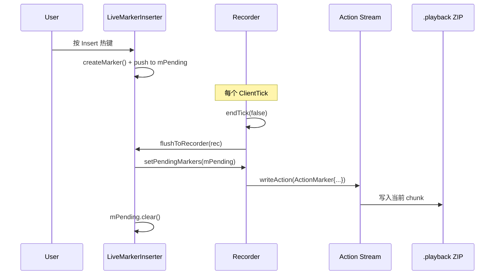
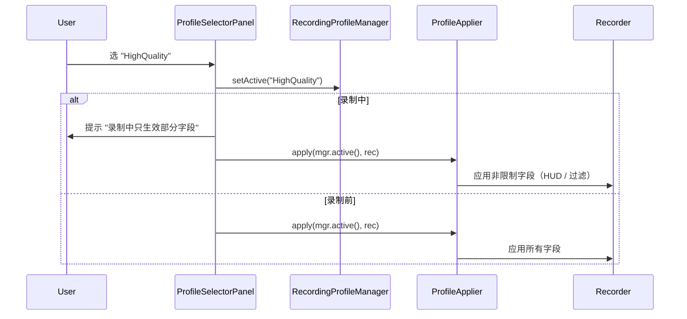
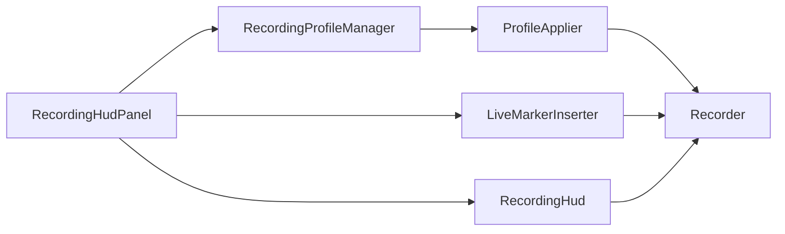

# 03 · 高级录制（B2 实时标记 + B3 HUD 统计 + B5 录制预设）

> 入口：`src/playback/refactor/advanced-recording/`
> 角色：在旧 [Recorder](../functions/record.md) 基础上扩展**录制中**的高级能力（B2 标记插入 + B3 HUD + B5 预设），**不动**旧录制主流程。
> 数据模型见 [06-data-persistence.md](06-data-persistence.md)；本文件描述**运行时行为**。

## 一、需求（Requirements）

### 1.1 功能性需求

| ID | 需求 | 优先级 |
|---|---|---|
| AR-1 | **B2 实时标记**：录制中按热键（默认 `Insert`）插入章节标记，写入 `mPendingMarkers` | P0 |
| AR-2 | 标记按时间顺序累加；`record stop` 时落盘到 `.playback` 的 `editor.markers` | P0 |
| AR-3 | 标记含 name（默认 `Marker N`）、color（轮询）、note（i18n key） | P1 |
| AR-4 | **B3 HUD 指示器**：屏幕角落显示"录制中 ●" + 时长（HH:MM:SS）+ 文件大小（MB）+ 实时 FPS | P0 |
| AR-5 | HUD 位置可在 4 角切换（preferences.hudPosition） | P0 |
| AR-6 | HUD 字体 / 颜色 / 透明度可在 preferences 调 | P2 |
| AR-7 | **B5 录制配置预设**：用户保存 / 加载 / 切换 `RecordingProfile` | P0 |
| AR-8 | 内置 3 个预设：Balanced（默认）/ HighQuality / SpaceSaving | P0 |
| AR-9 | `record start` 可指定 `--profile <name>`，缺省用 `preferences.activeProfile` | P0 |
| AR-10 | profile 字段映射到 Recorder 的现有参数（chunkTicks / snapshotInterval / 包过滤） | P0 |
| AR-11 | 录制中 profile 字段变更实时生效（除 chunkTicks——已分块不可改） | P1 |
| AR-12 | 标记热键可绑（profile.liveMarkerHotkey）；切换 profile 改热键 | P0 |

### 1.2 非功能性需求

- **标记插入延迟**：热键 → 写入 `mPendingMarkers` < 5ms
- **HUD 渲染开销**：< 0.5ms / frame
- **profile 切换**：< 50ms（IO + 重新解析）
- **持久化**：markers 落盘到 `.playback` `editor.markers`；profile 存 `data/recording/profiles/*.json`
- **向后兼容**：旧 `.playback` 无 `markers` 节点，加载不报错

### 1.3 与现有约束对齐

- 复用旧 [Recorder](../functions/record.md) 的状态机（Idle / Recording / Paused / Closing）
- 复用 [RecordingProfile](06-data-persistence.md) 数据模型
- HUD 走 ImGui 渲染（在 D3D12 Present 线程）
- 标记热键走 [KeyMap](06-data-persistence.md) 绑定

## 二、架构（Architecture）

### 2.1 内部结构

```
refactor/advanced-recording/
├── LiveMarkerInserter.{h,cpp}      ← B2
├── RecordingHud.{h,cpp}            ← B3
├── RecordingProfileManager.{h,cpp} ← B5
├── ProfileApplier.{h,cpp}          ← profile → Recorder 参数
└── MarkerHotkeyFilter.{h,cpp}      ← KeyMap 集成
```

### 2.2 `LiveMarkerInserter`（B2 实时标记）

```cpp
class LiveMarkerInserter {
public:
    static LiveMarkerInserter& getInstance();

    // 每帧调（ClientTick 主线程）；热键检测
    void tick();

    // Recorder::endTick 时调，把 pending markers 写进 replay
    void flushToRecorder(Recorder& rec);

    // UI / 命令查询
    std::vector<Marker> snapshotPending() const;

private:
    void onHotkeyPressed();  // 调 KeyMap 查 liveMarkerHotkey
    Marker createMarker();

    mutable std::mutex  mMtx;
    std::vector<Marker> mPending;
    ImGuiKey            mHotkey{ImGuiKey_Insert};
    int                 mColorIdx{0};
};
```

**`tick()` 流程**：

```cpp
void LiveMarkerInserter::tick() {
    if (!Recorder::getInstance().isRecording()) return;
    auto& io = ImGui::GetIO();
    if (ImGui::IsKeyPressed(mHotkey, false)) {
        std::scoped_lock lk(mMtx);
        mPending.push_back(createMarker());
    }
}
```

**`createMarker`**：

```cpp
Marker LiveMarkerInserter::createMarker() {
    Marker m;
    m.name = std::format("Marker {}", mPending.size() + 1);
    m.tick = Recorder::getInstance().getCurrentTick();
    m.color = kMarkerColors[mColorIdx++ % std::size(kMarkerColors)];
    m.note = "playback.recording.liveMarker";
    return m;
}
```

**`flushToRecorder`**（`record stop` 时调）：

```cpp
void LiveMarkerInserter::flushToRecorder(Recorder& rec) {
    std::scoped_lock lk(mMtx);
    rec.setPendingMarkers(mPending);  // 新增 Recorder API
    mPending.clear();
    mColorIdx = 0;
}
```

### 2.3 `Recorder` 扩展（最小侵入）

旧 [Recorder.h](file:///d:/raplay/Playback/src/playback/functions/record/Recorder.h) 增加：

```cpp
class Recorder {
public:
    // ... 旧 API ...

    // ===== 新增 =====
    void setPendingMarkers(std::vector<Marker> markers);
    std::vector<Marker> getPendingMarkers() const;

    // Recorder::endTick 内追加
    //   for (auto& m : mPendingMarkers) {
    //       writer.writeAction(ActionMarker{m.tick, m.name, m.color, m.note});
    //   }
};
```

`ActionMarker` 是新 Action 类型，注册到 [ActionRegistry](../functions/action.md)：

```cpp
struct ActionMarker {
    int          tick;
    std::string  name;
    Color4       color;
    std::string  note;

    void write(BinaryStream& s) const;
    void read (BinaryStream& s);
};
```

> **优点**：走 Action 协议 = 录制 / 回放两端自动一致；导出到 `.playback` 不需特殊处理。
>
> **替代方案**（**不推荐**）：把 markers 单独存 `.playback` 的 `editor.markers` 字段，绕过 Action 协议。问题是回放端 `ReplaySession` 不知道 markers 何时触发；维护成本高。

**最终选择**：用 ActionMarker，走协议；`.playback` 的 `editor.markers` 字段在导出时由 Action 流回放生成。

### 2.4 `RecordingHud`（B3 HUD 指示器 + 统计）

```cpp
class RecordingHud {
public:
    static RecordingHud& getInstance();

    void tick();  // 每 ClientTick 调，更新数据
    void draw();  // D3D Present 线程调，渲染 ImGui

    // 配置
    void setPosition(int corner);  // 0=左上 1=右上 2=左下 3=右下
    void setVisible(bool v);

private:
    struct Stats {
        int     durationSec{0};
        int     durationTick{0};
        int     fileSizeMB{0};
        int     fps{0};
        bool    recording{false};
    };

    mutable std::mutex mMtx;
    Stats mStats;
    int   mCorner{0};  // 从 preferences 读
    bool  mVisible{true};
};
```

**`tick()` 流程**：

```cpp
void RecordingHud::tick() {
    auto& rec = Recorder::getInstance();
    std::scoped_lock lk(mMtx);
    mStats.recording = rec.isRecording();
    if (!mStats.recording) return;
    mStats.durationTick = rec.getCurrentTick();
    mStats.durationSec  = mStats.durationTick / 20;  // 20 t/s
    mStats.fileSizeMB   = static_cast<int>(rec.getCurrentFileSize() / 1024 / 1024);
    mStats.fps          = ClientInstance::get()->getFps();
}
```

**`draw()` 流程**（D3D12 Present 线程）：

```cpp
void RecordingHud::draw() {
    if (!mVisible) return;
    Stats s;
    { std::scoped_lock lk(mMtx); s = mStats; }
    if (!s.recording) return;

    ImGui::SetNextWindowBgAlpha(0.4f);
    ImGui::SetNextWindowPos(computeCorner(mCorner), ImGuiCond_Always);
    ImGui::SetNextWindowSize({180, 0}, ImGuiCond_Always);

    ImGui::Begin("##RecordingHud", nullptr,
                 ImGuiWindowFlags_NoTitleBar | ImGuiWindowFlags_NoResize |
                 ImGuiWindowFlags_NoMove | ImGuiWindowFlags_NoScrollbar);

    // 红色 ● + "REC"
    ImGui::PushStyleColor(ImGuiCol_Text, IM_COL32(255, 60, 60, 255));
    ImGui::Text("● REC");
    ImGui::PopStyleColor();

    ImGui::Separator();
    ImGui::Text("Time:  %s", formatDuration(s.durationSec));
    ImGui::Text("Size:  %d MB", s.fileSizeMB);
    ImGui::Text("FPS:   %d", s.fps);

    ImGui::End();
}
```

**4 角位置**：

```cpp
ImVec2 computeCorner(int corner) {
    ImGuiIO& io = ImGui::GetIO();
    ImVec2 size{180, 100};
    constexpr float pad = 10;
    switch (corner) {
        case 0: return ImVec2(pad, pad);                                  // 左上
        case 1: return ImVec2(io.DisplaySize.x - size.x - pad, pad);      // 右上
        case 2: return ImVec2(pad, io.DisplaySize.y - size.y - pad);      // 左下
        case 3: return ImVec2(io.DisplaySize.x - size.x - pad,
                              io.DisplaySize.y - size.y - pad);           // 右下
    }
}
```

### 2.5 `RecordingProfileManager`（B5 预设管理）

```cpp
class RecordingProfileManager {
public:
    static RecordingProfileManager& getInstance();

    // 加载所有内置 + 用户
    void initialize();

    // 列表
    std::vector<RecordingProfile> listProfiles() const;
    std::vector<RecordingProfile> listBuiltin() const;
    std::vector<RecordingProfile> listUser() const;

    // 读
    RecordingProfile getByName(const std::string& name) const;

    // 写
    void saveUserProfile(const RecordingProfile& p);
    void deleteUserProfile(const std::string& name);

    // 当前激活
    void setActive(const std::string& name);
    RecordingProfile active() const;

    // 导入导出
    void importProfile(const std::filesystem::path& jsonPath);
    void exportProfile(const std::string& name, const std::filesystem::path& jsonPath);

private:
    void loadBuiltin();
    void loadUser();

    std::vector<RecordingProfile> mBuiltin;
    std::vector<RecordingProfile> mUser;
    std::string                   mActive{"Balanced"};
    mutable std::mutex            mMtx;
};
```

**`initialize()`**：

```cpp
void RecordingProfileManager::initialize() {
    std::filesystem::create_directories("data/recording/profiles");
    // 内置从 resources/defaults/recording/ 拷贝（首次）
    for (auto& src : {"Balanced.json", "HighQuality.json", "SpaceSaving.json"}) {
        auto dst = std::filesystem::path("data/recording/profiles") / src;
        if (!std::filesystem::exists(dst)) {
            std::filesystem::copy("resources/defaults/recording" / src, dst);
        }
    }
    loadBuiltin();  // 读 resources/defaults/recording/
    loadUser();     // 读 data/recording/profiles/*.json
}
```

### 2.6 `ProfileApplier`（profile → Recorder 参数映射）

```cpp
struct ProfileApplier {
    // 把 profile 字段应用到 Recorder
    static void apply(const RecordingProfile& p, Recorder& rec) {
        rec.setChunkTicks(p.recordChunkTicks);                  // 5 min default
        rec.setInitialSnapshotEnabled(p.captureInitialSnapshot);
        rec.setSnapshotInterval(p.snapshotIntervalTicks);
        rec.setEnabledPacketFilter(p.enabledPackets);
        rec.setDisabledPacketFilter(p.disabledPackets);
        rec.setShowHud(p.showHud);
        rec.setHudPosition(p.hudPosition);

        // 热键
        LiveMarkerInserter::getInstance().setHotkey(p.liveMarkerHotkey.key);
    }
};
```

> **`Recorder::setChunkTicks` 限制**：录制中**不能**改 chunk 周期（已分块不可逆）；profile 切换仅在 `record start` 前生效。

### 2.7 内置预设定义

```json
// resources/defaults/recording/Balanced.json
{
  "version": 1,
  "name": "Balanced",
  "recordChunkTicks": 6000,
  "captureInitialSnapshot": true,
  "snapshotIntervalTicks": 0,
  "showHud": true,
  "hudPosition": 0,
  "liveMarkerHotkey": { "key": 574, "ctrl": false, "shift": false, "alt": false }
}
```

> `key: 574` = `ImGuiKey_Insert`

```json
// HighQuality.json
{
  "recordChunkTicks": 12000,
  "captureInitialSnapshot": true,
  "snapshotIntervalTicks": 6000,
  "showHud": true,
  "hudPosition": 1,
  ...
}
```

```json
// SpaceSaving.json
{
  "recordChunkTicks": 6000,
  "captureInitialSnapshot": false,
  "snapshotIntervalTicks": 0,
  "showHud": false,
  ...
}
```

### 2.8 数据流（录制中插入标记 + 落盘）



### 2.9 数据流（profile 切换）



### 2.10 命令行集成

```text
record start --profile HighQuality
record profile list
record profile set <name>
record profile new <name> --base HighQuality
record profile delete <name>
```

实现：在旧 [Record.cpp](../command/index.md) 的 `registerRecordCommand` 中加 overload，调 `RecordingProfileManager`。

### 2.11 与 HUD 的集成（UI 入口）

`RecordingHudPanel`（在 [01-editor-architecture.md](01-editor-architecture.md) 中描述）显示：
- 当前 active profile 名
- 切换下拉
- 标记列表（最近 10 个）
- "管理 profile" 按钮 → 弹窗（创建 / 删除 / 导入导出）



## 三、执行（Execution）

### 3.1 任务拆分

| 步骤 | 文件 | 验证 |
|---|---|---|
| 1 | `ActionMarker` 注册到 [ActionRegistry](../functions/action.md) | 编译 |
| 2 | `Recorder::setPendingMarkers / getPendingMarkers` + `endTick` 内写 ActionMarker | 手动：录制 + 插入 + 导出 → 回放看到 marker |
| 3 | `LiveMarkerInserter.tick` 热键 + flushToRecorder | 单测：tick() + getPendingMarkers() |
| 4 | `RecordingHud.tick / draw` 4 角位置 | 手动：录制中 HUD 显示 |
| 5 | `RecordingProfile` JSON 序列化（已在 [06](06-data-persistence.md)） | 单测：round-trip |
| 6 | `RecordingProfileManager.initialize / list / save / delete / setActive` | 单测：内置 + 用户 |
| 7 | `resources/defaults/recording/*.json` 3 个文件 | 手动：首次启动自动拷贝 |
| 8 | `ProfileApplier.apply` 映射 | 手动：切 profile → recorder 字段变 |
| 9 | 命令行 `record profile *` | 手动：控制台命令 |
| 10 | HUD Panel UI（[01-editor-architecture.md](01-editor-architecture.md)） | 手动：面板可见 |
| 11 | 标记插入 + 持久化集成测试 | 手动：录制 → 导出 → 加载回放看到 marker |

### 3.2 关键算法

**热键匹配**（兼容 KeyMap）：

```cpp
bool matchHotkey(const KeyBinding& kb, const ImGuiIO& io) {
    if (ImGui::IsKeyPressed(kb.key, false)) {
        return io.KeyCtrl == kb.ctrl && io.KeyShift == kb.shift && io.KeyAlt == kb.alt;
    }
    return false;
}
```

**FPS 平滑**（避免跳变）：

```cpp
class FpsAverager {
    std::deque<int> mSamples;
public:
    void push(int fps) {
        mSamples.push_back(fps);
        if (mSamples.size() > 30) mSamples.pop_front();
    }
    int avg() const {
        if (mSamples.empty()) return 0;
        int sum = 0;
        for (int s : mSamples) sum += s;
        return sum / mSamples.size();
    }
};
```

### 3.3 关键不变量

1. **标记只增不删**：录制中插入的标记不丢（直到 `record stop` 落盘）
2. **HUD 永不阻塞主线程**：mutex 保护 stats，UI 线程只读
3. **profile 字段不可改的标 .immutableAtRunTime**：UI 灰显
4. **标记热键幂等**：按住 Insert 不连续触发（用 `IsKeyPressed`，不是 `IsKeyDown`）
5. **`.playback` `editor.markers` 与 ActionMarker 一致**：导出时由 Action 流回放填充

### 3.4 测试用例

| ID | 用例 | 期望 |
|---|---|---|
| AR-T1 | 按 Insert × 3 | 3 个 marker，tick 升序 |
| AR-T2 | flushToRecorder | mPending 清空 |
| AR-T3 | HUD 4 角位置 | ImGui::SetNextWindowPos 调用正确 |
| AR-T4 | profile list（首次） | Balanced + HighQuality + SpaceSaving |
| AR-T5 | profile save | JSON 写入 data/recording/profiles/ |
| AR-T6 | profile set HighQuality | active() = HighQuality |
| AR-T7 | apply(HighQuality, Recorder) | chunkTicks = 12000 |
| AR-T8 | 录制中切 profile | HUD 字段变，chunkTicks 不变 |
| AR-T9 | 录制 10 分钟，插入 5 标记 | 5 个 ActionMarker 落盘 |
| AR-T10 | 回放加载 5 标记 | TimelinePanel 显示 5 个 marker |

### 3.5 风险与回退

| 风险 | 缓解 |
|---|---|
| 热键冲突（聊天框 / UI） | KeyMap 加 scope（"global" / "recording"） |
| HUD 与游戏内 UI 重叠 | 4 角可调 + 可隐藏（preferences.showHud） |
| Profile 文件损坏 | 启动时校验，损坏用默认 |
| ActionMarker 协议版本不匹配 | 旧 .playback 加载跳过 marker（`optional`） |
| FPS 采样不准 | 30 帧平均 |

## 四、模块关系

### 被谁调用（上游）

- **旧 [Recorder](../functions/record.md)**：`endTick` 调 `LiveMarkerInserter::flushToRecorder`；profile 字段应用
- **旧 [ClientTickHooks](../functions/tick.md)**：每 tick 调 `LiveMarkerInserter::tick` + `RecordingHud::tick`
- **旧 [D3D12 Present Hook](../editor/renderer.md)**：每帧调 `RecordingHud::draw`
- **`refactor/editor-architecture/Panels/RecordingHudPanel`**：UI 入口
- **旧 [Record.cpp 命令](../command/index.md)**：`record profile *`

### 调用谁（下游）

- 旧 [EditorContext](../editor/context/EditorContext.md)：preferences 读
- 旧 [KeyMap](06-data-persistence.md)：热键查
- 旧 [ActionRegistry](../functions/action.md)：注册 ActionMarker
- **[06-data-persistence.md](06-data-persistence.md)**：RecordingProfile 模型
- **ImGui / ImGuiKey**：热键检测

### 共享数据

- `EditorContext::mRecordingHudExt`（新增）：UI ↔ HUD
- `RecordingProfileManager::mUser`（磁盘）

### 事件订阅 / 发送

- 不订阅新事件；通过 ClientTickHooks 间接触发

## 五、阅读顺序

1. 本文件
2. [06-data-persistence.md](06-data-persistence.md) —— 数据模型
3. [02-camera-motion.md](02-camera-motion.md) —— 摄影机（Marker 由摄影机系统消费）
4. [05-render-pipeline.md](05-render-pipeline.md) —— 渲染
5. [01-editor-architecture.md](01-editor-architecture.md) —— UI 入口
