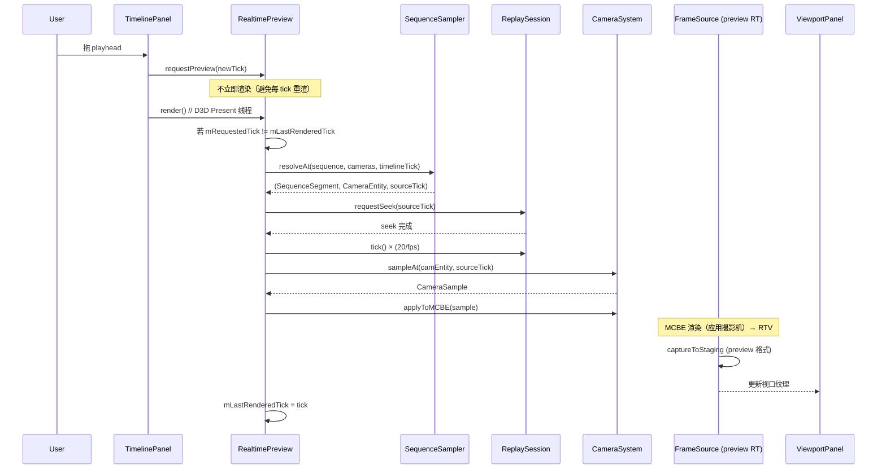
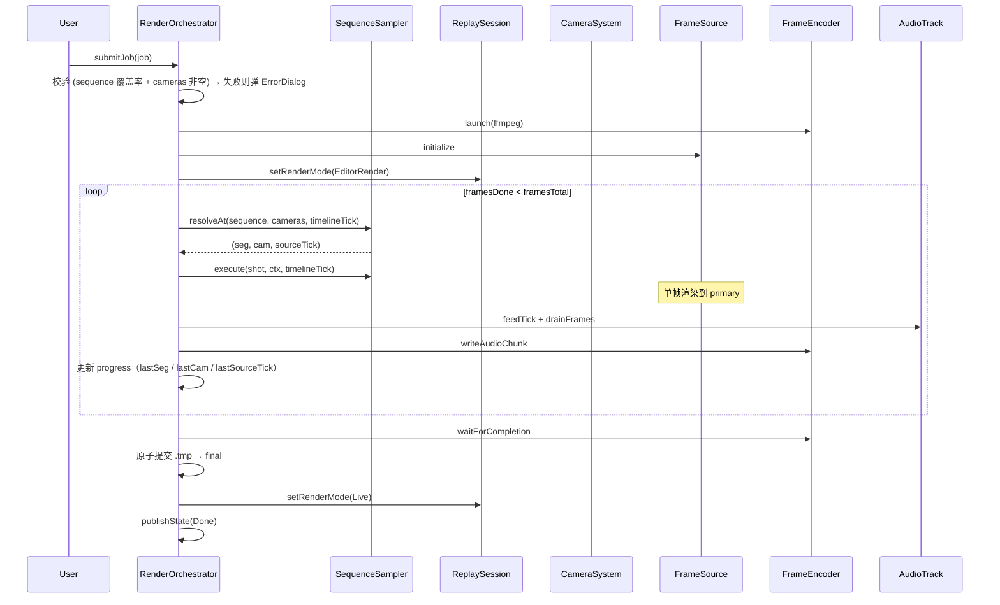
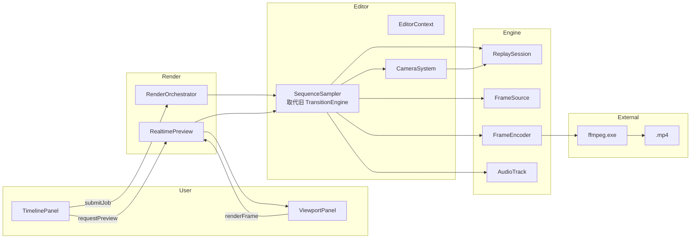

# 05 · 渲染管线（RealtimePreview + RenderJob 扩展 + 命令联动）

> 入口：`src/playback/refactor/render-pipeline/`
> 角色：在旧 [RenderJob](../functions/render/render-job.md) / [FrameSource](../functions/render/frame-source.md) / [FrameEncoder](../functions/render/frame-encoder.md) / [AudioTrack](../functions/render/audio-track.md) / [ExportPresets](../functions/render/export-presets.md) 之上，扩展为**生产级 + 实时预览**双模式，**不**重写底层。
> **视频编辑工作流**遵循 [09-video-editing-workflow.md](09-video-editing-workflow.md) 的 3 条一级轨道模型：
> - **导出 = 沿摄像机序列采集世界Actor**（[09 §2.7](09-video-editing-workflow.md)）：每帧 = `findSegmentAt → 绑定的 CameraEntity → seek + sample + apply + capture`。
> - **预览 = 同样的链路，但 `ctx.encoder == nullptr` 且只更新 Viewport 纹理**（[09 §2.8](09-video-editing-workflow.md)）。
> - **本工作流无 `TransitionEngine::planAt` / `TrackManager` / 多 Clip 混合**：旧转场概念被新工作流"按序列段绑 Camera"完全替代。
> 本文件是"扩展点"文档；底层细节见旧 5 份 render 文档。

## 一、需求（Requirements）

### 1.1 功能性需求

| ID | 需求 | 优先级 |
|---|---|---|
| RP-1 | 离线导出复用旧 `RenderJob` 全部能力（队列 / 软取消 / 原子提交 / 失败 dump） | P0 |
| RP-2 | 新增 `RealtimePreview` 模块：在编辑器内**实时**渲染当前 playhead tick | P0 |
| RP-3 | 预览分辨率 = `preferences.previewResolution`（默认 540p，可调 270/540/720/1080） | P0 |
| RP-4 | 预览用相同的摄影机 / 路径 / Rig / 绑定 / Shake / Limiter 链路 | P0 |
| RP-5 | 预览不写文件，只刷新 ViewportPanel 的 RTV | P0 |
| RP-6 | 预览 ≥ 30 FPS（1080p 时 ≥ 24 FPS） | P0 |
| RP-7 | `playback export` 命令复用 [export-presets.md 命令架构](../functions/render/export-presets.md) | P0 |
| RP-8 | RenderJob 支持 **sequence-driven 渲染**：按 [09 §2.7](09-video-editing-workflow.md) 沿 `EditorStateExt.sequence` 逐段取 `CameraEntity` 采样 | P0 |
| RP-9 | 渲染中按序列段的 `speed` 调整 `sourceTick` 步进 | P0 |
| RP-10 | 失败诊断 dump 增加 **当前 SequenceSegment** + **当前 CameraEntity** + **WorldActor 段** 上下文 | P0 |
| RP-11 | 序列段 `cameraId == ""` 或 `cameras[0]` 缺失时，导出报错弹 `ErrorDialog`（见 [01 §2.15](01-editor-architecture.md)） | P0 |

### 1.2 非功能性需求

- **预览延迟**：playhead 移动 → 视口更新 < 50ms
- **离线导出吞吐**：1080p 60fps ≥ 30 FPS 渲染（libx264 soft 编码）
- **CPU 占用**：预览 < 1 核；导出 < 4 核
- **内存**：预览 RTV × 1（双 RTV 仅导出转场期间）；导出 RTV × 2（ping-pong）+ staging × 2
- **可恢复**：崩溃留下 `.exporting.tmp`；启动扫

### 1.3 与现有约束对齐

- **不重写**旧 `RenderJob` / `FrameSource` / `FrameEncoder` / `AudioTrack`
- 通过**组合 + 包装**扩展
- 旧 `playback export` 命令接口保留；新 `playback export preview` 调 RealtimePreview

## 二、架构（Architecture）

### 2.1 内部结构

```
refactor/render-pipeline/
├── RenderOrchestrator.{h,cpp}       ← 顶层协调（导出 / 预览共用）
├── RealtimePreview.{h,cpp}          ← 实时预览（新）
├── SequenceSampler.{h,cpp}          ← sequence 段 → CameraEntity（取代旧 TransitionEngine::planAt）
├── RenderContext.{h,cpp}            ← 共享上下文（renderJob / frameSource / editor / camera）
├── RenderDiagnostics.{h,cpp}        ← 增强版失败 dump（含 SequenceSegment / CameraEntity 上下文）
└── ExportCommand.h                  ← 命令行扩展
```

### 2.2 `RenderContext`（共享上下文）

```cpp
struct RenderContext {
    EditorStateExt        editor;             // 来自 EditorContext（sequence / worldActor / cameras）
    std::unique_ptr<FrameSource>  primary;    // 主 RTV
    std::unique_ptr<FrameEncoder> encoder;    // 仅 RenderJob 用
    std::unique_ptr<AudioTrack>   audio;      // 仅 RenderJob 用
    RenderJobProgress      progress;
    std::atomic<bool>      stopToken{false};
};
```

**RenderOrchestrator** 是单例，**离线**与**预览**共享同一 `RenderContext`，但：

| 字段 | 离线 | 预览 |
|---|---|---|
| `primary` | 编码分辨率（如 1920×1080） | 预览分辨率（如 960×540） |
| `encoder` | FFmpegPipeEncoder / PngSequenceEncoder | **空**（不写文件） |
| `audio` | AudioTrack | **空** |
| `progress.state` | `Encoding` | `Previewing`（新增状态） |
| `stopToken` | 软取消触发 | playhead 移动触发 |

> **新工作流没有 secondary RTV**（旧概念为转场期间双 Clip 混合）。每帧只渲染一台 CameraEntity 拍到的当前世界Actor 状态。

### 2.3 `RealtimePreview`（实时预览）

```cpp
class RealtimePreview {
public:
    static RealtimePreview& getInstance();

    // 配置
    void initialize(const std::string& replayPath, int previewHeightP);
    void shutdown();

    // 状态
    bool isActive() const;

    // 主入口：playhead tick 改变时调
    void requestPreview(int tick);

    // 每帧渲染
    void render();  // 在 D3D12 Present 线程调

    // 配置变更
    void setPreviewResolution(int heightP);

private:
    void renderTick(int tick);
    void onPlayheadChanged(int newTick);
    void scheduleRender();  // 异步触发

    mutable std::mutex           mMtx;
    std::atomic<int>             mRequestedTick{-1};
    std::atomic<bool>            mRenderInFlight{false};
    int                          mLastRenderedTick{-1};
    std::unique_ptr<RenderContext> mCtx;
};
```

**`requestPreview` → `render` 时序**（沿 [09 §2.8](09-video-editing-workflow.md) 序列驱动）：



**`SequenceSampler::resolveAt` 算法**：

```cpp
struct ResolvedShot {
    const SequenceSegment* seg;    // 命中的段
    const CameraEntity*    cam;    // 段绑定的 Camera（空则取 cameras[0]）
    int                   sourceTick;
};

ResolvedShot SequenceSampler::resolveAt(
    const std::vector<SequenceSegment>& sequence,
    const std::vector<CameraEntity>&    cameras,
    int                                 timelineTick)
{
    ResolvedShot r{};

    // 1) 找当前 timelineTick 命中的段
    r.seg = SequenceOps::findSegmentAt(sequence, timelineTick);
    if (!r.seg) return r;  // 越界

    // 2) 段绑定的 Camera（未绑定 → cameras[0] 兜底）
    r.cam = CameraBindingOps::resolveCamera(cameras, r.seg->cameraId);

    // 3) 计算 WorldActor 的源 tick（speed 步进）
    int localTick = timelineTick - r.seg->startTick;
    r.sourceTick = r.seg->sourceTick + int(localTick * r.seg->speed);
    return r;
}
```

**去抖**（避免 playhead 拖动时每帧都 seek）：

```cpp
void RealtimePreview::requestPreview(int tick) {
    int last;
    { std::scoped_lock lk(mMtx); last = mLastRenderedTick; }
    if (tick == last) return;
    mRequestedTick = tick;
}

void RealtimePreview::render() {
    int req = mRequestedTick.load();
    if (req == mLastRenderedTick) return;
    if (mRenderInFlight.exchange(true)) return;  // 已有一帧在渲

    renderTick(req);
    mLastRenderedTick = req;
    mRenderInFlight = false;
}
```

### 2.4 `SequenceSampler`（单帧执行 = sequence 段 → CameraEntity → CameraSample）

```cpp
class SequenceSampler {
public:
    // 由 SequenceSampler::resolveAt 返回
    struct ResolvedShot {
        const SequenceSegment* seg;
        const CameraEntity*    cam;
        int                    sourceTick;
    };

    // 解析当前 timelineTick 命中的段 + 绑定的 Camera
    static ResolvedShot resolveAt(const EditorStateExt& editor, int timelineTick);

    // 应用到 RenderContext：seek ReplaySession + 采样 + apply MCBE
    void execute(const ResolvedShot& shot, RenderContext& ctx, int timelineTick);

private:
    ResolvedShot resolveAt(const std::vector<SequenceSegment>& sequence,
                          const std::vector<CameraEntity>&    cameras,
                          int                                 timelineTick);
    void         renderSingleFrame(const CameraEntity& cam, int sourceTick,
                                   FrameSource& dst, RenderContext& ctx);
};
```

**`execute` 主流程**（取代旧 `RenderPlanExecutor::renderBlended`）：

```cpp
void SequenceSampler::execute(const ResolvedShot& shot, RenderContext& ctx, int timelineTick) {
    // 1) 段未命中或 cam 缺失 → 跳过（导出校验阶段应已 fail；此处为防御）
    if (!shot.seg) return;
    if (!shot.cam) return;

    // 2) seek WorldActor 到 sourceTick + tick
    ctx.session->requestSeek(shot.sourceTick);
    ctx.session->tick();

    // 3) 采样 Camera + apply MCBE
    CameraSample s = CameraSystem::getInstance().sampleAt(*shot.cam, shot.sourceTick, *ctx.session);
    CameraSystem::getInstance().applyToMCBE(s);

    // 4) 让 MCBE 渲一帧 → RTV（应用了摄影机的世界状态）
    ctx.primary->waitForFrame();
    ctx.primary->captureToStaging(rgbA);

    // 5) 写入
    if (ctx.encoder) {
        ctx.encoder->writeVideoFrame(rgbA.data(), rgbA.size());
    }
    // 预览只更新 ViewportPanel 纹理
}
```

> **新工作流每帧只渲一台 Camera**（不混合、不叠加、不计算 blendAlpha）。"切镜头"通过序列段切换 CameraEntity 实现（每段的第一帧触发一次"瞬切"）。这是与旧 TransitionEngine 最大的区别。

### 2.5 `RenderOrchestrator`（顶层）

```cpp
class RenderOrchestrator {
public:
    static RenderOrchestrator& getInstance();

    // 离线
    bool submitJob(QueuedJob job);    // 复用旧 RenderJob::submitJob
    void cancelCurrent();
    RenderJobProgress snapshot() const;

    // 预览
    void startPreview(const std::string& replayPath, int previewHeightP);
    void stopPreview();
    void requestPreview(int tick);
    void renderPreviewFrame();  // D3D12 Present 线程

    // 配置
    void setEditorState(const EditorStateExt& state);

private:
    void runJobLoop();  // worker 线程
    void runEncodingJob(const QueuedJob& job);
    void finalizeEncoding(const QueuedJob& job);

    std::unique_ptr<RenderContext>         mRenderCtx;
    std::unique_ptr<RealtimePreview>       mPreview;
    std::unique_ptr<SequenceSampler>       mSampler;
    // ... 旧 RenderJob 成员 ...
};
```

**离线任务流**（沿 [09 §2.7](09-video-editing-workflow.md)）：



### 2.6 旧 RenderJob 改动（最小侵入）

旧 [RenderJob](../functions/render/render-job.md) 是**主循环骨架**；新 `RenderOrchestrator` 包装它：

```cpp
// RenderOrchestrator.cpp
void RenderOrchestrator::runEncodingJob(const QueuedJob& job) {
    // 0) 校验：sequence 填满 [0, totalTicks] + cameras 非空
    if (!SequenceOps::validateCoverage(mRenderCtx->editor.sequence, mRenderCtx->editor.totalTicks)
        || mRenderCtx->editor.cameras.empty()) {
        ErrorDialog::show("Export Failed", "Sequence incomplete or no cameras");
        return;
    }

    // 1) 沿用旧 RenderJob 准备（probe / build / launch / init）
    auto* oldJob = RenderJob::getInstancePtr();
    oldJob->beginEncoding(job);  // 新增入口

    // 2) 主循环改造：每帧查 SequenceSampler（取代旧 TransitionEngine::planAt）
    for (int frame = 0; frame < job.totalFrames; ++frame) {
        if (stopToken) { oldJob->cancelEncoding(); return; }
        int timelineTick = job.inTick + frame * (20 / job.config.fps);

        auto shot = SequenceSampler::resolveAt(mRenderCtx->editor, timelineTick);
        mSampler->execute(shot, *mRenderCtx, timelineTick);

        // 音频 / 进度
        oldJob->writeAudioChunk(frame);
        oldJob->publishProgress(frame, job.totalFrames);
    }
    oldJob->finalizeEncoding();
}
```

> **不重写 RenderJob**；只新增 `beginEncoding / writeAudioChunk / publishProgress / cancelEncoding / finalizeEncoding` 5 个入口（旧文档中的 `seekTo` 不再必要，因为 SequenceSampler 内部已 seek）。

### 2.7 命令行集成

```text
playback export start [<replay>] [--preset <name>] [...cli args]
playback export cancel
playback export status
playback export preview start    ← 新增（RealtimePreview 模式）
playback export preview stop
playback export preview toggle   ← 切换启用
```

`playback export preview` 实现：

```cpp
exportCmd.overload().text("preview").execute([](const CommandOrigin&, CommandOutput& out) {
    auto sub = parseSubcommand(getRemainingArgs());
    if (sub == "start") {
        RenderOrchestrator::getInstance().startPreview(currentReplay(), preferences.previewResolution);
        out.success("playback.command.export.preview.started");
    } else if (sub == "stop") {
        RenderOrchestrator::getInstance().stopPreview();
        out.success("playback.command.export.preview.stopped");
    }
});
```

### 2.8 失败诊断增强

```cpp
// RenderDiagnostics.cpp
void dumpEnhancedDiagnostics(const RenderJobProgress& p, const QueuedJob& job) {
    auto dir = std::filesystem::path(p.outputPath).parent_path();
    std::ofstream log(dir / "export-failed.log");

    log << "Frames done: " << p.framesDone << "/" << p.framesTotal << "\n"
        << "Last SequenceSegment: id=" << p.lastSequenceSegmentId
            << " startTick=" << p.lastSegStartTick
            << " endTick=" << p.lastSegEndTick
            << " cameraId=" << p.lastCameraId
            << " speed=" << p.lastSegSpeed << "\n"
        << "Last sourceTick: " << p.lastSourceTick << "\n"
        << "Last WorldActor segment: id=" << p.lastWorldActorSegId << "\n"
        << "FFmpeg stderr: " << p.ffmpegStderr << "\n";

    // 抽样 5 帧
    for (int i : sampleFrames(p.framesDone, 5)) {
        savePng(sampleFrame(i), dir / std::format("sample_{}.png", i));
    }

    // 新增：导出当前 EditorStateExt（便于诊断 sequence / cameras 配置问题）
    log << "EditorStateExt:\n" << job.editor.toJson().dump(2);
}
```

### 2.9 数据流（端到端）



## 三、执行（Execution）

### 3.1 任务拆分

| 步骤 | 文件 | 验证 |
|---|---|---|
| 1 | `RenderContext` + `RenderOrchestrator` 单例 | 编译 |
| 2 | `RealtimePreview.initialize / shutdown` | 单测：lifecycle |
| 3 | `RealtimePreview.requestPreview / render` | 手动：playhead 拖动视口更新 |
| 4 | `SequenceSampler.resolveAt / execute`（单 Camera） | 单测：调 FrameSource 写文件 |
| 5 | `RenderOrchestrator.runEncodingJob` 主循环 | 手动：导出按序列切镜头 |
| 6 | 旧 `RenderJob` 增 5 个新入口（`beginEncoding` / `writeAudioChunk` / `publishProgress` / `cancelEncoding` / `finalizeEncoding`） | 编译（不破坏旧行为） |
| 7 | `RenderDiagnostics.dumpEnhancedDiagnostics` | 手动：故意失败 |
| 8 | `playback export preview` 命令 | 手动：控制台 |
| 9 | 集成 `TimelinePanel` playhead 事件 | 手动：拖 playhead → 预览 |
| 10 | 集成 `ViewportPanel` 接收预览纹理 | 手动：视口显示预览 |
| 11 | 性能调优：1080p 60fps ≥ 30 渲染 FPS | perf marker |
| 12 | 导出校验（sequence 覆盖率 + cameras 非空） | 手动：删除 cameras → 导出失败弹 ErrorDialog |

### 3.2 关键算法

**预览分辨率计算**：

```cpp
Resolution previewResolution(int heightP, AspectRatio a) {
    int h = heightP;
    int w = h * aspectRatioNum(a) / aspectRatioDen(a);
    return {w, h};
}
```

> **新工作流无 CPU/GPU 端 alpha 混合**（旧转场概念移除）。每帧由一台 Camera 渲染一次 → RTV → 写盘 / 更新视口。CPU 混合代码（`blendOnCPU`）整体删除。

**`SequenceSampler::resolveAt`（与 §2.3 一致）**：

```cpp
ResolvedShot SequenceSampler::resolveAt(const EditorStateExt& e, int timelineTick) {
    ResolvedShot r{};
    r.seg = SequenceOps::findSegmentAt(e.sequence, timelineTick);
    if (!r.seg) return r;
    r.cam = CameraBindingOps::resolveCamera(e.cameras, r.seg->cameraId);
    int localTick = timelineTick - r.seg->startTick;
    r.sourceTick = r.seg->sourceTick + int(localTick * r.seg->speed);
    return r;
}
```

### 3.3 关键不变量

1. **预览与导出共用 `SequenceSampler::resolveAt`**：同一 timelineTick → 同一 `(seg, cam, sourceTick)` → 同一 `execute` 路径；唯一差异是 `ctx.encoder == nullptr`
2. **预览不写盘**：`ctx.encoder = nullptr`；`ctx.audio = nullptr`
3. **离线 / 预览互斥**：同一 `RenderOrchestrator` 同时只跑一种模式
4. **每帧只渲一台 Camera**：序列段切换 = 镜头切换；不混合、不叠加、不计算 blendAlpha
5. **失败 dump 包含 SequenceSegment + CameraEntity 上下文**：便于诊断镜头配置
6. **不破坏旧 RenderJob 行为**：5 个新入口不影响旧 API
7. **导出前校验**：`SequenceOps::validateCoverage == true` 且 `cameras` 非空；否则弹 `ErrorDialog` 并返回

### 3.4 测试用例

| ID | 用例 | 期望 |
|---|---|---|
| RP-T1 | RealtimePreview.initialize | mCtx 创建，FS 初始化 |
| RP-T2 | requestPreview(100) + render | FS 抓 100 tick 帧 |
| RP-T3 | requestPreview 同 tick | 跳过 |
| RP-T4 | 旧 RenderJob submitJob | 行为不变（向后兼容） |
| RP-T5 | 旧 RenderJob submitJob + 新入口 | 完整导出 |
| RP-T6 | `SequenceSampler::resolveAt` 单段 | 返回正确的 `(seg, cam, sourceTick)` |
| RP-T7 | `SequenceSampler::resolveAt` 段边界 | tick=endTick → 下一段 |
| RP-T8 | 段 `cameraId=""` resolveAt | cam 兜底为 `cameras[0]` |
| RP-T9 | `playback export preview start` | RealtimePreview 启动 |
| RP-T10 | 失败 dump 含 EditorStateExt | log 包含完整 JSON |
| RP-T11 | 1080p 60fps 离线 | 渲染 FPS ≥ 30 |
| RP-T12 | 预览 540p 60fps | 视口更新 ≥ 30 FPS |
| RP-T13 | 导出校验 cameras 空 | 弹 ErrorDialog，job 不启动 |
| RP-T14 | 导出校验 sequence 不覆盖 | 弹 ErrorDialog，job 不启动 |

### 3.5 风险与回退

| 风险 | 缓解 |
|---|---|
| 预览 + 录制同时跑资源争 | 录制中禁用预览 |
| 沿序列导出某段 cameras[0] 也不存在 | 校验阶段 ErrorDialog 兜底；不进入主循环 |
| 序列段与 WorldActor 段不对齐 | 导出前校验；缺失则在 ErrorDialog 中标注"sequence @ tick X 缺少 WorldActor 段覆盖" |
| 旧 RenderJob 行为变化 | 5 个新入口，旧 API 不动 |
| 失败 dump 文件过大 | 限制 EditorStateExt 序列化深度 |

## 四、模块关系

### 被谁调用（上游）

- **`refactor/editor/panels/TimelinePanel`**：`requestPreview` + `submitJob`
- **`refactor/editor/panels/ViewportPanel`**：`renderPreviewFrame` + 接收预览纹理
- **`refactor/video-editing/SequenceOps` / `WorldActorOps` / `CameraBindingOps`**：导出时校验 + 解析
- **旧 [playback export 命令](../functions/render/export-presets.md)**：`submitJob` + `preview` 子命令

### 调用谁（下游）

- 旧 [RenderJob](../functions/render/render-job.md)：通过 5 个新入口包装
- 旧 [FrameSource](../functions/render/frame-source.md)：抓帧
- 旧 [FrameEncoder](../functions/render/frame-encoder.md)：写文件
- 旧 [AudioTrack](../functions/render/audio-track.md)：写音频
- 旧 [ExportPresets](../functions/render/export-presets.md)：FFmpeg 命令
- 旧 [ReplaySession](../functions/replay.md)：seek + tick
- 旧 [Recorder](../functions/record.md)：preview 用 `getCurrentFileSize` 等
- **[02-camera-motion.md](02-camera-motion.md)**：摄影机采样（接收 `CameraEntity`）
- **[04-video-editing.md](04-video-editing.md)**：`SequenceOps::findSegmentAt` / `validateCoverage`、`CameraBindingOps::resolveCamera` / `clearReferencesInSequence`
- **[06-data-persistence.md](06-data-persistence.md)**：EditorStateExt
- **[09-video-editing-workflow.md](09-video-editing-workflow.md)**：消费 sequence / worldActor / cameras

### 共享数据

- `RenderOrchestrator` 单例
- `EditorContext::mEditorExt` —— UI ↔ 渲染
- `EditorContext::mExportExt` —— 进度

### 事件订阅 / 发送

- `SequenceOps.onSegmentsChanged` → RenderOrchestrator（清缓存）
- `CameraBindingOps.onBindingCreated` → RenderOrchestrator（清缓存 + 重置 mPrevFrame）

## 五、阅读顺序

1. 本文件
2. 旧 [functions/render/render-job.md](../functions/render/render-job.md) —— RenderJob 基础
3. 旧 [functions/render/frame-source.md](../functions/render/frame-source.md)
4. 旧 [functions/render/frame-encoder.md](../functions/render/frame-encoder.md)
5. 旧 [functions/render/audio-track.md](../functions/render/audio-track.md)
6. 旧 [functions/render/export-presets.md](../functions/render/export-presets.md)
7. [09-video-editing-workflow.md](09-video-editing-workflow.md) —— 工作流总览（必读）
8. [04-video-editing.md](04-video-editing.md) —— 序列操作（`SequenceOps` / `CameraBindingOps`）
9. [02-camera-motion.md](02-camera-motion.md) —— CameraSystem
10. [06-data-persistence.md](06-data-persistence.md) —— EditorStateExt
11. [01-editor-architecture.md](01-editor-architecture.md) —— UI
