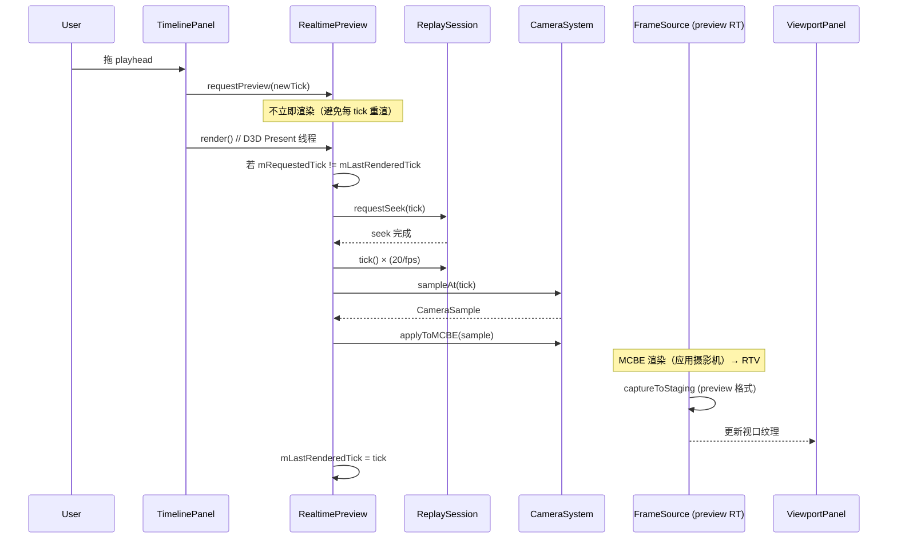
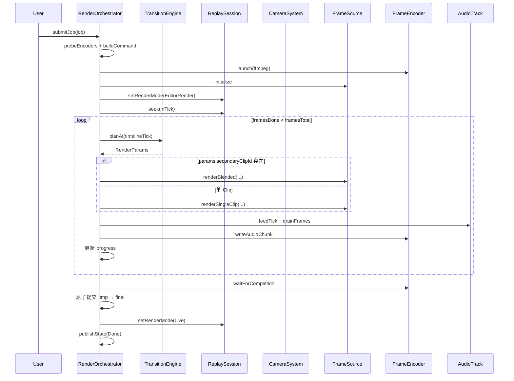
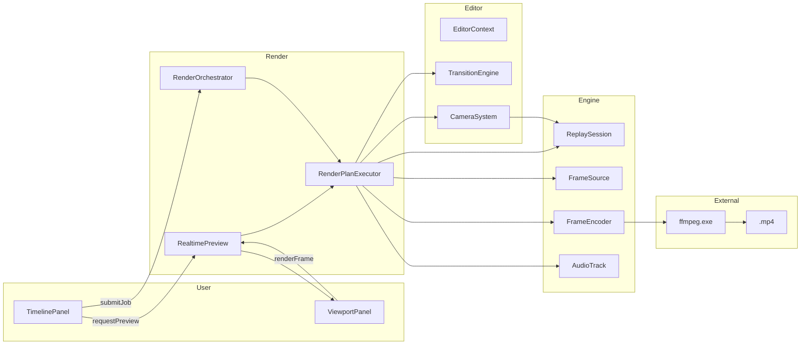

# 05 · 渲染管线（RealtimePreview + RenderJob 扩展 + 命令联动）

> 入口：`src/playback/refactor/render-pipeline/`
> 角色：在旧 [RenderJob](../functions/render/render-job.md) / [FrameSource](../functions/render/frame-source.md) / [FrameEncoder](../functions/render/frame-encoder.md) / [AudioTrack](../functions/render/audio-track.md) / [ExportPresets](../functions/render/export-presets.md) 之上，扩展为**生产级 + 实时预览**双模式，**不**重写底层。
> 本文件是"扩展点"文档；底层细节见旧 5 份 render 文档。

## 一、需求（Requirements）

### 1.1 功能性需求

| ID | 需求 | 优先级 |
|---|---|---|
| RP-1 | 离线导出复用旧 `RenderJob` 全部能力（队列 / 软取消 / 原子提交 / 失败 dump） | P0 |
| RP-2 | 新增 `RealtimePreview` 模块：在编辑器内**实时**渲染当前 playhead tick | P0 |
| RP-3 | 预览分辨率 = `preferences.previewResolution`（默认 540p，可调 270/540/720/1080） | P0 |
| RP-4 | 预览用相同的摄影机 / 转场 / 曲线 / TimeRemap 链路 | P0 |
| RP-5 | 预览不写文件，只刷新 ViewportPanel 的 RTV | P0 |
| RP-6 | 预览 ≥ 30 FPS（1080p 时 ≥ 24 FPS） | P0 |
| RP-7 | `playback export` 命令复用 [export-presets.md 命令架构](../functions/render/export-presets.md) | P0 |
| RP-8 | RenderJob 支持 **clip-based 渲染**：按 [04-video-editing.md](04-video-editing.md) 的 `TransitionEngine::planAt` 输出 RenderPlan | P0 |
| RP-9 | 渲染中按 TimeRemap 调整源 tick 步进 | P0 |
| RP-10 | 失败诊断 dump 增加 **clip 索引** + **当前 Transition** 上下文 | P0 |

### 1.2 非功能性需求

- **预览延迟**：playhead 移动 → 视口更新 < 50ms
- **离线导出吞吐**：1080p 60fps ≥ 30 FPS 渲染（libx264 soft 编码）
- **CPU 占用**：预览 < 1 核；导出 < 4 核
- **内存**：预览 RTV × 1（双 RTV 仅导出转场期间）；导出 RTV × 2（ping-pong）+ staging × 2
- **可恢复**：崩溃留下 `.exporting.tmp`；启动扫

### 1.3 与现有约束对齐

- **不重写**旧 `RenderJob` / `FrameSource` / `FrameEncoder` / `AudioTrack`
- 通过**组合 + 包装**扩展
- 旧 `playback export` 命令接口保留；新 `playback export preview` 调 RealtimePreview

## 二、架构（Architecture）

### 2.1 内部结构

```
refactor/render-pipeline/
├── RenderOrchestrator.{h,cpp}       ← 顶层协调（导出 / 预览共用）
├── RealtimePreview.{h,cpp}          ← 实时预览（新）
├── RenderPlanExecutor.{h,cpp}       ← 执行 TransitionEngine::planAt
├── RenderContext.{h,cpp}            ← 共享上下文（renderJob / frameSource / editor / camera）
├── RenderDiagnostics.{h,cpp}        ← 增强版失败 dump
└── ExportCommand.h                  ← 命令行扩展
```

### 2.2 `RenderContext`（共享上下文）

```cpp
struct RenderContext {
    EditorState            editor;             // 来自 EditorContext
    std::unique_ptr<FrameSource>  primary;     // 主 RTV
    std::unique_ptr<FrameSource>  secondary;   // 转场用（可选）
    std::unique_ptr<FrameEncoder> encoder;     // 仅 RenderJob 用
    std::unique_ptr<AudioTrack>   audio;       // 仅 RenderJob 用
    RenderJobProgress      progress;
    std::atomic<bool>      stopToken{false};
};
```

**RenderOrchestrator** 是单例，**离线**与**预览**共享同一 `RenderContext`，但：

| 字段 | 离线 | 预览 |
|---|---|---|
| `primary` | 编码分辨率（如 1920×1080） | 预览分辨率（如 960×540） |
| `secondary` | 转场时创建 | 不创建 |
| `encoder` | FFmpegPipeEncoder / PngSequenceEncoder | **空**（不写文件） |
| `audio` | AudioTrack | **空** |
| `progress.state` | `Encoding` | `Previewing`（新增状态） |
| `stopToken` | 软取消触发 | playhead 移动触发 |

### 2.3 `RealtimePreview`（实时预览）

```cpp
class RealtimePreview {
public:
    static RealtimePreview& getInstance();

    // 配置
    void initialize(const std::string& replayPath, int previewHeightP);
    void shutdown();

    // 状态
    bool isActive() const;

    // 主入口：playhead tick 改变时调
    void requestPreview(int tick);

    // 每帧渲染
    void render();  // 在 D3D12 Present 线程调

    // 配置变更
    void setPreviewResolution(int heightP);

private:
    void renderTick(int tick);
    void onPlayheadChanged(int newTick);
    void scheduleRender();  // 异步触发

    mutable std::mutex           mMtx;
    std::atomic<int>             mRequestedTick{-1};
    std::atomic<bool>            mRenderInFlight{false};
    int                          mLastRenderedTick{-1};
    std::unique_ptr<RenderContext> mCtx;
};
```

**`requestPreview` → `render` 时序**：



**去抖**（避免 playhead 拖动时每帧都 seek）：

```cpp
void RealtimePreview::requestPreview(int tick) {
    int last;
    { std::scoped_lock lk(mMtx); last = mLastRenderedTick; }
    if (tick == last) return;
    mRequestedTick = tick;
}

void RealtimePreview::render() {
    int req = mRequestedTick.load();
    if (req == mLastRenderedTick) return;
    if (mRenderInFlight.exchange(true)) return;  // 已有一帧在渲

    renderTick(req);
    mLastRenderedTick = req;
    mRenderInFlight = false;
}
```

### 2.4 `RenderPlanExecutor`（转场执行）

```cpp
class RenderPlanExecutor {
public:
    // 每帧：决定渲染哪些 Clip + alpha
    struct RenderParams {
        std::optional<std::string> secondaryClipId;
        float blendAlpha{1.0f};
        TransitionKind kind{TransitionKind::Cut};
    };

    // 应用到 RenderJob / RealtimePreview 的 RTV
    void execute(const RenderParams& params, RenderContext& ctx, int timelineTick);

private:
    void renderSingleClip(const std::string& clipId, FrameSource& dst, RenderContext& ctx);
    void renderBlended(const std::string& primaryId, const std::string& secondaryId,
                       float alpha, FrameSource& dst, RenderContext& ctx);
};
```

**`renderBlended`（双 RTV 路径）**：

```cpp
void RenderPlanExecutor::renderBlended(
    const std::string& primaryId, const std::string& secondaryId,
    float alpha, FrameSource& dst, RenderContext& ctx
) {
    // 1) 渲 primary 到 ctx.primary（已应用摄影机）
    renderSingleClip(primaryId, *ctx.primary, ctx);
    ctx.primary->waitForFrame();
    ctx.primary->captureToStaging(rgbA);

    // 2) 渲 secondary 到 ctx.secondary
    if (!ctx.secondary) ctx.secondary = createFrameSource(ctx.editor.exportConfig, /*secondary=*/true);
    renderSingleClip(secondaryId, *ctx.secondary, ctx);
    ctx.secondary->waitForFrame();
    ctx.secondary->captureToStaging(rgbB);

    // 3) CPU 端 alpha 混合
    blendOnCPU(rgbA, rgbB, alpha, ctx.primary->getWidth(), ctx.primary->getHeight());

    // 4) 写
    if (ctx.encoder) {
        ctx.encoder->writeVideoFrame(rgbA.data(), rgbA.size());
    }
    // 预览只更新视口
}
```

> **CPU 端混合的取舍**：CPU blend 比 GPU 慢，但实现简单、避免多 GPU 资源竞争。**首期**用 CPU；性能不够再换 GPU compute shader。

### 2.5 `RenderOrchestrator`（顶层）

```cpp
class RenderOrchestrator {
public:
    static RenderOrchestrator& getInstance();

    // 离线
    bool submitJob(QueuedJob job);    // 复用旧 RenderJob::submitJob
    void cancelCurrent();
    RenderJobProgress snapshot() const;

    // 预览
    void startPreview(const std::string& replayPath, int previewHeightP);
    void stopPreview();
    void requestPreview(int tick);
    void renderPreviewFrame();  // D3D12 Present 线程

    // 配置
    void setEditorState(const EditorState& state);

private:
    void runJobLoop();  // worker 线程
    void runEncodingJob(const QueuedJob& job);
    void finalizeEncoding(const QueuedJob& job);

    std::unique_ptr<RenderContext>         mRenderCtx;
    std::unique_ptr<RealtimePreview>       mPreview;
    std::unique_ptr<RenderPlanExecutor>    mExecutor;
    // ... 旧 RenderJob 成员 ...
};
```

**离线任务流**（在旧 [render-job.md §2.4](../functions/render/render-job.md) 基础上加转场）：



### 2.6 旧 RenderJob 改动（最小侵入）

旧 [RenderJob](../functions/render/render-job.md) 是**主循环骨架**；新 `RenderOrchestrator` 包装它：

```cpp
// RenderOrchestrator.cpp
void RenderOrchestrator::runEncodingJob(const QueuedJob& job) {
    // 1) 沿用旧 RenderJob 准备（probe / build / launch / init）
    auto* oldJob = RenderJob::getInstancePtr();
    oldJob->beginEncoding(job);  // 新增入口

    // 2) 主循环改造：每帧查 TransitionEngine
    for (int frame = 0; frame < job.totalFrames; ++frame) {
        if (stopToken) { oldJob->cancelEncoding(); return; }
        int timelineTick = job.inTick + frame * (20 / job.config.fps);
        int remappedTick = job.editor.timeRemap.remap(timelineTick);
        oldJob->seekTo(remappedTick);

        auto params = TransitionEngine::planAt(timelineTick, job.editor);
        mExecutor->execute(params, *mRenderCtx, timelineTick);

        // 音频 / 进度
        oldJob->writeAudioChunk(frame);
        oldJob->publishProgress(frame, job.totalFrames);
    }
    oldJob->finalizeEncoding();
}
```

> **不重写 RenderJob**；只新增 `beginEncoding / seekTo / writeAudioChunk / publishProgress / cancelEncoding / finalizeEncoding` 6 个入口。

### 2.7 命令行集成

```text
playback export start [<replay>] [--preset <name>] [...cli args]
playback export cancel
playback export status
playback export preview start    ← 新增（RealtimePreview 模式）
playback export preview stop
playback export preview toggle   ← 切换启用
```

`playback export preview` 实现：

```cpp
exportCmd.overload().text("preview").execute([](const CommandOrigin&, CommandOutput& out) {
    auto sub = parseSubcommand(getRemainingArgs());
    if (sub == "start") {
        RenderOrchestrator::getInstance().startPreview(currentReplay(), preferences.previewResolution);
        out.success("playback.command.export.preview.started");
    } else if (sub == "stop") {
        RenderOrchestrator::getInstance().stopPreview();
        out.success("playback.command.export.preview.stopped");
    }
});
```

### 2.8 失败诊断增强

```cpp
// RenderDiagnostics.cpp
void dumpEnhancedDiagnostics(const RenderJobProgress& p, const QueuedJob& job) {
    auto dir = std::filesystem::path(p.outputPath).parent_path();
    std::ofstream log(dir / "export-failed.log");

    log << "Frames done: " << p.framesDone << "/" << p.framesTotal << "\n"
        << "Last clip: " << p.lastClipId << " tick=" << p.lastTick << "\n"
        << "Last transition: " << p.lastTransitionId
            << " alpha=" << p.lastBlendAlpha << "\n"
        << "FFmpeg stderr: " << p.ffmpegStderr << "\n";

    // 抽样 5 帧
    for (int i : sampleFrames(p.framesDone, 5)) {
        savePng(sampleFrame(i), dir / std::format("sample_{}.png", i));
    }

    // 新增：导出当前 EditorState（便于诊断摄影机 / 转场配置问题）
    log << "EditorState:\n" << job.editor.toJson().dump(2);
}
```

### 2.9 数据流（端到端）



## 三、执行（Execution）

### 3.1 任务拆分

| 步骤 | 文件 | 验证 |
|---|---|---|
| 1 | `RenderContext` + `RenderOrchestrator` 单例 | 编译 |
| 2 | `RealtimePreview.initialize / shutdown` | 单测：lifecycle |
| 3 | `RealtimePreview.requestPreview / render` | 手动：playhead 拖动视口更新 |
| 4 | `RenderPlanExecutor.execute`（单 Clip） | 单测：调 FrameSource 写文件 |
| 5 | `RenderPlanExecutor.renderBlended`（双 RTV） | 单测：blendOnCPU |
| 6 | `RenderOrchestrator.runEncodingJob` 主循环 | 手动：导出含转场 |
| 7 | 旧 `RenderJob` 增 6 个新入口 | 编译（不破坏旧行为） |
| 8 | `RenderDiagnostics.dumpEnhancedDiagnostics` | 手动：故意失败 |
| 9 | `playback export preview` 命令 | 手动：控制台 |
| 10 | 集成 `TimelinePanel` playhead 事件 | 手动：拖 playhead → 预览 |
| 11 | 集成 `ViewportPanel` 接收预览纹理 | 手动：视口显示预览 |
| 12 | 性能调优：1080p 60fps ≥ 30 渲染 FPS | perf marker |

### 3.2 关键算法

**CPU 端 alpha 混合**：

```cpp
void blendOnCPU(uint8_t* dst, const uint8_t* src, float alpha, int w, int h) {
    int n = w * h * 4;
    uint8_t a8 = (uint8_t)(alpha * 255);
    for (int i = 0; i < n; i += 4) {
        dst[i+0] = (dst[i+0] * (255 - a8) + src[i+0] * a8) / 255;
        dst[i+1] = (dst[i+1] * (255 - a8) + src[i+1] * a8) / 255;
        dst[i+2] = (dst[i+2] * (255 - a8) + src[i+2] * a8) / 255;
        // alpha 通道保留
    }
}
```

**预览分辨率计算**：

```cpp
Resolution previewResolution(int heightP, AspectRatio a) {
    int h = heightP;
    int w = h * aspectRatioNum(a) / aspectRatioDen(a);
    return {w, h};
}
```

### 3.3 关键不变量

1. **预览与导出共用 RenderPlan**：同一 `TransitionEngine::planAt` → 同一 `RenderParams` → 同一 `RenderPlanExecutor`
2. **预览不写盘**：ctx.encoder = nullptr；ctx.audio = nullptr
3. **离线 / 预览互斥**：同一 `RenderOrchestrator` 同时只跑一种模式
4. **TimeRemap 始终生效**：预览 / 导出都按 `editor.timeRemap.remap` 算 tick
5. **失败 dump 包含 EditorState**：便于诊断摄影机 / 转场配置
6. **不破坏旧 RenderJob 行为**：6 个新入口不影响旧 API

### 3.4 测试用例

| ID | 用例 | 期望 |
|---|---|---|
| RP-T1 | RealtimePreview.initialize | mCtx 创建，FS 初始化 |
| RP-T2 | requestPreview(100) + render | FS 抓 100 tick 帧 |
| RP-T3 | requestPreview 同 tick | 跳过 |
| RP-T4 | 旧 RenderJob submitJob | 行为不变（向后兼容） |
| RP-T5 | 旧 RenderJob submitJob + 新入口 | 完整导出 |
| RP-T6 | blendOnCPU(alpha=0.5) | dst = (dst + src) / 2 |
| RP-T7 | renderBlended(Cut, dur=0) | 等同 renderSingleClip |
| RP-T8 | planAt 转场中点 | blendAlpha = 0.5 |
| RP-T9 | `playback export preview start` | RealtimePreview 启动 |
| RP-T10 | 失败 dump 含 EditorState | log 包含完整 JSON |
| RP-T11 | 1080p 60fps 离线 | 渲染 FPS ≥ 30 |
| RP-T12 | 预览 540p 60fps | 视口更新 ≥ 30 FPS |

### 3.5 风险与回退

| 风险 | 缓解 |
|---|---|
| CPU blend 慢 | GPU compute shader（次版本） |
| 预览 + 录制同时跑资源争 | 录制中禁用预览 |
| 双 RTV 显存（导出 4K） | 转场期间才创建 secondary，否则复用 primary |
| 旧 RenderJob 行为变化 | 6 个新入口，旧 API 不动 |
| TimeRemap 反向映射越界 | clamp 到 [0, totalTicks] |
| 失败 dump 文件过大 | 限制 EditorState 序列化深度 |

## 四、模块关系

### 被谁调用（上游）

- **`refactor/editor-architecture/Panels/TimelinePanel`**：`requestPreview` + `submitJob`
- **`refactor/editor-architecture/Panels/ViewportPanel`**：`renderPreviewFrame` + 接收预览纹理
- **`refactor/editor-architecture/Panels/ExportPanel`**：`submitJob` + 进度显示
- **`refactor/video-editing/TrackManager`**：导出时遍历 Clip
- **旧 [playback export 命令](../functions/render/export-presets.md)**：`submitJob` + `preview` 子命令

### 调用谁（下游）

- 旧 [RenderJob](../functions/render/render-job.md)：通过 6 个新入口包装
- 旧 [FrameSource](../functions/render/frame-source.md)：抓帧
- 旧 [FrameEncoder](../functions/render/frame-encoder.md)：写文件
- 旧 [AudioTrack](../functions/render/audio-track.md)：写音频
- 旧 [ExportPresets](../functions/render/export-presets.md)：FFmpeg 命令
- 旧 [ReplaySession](../functions/replay.md)：seek + tick
- 旧 [Recorder](../functions/record.md)：preview 用 `getCurrentFileSize` 等
- **[02-camera-motion.md](02-camera-motion.md)**：摄影机采样
- **[04-video-editing.md](04-video-editing.md)**：TransitionEngine::planAt
- **[06-data-persistence.md](06-data-persistence.md)**：EditorState

### 共享数据

- `RenderOrchestrator` 单例
- `EditorContext::mEditorExt` —— UI ↔ 渲染
- `EditorContext::mExportExt` —— 进度

### 事件订阅 / 发送

- 无

## 五、阅读顺序

1. 本文件
2. 旧 [functions/render/render-job.md](../functions/render/render-job.md) —— RenderJob 基础
3. 旧 [functions/render/frame-source.md](../functions/render/frame-source.md)
4. 旧 [functions/render/frame-encoder.md](../functions/render/frame-encoder.md)
5. 旧 [functions/render/audio-track.md](../functions/render/audio-track.md)
6. 旧 [functions/render/export-presets.md](../functions/render/export-presets.md)
7. [04-video-editing.md](04-video-editing.md) —— TransitionEngine
8. [02-camera-motion.md](02-camera-motion.md) —— CameraSystem
9. [06-data-persistence.md](06-data-persistence.md) —— EditorState
10. [01-editor-architecture.md](01-editor-architecture.md) —— UI
