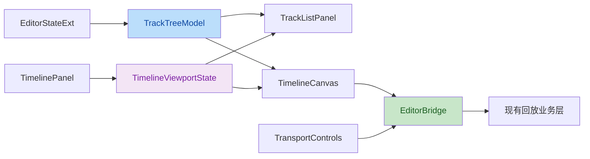

# Sequencer 时间轴 UI（按 09 工作流 · 3+N 轨模型）

> 本文件实现 [09-video-editing-workflow.md](09-video-editing-workflow.md) §2.1 所定义的时间轴 UI。
> 核心变化：原"视频轨 / 相机轨 / Marker 轨"**3 类分组**改为 **"摄像机序列 + 世界Actor + 摄像机 + Marker" 4 类固定一级轨道**（3 条一级 + N 条用户摄像机轨），子Actor **不**生成行。

## 需求

### 目标

- 重写编辑器底部时间轴为整体式 Sequencer 工作区，明确划分全局工具栏、轨道导航栏、时间轴画布和传输控制栏四个区域。
- 时间轴所有 UI 均嵌入 `EditMode` 分配的 Timeline 容器，不创建可移动、可缩放、可保存位置的独立 ImGui 窗口。
- 时间轴自身与编辑器主布局解耦：轨道导航栏宽度由时间轴内部纵向分隔条控制；编辑器外层横向分隔条只控制 Timeline 总高度；Details 宽度只由编辑器外层纵向分隔条控制。
- 所有文本，包括标尺、片段时长、轨道名、按钮标签、提示和菜单，字号不得低于 14px；图标按钮的可点击热区不得小于 28×28px。
- **轨道组固定为 4 类**（按 [09 §2.1](09-video-editing-workflow.md)）：`Sequence` / `WorldActor` / `Cameras` / `Marker`。每类下挂的可见行数：
  - `Sequence` = 1 行（顶轨）
  - `WorldActor` = 1 行（中轨）
  - `Cameras` = 0..N 行（底轨，按 `EditorStateExt.cameras` 数组顺序）
  - `Marker` = 0..1 行（独立轨，可选）

### 四区布局

| 区域 | 位置 | 默认尺寸 | 职责 |
|---|---|---:|---|
| 全局工具栏 | Timeline 顶部 | 38px 高 | 时间码、撤销/重做、吸附、缩放、视图选项 |
| 轨道导航栏 | Timeline 左侧 | 260px 宽 | 搜索、添加轨道、轨道树（4 类）、分组折叠、轨道状态 |
| 时间轴画布 | Timeline 右侧 | 剩余空间 | 标尺、序列段、世界Actor 段、关键帧、Marker、播放头、横向滚动 |
| 传输控制栏 | Timeline 底部 | 34px 高 | 跳转、逐帧、播放/暂停、速度、循环 |

### 轨道导航栏

- 顶部提供搜索框（按相机名 / 子Actor 名过滤）和视图选项按钮；**不**提供"添加轨道"按钮（`Sequence` / `WorldActor` 不可增删；`Cameras` 通过 Details 面板的 `[+ Add Free Camera]` 或子Actor 的"创建摄像机绑定"添加；详见 [09 §2.6](09-video-editing-workflow.md)）。
- 轨道树按 4 类（`Sequence` / `WorldActor` / `Cameras` / `Marker`）进行**固定**分组：
  - `Sequence` 组下**始终 1 行**（摄像机序列本身，**不可折叠为 0 行**；UI 上始终可见）
  - `WorldActor` 组下**始终 1 行**（世界Actor 本身，**不可折叠为 0 行**）
  - `Cameras` 组下 0..N 行（每行 = 1 台 `CameraEntity`）
  - `Marker` 组下 0..1 行
- 每行左侧显示类型图标和名称，右侧显示可见、锁定、静音等状态（按 [09 §2.14](09-video-editing-workflow.md) `TrackHeaderMenu`）。
- 导航栏与画布使用同一份可见轨道行序列、行高和垂直滚动偏移，确保左右严格对齐。

### 时间轴画布

- 标尺固定于画布顶部，按缩放级别显示刻度和不小于 14px 的时间标签。
- **4 类内容共用**以 tick 为单位的水平坐标系：
  - 序列段（`SequenceSegment`，蓝）—— 顶轨
  - 世界Actor 段（`WorldActorSegment`，橙）—— 中轨
  - 关键帧（`CameraKeyframe`，按 `CameraEntity.path` 圆点）—— 底轨每行
  - Marker（垂直细线 + 标签）—— Marker 轨
- 播放头跨越标尺和全部可见轨道行；点击标尺或画布空白处可定位播放头。
- **子Actor 不画在画布**；展开在 Details 面板的 `SubActorTree`（按 Default / Players / Creatures / Entities 折叠），详见 [09 §2.6](09-video-editing-workflow.md)。
- 画布内容裁剪到画布矩形内，不能绘制到导航栏、工具栏、传输控制栏或编辑器外层面板。
- 画布底部提供独立横向滚动条；滚动只影响画布时间坐标，不移动导航栏。

### 传输控制栏

- 提供跳转开头、上一帧、播放/暂停、下一帧、跳转结尾、速度和循环控制。
- 传输控制调用既有 `EditorBridge` 的播放、定位和速度能力；未实现的循环后端仅展示禁用态并预留回调接口。

### 独立调整约束

- 拖动编辑器外层 Details 分隔条时，仅改变 `detailsWidthRatio`。
- 拖动编辑器外层 Timeline 分隔条时，仅改变 `timelineHeightRatio`。
- 拖动时间轴内部导航栏分隔条时，仅改变 `trackListWidthRatio`，不会改变 Details 宽度、Viewport 尺寸或 Timeline 高度。
- 每个分隔条仅在自身 `InvisibleButton` 为 active 时更新比例；不得通过全局鼠标拖动状态同时更新多个比例。
- 三个比例持久化到编辑器布局偏好中，并在下次打开编辑器时恢复。

### 非目标

- 不实现视频导出、编码、离线渲染或导出任务调度（[05](05-render-pipeline.md) 负责）。
- 不实现**新建 Sequence / WorldActor 行**的入口（**始终各 1 行**，固定结构）。
- 不实现新增 / 删除 Sequence / WorldActor 行的命令。
- 不实现新增 Marker 轨道的命令（**只有 1 个独立 Marker 轨**，与条目无关）。
- 不实现新的回放数据格式；继续使用 `EditorStateExt`（v3 schema）、`EditorBridge` 和已有命令栈。

## 架构

### 模块边界

| 模块 | 责任 | 依赖 |
|---|---|---|
| `TimelinePanel` | 协调四区布局、统一可见轨道行、处理 Timeline 内部状态 | `EditorStateExt`、`EditorBridge`、子模型 |
| `TimelineViewportState` | 保存缩放、水平偏移、吸附开关、轨道栏宽度比例 | ImGui 输入、编辑器偏好 |
| `TrackTreeModel` | 将视频轨道、相机轨道、Marker 轨道转换为可见轨道行，维护搜索和折叠状态 | `EditorStateExt` |
| `TrackListPanel` | 绘制搜索、添加轨道、分组和轨道状态 | `TrackTreeModel` |
| `TimelineCanvas` | 绘制标尺、轨道内容、播放头、滚动条与画布命中 | `TrackTreeModel`、`TimelineViewportState` |
| `TransportControls` | 绘制传输控制并调用已有 Bridge 操作 | `EditorBridge` |

### 数据流



### 布局计算

1. `TimelinePanel` 读取 Timeline 外层内容矩形，减去 38px 工具栏和 34px 传输控制栏，得到中间工作区。
2. `TimelineViewportState.trackListWidthRatio` 将中间工作区切分为轨道导航栏与画布；内部纵向分隔条位于二者边界。
3. `TrackTreeModel` 计算可见轨道行，并给两侧提供相同的行顺序、行高和垂直偏移。
4. `TimelineCanvas` 在画布裁剪矩形内，将 tick 映射为 `canvasLeft + tick * pixelsPerTick - horizontalScroll`。
5. 时间轴内部的所有自绘内容使用显式的 `ImGui::GetFont(), 14.0f` 或更大字号。

### 后端预留接口

```cpp
struct TimelineBackendActions {
    std::function<void()> addTrack;
    std::function<void(std::string_view)> deleteTrack;
    std::function<void(std::string_view, bool)> setTrackLocked;
    std::function<void(std::string_view, bool)> setTrackMuted;
    std::function<void(bool)> setLoopEnabled;
    std::function<void(int, int)> setLoopRange;
};
```

- 本次 UI 只声明、注入或保留这些动作的调用边界；回调为空时，相关控件显示禁用态且不修改本地业务状态。
- 已有的播放、定位、速度、撤销、重做、关键帧、Marker、切片和删除片段继续直接使用 `EditorBridge`。

### 偏好持久化

- 现有布局偏好文件扩展为版本化键值格式，至少保存 `detailsWidthRatio`、`timelineHeightRatio`、`trackListWidthRatio`、`videoAspectRatio`、`pixelsPerTick` 和 `horizontalScroll`。
- 读取失败、缺失字段或越界值时采用默认值并钳制，不阻止编辑器打开。

## 执行计划

1. 创建 `TimelineViewportState`、`TrackTreeModel` 和时间轴 UI 子组件，迁移现有 TimelinePanel 的缩放、播放头、片段、关键帧和 Marker 绘制逻辑。
2. 将 TimelinePanel 改为四区固定布局，在 Timeline 内接入独立纵向分隔条；将外层高度控制与内部宽度控制完全分离。
3. 用 `TrackTreeModel` 统一生成左右共享的可见轨道行，完成搜索、分组折叠、轨道状态展示及画布同步隐藏。
4. 实现画布裁剪、标尺、横向滚动条、播放头、片段/关键帧/Marker 命中与既有 Bridge 编辑操作。
5. 实现传输控制栏并将无后端接口的功能以禁用控件和 `TimelineBackendActions` 预留边界呈现。
6. 将所有自绘文字改为显式 14px 以上字体，检查图标按钮热区。
7. 扩展布局偏好读写，持久化时间轴内部宽度、缩放与滚动状态。
8. 回归验证：不同窗口尺寸、三类分隔条独立拖动、轨道折叠/搜索、片段编辑、播放控制、重启恢复与字体下限。
9. 运行 `xmake build playback`、源文件诊断和 `git diff --check`。

## 验收标准

- 时间轴始终为单一嵌入式 Sequencer 工作区，不出现独立 ImGui 时间轴窗口。
- 四区边界清晰，轨道导航栏与画布轨道行逐行对齐。
- 调整任一分隔条时，只有其所属的一个尺寸比例变化。
- 左侧轨道导航栏固定，画布横向滚动时不移动；片段和关键帧不越过画布裁剪边界。
- 已存在的播放、定位、速度、撤销、重做、切片、删除片段、关键帧和 Marker 操作保持可用。
- 没有后端支持的控件不会显示为可执行操作。
- 所有用户可见文本不低于 14px。
