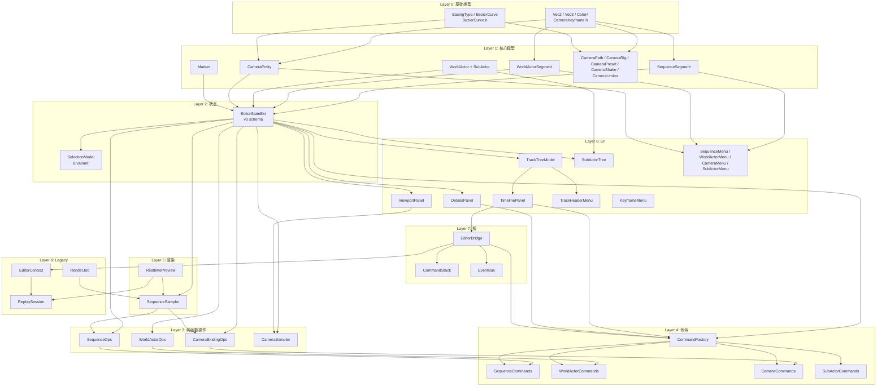
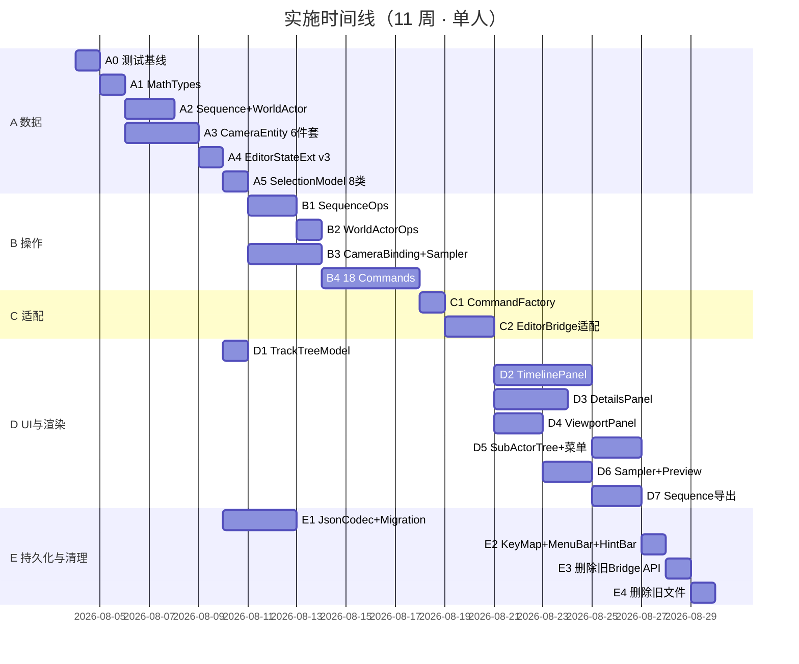

# 10 · 实施计划与模块依赖（3 条一级轨道落地）

> 入口：`src/playback/refactor/`
> 角色：把 [09-video-editing-workflow.md](09-video-editing-workflow.md) 定义的 **"摄像机序列 / 世界Actor / 摄像机" 3 条一级轨道** 落到代码层。**本文是"该改哪里 / 改先后 / 怎么验证"的可执行清单**。
> 数据契约见 [06](06-data-persistence.md)；UI 见 [08](08-sequencer-timeline-ui.md)；操作见 [04](04-video-editing.md)；渲染见 [05](05-render-pipeline.md)；摄影机算法见 [02](02-camera-motion.md)。
> **原则：旧 `Track / Clip / Transition / TrackManager / TransitionEngine / ClipEditor` 全部下线**；新工作流以 `SequenceSegment / WorldActorSegment / CameraEntity / SubActor` 为核心数据结构。

## 一、需求（Requirements）

### 1.1 功能性需求

| ID | 需求 | 优先级 |
|---|---|---|
| IP-1 | **数据模型替换**：`EditorStateExt` 增加 v3 `version / sequence / worldActor / cameras`；最终删除 `videoTracks / cameraTracks / transitions / activeVideoTrackIdx / timeRemap / curves` | P0 |
| IP-2 | **新模型头文件**：`SequenceSegment / WorldActorSegment / CameraEntity / SubActor / WorldActor / CameraPath / CameraRig / CameraPreset / CameraShake / CameraLimiter / TrackTreeModel` | P0 |
| IP-3 | **Selection 替换**：从 5 类（Clip/Keyframe/Marker/Track/Transition）改为 8 类（Sequence/SequenceSeg/WorldActor/WorldActorSeg/SubActor/Camera/Keyframe/Marker） | P0 |
| IP-4 | **新操作命名空间**：`SequenceOps / WorldActorOps / CameraBindingOps / CameraSampler`；旧 `TrackManager / TransitionEngine` 删除 | P0 |
| IP-5 | **新命令集**：`SequenceCommands / WorldActorCommands / CameraCommands / SubActorCommands`；旧 `EditingCommands` 删除 | P0 |
| IP-6 | **新渲染核心**：`SequenceSampler::resolveAt / execute`；旧 `TransitionEngine::planAt` 删除 | P0 |
| IP-7 | **UI 改写**：`TimelinePanel / DetailsPanel / ViewportPanel / TrackHeaderMenu / ClipMenu` 按 3+N 轨重写；新增 `SubActorTree` | P0 |
| IP-8 | **EditorBridge 改写**：删除 `splitClip/deleteClip/trimClip/moveClip/addTransition`；新增 `splitSequence/trimWorldActor/bindCamera/...` 9 个 | P0 |
| IP-9 | **持久化**：`PlaybackMeta.editor` 增 `sequence / worldActor / cameras / subActors` 字段；提供无 editor、v1/v2、v3 与未来版本的确定加载策略 | P0 |
| IP-10 | **可编译**：删除旧结构后 `xmake build playback` 零错 | P0 |
| IP-11 | **可运行**：编辑器启动、旧 `.playback` 文件加载、新文件编辑、撤销重做、导出样片全部通过 | P0 |

### 1.2 非功能性需求

- **变更爆炸半径**：每次提交只动一个模块；先建立可执行的 XMake 测试目标，再要求编译 + 单测通过后合入
- **回归零破坏**：旧 `.playback` 文件（无 editor 节点）必须能加载（自动重建 1 段 sequence + 1 段 worldActor + 空 cameras）
- **接口稳定**：单测断言只面向公共 API，不依赖实现细节
- **依赖收敛**：新模块不引入第三方库；`nlohmann::json` 复用现有依赖

### 1.3 与现有约束对齐

- 复用 `CommandStack`（`src/playback/refactor/editor/CommandStack.h`）做 Undo/Redo
- 复用 `EditorBridge`（`src/playback/refactor/editor/EditorBridge.h`）路由到 Legacy
- 复用 `SelectionModel` 容器（仅替换内部 variant 类型）
- 复用 `KeyMap` / `EventBus` / `ErrorDialog` / `IconSystem`
- 复用 Legacy `EditorContext` / `ReplaySession`；导出阶段允许向 Legacy `RenderJob` 添加受控的 sequence 驱动入口
- 复用 `nlohmann::json` 序列化通道

## 二、架构（Architecture）

### 2.1 新旧对照表

| 类别 | 旧（删除 / 改） | 新（创建） |
|---|---|---|
| 模型 | `TrackKind / Clip / Transition / Track / CameraTrack / TrackDescriptor` | `SequenceSegment / WorldActorSegment / WorldActor / SubActor / CameraEntity / CameraPath / CameraRig / CameraPreset / CameraShake / CameraLimiter` |
| 模型 | `EditorStateExt.videoTracks / cameraTracks / transitions / activeVideoTrackIdx / timeRemap` | `EditorStateExt.version / sequence / worldActor / cameras / activeCameraIndex` |
| 模型 | `Selection = variant<Keyframe/Clip/Marker/Track/Transition>` | `Selection = variant<Sequence/SequenceSeg/WorldActor/WorldActorSeg/SubActor/Camera/Keyframe/Marker>` |
| 操作 | `TrackManager`（单例；add/remove track/clip/transition） | `SequenceOps / WorldActorOps`（命名空间；纯函数；WorldActor 是唯一时间映射器） |
| 操作 | `TransitionEngine::planAt` | `SequenceSampler::resolveAt`（静态 + 状态） |
| 操作 | `ClipEditor` | `CameraBindingOps`（命名空间） |
| 命令 | `EditingCommands`（AddClip/RemoveClip/SplitClip/TrimClip/MoveClip/AddTransition） | `SequenceCommands / WorldActorCommands / CameraCommands / SubActorCommands` |
| 工厂 | `CommandFactory::createSplitClip / createRemoveClip / createTrimClip / createMoveClip / createAddTransition` | `CommandFactory::createSplitSequence / createBindCamera / createAddFreeCamera / createKeyframe ...` |
| Bridge | `EditorBridge::splitClip / deleteClip / trimClip / moveClip / addTransition / addVideoTrack / deleteVideoTrack` | `EditorBridge::splitSequence / trimSequence / bindSequence / setSeqSpeed / splitWorldActor / trimWorldActor / rippleDeleteWorldActor / addFreeCamera / createBindingCamera / addKeyframe / moveKeyframe / setKeyframeEasing / setSubActorDetails` |
| UI 菜单 | `ClipMenu / TrackHeaderMenu`（基于 Track/Clip） | `SequenceMenu / WorldActorMenu / CameraMenu / SubActorMenu`（新）/ `TrackHeaderMenu` 改（无 addTrack） |
| UI 树 | （无） | `SubActorTree`（按 Default/Players/Creatures/Entities 折叠） |

### 2.2 模块依赖图



**依赖方向**（强 → 弱）：
- `基础类型 → 核心模型 → 状态 → 纯函数 → 命令 → 渲染 → UI → 桥 → Legacy`
- 任何下层变动必须先合入，下层未合前上层不能开新 PR

### 2.3 文件变更总表

#### 2.3.1 删除（11 个文件 / 约 1500 行）

```
src/playback/refactor/video-editing/TrackManager.h
src/playback/refactor/video-editing/TrackManager.cpp
src/playback/refactor/video-editing/TransitionEngine.h
src/playback/refactor/video-editing/TransitionEngine.cpp
src/playback/refactor/video-editing/ClipEditor.h
src/playback/refactor/video-editing/ClipEditor.cpp
src/playback/refactor/video-editing/EditingCommands.h
src/playback/refactor/video-editing/EditingCommands.cpp
src/playback/refactor/editor/models/Track.h              ← 移到 Layer 0 仅保留 Color4 + Marker
src/playback/refactor/editor/CommandFactory.h           ← 替换为新工厂
src/playback/refactor/editor/CommandFactory.cpp         ← 替换为新工厂
```

> `BezierCurveEditor.h/.cpp`、`Clipboard.h/.cpp` **保留**（`BezierCurve` 仍被 `CameraKeyframe.easing` 引用）。
> `SelectionModel.h/.cpp` **修改**而非删除（仅替换 variant）。

#### 2.3.2 新增（25 个文件 / 约 3500 行）

**Layer 0**（基础）：
```
src/playback/refactor/editor/models/MathTypes.h          ← Vec2/Vec3/Color4/EasingType（抽离自 CameraKeyframe）
src/playback/refactor/editor/models/BezierCurve.h        ← 独立（不再依赖 Track.h）
```

**Layer 1**（核心模型，9 个）：
```
src/playback/refactor/editor/models/SequenceSegment.h
src/playback/refactor/editor/models/WorldActorSegment.h
src/playback/refactor/editor/models/SubActor.h
src/playback/refactor/editor/models/WorldActor.h
src/playback/refactor/editor/models/CameraEntity.h
src/playback/refactor/editor/models/CameraPath.h
src/playback/refactor/editor/models/CameraRig.h
src/playback/refactor/editor/models/CameraPreset.h
src/playback/refactor/editor/models/CameraShake.h
src/playback/refactor/editor/models/CameraLimiter.h
```

**Layer 2**（状态，2 个修改）：
```
src/playback/refactor/editor/models/EditorStateExt.h    ← 修改（增 sequence/worldActor/cameras；删 videoTracks/cameraTracks/transitions/...）
src/playback/refactor/editor/models/SelectionModel.h    ← 修改（替换 variant）
src/playback/refactor/editor/models/SelectionModel.cpp  ← 修改
```

**Layer 3**（操作，4 个命名空间）：
```
src/playback/refactor/video-editing/SequenceOps.h
src/playback/refactor/video-editing/SequenceOps.cpp
src/playback/refactor/video-editing/WorldActorOps.h
src/playback/refactor/video-editing/WorldActorOps.cpp
src/playback/refactor/video-editing/CameraBindingOps.h
src/playback/refactor/video-editing/CameraBindingOps.cpp
src/playback/refactor/camera-motion/CameraSampler.h
src/playback/refactor/camera-motion/CameraSampler.cpp
```

**Layer 4**（命令，4 个）：
```
src/playback/refactor/video-editing/commands/SequenceCommands.h
src/playback/refactor/video-editing/commands/SequenceCommands.cpp
src/playback/refactor/video-editing/commands/WorldActorCommands.h
src/playback/refactor/video-editing/commands/WorldActorCommands.cpp
src/playback/refactor/video-editing/commands/CameraCommands.h
src/playback/refactor/video-editing/commands/CameraCommands.cpp
src/playback/refactor/video-editing/commands/SubActorCommands.h
src/playback/refactor/video-editing/commands/SubActorCommands.cpp
```

**Layer 5**（渲染，2 个）：
```
src/playback/refactor/render-pipeline/SequenceSampler.h
src/playback/refactor/render-pipeline/SequenceSampler.cpp
src/playback/refactor/render-pipeline/RealtimePreview.h ← 已有；改实现
src/playback/refactor/render-pipeline/RealtimePreview.cpp ← 改
```

**Layer 6**（UI，5 修改 + 1 新增）：
```
src/playback/refactor/editor/panels/TimelinePanel.h/.cpp   ← 修改（3+N 轨）
src/playback/refactor/editor/panels/DetailsPanel.h/.cpp    ← 修改（8 上下文）
src/playback/refactor/editor/panels/ViewportPanel.h/.cpp   ← 修改（默认 sequence 驱动）
src/playback/refactor/editor/contextmenu/TrackHeaderMenu.h/.cpp ← 修改（无 addTrack 入口）
src/playback/refactor/editor/contextmenu/ClipMenu.h/.cpp   ← 改名为 SequenceMenu / WorldActorMenu（保留旧文件并 redirect）
src/playback/refactor/editor/panels/SubActorTree.h         ← 新
src/playback/refactor/editor/panels/SubActorTree.cpp       ← 新
```

**Layer 7**（桥，1 修改）：
```
src/playback/refactor/editor/EditorBridge.h/.cpp   ← 修改（替换 split/trim/addTransition 等）
src/playback/refactor/editor/CommandFactory.h/.cpp ← 替换（旧 API 删，新 API 加）
```

#### 2.3.3 修改（10 个文件 / 约 800 行）

```
src/playback/refactor/editor/CommandStack.h     ← 不变（接口稳定）
src/playback/refactor/editor/KeyMap.cpp         ← 修改（Ctrl+B 改绑 splitSequence 等）
src/playback/refactor/editor/MenuBar.cpp        ← 修改（File 菜单 / Edit 菜单按新命令）
src/playback/refactor/editor/ErrorDialog.cpp    ← 不变（接口稳定）
src/playback/refactor/editor/HintBar.cpp        ← 修改（按 8 上下文显示提示）
src/playback/refactor/editor/models/CameraKeyframe.h ← 修改（不再 include Track.h）
src/playback/refactor/editor/EditorTheme.cpp    ← 不变
src/playback/refactor/editor/IconSystem.cpp     ← 不变
src/playback/refactor/editor/render/EditMode.cpp ← 修改（按新 TimelinePanel / DetailsPanel 调用）
src/playback/refactor/editor/render/RenderMode.cpp ← 不变（仅消费状态）
```

#### 2.3.4 持久化（修改 + 新增 1 个迁移文件）

```
src/playback/functions/record/Recorder.h          ← 修改（PlaybackMeta.editor 改 v3 schema）
src/playback/refactor/data/JsonCodec.h/.cpp       ← 新增（SequenceSegment / CameraEntity / SubActor 序列化）
src/playback/refactor/data/Migration.h/.cpp       ← 新增（v2 → v3 迁移）
```

### 2.4 关键类 / 接口契约

#### 2.4.1 `EditorStateExt`（v3 schema）

```cpp
struct EditorStateExt {
    int version{3};
    int currentTick{};
    int totalTicks{};
    bool playing{};
    float playbackSpeed{1.0f};

    // 顶轨
    std::vector<SequenceSegment> sequence;     // 1..256 段；默认 1 段 [0,totalTicks]
    // 中轨
    WorldActor worldActor;                      // 1 个；内含 segments + subActors
    // 底轨
    std::vector<CameraEntity> cameras;          // 0..16
    int activeCameraIndex{};                    // 详情面板上下文
    // 独立轨
    std::vector<Marker> markers;
    // 性能
    float fps{60.0f};
    size_t memoryUsageBytes{};
};
```

#### 2.4.2 `SequenceOps` 公开 API

```cpp
namespace SequenceOps {
    const SequenceSegment* findSegmentAt(const std::vector<SequenceSegment>&, int tick);
    bool validateCoverage(const std::vector<SequenceSegment>&, int totalTicks);
    std::string splitAt(std::vector<SequenceSegment>&, int atTick);
    bool deleteSegment(std::vector<SequenceSegment>&, size_t index, int totalTicks);
    void trimSegment(std::vector<SequenceSegment>&, const std::string& segId,
                     int newStart, int newEnd);
    void bindCamera(SequenceSegment&, const std::string& cameraId);
    void clearDanglingRefs(std::vector<SequenceSegment>&, const std::string& removedCamId);
}
```

#### 2.4.3 新命令集（18 个）

```cpp
class SplitSequenceAtPlayhead   : public IEditCommand;
class TrimSequenceSegment       : public IEditCommand;
class DeleteSequenceSegment     : public IEditCommand;  // 保持覆盖的 deleteSegment
class BindSequenceToCamera      : public IEditCommand;
class AddFreeCamera             : public IEditCommand;
class DeleteCamera              : public IEditCommand;  // 同时 SequenceOps::clearDanglingRefs
class CreateBindingCamera       : public IEditCommand;  // 选 SubActor → cameras.push + boundCameraIds 追加
class UnbindCamera              : public IEditCommand;
class AddKeyframe               : public IEditCommand;
class MoveKeyframe              : public IEditCommand;
class DeleteKeyframe            : public IEditCommand;
class SetKeyframeEasing         : public IEditCommand;
class SetCameraKind             : public IEditCommand;
class SplitWorldActorAtPlayhead : public IEditCommand;
class TrimWorldActorSegment     : public IEditCommand;
class SetWorldActorSegmentSpeed : public IEditCommand;
class RippleDeleteWorldActorSeg : public IEditCommand;
class SetSubActorDetails        : public IEditCommand;
```

> 总计 **18 个** `IEditCommand` 实现。Undo 栈容量 100（`CommandStack::mMaxSteps`）。

#### 2.4.4 `SequenceSampler`（替换 `TransitionEngine::planAt`）

```cpp
struct ResolvedShot {
    const SequenceSegment* seg;
    const CameraEntity*    cam;
    int                    sourceTick;
};

class SequenceSampler {
public:
    static ResolvedShot resolveAt(const EditorStateExt& e, int timelineTick);
    void execute(const ResolvedShot& shot, RenderContext& ctx, int timelineTick);
};
```

> `resolveAt` 先用 `SequenceOps::findSegmentAt` 决定镜头，再用 `WorldActorOps::mapTimelineToSourceTick` 得到唯一回放源 tick；每帧单调用 `resolveAt` → `execute`，不再有 `secondaryClipId / blendAlpha`。

### 2.5 公共 API 不变清单

为了减少 UI / Bridge 的连锁改动，以下接口**签名保持兼容**，仅内部实现替换：

```cpp
// EditorBridge
class EditorBridge {
    void playPause();    // 不变
    void seek(int);      // 不变
    void skipToStart();  // 不变
    void skipToEnd();    // 不变
    void decreaseSpeed();
    void increaseSpeed();
    void stopReplay();
    void undo(EditorStateExt&);
    void redo(EditorStateExt&);
    [[nodiscard]] bool canUndo() const;
    [[nodiscard]] bool canRedo() const;
    CommandStack& commandStack();
    void initialize(playback::editor::EditorContext*);
    void shutdown();
    void syncState(EditorStateExt&);
    void commitState();
    bool isInitialized() const;
    void ensureInitialData(EditorStateExt&);
};

// CommandStack
class CommandStack {
    void push(std::unique_ptr<IEditCommand>, EditorStateExt&);
    bool undo(EditorStateExt&);
    bool redo(EditorStateExt&);
    void clear();
    std::vector<std::string> undoLabels() const;
    std::vector<std::string> redoLabels() const;
    bool canUndo() const;
    bool canRedo() const;
};

// IEditCommand
class IEditCommand {
    virtual void execute(EditorStateExt&) = 0;
    virtual void undo(EditorStateExt&) = 0;
    virtual std::string label() const = 0;
};
```

## 三、执行（Execution）

### 3.1 任务拆分（5 阶段）

#### 阶段 A：数据基底（Layer 0-2） · 5 步

| # | 任务 | 文件 | 验证 |
|---|---|---|---|
| A0 | 建立模型测试基线 | 新 XMake 测试规则、`tests/refactor/models/` | `xmake test` 可执行，至少能运行空模型测试 |
| A1 | 抽离 `MathTypes` | 新 `editor/models/MathTypes.h`（Vec2/Vec3/Color4/EasingType） | `CameraKeyframe.h` 改 include；`BezierCurve.h` 不依赖 `Track.h` |
| A2 | `SequenceSegment / WorldActorSegment / WorldActor / SubActor` | 4 新头文件 | 编译 + 字段对 [09 §2.2](09-video-editing-workflow.md) |
| A3 | `CameraEntity / CameraPath / CameraRig / CameraPreset / CameraShake / CameraLimiter` | 6 新头文件 | 编译 + 字段对 [02 §2.5-2.10](02-camera-motion.md) |
| A4 | `EditorStateExt` v3 schema | 改 `EditorStateExt.h` | 以新字段为主，旧字段只在兼容层暂留；记录 E4 删除项；编译通过 |
| A5 | `SelectionModel` 8 类 variant | 改 `SelectionModel.h/.cpp` | 新 8 类选择可用；旧选择类型仅在旧 UI 兼容层暂留，随 D 阶段 UI 迁移删除 |

#### 阶段 B：操作 + 命令（Layer 3-4） · 5 步

| # | 任务 | 文件 | 验证 |
|---|---|---|---|
| B1 | `SequenceOps` | 新 `video-editing/SequenceOps.h/.cpp` | 单测：findSegmentAt / splitAt / 保持覆盖的 delete / clearDanglingRefs |
| B2 | `WorldActorOps` | 新 `video-editing/WorldActorOps.h/.cpp` | 单测：split / trim / rippleDelete / `mapTimelineToSourceTick` |
| B3 | `CameraBindingOps` + `CameraSampler` | 新 `video-editing/CameraBindingOps.h/.cpp` + `camera-motion/CameraSampler.h/.cpp` | 单测：同一子Actor创建多台不同视角 Camera / resolveCamera / sampleAt 4 种 kind |
| B4 | 18 个 `IEditCommand` 实现 | 新 `video-editing/commands/{Sequence,WorldActor,Camera,SubActor}Commands.h/.cpp` | 单测：每个命令 `execute → undo → execute` 状态 = 初始 |

#### 阶段 C：命令工厂 + Bridge 适配（Layer 4、7） · 2 步

| # | 任务 | 文件 | 验证 |
|---|---|---|---|
| C1 | `CommandFactory` 新 API | 改 `editor/CommandFactory.h/.cpp` | 编译 + 每个工厂方法单测 |
| C2 | `EditorBridge` 适配层 | 先增新 API，保留旧 API 到清理阶段 | 新 UI 可编译接入；旧 UI 行为不回归 |

#### 阶段 D：UI + 渲染（Layer 5-6） · 7 步

| # | 任务 | 文件 | 验证 |
|---|---|---|---|
| D1 | `TrackTreeModel` | 新 `editor/models/TrackTreeModel.h/.cpp` | 单测：rebuild 后行数 = 2 + cameras.size()；顺序 = Sequence → WorldActor → Cameras |
| D2 | `TimelinePanel` 3+N 轨 | 改 `editor/panels/TimelinePanel.h/.cpp` | 手动：标尺、3 轨、N 摄像机轨、Marker 轨；段 / 关键帧可拖 |
| D3 | `DetailsPanel` 8 上下文 | 改 `editor/panels/DetailsPanel.h/.cpp` | 手动：每种选中刷新对应字段；新增自由/绑定 Camera 按钮可用 |
| D4 | `ViewportPanel` sequence 驱动 | 改 `editor/panels/ViewportPanel.h/.cpp` | 手动：默认预览走 sequence；选中 Camera 时直接用 |
| D5 | `SubActorTree` + 4 个新菜单 | 新 `SubActorTree.h/.cpp` + 改菜单 | 手动：子Actor按类别折叠；右键菜单按条目类型弹出 |
| D6 | `SequenceSampler` + `RealtimePreview` | 新 `render-pipeline/SequenceSampler.h/.cpp`；新建或改造 `RealtimePreview` | 单测：解析 Camera 与 WorldActor 唯一时间映射；手动：拖动刷新 < 50ms |
| D7 | sequence 驱动导出 | 改 Legacy `RenderJob` 受控入口 | 导出按硬切镜头和 WorldActor 映射渲染 |

#### 阶段 E：持久化 + 清理（Layer 7-8） · 4 步

| # | 任务 | 文件 | 验证 |
|---|---|---|---|
| E1 | `JsonCodec` + `Migration` | 新 `refactor/data/JsonCodec.h/.cpp` + `Migration.h/.cpp`；改 `functions/record/Recorder.h` | 单测：无 editor 默认、v1/v2→v3、v3 校验、未来版本拒绝 |
| E2 | `KeyMap` / `MenuBar` / `HintBar` 改快捷键 | 改 `editor/KeyMap.cpp` / `MenuBar.cpp` / `HintBar.cpp` | 手动：Ctrl+B 切 sequence、Ctrl+Shift+B 切 worldActor、Delete 删选中 |
| E3 | 删除旧 Bridge API | 改 `editor/EditorBridge.h/.cpp` | 新 UI 完成接入后，旧 `splitClip / deleteClip / trimClip / moveClip / addTransition` 全删 |
| E4 | 删除旧文件 | 删 `TrackManager / TransitionEngine / ClipEditor / EditingCommands / Track.h` 与旧 video-editing `SelectionModel` | `xmake build playback` 零错；旧类型和引用清零 |

### 3.2 模块依赖顺序（关键路径）



**关键路径**：`A0 → A1 → A2/A3 → A4 → B1/B2/B3 → B4 → C1 → C2 → D2/D3/D4 → D6 → D7 → E4`。
**可并行段**：
- A2 / A3 平行（A1 之后）
- B1 / B2 / B3 平行（A5 之后）
- D1 与阶段 B 并行（只依赖 A4）
- E1 与阶段 B/C/D 并行（只依赖 A4）
- D4 与 D2/D3 并行（只依赖 B3/C2）

### 3.3 关键算法（已在 09/04/02 文档定义，此处列实现位置）

| 算法 | 文件 | 行数预估 |
|---|---|---|
| `findSegmentAt` O(log n) | `SequenceOps.cpp` | 20 |
| `splitAt` | `SequenceOps.cpp` | 30 |
| 保持覆盖的 `deleteSegment` | `SequenceOps.cpp` | 20 |
| `clearDanglingRefs` | `SequenceOps.cpp` | 20 |
| `createBindingCamera` | `CameraBindingOps.cpp` | 30 |
| `mapTimelineToSourceTick` | `WorldActorOps.cpp` | 20 |
| `resolveCamera` (cameraId 空 → cameras[0]) | `CameraBindingOps.cpp` | 10 |
| `sampleAt` 4 kind 聚合 | `CameraSampler.cpp` | 100 |
| `resolveAt` | `SequenceSampler.cpp` | 25 |
| `execute` | `SequenceSampler.cpp` | 40 |
| `TrackTreeModel::rebuild` | `TrackTreeModel.cpp` | 30 |
| `Migration::v2ToV3` | `Migration.cpp` | 50 |

### 3.4 风险与缓解

| 风险 | 缓解 |
|---|---|
| 旧 `.playback` 文件破坏 | 无 editor 重建默认；v1/v2 迁移 v3；v3 校验加载；未知未来版本拒绝；新存档不写旧字段 |
| 18 个命令的 Undo 互逆性 bug | 每个命令必须有"快照 mBefore"模式；B4 单测断言 `undo(execute(s)) == s` |
| 切换时 UI 闪屏（重建 TrackTreeModel） | `rebuild` 仅在 `EditorStateExt` 变更时调；用 dirty flag 缓存 |
| 段/关键帧/Marker 命中错位（坐标系混乱） | 全部统一为 `tick` 整数；不混用 `seconds`；样条/关键帧 easing 转 `tick` |
| 删除 Camera 后 sequence 段引用悬空 | `clearDanglingRefs` 兜底 `cameraId=""`；导出再次兜底 `cameras[0]` |
| 旧 `EditMode` / `RenderMode` 调用旧 API 编译失败 | C2 先提供 Bridge 新 API 适配层；E3 才删除旧 API |
| 旧 UI 上下文菜单残留 | C5 一次性替换 `ClipMenu` 内容为新 4 菜单（保留文件名以减少 include 改动） |

### 3.5 测试用例（关键回归）

| ID | 场景 | 期望 |
|---|---|---|
| IT-1 | 加载旧 v2 `.playback` | `sequence.size()==1`、`cameras.empty()==true`、`worldActor.subActors` 由 Legacy 解析填充 |
| IT-2 | 新建 `.playback` + 添加 1 个摄像机 | `sequence=[1段[0,totalTicks]]`、`cameras=[1台]` |
| IT-3 | 在 playhead 切 sequence | `sequence.size()==2`、`validateCoverage()==true` |
| IT-4 | 删除世界Actor 第 1 段（ripple） | 后续段前移，段间无空隙 |
| IT-5 | 玩家两次创建不同视角绑定 | `cameras.size() += 2`、`subActor.boundCameraIds` 含两个不同 id |
| IT-6 | 删除被 sequence 引用的 Camera | 引用段 `cameraId=""`；导出兜底 `cameras[0]` |
| IT-7 | 18 命令 `execute→undo→execute` 状态等价 | 单测断言 |
| IT-8 | 撤销 100 步 | 不抛异常；`undoLabels().size() == 100` |
| IT-9 | 导出 sample（5s 1080p 60fps） | `timelineTick = start + floor(frame * ticksPerSecond / fps)`；沿 sequence 硬切镜头；FFprobe 检查 frame 数 = 300 |
| IT-10 | 实时预览 30 秒 1080p | 帧率 ≥ 30 FPS；playhead 移动 → 视口 < 50ms |
| IT-11 | 子Actor 树展开 500 个实体 | 首次展开 ≤ 100ms；滚动无卡顿 |
| IT-12 | 旧快捷键 `Ctrl+B` / `Delete` / `Space` 仍可用 | 键盘测试 |
| IT-13 | 字体下限 14px | grep 自绘 `ImGui::Text` / `PushFont` 字号 ≥ 14 |
| IT-14 | 旧 `Track.h` / `TrackManager` 引用全清零 | `rg "TrackKind|Clip\(|Transition\("` 在 refactor 目录 0 命中 |

### 3.6 验收标准

- [ ] A 阶段：测试基础设施已可执行；`xmake build playback` 零错；新头文件全部存在；旧字段仅在兼容层保留并有明确删除清单
- [ ] B 阶段：18 个命令单测全过；`CommandFactory` 编译；BezierCurve 单测保持
- [ ] C 阶段：手动验证 8 上下文 + 4 菜单 + SubActor 树；`TrackTreeModel` 单测行数断言
- [ ] D 阶段：`SequenceSampler` 单测；导出 5s 样片 frame 数正确；预览 ≥ 30 FPS
- [ ] E 阶段：`EditorBridge` 旧 API 0 引用；完整加载策略单测；旧文件删除后 `xmake build` 零错
- [ ] 端到端：旧 `.playback` 加载 → 编辑 → 保存 → 重开 → 导出样片 → 与原视频一致

### 3.7 验证命令原则

测试基础设施在 A0 落地前，仓库只将 `xmake build playback` 作为真实可执行验证。A0 完成后，所有后续阶段统一使用其新增的 XMake 测试入口；文档不预设当前仓库尚不存在的 target 名称。

## 四、模块关系

### 被谁调用（上游）

- **`panels/TimelinePanel`**：依赖 `EditorStateExt / TrackTreeModel / CommandFactory / EditorBridge`
- **`panels/DetailsPanel`**：依赖 `EditorStateExt / SelectionModel / CommandFactory`
- **`panels/ViewportPanel`**：依赖 `CameraSampler / ReplaySession`
- **`panels/SubActorTree`**：依赖 `EditorStateExt.worldActor.subActors`
- **`contextmenu/*`**：依赖 `CommandFactory`
- **`EditorBridge`**：依赖 `CommandStack / CommandFactory / EditorContext`
- **`SequenceSampler`**：被 `RenderJob` + `RealtimePreview` 调用
- **`RealtimePreview`**：被 `EditMode` / `RenderMode` 调用
- **`CameraSampler`**：被 `ViewportPanel` + `SequenceSampler::execute` 调用

### 调用谁（下游）

- **`EditorStateExt` / `SequenceSegment` / `WorldActor` / `CameraEntity`**：被所有上层模块读
- **`CommandStack`**：包装所有 `IEditCommand` 实现
- **`EditorContext`**（Legacy）：通过 `EditorBridge::submitAction` 路由
- **`ReplaySession`**（Legacy）：通过 `EditorBridge::seek / playPause` 路由
- **`PlaybackMeta.editor`**（持久化）：由 `JsonCodec` 序列化

### 共享数据

- `EditorStateExt.sequence`：UI ↔ 渲染
- `EditorStateExt.worldActor`：UI ↔ 渲染
- `EditorStateExt.cameras`：UI ↔ 渲染
- `EditorStateExt.activeCameraIndex`：gizmo / Details 上下文
- `SelectionModel::mSelection`：Details / Timeline 共享

### 事件订阅 / 发送

- `CommandStack.onPushed/onUndo/onRedo` → `StatusPanel`
- `EditorBridge.onWorldActorChanged` → `ViewportPanel`（重置预览源）
- `TrackTreeModel.onRebuilt` → `TimelinePanel`
- `SelectionModel.onChanged` → `DetailsPanel`

## 五、阅读顺序

1. 本文件（落地路径 + 依赖 + 顺序）
2. [09-video-editing-workflow.md](09-video-editing-workflow.md) — 工作流权威
3. [06-data-persistence.md](06-data-persistence.md) — 数据 schema
4. [04-video-editing.md](04-video-editing.md) — 18 个命令的语义
5. [08-sequencer-timeline-ui.md](08-sequencer-timeline-ui.md) — UI 布局
6. [05-render-pipeline.md](05-render-pipeline.md) — 渲染消费
7. [02-camera-motion.md](02-camera-motion.md) — 摄影机采样
8. [01-editor-architecture.md](01-editor-architecture.md) — 编辑器骨架
9. [07-link-assembly.md](07-link-assembly.md) — 装配桥

## 六、变更日志

| 版本 | 日期 | 内容 |
|---|---|---|
| v1 | 2026-08-02 | 初版（基于 09 工作流） |
| v2 | 2026-08-02 | 明确仅硬切、WorldActor 唯一时间映射、多视角绑定、版本迁移与可执行阶段依赖 |
