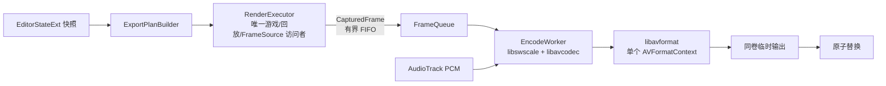
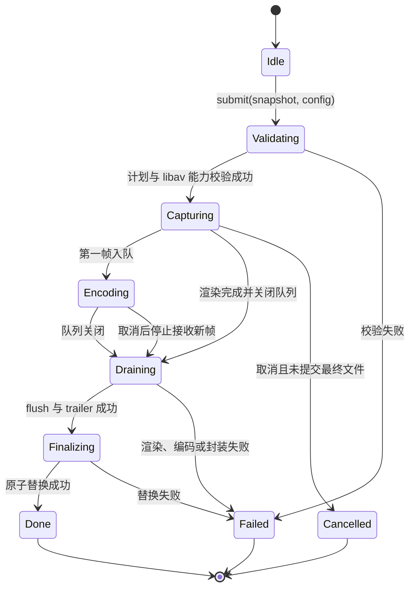

# 11 · 导出视频链路架构（内置 FFmpeg libav API）

> 入口：`src/playback/refactor/export-pipeline/`
> 角色：把 [09-video-editing-workflow.md](09-video-editing-workflow.md) 定义的“沿摄像机序列采集世界Actor”落地为单一、可取消、可诊断的视频导出链路。
> 本文是导出链路的单一权威。已确认方案为：**GPL 静态链接内置 FFmpeg，直接调用 libav API；游戏/回放/抓帧只由单渲染执行器串行访问；压缩、复用和封装在异步编码线程执行。**

## 一、需求（Requirements）

### 1.1 功能性需求

| ID | 需求 | 优先级 |
|---|---|---|
| EX-1 | 适配三轨工作流：导出由 `EditorStateExt.sequence` 决定镜头与硬切，`worldActor` 决定时间轴到回放源 tick 的映射，`cameras` 提供采样参数 | P0 |
| EX-2 | 使用静态链接的 FFmpeg libav API：`libavcodec`、`libavformat`、`libavutil`、`libswscale`；不启动 ffmpeg 可执行文件、不使用命名管道或 concat demuxer | P0 |
| EX-3 | **单渲染执行器**是唯一可调用 `ReplaySession`、`CameraSystem::applyToMCBE`、`FrameSource` 和 D3D12 抓帧的执行上下文；帧严格按时间轴顺序生成 | P0 |
| EX-4 | **异步编码**：渲染执行器将已捕获帧提交至有界队列；编码线程完成像素转换、`avcodec_send_frame` / `receive_packet` 与封装 | P0 |
| EX-5 | 以单个编码上下文完成全片编码，序列段边界通过同一输入帧流自然形成硬切；不得为段边界并发渲染或创建多个编码器 | P0 |
| EX-6 | 支持 MP4（H.264/H.265）、MOV（ProRes）、WebM（VP9）、MKV、PNG 序列；GIF 为后续可选能力 | P0 |
| EX-7 | 复用 `AudioTrack` 的 48 kHz、双声道 PCM 语义；视频和音频由同一个 `AVFormatContext` 写入最终容器 | P0 |
| EX-8 | 提供校验、进度、软取消、失败诊断与临时文件原子提交 | P0 |
| EX-9 | 可复用相同的导出计划结果缓存；恢复粒度为“重新编码整个导出”，不承诺按镜头段并行或中间视频断点续传 | P1 |
| EX-10 | UI 展示“采集帧 / 编码封装 / 收尾”阶段，以及采集与编码各自的帧进度、队列深度和 ETA | P0 |

### 1.2 非功能性需求

- **正确性优先**：同一时刻只能有一个导出帧在改变回放状态、应用摄像机或读取交换链；不得将这些对象交给编码线程或多个 worker。
- **背压受控**：队列以字节数和帧数双重限制；编码跟不上时渲染执行器等待可用槽位，不无界堆积 CPU 帧。
- **响应性**：渲染执行器在安全点处理 UI/取消请求；编码、封装和色彩转换不阻塞游戏渲染钩子的职责边界。
- **一致时间基**：导出帧 PTS 使用 `frameIndex`，视频 time base 为 `{1, fps}`；音频 PTS 使用样本数，time base 为 `{1, sampleRate}`。
- **原子输出**：先写入与目标文件同卷的唯一临时路径；仅在 `av_write_trailer` 成功、文件关闭成功后替换最终文件。
- **可观测性**：每次失败记录 FFmpeg 错误码及 `av_strerror` 文本、导出计划、当前 timeline/source tick、摄像机 ID、编码器参数和队列状态；不写入回放内容或用户敏感路径以外的内容。

### 1.3 合规边界

本模块明确采用 **GPL 静态链接** 构建产物。该决策不是运行时可选项，而是产品分发约束。

| 范围 | 必须执行 |
|---|---|
| FFmpeg 构建 | 使用与目标架构、运行库一致的 GPL 配置静态库；纳入 `libavcodec`、`libavformat`、`libavutil`、`libswscale` 及其实际启用的依赖 |
| 产物许可 | 分发含静态 FFmpeg 的模组/二进制时，整体以 GPL 兼容方式发布；随发行物提供 GPL 文本、FFmpeg 版权与许可证声明 |
| 对应源代码 | 为该二进制提供完整、可构建的对应源代码：本项目源代码、构建脚本、FFmpeg 精确版本/补丁/配置及获取或重建说明 |
| 第三方审计 | 发布前核对 FFmpeg `configure` 输出、静态依赖的许可证和项目自身依赖兼容性；不以“动态加载”“可替换 DLL”规避静态链接义务 |
| 文案 | 设置页、导出页与发行说明标明“内置 FFmpeg（GPL）”；不得写成外部工具或 LGPL-only 方案 |

> `libx264`、`libx265` 等 GPL 编码器若被启用，必须同样进入许可证清单和可复现构建记录。编码器可用性由构建矩阵决定，不在运行时假设系统安装任意外部编解码器。

### 1.4 与既有模块的关系

- 复用 [09](09-video-editing-workflow.md) 的 `sequence`、`worldActor`、`cameras` 及 `WorldActorOps::mapTimelineToSourceTick`。
- 复用 [02-camera-motion.md](02-camera-motion.md) 的 `CameraSystem::sampleAt` 与摄像机数据模型。
- 复用 [05-render-pipeline.md](05-render-pipeline.md) 的逐帧采样语义，但本模块定义导出的执行、编码和封装边界。
- `ExportConfig`、平台预设和 `AudioTrack` 保留为领域配置/音频来源；旧 `FFmpegProcess`、`NamedPipe`、外部 ffmpeg 命令拼装及分段 concat 不能作为新链路依赖。

## 二、架构（Architecture）

### 2.1 为什么必须是“单渲染执行器 + 异步编码”

回放世界、相机应用、MCBE tick、D3D12 交换链与 `FrameSource` 都是共享且具有线程亲和性的状态。将不同 `SequenceSegment` 分配给多个 worker，会同时 seek 同一个回放、覆盖同一台游戏摄像机、争用同一渲染设备；即使每段输出到独立文件，也无法保证画面对应正确的 source tick 或摄像机。

因此并发边界按资源性质划分，而不是按镜头段划分：

| 工作 | 执行模型 | 原因 |
|---|---|---|
| 解析序列、映射 source tick、seek/tick 回放、采样/应用 Camera、等待 Present、GPU→CPU 抓帧 | 单渲染执行器，严格顺序 | 访问单一游戏与 GPU 上下文 |
| BGRA/RGBA → YUV、`AVFrame` 填充、视频压缩、PCM 音频编码、`av_interleaved_write_frame` | 一个异步编码线程 | CPU 密集，且单 `AVCodecContext` / `AVFormatContext` 的写入顺序必须串行 |
| UI 进度快照、取消信号、计划构建、缓存查询 | 协调线程或无锁快照 | 不持有渲染或 FFmpeg 编码上下文 |

“异步”不表示多个视频编码器并发写同一部影片。首版每个导出 Job 恰有一个视频编码器、一个音频编码器（若启用）和一个封装上下文，编码线程是它们的唯一所有者。

### 2.2 总体数据流



帧顺序规则：`RenderExecutor` 只递增 `frameIndex`；`FrameQueue` 是 FIFO；`EncodeWorker` 只按 FIFO 取帧并以 `frameIndex` 生成 PTS。取消、出错或正常结束均由生产端关闭队列，编码端排空已入队帧后 flush 编码器与封装器，失败时删除临时输出。

### 2.3 模块结构

```text
refactor/export-pipeline/
├── ExportOrchestrator.{h,cpp}  ← Job 状态机、线程生命周期、取消与进度
├── ExportPlan.{h,cpp}          ← 对 EditorStateExt 的不可变快照、逐帧采样计划
├── ExportValidator.{h,cpp}     ← 三轨覆盖、Camera 解析、输出/磁盘检查
├── RenderExecutor.{h,cpp}      ← 唯一访问 ReplaySession/CameraSystem/FrameSource
├── FrameQueue.{h,cpp}          ← 有界 FIFO、背压、关闭与错误传播
├── CapturedFrame.{h,cpp}       ← 帧序号、BGRA 数据、尺寸、timeline/source tick 元数据
├── LibavEncoder.{h,cpp}        ← AVCodecContext、SwsContext、AVFrame、flush
├── LibavMuxer.{h,cpp}          ← AVFormatContext、流创建、写包、trailer
├── AudioEncodeSource.{h,cpp}   ← AudioTrack PCM → AVFrame/音频 PTS
├── ExportDiagnostics.{h,cpp}   ← 结构化失败报告
├── ExportCache.{h,cpp}         ← 完整计划键的最终结果缓存
├── FfmpegBuildInfo.{h,cpp}     ← 编译期 FFmpeg 版本、配置与许可证展示
└── ExportCommand.{h,cpp}       ← start/cancel/status 命令适配
```

### 2.4 核心数据模型

```cpp
struct ExportFramePlan {
    int64_t     frameIndex;
    int         timelineTick;
    int         sourceTick;
    std::string sequenceSegmentId;
    std::string worldActorSegmentId;
    std::string cameraId;
};

struct ExportPlan {
    std::string                     planId;
    EditorStateExt                  editorSnapshot;
    ExportConfig                    config;
    std::vector<ExportFramePlan>    frames;
    std::filesystem::path           outputPath;
    std::filesystem::path           temporaryPath;
    std::string                     cacheKey;
};

struct CapturedFrame {
    int64_t              frameIndex;
    int                  timelineTick;
    int                  sourceTick;
    int                  width;
    int                  height;
    int                  rowPitch;
    std::vector<uint8_t> bgra;
};

enum class ExportStage {
    Idle,
    Validating,
    Capturing,
    Encoding,
    Draining,
    Finalizing,
    Done,
    Failed,
    Cancelled,
};

struct ExportProgress {
    ExportStage stage{ExportStage::Idle};
    int64_t capturedFrames{};
    int64_t encodedFrames{};
    int64_t totalFrames{};
    size_t  queuedFrames{};
    size_t  queuedBytes{};
    float   captureFps{};
    float   encodeFps{};
    float   etaSec{};
    std::string lastError;
};
```

`ExportPlan` 必须在任务提交时深拷贝或序列化冻结，渲染期间不读可变编辑器状态。用户之后的 Undo/Redo、修改段速率或删 Camera 不会改变正在导出的画面；UI 应提示“编辑不会影响当前导出，重新提交后生效”。

### 2.5 计划构建与工作流适配

每个输出帧均按照 [09 §2.7](09-video-editing-workflow.md) 的同一语义解析：

```cpp
ExportFramePlan ExportPlanBuilder::makeFrame(
    const EditorStateExt& editor,
    int64_t frameIndex,
    const ExportConfig& config)
{
    const int timelineTick = config.startTick
        + static_cast<int>((frameIndex * 20) / config.fps);
    const auto& sequence = SequenceOps::findAt(editor.sequence, timelineTick);
    const auto& world = WorldActorOps::findAt(editor.worldActor.segments, timelineTick);
    const auto& camera = CameraBindingOps::resolveCamera(editor.cameras, sequence.cameraId);

    return {
        .frameIndex = frameIndex,
        .timelineTick = timelineTick,
        .sourceTick = WorldActorOps::mapTimelineToSourceTick(editor.worldActor, timelineTick),
        .sequenceSegmentId = sequence.id,
        .worldActorSegmentId = world.id,
        .cameraId = camera.id,
    };
}
```

- `SequenceSegment` 只决定使用哪台 Camera；它不拥有 `sourceTick` 或 `speed`。
- `WorldActorSegment` 是唯一时间映射器：`sourceTick + floor((timelineTick - startTick) * speed)`。
- `cameraId` 为空时使用 `cameras[0]`；若摄像机列表为空，校验失败并在进入渲染前返回明确错误。
- 序列和 WorldActor 段必须覆盖导出范围且无空隙/重叠；未覆盖、Camera ID 不存在或输出帧数为零均不可启动 Job。
- 序列边界是硬切语义，不强制 GOP/I 帧边界。编码器可按目标质量、码率和容器要求决定关键帧；若产品将来需要“可独立编辑的镜头边界”，再以明确的 `forceIdrAtSegmentBoundary` 选项实现，不能借此恢复分段并行渲染。

### 2.6 RenderExecutor：唯一渲染访问者

```cpp
class RenderExecutor {
public:
    RenderResult run(
        const ExportPlan& plan,
        FrameQueue& queue,
        std::stop_token stopToken
    );

private:
    CapturedFrame capture(const ExportFramePlan& frame);
};

CapturedFrame RenderExecutor::capture(const ExportFramePlan& frame) {
    mReplaySession.requestSeek(frame.sourceTick);
    mReplaySession.tick();

    const auto& camera = findCamera(mPlan.editorSnapshot.cameras, frame.cameraId);
    const CameraSample sample = CameraSystem::getInstance().sampleAt(
        &camera, frame.sourceTick, mReplaySession
    );
    CameraSystem::applyToMCBE(sample);

    mFrameSource.waitForFrame();
    return mFrameSource.captureBgra(frame.frameIndex, frame.timelineTick, frame.sourceTick);
}
```

实现要求：

1. `RenderExecutor` 运行在已定义的游戏渲染安全点/线程，不能由普通后台线程直接驱动 D3D12 或 MCBE。
2. `captureBgra` 完成 GPU copy、fence 等待和 CPU staging 拷贝后才返回；`CapturedFrame` 不持有可在下一帧被复用的 GPU 映射指针。
3. 一旦 `FrameQueue::push` 因背压阻塞，执行器仅等待队列条件变量或处理取消；不生成下一帧、不改变回放状态。
4. `RenderExecutor` 不调用任何 `avcodec_*` 或 `avformat_*` 接口。

### 2.7 FrameQueue：有界队列与背压

```cpp
class FrameQueue {
public:
    bool push(CapturedFrame frame, std::stop_token stopToken);
    std::optional<CapturedFrame> pop(std::stop_token stopToken);
    void close();
    void fail(std::string error);

private:
    size_t mMaxFrames{4};
    size_t mMaxBytes{};
    size_t mQueuedBytes{};
    std::deque<CapturedFrame> mFrames;
    bool mClosed{};
    std::optional<std::string> mFailure;
    std::mutex mMutex;
    std::condition_variable_any mNotEmpty;
    std::condition_variable_any mNotFull;
};
```

- 默认容量按分辨率计算，并限制在 2–4 帧：`maxBytes = min(512 MiB, max(2 * frameBytes, configuredLimit))`。4K BGRA 单帧约 31.6 MiB，不能采用“CPU 核数减二”的帧/worker 公式。
- `push` 等待“有空间 / 队列已失败 / 已取消”；`pop` 等待“有数据 / 队列关闭 / 已失败 / 已取消”。所有等待均使用谓词，避免虚假唤醒。
- 编码失败调用 `fail` 唤醒渲染执行器；渲染失败调用 `close`，编码器排空此前成功入队的帧后由 Job 统一判定失败并清理临时文件。
- 队列只传递已拥有的数据，不跨线程共享 `ReplaySession`、`CameraEntity` 指针、D3D12 资源或 `AVFrame`。

### 2.8 LibavEncoder 与 LibavMuxer

`EncodeWorker` 独占所有 FFmpeg 对象的创建、调用和销毁：`AVFormatContext`、`AVCodecContext`、`AVStream`、`SwsContext`、`AVFrame`、`AVPacket` 与音频重采样状态。不得由渲染执行器写包、不得在多个编码线程间共享同一上下文。

```cpp
class LibavEncoder {
public:
    bool open(const ExportConfig& config, const std::filesystem::path& temporaryPath);
    bool encodeVideo(const CapturedFrame& captured);
    bool encodeAudio(AudioTrack& source);
    bool drain();
    bool finalize();
    [[nodiscard]] std::string lastError() const;
};

bool LibavEncoder::encodeVideo(const CapturedFrame& captured) {
    fillBgraFrame(captured);
    sws_scale(mSws, mBgraFrame->data, mBgraFrame->linesize, 0,
              captured.height, mVideoFrame->data, mVideoFrame->linesize);
    mVideoFrame->pts = captured.frameIndex;

    check(avcodec_send_frame(mVideoCodec.get(), mVideoFrame.get()));
    while (receivePacketAndMux()) {}
    return true;
}
```

编码与封装规则：

- 视频编码器和像素格式由**已链接并已注册的构建能力**和 `ExportConfig` 的容器约束协商；H.264/H.265/VP9/ProRes/PNG 不以外部二进制探测为前提。
- 使用 `avcodec_find_encoder`/`avcodec_find_encoder_by_name` 选择可用编码器，使用 `avcodec_get_supported_config`（或与所固定 FFmpeg 版本等价的兼容封装）选择 `pix_fmt`、帧率和采样率；协商失败要在写文件前终止。
- 设置视频 `AVCodecContext::time_base = {1, fps}`，并在写包前用 `av_packet_rescale_ts` 从 codec time base 转换到 stream time base。
- `AVFormatContext` 由 `avformat_alloc_output_context2` 创建；依次创建流、`avio_open`、`avformat_write_header`、写包、`av_write_trailer`。所有错误码必须保留。
- 转换使用 `libswscale`；颜色范围、色彩原色、传输和矩阵从 `ExportConfig` 显式设置，不依赖播放器猜测。默认 8-bit SDR 输出采用目标编码器支持的 `yuv420p`。
- 音频从 `AudioTrack` 顺序读取；必要时以 `libswresample` 转换为编码器采样格式。编码线程按音频样本数推进 PTS，并通过 `av_compare_ts` 或等价逻辑交错写入音视频包。
- 正常结束时先向视频/音频编码器发送 `nullptr` flush，再持续 `receive_packet` 至 `AVERROR_EOF`，最后调用 `av_write_trailer`。取消后不把不完整容器提升为最终文件。

### 2.9 Job 状态机、取消与错误传播



- `cancel()` 设置 `std::stop_source`，同时唤醒队列的生产/消费等待。它不从其他线程调用 FFmpeg 上下文销毁函数。
- 渲染执行器在每个帧前、等待抓帧后、队列入队前检查停止请求；编码线程在取帧前和音频读取边界检查停止请求。
- 第一处致命错误写入 `JobError`（阶段、错误码、文本、关联帧），关闭/失败队列并请求停止；`ExportOrchestrator` 是唯一负责 join 两个执行单元、释放资源和更新最终状态的对象。
- 取消、异常退出、`av_write_trailer` 失败或原子替换失败均删除临时输出；仅保留显式诊断文件。最终结果缓存只记录成功且已提交的文件。

### 2.10 缓存、恢复与资源策略

缓存键至少包含：导出范围、fps、分辨率、容器/编码器/码率/颜色配置、完整的 `sequence`、`worldActor`、`cameras`、回放标识和版本、FFmpeg 构建标识。命中时验证最终文件存在、大小非零且元数据匹配后才能复用。

本方案**不采用**镜头段中间视频，也不提供“段级 ffmpeg stderr”“段级重试”“concat list”或“每段独立编码器”。失败或取消后的可靠恢复是重新执行整个 Job；缓存只面向完整、已成功提交的导出结果。这样避免把不可并发的游戏状态错误包装成看似可恢复的分段任务。

开始前检查：

1. 输出目录可创建且与临时文件在同一卷；
2. 可用空间至少覆盖保守的队列、容器开销和配置预估，空间不足立即拒绝；
3. 当前 FFmpeg 构建支持容器、视频编码器及音频编码器；
4. 时间轴覆盖、Camera 绑定与 WorldActor 映射均通过验证；
5. 任意时刻至多一个活动导出 Job，防止两个 Job 竞争同一游戏渲染上下文。

### 2.11 失败诊断

失败报告写至输出目录旁的 `export-failed-<planId>.json`，字段包括：

```json
{
  "planId": "...",
  "stage": "Encoding",
  "frameIndex": 1482,
  "timelineTick": 494,
  "sourceTick": 901,
  "sequenceSegmentId": "...",
  "worldActorSegmentId": "...",
  "cameraId": "...",
  "ffmpeg": {
    "version": "...",
    "configuration": "...",
    "operation": "avcodec_send_frame",
    "errorCode": -22,
    "error": "Invalid argument"
  },
  "queue": { "frames": 2, "bytes": 66355200 },
  "config": { "width": 1920, "height": 1080, "fps": 60 }
}
```

诊断中不保存原始帧、回放数据、完整用户目录或密钥。UI 展示可操作摘要，并提供诊断文件路径。

## 三、执行（Execution）

### 3.1 实施顺序

| 步骤 | 模块 | 内容 | 验证 |
|---|---|---|---|
| 1 | `FfmpegBuildInfo` 与构建脚本 | 固定 GPL 静态 FFmpeg 8.1.2、配置、依赖和许可证随附规则（执行入口见 `scripts/build-ffmpeg/build-ffmpeg.ps1`，版本清单见 `scripts/build-ffmpeg/versions.txt`） | 干净环境可重建；发行物许可证清单审计 |
| 2 | `ExportPlan` / `ExportValidator` | 从三轨不可变快照建立逐帧计划并校验 | 单测：Camera 兜底、变速 WorldActor、覆盖缺口、空 Camera |
| 3 | `FrameQueue` | 有界 FIFO、背压、close/fail/cancel | 单测：顺序、容量、唤醒、失败传播 |
| 4 | `RenderExecutor` | 在渲染安全点逐帧 seek、采样、抓帧 | 集成：不同序列段按顺序切镜头，source tick 正确 |
| 5 | `LibavEncoder` / `LibavMuxer` | 视频转换、编码、音频编码、封装、flush | 集成：各目标容器可被 ffprobe/播放器读取 |
| 6 | `ExportOrchestrator` | 生命周期、唯一活动 Job、进度、取消、临时提交 | 单测：状态转换；集成：取消不产生正式文件 |
| 7 | `ExportDiagnostics` / `ExportCache` | 失败报告、完整结果缓存 | 单测：缓存键失效与诊断字段 |
| 8 | `ExportPanel` / 命令入口 | 预设、GPL 声明、阶段化进度和错误呈现 | 手动：导出、取消、缓存命中 |

### 3.2 关键不变量

1. 一个活动导出 Job 只有一个 `RenderExecutor`，且它是唯一可改变回放/摄像机/FrameSource 状态的执行单元。
2. 一个 Job 只有一个 `LibavEncoder` 所有者线程；所有 `AVCodecContext` 和 `AVFormatContext` 调用在该线程串行发生。
3. 输出帧严格按 `frameIndex` 递增；PTS 不由墙钟、渲染耗时或段编号推导。
4. `WorldActorOps::mapTimelineToSourceTick` 是唯一 source tick 映射；Sequence 段不得复制或修正该映射。
5. 队列满时停止推进回放和抓取下一帧；队列错误/取消必须唤醒所有等待者。
6. 只有 `av_write_trailer` 和文件关闭成功后才能原子提交最终文件。
7. 任何静态链接 FFmpeg 的可分发构建均附带 GPL 义务所需的许可与对应源代码，不存在“无 GPL 的运行时回退”。

### 3.3 测试矩阵

| ID | 用例 | 期望 |
|---|---|---|
| EX-T1 | 两个 SequenceSegment 绑定不同 Camera | 单一编码流中按边界硬切，帧序和 PTS 连续 |
| EX-T2 | WorldActor 两段且第二段 `speed=2.0` | 画面 source tick 完全由映射函数决定，输出帧率不变 |
| EX-T3 | 段未绑定 Camera、列表存在 Camera | 使用第 1 台 Camera 并产生 UI 警告 |
| EX-T4 | 无任何 Camera | 校验失败，未创建正式输出 |
| EX-T5 | 编码慢于抓帧 | 队列达到上限后抓帧暂停；内存不超过配置上限 |
| EX-T6 | 编码器故意返回错误 | 渲染端被唤醒并停止；输出临时文件清理；报告含 FFmpeg 错误 |
| EX-T7 | 渲染阶段取消 | 不再 seek/抓下一帧；线程收敛；无最终文件 |
| EX-T8 | 编码阶段取消 | 不接收新帧，安全释放 libav 对象；无最终文件 |
| EX-T9 | MP4、MOV、WebM、MKV、PNG 序列 | 每种已启用格式的产物可解析，音视频时长与预期一致 |
| EX-T10 | 含 PCM 音频导出 | 音视频 PTS 单调，容器可正常播放且无明显漂移 |
| EX-T11 | 编辑中修改序列/Camera | 当前输出仍使用提交时快照；下次提交使用新状态 |
| EX-T12 | 同计划第二次导出 | 校验缓存元数据后复用完整成功文件 |
| EX-T13 | 两个导出请求重叠 | 第二个请求排队或明确拒绝，绝不并发驱动游戏渲染上下文 |
| EX-T14 | 发行包合规审计 | 存在 GPL 文本、FFmpeg 版权/配置、对应源码与重建说明 |

### 3.4 迁移与清理

1. 增加静态 FFmpeg 构建与 `LibavEncoder`，以最小 MP4/H.264 视频导出验证链接、封装与许可证交付。
2. 将导出帧循环接入 `RenderExecutor`，确保它在现有 D3D12/游戏渲染安全点运行。
3. 用 `FrameQueue` 连接渲染和编码，接入 `AudioTrack`，再实现取消、进度与诊断。
4. 将 UI 与命令入口切换到 `ExportOrchestrator`；保留 `ExportConfig`/预设数据模型，但移除外部 ffmpeg 命令展示和硬件外部探测文案。
5. 删除或标记废弃的 `SegmentWorker`、`PerSegmentFFmpeg`、`ConcatStage`、`AudioMuxStage`、`NamedPipe` 导出路径和段级中间缓存；它们不得继续作为新导出的回退路径。

## 四、模块关系

### 上游

- `ExportPanel` 与 `playback export start`：创建 `EditorStateExt` 快照与 `ExportConfig` 并提交 Job。
- `StatusPanel` / `TimelinePanel`：订阅节流后的 `ExportProgress`，展示采集、编码和队列状态。
- 模组卸载：请求取消并在渲染安全点完成 Job 收敛；无法安全收敛时阻止卸载完成，而非强行析构 D3D12/FFmpeg 对象。

### 下游

- [09-video-editing-workflow.md](09-video-editing-workflow.md)：`SequenceSegment`、`WorldActorSegment`、`CameraEntity` 和时间映射语义。
- [02-camera-motion.md](02-camera-motion.md)：Camera 采样与应用。
- `ReplaySession`、`FrameSource`：只由 `RenderExecutor` 使用。
- `AudioTrack`：只由编码线程的音频来源适配层读取。
- 静态 FFmpeg libav：只由 `LibavEncoder` / `LibavMuxer` 使用。

## 五、废弃设计

下列内容与本方案冲突，不能在新实现中保留为主路径或“性能优化”：

| 废弃项 | 原因 | 替代 |
|---|---|---|
| 外部 `ffmpeg` 子进程、`FFmpegProcess` | 已确认使用内置静态 libav API；外部进程增加部署和诊断边界 | `LibavEncoder` / `LibavMuxer` |
| Windows 命名管道、`pipe:0` rawvideo 输入 | 无外部进程，不需要跨进程传帧 | 进程内 `FrameQueue` |
| `SegmentWorkerPool`、按镜头段并行渲染 | 会并发访问同一个回放、Camera 和 D3D12 上下文，画面不正确 | 单 `RenderExecutor` |
| 中间段视频、concat demuxer、每段 GOP=1 | 不需要且磁盘/编码开销高；不能解决共享渲染状态 | 单编码流、可选边界 IDR 策略 |
| 段级断点续传和段级 ffmpeg stderr | 建立在错误的分段并行模型上 | 完整 Job 缓存与帧级结构化诊断 |
| “仅替换 ffmpeg binary 即可升级” | 静态链接升级必须重新构建并重新做许可证/依赖审计 | 固定版本、可复现构建与发行审计 |

## 六、阅读顺序

1. 本文：导出执行、并发与 GPL 合规权威。
2. [09-video-editing-workflow.md](09-video-editing-workflow.md)：三轨工作流与导出语义。
3. [05-render-pipeline.md](05-render-pipeline.md)：逐帧采样和渲染安全点。
4. [02-camera-motion.md](02-camera-motion.md)：Camera 采样。
5. [06-data-persistence.md](06-data-persistence.md)：`EditorStateExt` 持久化与版本迁移。
