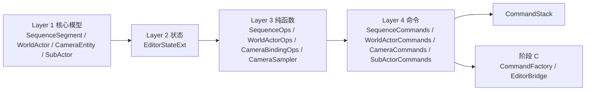
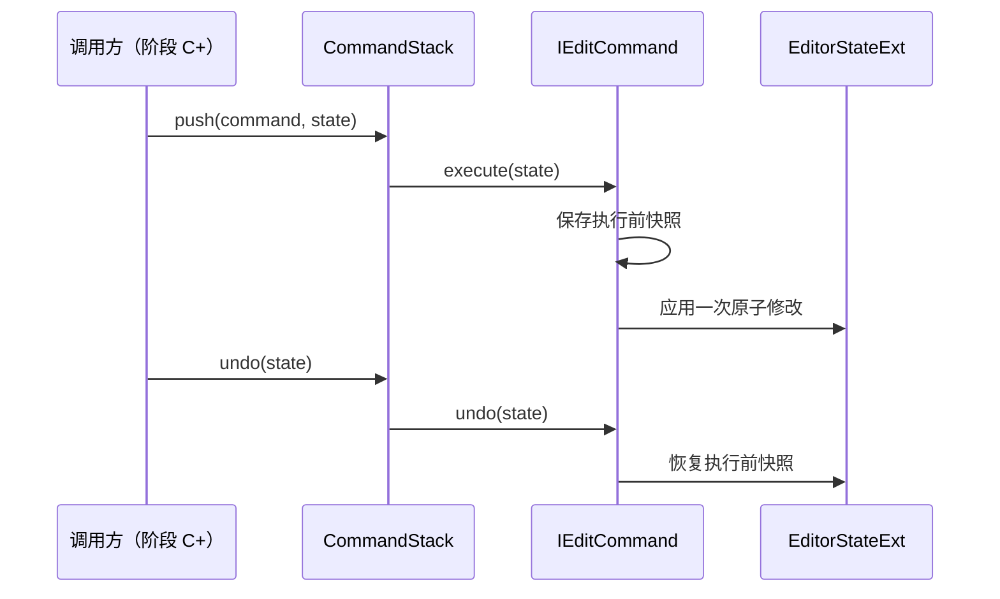

# 12 · 阶段 B：操作与命令（Layer 3–4）

> 入口：`src/playback/refactor/video-editing/`、`src/playback/refactor/camera-motion/`
> 角色：为 [09-video-editing-workflow.md](09-video-editing-workflow.md) 的 **摄像机序列 / 世界Actor / 摄像机** 三条一级轨道提供无 UI 依赖的业务操作，以及可撤销、可重做的编辑命令。
> 范围：严格承接 [10 §3.1 阶段 B](10-implementation-plan.md#L450-L458) 的 B1–B4；不负责 `CommandFactory`、`EditorBridge`、UI、预览装配、导出和持久化。
> 前置：阶段 A 已提供 v3 `EditorStateExt`、`SequenceSegment`、`WorldActorSegment`、`WorldActor`、`SubActor`、`CameraEntity`、`SelectionModel` 与 `CommandStack`。

## 一、需求（Requirements）

### 1.1 功能性需求

| ID | 需求 | 对齐来源 | 优先级 |
|---|---|---|---|
| SB-1 | 提供 `SequenceOps` 纯函数：段查找、覆盖校验、切分、保持覆盖的删除、修剪、绑定摄像机、清理失效摄像机引用 | [09 §2.5](09-video-editing-workflow.md#L215-L235)、[10 B1](10-implementation-plan.md#L454) | P0 |
| SB-2 | 提供 `WorldActorOps` 纯函数：段切分、修剪、速度修改、ripple 删除与时间轴到源回放 tick 的唯一映射 | [09 §2.2](09-video-editing-workflow.md#L151-L157)、[10 B2](10-implementation-plan.md#L455) | P0 |
| SB-3 | 提供 `CameraBindingOps`：创建自由 / 绑定摄像机、解析序列段摄像机、维护 `SubActor.boundCameraIds`、解除绑定与删除关联 | [09 §2.5](09-video-editing-workflow.md#L227-L233)、[10 B3](10-implementation-plan.md#L456) | P0 |
| SB-4 | 提供 `CameraSampler`：按 `Keyframe` / `Path` / `Rig` / `Preset` 四种 `CameraKind` 在指定 source tick 采样相机参数 | [09 §2.2](09-video-editing-workflow.md#L106-L124)、[10 §2.4.4](10-implementation-plan.md#L370-L386) | P0 |
| SB-5 | 实现 18 个 `IEditCommand`，覆盖序列段、世界Actor 段、Camera、SubActor 的全部编辑操作 | [10 §2.4.3](10-implementation-plan.md#L345-L368) | P0 |
| SB-6 | 每个命令满足 `execute → undo → execute` 的可逆性；Undo 栈继续复用既有 `CommandStack` 的 100 步上限 | [09 §2.5](09-video-editing-workflow.md#L236-L236)、[10 §2.5](10-implementation-plan.md#L415-L433) | P0 |
| SB-7 | 操作层与命令层不依赖 ImGui、面板、`EditorBridge` 或 Legacy `EditorContext`；输入、输出仅使用核心模型和值类型 | [10 §2.2](10-implementation-plan.md#L177-L180) | P0 |

### 1.2 非功能性需求

- 所有时间位置统一使用整数 `tick`，不得在操作层混入秒值。
- `SequenceOps::findSegmentAt` 在有序、无重叠段集合上应为 O(log n)。
- 操作函数先校验模型约束，失败时不得将状态留在部分修改状态。
- Camera id、段 id、SubActor id 均使用稳定 uuid；显示名称不可作为关联键。
- 仅复用现有 C++ 标准库与项目既有类型，不在本阶段引入第三方依赖。

### 1.3 与工作流不变量对齐

1. `sequence` 和 `worldActor.segments` 首尾相接，完整覆盖 `[0, totalTicks]`，不存在空隙或重叠。
2. 摄像机序列与世界Actor 均不可删至零段；删除段应按相邻边界合并以维持覆盖。
3. `WorldActorOps::mapTimelineToSourceTick` 是唯一合法的时间映射入口：`sourceTick + floor((timelineTick - startTick) * speed)`。
4. Camera 删除后，所有引用它的 `SequenceSegment.cameraId` 必须置空；空引用由后续采样 / 渲染层回退到 `cameras[0]`，不可在操作层替换成不稳定索引。
5. 同一 `SubActor` 可拥有多台绑定 Camera；撤销创建或删除 Camera 时只能移除本次关联的 camera id。
6. `SubActor.category` 来自回放解析，在本阶段不提供修改类别的命令。

## 二、架构（Architecture）

### 2.1 层级与依赖边界



- `SequenceOps` / `WorldActorOps` 只修改传入的段容器或返回查询结果，不读取全局状态。
- `CameraBindingOps` 负责跨 `cameras` 与 `subActors` 的关联一致性，但不执行回放会话操作。
- `CameraSampler` 只根据 Camera 数据和 source tick 生成采样结果；应用到 MCBE 的副作用属于阶段 D 的 `SequenceSampler::execute`。
- 四组命令通过快照或等价的精确逆操作保存执行前状态，并由既有 `CommandStack` 统一调度。

### 2.2 文件与职责

| 工作项 | 文件 | 公开职责 | 禁止承担的职责 |
|---|---|---|---|
| B1 | `video-editing/SequenceOps.h/.cpp` | `findSegmentAt`、`validateCoverage`、`splitAt`、`deleteSegment`、`trimSegment`、`bindCamera`、`clearDanglingRefs` | UI 命中测试、播放控制、序列化 |
| B2 | `video-editing/WorldActorOps.h/.cpp` | 世界Actor 段增删改与 `mapTimelineToSourceTick` | 摄像机选择、相机采样 |
| B3 | `video-editing/CameraBindingOps.h/.cpp` | 创建 / 解除子Actor绑定、解析 Camera、维护双向 id 关联 | 直接写 UI 选择状态、渲染画面 |
| B3 | `camera-motion/CameraSampler.h/.cpp` | 聚合四种 `CameraKind` 的 `sampleAt` | 回放 seek、帧抓取、导出 |
| B4 | `video-editing/commands/SequenceCommands.h/.cpp` | 4 个序列编辑命令 | Factory / Bridge 路由 |
| B4 | `video-editing/commands/WorldActorCommands.h/.cpp` | 4 个世界Actor 编辑命令 | Factory / Bridge 路由 |
| B4 | `video-editing/commands/CameraCommands.h/.cpp` | 9 个 Camera 编辑命令 | Factory / Bridge 路由 |
| B4 | `video-editing/commands/SubActorCommands.h/.cpp` | `SetSubActorDetails` | 子Actor解析、持久化 |

### 2.3 操作 API 契约

```cpp
namespace SequenceOps {
    const SequenceSegment* findSegmentAt(const std::vector<SequenceSegment>& segments, int tick);
    bool validateCoverage(const std::vector<SequenceSegment>& segments, int totalTicks);
    std::string splitAt(std::vector<SequenceSegment>& segments, int atTick);
    bool deleteSegment(std::vector<SequenceSegment>& segments, size_t index, int totalTicks);
    void trimSegment(std::vector<SequenceSegment>& segments, const std::string& segmentId,
                     int newStartTick, int newEndTick);
    void bindCamera(SequenceSegment& segment, const std::string& cameraId);
    void clearDanglingRefs(std::vector<SequenceSegment>& segments, const std::string& removedCameraId);
}
```

- `splitAt` 仅能在段内部切分，切分后新旧段保留连续边界；段属性按 [09](09-video-editing-workflow.md) 的 `SequenceSegment` 语义继承。
- `trimSegment` 通过调整相邻段共享边界实现，拒绝产生反向区间、空洞或重叠的输入。
- `deleteSegment` 在首段、尾段、中间段分别扩展唯一相邻段或左邻段；不得删除唯一段。
- `mapTimelineToSourceTick` 必须首先定位 `WorldActorSegment`，再在该段内计算 source tick；预览和导出不得自行复制此计算。

### 2.4 命令集合与影响范围

| 命令组 | 命令 | 主要状态变化 |
|---|---|---|
| Sequence | `SplitSequenceAtPlayhead`、`TrimSequenceSegment`、`DeleteSequenceSegment`、`BindSequenceToCamera` | `EditorStateExt.sequence` |
| WorldActor | `SplitWorldActorAtPlayhead`、`TrimWorldActorSegment`、`SetWorldActorSegmentSpeed`、`RippleDeleteWorldActorSeg` | `EditorStateExt.worldActor.segments` |
| Camera | `AddFreeCamera`、`DeleteCamera`、`CreateBindingCamera`、`UnbindCamera`、`AddKeyframe`、`MoveKeyframe`、`DeleteKeyframe`、`SetKeyframeEasing`、`SetCameraKind` | `cameras`、`subActors.boundCameraIds`、相关 `sequence.cameraId` |
| SubActor | `SetSubActorDetails` | 指定 `SubActor.agentDetails` |

### 2.5 命令可逆性策略



- 对涉及多个容器的操作（`CreateBindingCamera`、`DeleteCamera`）必须保存全部受影响集合，保证关联 id 与 Camera 列表同步恢复。
- 对纯标量修改（速度、绑定 id、easing、kind）可保存修改前字段值，但恢复后仍需满足全局不变量。
- 命令不得依赖对象地址、数组索引或临时 UI 状态作为 Undo 标识，应使用 uuid 定位。

## 三、执行（Execution）

### 3.1 实施顺序

| # | 工作项 | 实施内容 | 前置 | 完成判定 |
|---|---|---|---|---|
| B1 | `SequenceOps` | 先完成查询、覆盖校验与段结构操作；最后实现 Camera 悬空引用清理 | 阶段 A 的 `SequenceSegment`、`EditorStateExt` | 所有 sequence 操作单测通过，覆盖约束不被破坏 |
| B2 | `WorldActorOps` | 完成段操作与唯一时间映射函数 | 阶段 A 的 `WorldActorSegment`、`WorldActor` | 边界修剪、ripple 删除、变速映射单测通过 |
| B3 | `CameraBindingOps` + `CameraSampler` | 完成 Camera 生命周期关联和四种 kind 的采样分派 | 阶段 A Camera 模型；B1 可并行 | 多视角绑定、空绑定回退、四 kind 采样单测通过 |
| B4 | 四组命令 | 基于 B1–B3 包装 18 个操作，接入既有 `CommandStack` 接口 | B1、B2、B3 | 每个命令的 execute / undo / re-execute 回归通过 |

### 3.2 B1：`SequenceOps`

| 子任务 | 行为 | 验证 |
|---|---|---|
| 段定位 | 对已排序段集合按 tick 返回唯一命中段；边界遵循 `[startTick, endTick)` | `findSegmentAt` 首、中、尾、越界测试 |
| 覆盖验证 | 校验第一段从 0 开始、相邻边界相等、末段结束于 `totalTicks` | 有效 / 空隙 / 重叠 / 空集合测试 |
| 切分与修剪 | 只调整共享边界，并保留连续覆盖 | 多段切分、首尾修剪、非法边界测试 |
| 删除与清理 | 删除段后合并覆盖；删除 Camera 后清空所有引用 | 首 / 中 / 尾 / 唯一段、多个引用测试 |

### 3.3 B2：`WorldActorOps`

| 子任务 | 行为 | 验证 |
|---|---|---|
| 段编辑 | 支持 split、trim、设置 speed、ripple 删除 | 每次修改后 segments 仍完整覆盖时间轴 |
| tick 映射 | 使用命中段的 `sourceTick` 与 `speed` 计算 source tick | 1.0x、变速、段边界、非零 sourceTick 测试 |
| 失败处理 | 越界 tick、无覆盖段、非法速度不产生部分状态 | 负例测试与原状态相等断言 |

### 3.4 B3：Camera 绑定与采样

| 子任务 | 行为 | 验证 |
|---|---|---|
| 创建绑定 Camera | 为指定 SubActor 新建唯一 id 的 Camera 并追加该 id；允许同一子Actor重复创建不同视角 | 连续创建两台后，Camera 与 `boundCameraIds` 数量均为 2 |
| 解析序列 Camera | 优先按 `SequenceSegment.cameraId` 查找；缺失或为空时回退第一台 Camera；无 Camera 时返回空结果 | 显式绑定、悬空引用、空列表测试 |
| 删除 / 解绑 | 删除时清理子Actor关联与 Sequence 引用；解绑仅清空绑定字段 | 删除后无悬空 id；Undo 后全部恢复 |
| 四 kind 采样 | Keyframe 插值、Path、Rig、Preset 分别输出统一 CameraSample | 四种 kind 分派、关键帧边界、可选叠加参数测试 |

### 3.5 B4：命令测试矩阵

| 分类 | 最低测试集 |
|---|---|
| SequenceCommands | split、trim、delete、bind 各执行一次；每项断言 `undo(execute(state)) == state` |
| WorldActorCommands | split、trim、speed、ripple delete 各执行一次；额外断言映射段覆盖仍有效 |
| CameraCommands | 自由创建、绑定创建、删除、解绑、关键帧 CRUD、easing、kind；删除测试覆盖 sequence 引用清理 |
| SubActorCommands | 更新嵌套 `agentDetails` 后 Undo 精确恢复原 JSON 值 |

### 3.6 阶段验收

- [ ] B1–B3 的纯函数不包含 UI、Bridge 或 Legacy 回放副作用。
- [ ] `SequenceOps::validateCoverage` 与世界Actor 等价校验在所有修改命令后成立。
- [ ] 18 个 `IEditCommand` 都可被既有 `CommandStack` 推入、撤销、重做。
- [ ] 每个命令均通过 `execute → undo → execute` 等价性测试。
- [ ] 删除 Camera 后不存在引用该 id 的 sequence 段或 `boundCameraIds`。
- [ ] 阶段 B 完成后才将命令创建和 Legacy 路由工作移交阶段 C。

## 四、模块关系

### 被谁调用（上游）

- 阶段 C 的 `CommandFactory` 创建 18 个命令实例。
- 阶段 C 的 `EditorBridge` 将编辑请求交给 `CommandStack` 与命令实例。
- 阶段 D 的 `TimelinePanel`、`DetailsPanel` 和上下文菜单经 Factory / Bridge 间接使用命令。
- 阶段 D 的 `SequenceSampler`、`RealtimePreview` 读取 `SequenceOps`、`WorldActorOps`、`CameraBindingOps` 与 `CameraSampler`。

### 调用谁（下游）

- 阶段 A 的 `EditorStateExt`、核心模型、`IEditCommand` 与 `CommandStack`。
- [02-camera-motion.md](02-camera-motion.md) 定义的 Camera 数据与运动语义。
- [09-video-editing-workflow.md](09-video-editing-workflow.md) 定义的三轨不变量与导出 / 预览语义。

### 共享数据

- `EditorStateExt.sequence`：Sequence 操作、序列命令、后续采样器共享。
- `EditorStateExt.worldActor`：WorldActor 操作、子Actor绑定、后续预览 / 导出共享。
- `EditorStateExt.cameras`：Camera 操作、CameraSampler、序列绑定解析共享。
- `SubActor.boundCameraIds`：绑定操作与 Camera 删除 / Undo 共享。

## 五、阅读顺序

1. [09-video-editing-workflow.md](09-video-editing-workflow.md) — 工作流与不变量的唯一权威
2. [10-implementation-plan.md](10-implementation-plan.md#L450-L465) — 阶段 B/C 总计划
3. 本文件 — 阶段 B 的操作与命令边界
4. [02-camera-motion.md](02-camera-motion.md) — Camera 四种 kind 的采样语义
5. [04-video-editing.md](04-video-editing.md) — 编辑命令的交互语义
6. [13-stage-c-factory-and-bridge.md](13-stage-c-factory-and-bridge.md) — 阶段 C 的创建与桥接接入
