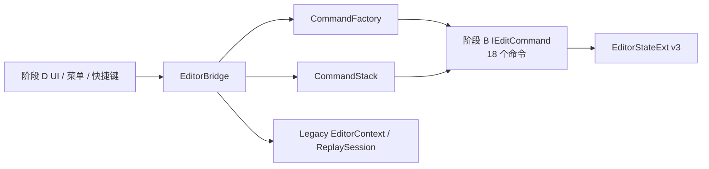
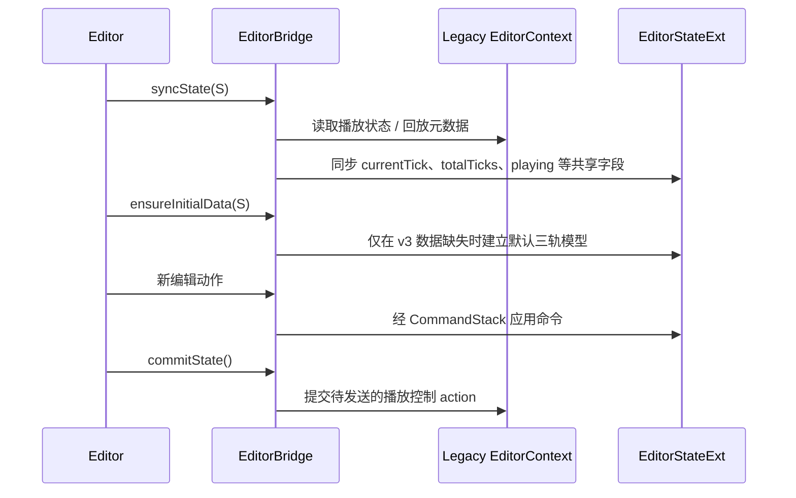

# 13 · 阶段 C：命令工厂与 Bridge 适配（Layer 4、7）

> 入口：`src/playback/refactor/editor/`
> 角色：将阶段 B 的 18 个可撤销命令以稳定的工厂 API 暴露给编辑器，并通过 `EditorBridge` 在新编辑器状态、`CommandStack` 与 Legacy `EditorContext / ReplaySession` 之间建立受控适配。
> 范围：严格承接 [10 §3.1 阶段 C](10-implementation-plan.md#L459-L465) 的 C1–C2；本阶段先增加新 API，旧 Clip / Track API 保留至 [10 阶段 E3](10-implementation-plan.md#L478-L485) 清理。
> 前置：阶段 B 的 `SequenceOps`、`WorldActorOps`、`CameraBindingOps`、`CameraSampler` 与 18 个 `IEditCommand` 已通过单元测试。

## 一、需求（Requirements）

### 1.1 功能性需求

| ID | 需求 | 对齐来源 | 优先级 |
|---|---|---|---|
| SC-1 | `CommandFactory` 提供阶段 B 18 个命令的创建 API，调用方无需直接 include 具体命令实现 | [10 C1](10-implementation-plan.md#L461-L464)、[10 §2.4.3](10-implementation-plan.md#L345-L368) | P0 |
| SC-2 | `EditorBridge` 为三轨工作流新增编辑入口：序列切分 / 修剪 / 绑定，世界Actor 切分 / 修剪 / ripple 删除，Camera 创建 / 绑定 / 关键帧编辑，SubActor 详情修改 | [10 §2.3.2](10-implementation-plan.md#L274-L278)、[09 §2.5](09-video-editing-workflow.md#L215-L235) | P0 |
| SC-3 | 所有新编辑入口通过 `CommandFactory → CommandStack → IEditCommand` 修改 `EditorStateExt`，禁止绕过命令栈直接写状态 | [09 §2.5](09-video-editing-workflow.md#L236-L236) | P0 |
| SC-4 | `EditorBridge` 继续保留播放控制、状态同步、提交 Legacy action、初始化、撤销 / 重做的公共行为 | [10 §2.5](10-implementation-plan.md#L388-L433) | P0 |
| SC-5 | C2 采用增量适配：新 API 可供阶段 D UI 编译接入，旧 Clip / Track API 暂不删除，直至 E3 完成全量迁移 | [10 C2](10-implementation-plan.md#L461-L465)、[10 E3](10-implementation-plan.md#L482-L485) | P0 |
| SC-6 | `ensureInitialData` 按 [09](09-video-editing-workflow.md) 初始化 v3 默认状态：一段完整 sequence、一段完整 worldActor、空 `cameras` | [09 §3.4](09-video-editing-workflow.md#L430-L447)、[10 §1.2](10-implementation-plan.md#L26-L31) | P0 |

### 1.2 非功能性需求

- Factory API 使用领域动作命名，不暴露旧 `Clip`、`Transition`、`TrackKind` 参数。
- Bridge 作为适配边界，不得复制阶段 B 的段编辑、时间映射、Camera 采样算法。
- 新旧 API 并存期间必须保持命名空间和语义明确，避免同一动作分别绕过和进入命令栈。
- Factory 单元测试只验证公开创建接口返回正确命令语义，不耦合 UI 实现。
- 该阶段不删除旧类型、不修改 UI、不实现 `SequenceSampler` 或导出流程。

### 1.3 公共行为保持项

下列既有 `EditorBridge` 行为在 C2 后保持可用，内部可继续路由 Legacy 系统：

```cpp
void playPause();
void seek(int tick);
void skipToStart();
void skipToEnd();
void decreaseSpeed();
void increaseSpeed();
void stopReplay();
void initialize(playback::editor::EditorContext* context);
void shutdown();
void syncState(EditorStateExt& outState);
void commitState();
void undo(EditorStateExt& state);
void redo(EditorStateExt& state);
bool canUndo() const;
bool canRedo() const;
CommandStack& commandStack();
```

## 二、架构（Architecture）

### 2.1 适配链路



- 编辑动作路径固定为：调用方 → `EditorBridge` → `CommandFactory` → `CommandStack::push` → `IEditCommand::execute` → `EditorStateExt`。
- `undo` / `redo` 不经 Factory，直接由 Bridge 委托 `CommandStack` 对相同状态实例执行。
- 播放控制与 Legacy 同步路径独立：Bridge → `EditorAction` → `EditorContext` → `ReplaySession`；不得将领域编辑命令伪装为 Legacy action。
- 阶段 D 只依赖 Bridge 的新领域入口和稳定 Factory API，不依赖具体 commands 文件。

### 2.2 `CommandFactory` API 分组

| 分组 | 创建方法 | 对应命令 |
|---|---|---|
| Sequence | `createSplitSequence`、`createTrimSequence`、`createDeleteSequenceSegment`、`createBindSequenceToCamera` | 4 个 SequenceCommands |
| WorldActor | `createSplitWorldActor`、`createTrimWorldActor`、`createSetWorldActorSpeed`、`createRippleDeleteWorldActorSegment` | 4 个 WorldActorCommands |
| Camera | `createAddFreeCamera`、`createDeleteCamera`、`createCreateBindingCamera`、`createUnbindCamera`、`createAddKeyframe`、`createMoveKeyframe`、`createDeleteKeyframe`、`createSetKeyframeEasing`、`createSetCameraKind` | 9 个 CameraCommands |
| SubActor | `createSetSubActorDetails` | 1 个 SubActorCommands |

> 方法签名以阶段 B 命令构造所需的稳定 uuid、tick、属性值为准。Factory 不接收 ImGui 组件、面板对象或 Legacy context 指针。

### 2.3 `EditorBridge` 新旧 API 分层

| 分层 | C2 新增或保留内容 | 迁移规则 |
|---|---|---|
| 播放与生命周期 | `initialize`、`shutdown`、`syncState`、`commitState`、播放控制 | 保持现有 Legacy 路由 |
| 新三轨编辑 API | `splitSequence`、`trimSequence`、`bindSequence`、`splitWorldActor`、`trimWorldActor`、`setWorldActorSegmentSpeed`、`rippleDeleteWorldActor`、`addFreeCamera`、`createBindingCamera`、关键帧操作、`setSubActorDetails` | 统一通过 Factory + CommandStack |
| Undo / Redo | `undo`、`redo`、`canUndo`、`canRedo`、`commandStack` | 接口稳定，状态改为 v3 模型 |
| 旧编辑 API | `splitClip`、`deleteClip`、`trimClip`、`moveClip`、`addTransition`、视频轨道操作 | C2 仍保留；E3 确认所有调用迁移后删除 |

### 2.4 Bridge 操作映射

| Bridge 方法 | Factory 方法 | 命令 | 状态影响 |
|---|---|---|---|
| `splitSequence(state, atTick)` | `createSplitSequence(atTick)` | `SplitSequenceAtPlayhead` | `sequence` |
| `trimSequence(state, segmentId, start, end)` | `createTrimSequence(...)` | `TrimSequenceSegment` | `sequence` |
| `bindSequence(state, segmentId, cameraId)` | `createBindSequenceToCamera(...)` | `BindSequenceToCamera` | `sequence` |
| `splitWorldActor(state, atTick)` | `createSplitWorldActor(atTick)` | `SplitWorldActorAtPlayhead` | `worldActor.segments` |
| `trimWorldActor(state, segmentId, start, end)` | `createTrimWorldActor(...)` | `TrimWorldActorSegment` | `worldActor.segments` |
| `rippleDeleteWorldActor(state, segmentId)` | `createRippleDeleteWorldActorSegment(...)` | `RippleDeleteWorldActorSeg` | `worldActor.segments` |
| `addFreeCamera(state, name)` | `createAddFreeCamera(name)` | `AddFreeCamera` | `cameras` |
| `createBindingCamera(state, subActorId, params)` | `createCreateBindingCamera(...)` | `CreateBindingCamera` | `cameras` + `boundCameraIds` |
| `addKeyframe` / `moveKeyframe` / `deleteKeyframe` | 对应 keyframe Factory 方法 | 3 个关键帧命令 | 指定 Camera `keys` |
| `setSubActorDetails(state, subActorId, details)` | `createSetSubActorDetails(...)` | `SetSubActorDetails` | `agentDetails` |

### 2.5 初始化与同步边界



- `syncState` 不得在每帧以 Legacy 旧 Track / Clip 数据覆盖已存在 v3 `sequence / worldActor / cameras`。
- `ensureInitialData` 只处理缺失或空白的初始化场景；迁移和 JSON 校验属于阶段 E。
- `commitState` 只处理待提交的 Legacy 播放 action；编辑命令在 push 时已经同步写入 `EditorStateExt`。

## 三、执行（Execution）

### 3.1 C1：实现 `CommandFactory` 新 API

| 顺序 | 任务 | 文件 | 验证 |
|---|---|---|---|
| C1.1 | 移除 Factory 对旧 `Track.h` / `TransitionKind` 的新路径依赖，改为引用 v3 模型和命令声明 | `editor/CommandFactory.h` | 新三轨 API 的头文件可独立编译 |
| C1.2 | 增加 Sequence / WorldActor / Camera / SubActor 四组创建方法 | `editor/CommandFactory.h/.cpp` | 每个公开方法可创建对应 `IEditCommand` |
| C1.3 | 保持旧 Factory 方法临时可用，避免阶段 D 前的现有 UI 断编译 | `editor/CommandFactory.h/.cpp` | 既有调用不回归，新旧 API 可并存 |
| C1.4 | 为全部新 Factory 方法建立单元测试 | `tests/refactor/editor/CommandFactory*` | 创建命令后推入 `CommandStack`，状态变化符合命令语义 |

### 3.2 C2：实现 `EditorBridge` 适配层

| 顺序 | 任务 | 文件 | 验证 |
|---|---|---|---|
| C2.1 | 增加三轨领域编辑入口，参数使用段 / Camera / SubActor uuid 和 tick | `editor/EditorBridge.h` | 阶段 D 面板可只依赖新 API 编译 |
| C2.2 | 各入口调用 Factory 创建命令，再由 `mCommandStack.push` 执行 | `editor/EditorBridge.cpp` | 操作后 `canUndo()` 为真，Undo 恢复原状态 |
| C2.3 | 保留播放控制、状态同步、提交 action、初始化和 Undo/Redo 行为 | `editor/EditorBridge.cpp` | 既有播放控制回归测试通过 |
| C2.4 | 调整 `ensureInitialData` 的默认数据契约 | `editor/EditorBridge.cpp` | 空 editor 初始化为 1 段 sequence + 1 段 worldActor + 0 Camera |
| C2.5 | 保留旧 Clip / Track 编辑入口并标记为迁移期兼容路径 | `editor/EditorBridge.h/.cpp` | 现有旧 UI 行为无回归；不在 C 阶段删除 API |

### 3.3 验证矩阵

| ID | 场景 | 期望 |
|---|---|---|
| SC-T1 | 逐一调用 18 个 Factory 方法 | 返回非空、类型和参数语义正确的 `IEditCommand` |
| SC-T2 | 经 Bridge 执行 sequence split / bind / trim | `CommandStack` 有记录；Undo 后 `sequence` 字节等价恢复 |
| SC-T3 | 经 Bridge 执行绑定 Camera 创建与删除 | `cameras`、`boundCameraIds`、`sequence.cameraId` 同步变更和恢复 |
| SC-T4 | 经 Bridge 修改 WorldActor speed 和 ripple 删除 | 段覆盖和源 tick 映射约束继续成立 |
| SC-T5 | 执行播放、seek、同步与提交 | Legacy `EditorContext / ReplaySession` 路径保持可用 |
| SC-T6 | 空白状态调用 `ensureInitialData` | 建立符合 v3 三轨默认模型的数据 |
| SC-T7 | 旧 UI 仍调用旧 Bridge / Factory API | C 阶段不发生编译或行为回归 |
| SC-T8 | 新 UI 模拟调用只使用新 Bridge API | 不需要直接依赖具体 commands 文件或 Legacy context |

### 3.4 完成标准与移交

- [ ] Factory 覆盖阶段 B 定义的全部 18 个命令，无遗漏、无旧模型参数泄漏到新 API。
- [ ] Bridge 的每个新编辑入口都经 `CommandFactory` 与 `CommandStack`，不存在直接状态写入分支。
- [ ] 现有播放控制、同步、提交和 Undo/Redo 接口不回归。
- [ ] `ensureInitialData` 的默认三轨结构与 [09](09-video-editing-workflow.md) 一致。
- [ ] 旧 Clip / Track API 仍可用，但只作为 C→E 迁移兼容层；删除工作明确留给 E3。
- [ ] 阶段 D 可在不触碰命令内部实现的前提下接入 Timeline、Details、Viewport 与菜单。

## 四、模块关系

### 被谁调用（上游）

- 阶段 D 的 `TimelinePanel`、`DetailsPanel`、上下文菜单和快捷键通过 `EditorBridge` 触发领域编辑。
- `Editor` / `EditMode` 在每帧调用 `syncState`、`ensureInitialData` 与 `commitState`。
- 未来持久化加载路径在获得 v3 `EditorStateExt` 后调用 `ensureInitialData` 兜底默认状态。

### 调用谁（下游）

- 阶段 B 的四组 commands 和操作层。
- `CommandStack` / `IEditCommand`，负责执行历史。
- 既有 `EventBus`、`EditorContext`、`EditorAction` 和 `ReplaySession`，仅用于播放控制与 Legacy 同步。
- [09-video-editing-workflow.md](09-video-editing-workflow.md) 的状态模型与不变量。

### 共享数据

- `EditorStateExt`：Bridge 的编辑命令与后续 UI / 渲染共享的唯一编辑状态。
- `CommandStack`：Factory 生成命令的执行、撤销、重做历史。
- `mPendingActions`：仅承载播放控制等 Legacy action，不承载三轨编辑命令。
- `EditorContext`：保留为 Legacy 播放会话适配对象，不成为新模型的事实来源。

## 五、阅读顺序

1. [09-video-editing-workflow.md](09-video-editing-workflow.md) — 工作流唯一权威
2. [10-implementation-plan.md](10-implementation-plan.md#L450-L485) — 阶段 B/C/E 的整体迁移顺序
3. [12-stage-b-operations-and-commands.md](12-stage-b-operations-and-commands.md) — 命令与纯函数的实现边界
4. 本文件 — Factory 与 Bridge 的适配契约
5. [08-sequencer-timeline-ui.md](08-sequencer-timeline-ui.md) — 阶段 D UI 消费方
6. [05-render-pipeline.md](05-render-pipeline.md) — 阶段 D 的预览与导出消费方
