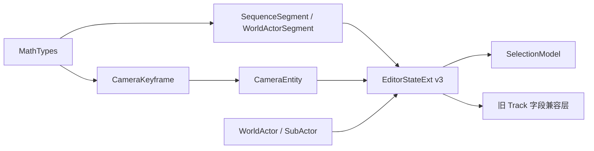

# 14 · 阶段 A：数据基底（Layer 0–2）

> 入口：`src/playback/refactor/editor/models/`
> 角色：为三条一级轨道工作流建立可由后续操作、命令与 UI 共同消费的 v3 数据结构，并在阶段 E 清理前保留旧编辑器字段的编译兼容性。

## 一、需求（Requirements）

| ID | 需求 | 优先级 |
|---|---|---|
| SA-1 | 抽离 `Vec2`、`Vec3`、`Color4`、`EasingType` 到 `MathTypes.h`，解除 `CameraKeyframe` 对旧 `Track.h` 的基础类型依赖 | P0 |
| SA-2 | 提供 `SequenceSegment`、`WorldActorSegment`、`WorldActor`、`SubActor`、`CameraEntity` 及四种 Camera kind 所需数据 | P0 |
| SA-3 | `EditorStateExt` 使用 `version=3`，增加 `sequence`、`worldActor`、`cameras` | P0 |
| SA-4 | 过渡期继续保留 `videoTracks`、`cameraTracks`、`transitions`，保证未迁移 UI 可编译 | P0 |
| SA-5 | SelectionModel 支持 Sequence、SequenceSegment、WorldActor、WorldActorSegment、SubActor、Camera、Keyframe、Marker；旧选择类型暂时保留 | P0 |

## 二、架构（Architecture）

- `sequence` 和 `worldActor.segments` 的完整覆盖不变量由阶段 B 操作层维护；阶段 A 只定义承载结构。
- `CameraEntity.id`、段 id 与 `SubActor.id` 是跨模块关联键，显示名称不参与关联。
- `SubActor.agentDetails` 当前使用字符串键值容器，避免在持久化阶段之前引入未确认的 JSON 依赖；阶段 E 的 JsonCodec 可据 schema 升级其编码实现。
- 新模型是阶段 B/C 的唯一写入目标；旧字段只服务未迁移 UI，不进行双向同步。

## 三、执行（Execution）

| 步骤 | 文件 | 完成内容 | 验证 |
|---|---|---|---|
| A1 | `MathTypes.h`、`CameraKeyframe.h` | 基础数学与颜色类型抽离 | 主项目编译 |
| A2 | `SequenceSegment.h`、`WorldActorSegment.h`、`SubActor.h`、`WorldActor.h` | 三轨的序列与世界实体模型 | 主项目编译 |
| A3 | `CameraEntity.h` | Keyframe / Path / Rig / Preset 数据承载 | 主项目编译 |
| A4 | `EditorStateExt.h` | v3 字段与旧字段共存 | 旧 UI 编译 |
| A5 | `SelectionModel.h/.cpp` | 新旧选择类型共存与 id 提取 | 主项目编译 |

**移交条件**：阶段 B 只能读取和写入 v3 字段；阶段 E3/E4 在 UI、渲染和持久化均切换后删除旧轨道字段及其依赖。
