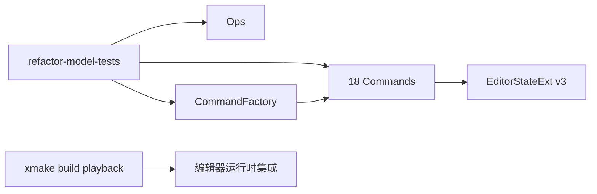

# 15 · 阶段 A–C：验证与回归

> 入口：`tests/refactor/models/`、`src/playback/refactor/`
> 角色：验证 v3 三轨模型、纯操作、可撤销命令、命令工厂与 Bridge 适配的可用性，并为阶段 D UI 接入建立回归基线。

## 一、需求（Requirements）

| ID | 需求 | 优先级 |
|---|---|---|
| VT-1 | 验证 Sequence 与 WorldActor 分段操作保持完整时间轴覆盖 | P0 |
| VT-2 | 验证 18 个 v3 命令可创建、执行、撤销与重做 | P0 |
| VT-3 | 验证 Camera 绑定、删除、解绑及关键帧边界不会遗留悬空引用或重复 tick | P0 |
| VT-4 | 验证 CommandFactory 的所有 v3 公开入口返回可执行命令 | P0 |
| VT-5 | 验证主项目持续可编译，并列出游戏内冒烟步骤 | P0 |

## 二、架构（Architecture）

- 自动化测试只使用无 UI、无 ReplaySession 依赖的模型层，确保本地快速执行。
- `EditorBridge` 的 Legacy 生命周期和游戏内面板交互采用运行时冒烟验证；阶段 D 完成后将其迁入可模拟的集成测试。
- 每项修改至少验证执行后状态、Undo 恢复和 Redo 重放；不变量通过 `validateCoverage` 或关联集合断言验证。

## 三、执行（Execution）

| 步骤 | 内容 | 验证命令 |
|---|---|---|
| V1 | 运行模型、Ops、命令和 Factory 测试 | `xmake build refactor-model-tests; xmake run refactor-model-tests` |
| V2 | 构建完整 DLL | `xmake build playback` |
| V3 | 部署 DLL 后进入回放编辑器 | 游戏内打开、关闭、重开编辑器三次 |
| V4 | 手工冒烟 | 切分序列、创建/绑定/删除 Camera、Undo/Redo；检查无崩溃和无重复段 |

**边界清单**：负 tick 与超尾 tick 的关键帧必须归一化；归一化后与已有 tick 冲突时拒绝创建或移动；Camera 删除必须清除 Sequence 和 SubActor 的所有关联 id。
