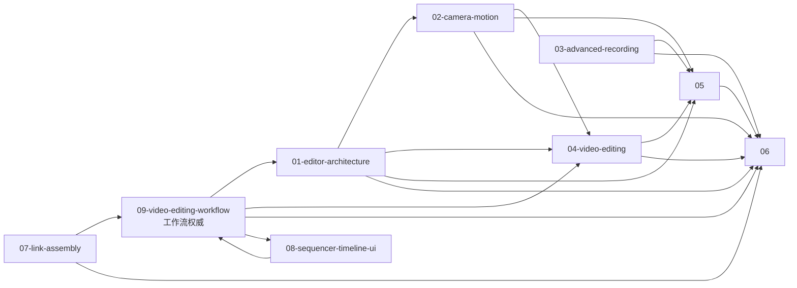

# Refactor — 视频编辑重构文档

> 本目录是 **UE5 风格编辑器重构** 的设计文档（**新增**，不动旧文档）。

## 9 份文档

| # | 文档 | 状态 | 范围 |
|---|---|---|---|
| 1 | [01-editor-architecture.md](01-editor-architecture.md) | **已写** | UE5 风格编辑器核心（4 面板 + 2 页面 + 1 可拖拽分隔条 + InputHook + 0 emoji） |
| 2 | [02-camera-motion.md](02-camera-motion.md) | ✅ 已写 | 摄像机系统扩展：多轨 / 3D 样条 / 8 运动原语 / 7 预设 / 绑定+阻尼 / Shake / 限位器 / TimeRemap / Markers |
| 3 | [03-advanced-recording.md](03-advanced-recording.md) | ✅ 已写 | 高级录制：B2 实时标记 / B3 HUD 指示器+统计 / B5 录制配置预设 |
| 4 | [04-video-editing.md](04-video-editing.md) | ✅ 已写 | 视频剪辑操作：Sequence / WorldActor / Camera 三类条目的命令实现 |
| 5 | [05-render-pipeline.md](05-render-pipeline.md) | ✅ 已写 | 渲染管线扩展：RealtimePreview + RenderJob 生产级增强 + 命令联动（沿序列导出） |
| 6 | [06-data-persistence.md](06-data-persistence.md) | ✅ 已写 | 新增数据模型 + 持久化（`EditorStateExt`：sequence / worldActor / cameras + 布局/工作区/快捷键/录制预设） |
| 7 | [07-link-assembly.md](07-link-assembly.md) | ✅ 已写 | 链接装配：把 SequenceSegment / WorldActorSegment / CameraEntity 装配为可执行时间轴 |
| 8 | [08-sequencer-timeline-ui.md](08-sequencer-timeline-ui.md) | ✅ 已写 | Sequencer 时间轴 UI：顶工具栏 / 左侧导航 / 右侧画布 / 底部传输栏（3+N 轨） |
| 9 | [09-video-editing-workflow.md](09-video-editing-workflow.md) | ✅ 已写 | **视频编辑工作流单一权威**（3 条一级轨道：摄像机序列 / 世界Actor / 摄像机） |
| 10 | [10-implementation-plan.md](10-implementation-plan.md) | ✅ 已写 | **可落地执行计划**：模块依赖 / 变更总表 / 21 步任务 / 11 周甘特 / 14 个回归用例 |

> **09 是工作流唯一权威**：01 / 04 / 06 / 08 全部以 09 为准。

## 文档交叉引用

**09** 是工作流权威；**06** 是数据基底；**02 / 03 / 04** 是三个功能块；**05** 是出口；**01 / 08** 是 UI 壳；**07** 是装配桥。

## 范围（与已确认）

**做：** UE5 风格编辑器 UI / 3 条一级轨道（摄像机序列 + 世界Actor + 摄像机） / 多轨摄影机 / 3D 样条 / 运动原语 / 摄影机 Shake + 限位 / TimeRemap / Markers / 高级录制（B2+B3+B5）/ 视频剪辑 / 沿序列导出 / Bezier 曲线 / RealtimePreview / 生产级渲染 / 数据持久化。

**不做：** 内容浏览器 / 色彩分级 / LUT / 暗角颗粒锐化 / 复杂转场（旧 3 个基础转场被新工作流"序列段绑 Camera"完全替代） / 媒体导入 / 环形预录缓冲 / 音频录制 / 自动入导出队列。

## 与旧文档的关系

**不修改**：
- 旧 `docs/editor/{camera-track,export-config,export-panel,context,controller,renderer,ui}.md`
- 旧 `docs/functions/render/{render-job,frame-source,frame-encoder,audio-track,export-presets}.md`
- 旧 `docs/command/export.md`
- 旧 `docs/overview/export-flow.md`
- 旧 `docs/README.md` 和所有 `index.md`

**新文档通过引用旧文档来描述"底层"**：
- 摄影机轨道基础 → [editor/camera-track.md](../editor/camera-track.md)
- 渲染 Job 基础 → [functions/render/render-job.md](../functions/render/render-job.md)
- 编码器基础 → [functions/render/frame-encoder.md](../functions/render/frame-encoder.md)
- 编辑器上下文 → [editor/context.md](../editor/context.md)
- 回放会话 → [functions/replay.md](../functions/replay.md)

## 阅读顺序

1. [09-video-editing-workflow.md](09-video-editing-workflow.md) —— **工作流单一权威（先读）**
2. [06-data-persistence.md](06-data-persistence.md) —— 数据基底
3. [02-camera-motion.md](02-camera-motion.md) —— 摄影机
4. [04-video-editing.md](04-video-editing.md) —— 剪辑操作
5. [03-advanced-recording.md](03-advanced-recording.md) —— 录制
6. [05-render-pipeline.md](05-render-pipeline.md) —— 渲染
7. [07-link-assembly.md](07-link-assembly.md) —— 装配桥
8. [01-editor-architecture.md](01-editor-architecture.md) —— UI 骨架
9. [08-sequencer-timeline-ui.md](08-sequencer-timeline-ui.md) —— Sequencer 四区 UI
