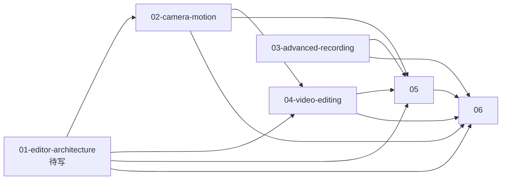

# Refactor — 视频编辑重构文档

> 本目录是 **UE5 风格编辑器重构** 的设计文档（**新增**，不动旧文档）。

## 6 份文档

| # | 文档 | 状态 | 范围 |
|---|---|---|---|
| 1 | [01-editor-architecture.md](01-editor-architecture.md) | **已写** | UE5 风格编辑器核心（4 面板 + 2 页面 + 1 可拖拽分隔条 + InputHook + 0 emoji） |
| 2 | [02-camera-motion.md](02-camera-motion.md) | ✅ 已写 | 摄像机系统扩展：多轨 / 3D 样条 / 8 运动原语 / 7 预设 / 绑定+阻尼 / Shake / 限位器 / TimeRemap / Markers |
| 3 | [03-advanced-recording.md](03-advanced-recording.md) | ✅ 已写 | 高级录制：B2 实时标记 / B3 HUD 指示器+统计 / B5 录制配置预设 |
| 4 | [04-video-editing.md](04-video-editing.md) | ✅ 已写 | 多剪辑编辑：Clip / Track / 3 基础转场 / Bezier 曲线 / 时间轴集成 |
| 5 | [05-render-pipeline.md](05-render-pipeline.md) | ✅ 已写 | 渲染管线扩展：RealtimePreview + RenderJob 生产级增强 + 命令联动 |
| 6 | [06-data-persistence.md](06-data-persistence.md) | ✅ 已写 | 新增数据模型 + 持久化（`.playback` editor 节点 + 布局/工作区/快捷键/录制预设） |

## 文档交叉引用

**06** 是数据基底；**02 / 03 / 04** 是三个功能块；**05** 是出口；**01** 是 UI 壳（最后做）。

## 范围（与已确认）

**做：** UE5 风格编辑器 UI / 多轨摄影机 / 3D 样条 / 运动原语 / 摄影机 Shake + 限位 / TimeRemap / Markers / 高级录制（B2+B3+B5）/ 多剪辑编辑 / 3 个基础转场 / Bezier 曲线 / RealtimePreview / 生产级渲染 / 数据持久化。

**不做：** 内容浏览器 / 色彩分级 / LUT / 暗角颗粒锐化 / 复杂转场 / 媒体导入 / 环形预录缓冲 / 音频录制 / 自动入导出队列。

## 与旧文档的关系

**不修改**：
- 旧 `docs/editor/{camera-track,export-config,export-panel,context,controller,renderer,ui}.md`
- 旧 `docs/functions/render/{render-job,frame-source,frame-encoder,audio-track,export-presets}.md`
- 旧 `docs/command/export.md`
- 旧 `docs/overview/export-flow.md`
- 旧 `docs/README.md` 和所有 `index.md`

**新文档通过引用旧文档来描述"底层"**：
- 摄影机轨道基础 → [editor/camera-track.md](../editor/camera-track.md)
- 渲染 Job 基础 → [functions/render/render-job.md](../functions/render/render-job.md)
- 编码器基础 → [functions/render/frame-encoder.md](../functions/render/frame-encoder.md)
- 编辑器上下文 → [editor/context.md](../editor/context.md)
- 回放会话 → [functions/replay.md](../functions/replay.md)

## 阅读顺序

1. [06-data-persistence.md](06-data-persistence.md) —— 数据基底
2. [02-camera-motion.md](02-camera-motion.md) —— 摄影机
3. [04-video-editing.md](04-video-editing.md) —— 剪辑
4. [03-advanced-recording.md](03-advanced-recording.md) —— 录制
5. [05-render-pipeline.md](05-render-pipeline.md) —— 渲染
6. [01-editor-architecture.md](01-editor-architecture.md) —— UI（最后深入）
