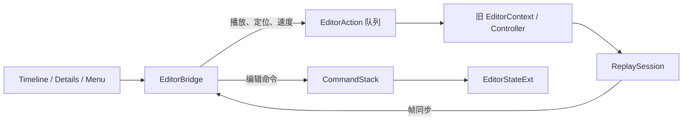

# UI 迁移 · Bridge 模块

> 目标模块：`src/playback/refactor/editor/EditorBridge.{h,cpp}`。
>
> 迁移定位：作为新 UI 与旧 `EditorContext → EditorController → ReplaySession` 链路之间的唯一适配层，同时将 UI 编辑意图转换为针对 `EditorStateExt` 的可撤销命令。

## 需求

### 职责

- 维持现有生命周期：`initialize` 绑定旧 `EditorContext`，每帧开始 `syncState`，每帧结束 `commitState`，关闭时 `shutdown`；UI 不得绕过 Bridge 直接操作旧 Context。
- 保持播放控制通道：播放/暂停、定位、首尾跳转、速度和停止仍转换为旧 `EditorAction` 并在 `commitState` 统一提交。
- 为首批 UI 迁移提供按稳定 id 的 Sequence、WorldActor、Camera、关键帧、SubActor 与 Marker 操作，所有可编辑操作进入 `CommandStack` 并支持 Undo/Redo。
- `ensureInitialData` 在状态为空时只建立一个覆盖全时长的 Sequence 段和一个 WorldActor 段；不得创建默认 Camera。该规则与已确认的“默认两条轨、Camera 为 0”一致。
- 在 Camera 删除后原子清除所有引用它的 `SequenceSegment.cameraId`，并从关联 `SubActor.boundCameraIds` 中移除 id；空绑定保留为渲染层的“首台 Camera 回退”语义。
- 旧 Clip/Track/Transition 方法在 UI 全部迁离后删除或隔离为兼容层；新 Timeline 与 Details 不得调用它们。

### 命令语义

| UI 意图 | Bridge 操作 | 必须保持的规则 |
|---|---|---|
| 序列切分/trim/删除/绑定 | `splitSequence` / `trimSequence` / `deleteSequenceSegment` / `bindSequence` | 段首尾相接、覆盖全时长，无空隙重叠 |
| 世界Actor 切分/trim/变速/删除 | `splitWorldActor` / `trimWorldActor` / `setWorldActorSegmentSpeed` / `rippleDeleteWorldActor` | 世界Actor 是唯一时间映射器 |
| 新建/绑定/删除/解绑 Camera | `addFreeCamera` / `createBindingCamera` / `deleteCamera` / `unbindCamera` | Camera ≤16，关系双向一致 |
| Camera 关键帧 | `add/move/deleteCameraKeyframe`、`setKeyframeEasing` | 单 Camera ≤1024，时间位置有效 |
| 子Actor属性 | `setSubActorDetails` | 保留未编辑的类别相关字段 |
| Marker | `addMarker` / `deleteMarker` | 不绑定到任一业务轨道 |

## 架构

### 双通道适配

- **运行时通道**只承接旧系统已有能力，Bridge 在 `commitState` 统一刷新，避免 UI 事件直接穿透到 ReplaySession。
- **编辑通道**以 `EditorStateExt` 为命令目标；每个命令保存 execute/undo 所需的完整前后值或最小可逆差异，不依赖 UI 临时指针。
- Bridge 验证输入 id、tick 边界、段上限、Camera 上限和锁定状态；非法或已失效选择必须无副作用并由 UI 保持当前安全状态。

### 迁移策略

1. 保留播放控制、Marker、Undo/Redo、生命周期和帧同步 API，确保旧编辑器基础设施无感。
2. 将已声明的新工作流 API 作为 Timeline 与 Details 的唯一编辑入口，补齐其实现和命令工厂映射。
3. 把 `splitClip`、`deleteClip`、`trimClip`、`moveClip`、`addTransition`、旧关键帧与旧视频轨 API 标记为待移除兼容区；首批 UI 不再引用。
4. 在所有 UI 和命令切换完成、旧状态迁移由数据层覆盖后，删除兼容区及旧 `Track / Clip / Transition` 依赖。

## 执行

1. 审核 `syncState`、`commitState` 与 `ensureInitialData`，使默认状态严格符合 Sequence 1 段、WorldActor 1 段、Camera 0 台的模型。
2. 为每个新工作流 API 建立或接通互逆命令，集中执行 id、锁定、上限和连续覆盖不变量校验。
3. 实现 Camera 删除与子Actor绑定的双向清理；验证未绑定 Sequence 段始终能安全回退且不会引用已删除 Camera。
4. 将 Timeline 和 Details 的所有提交点切换至新 API，编译期清除对旧 Clip/Transition UI 命令的引用。
5. 回归验证播放控制仍到达旧 Context、每项编辑操作可 Undo/Redo、无效 id 无副作用、状态可持久化并在重载后保持一致。

