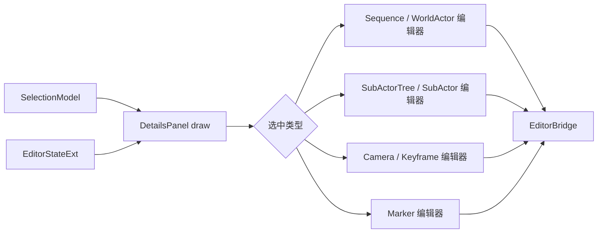

# UI 迁移 · Details 模块

> 目标模块：`src/playback/refactor/editor/panels/DetailsPanel.{h,cpp}`。
>
> 迁移定位：将旧 Track/Clip/Transition 属性面板替换为已确认三条一级轨道工作流的上下文敏感属性编辑器；字段定义以 [09-video-editing-workflow.md](09-video-editing-workflow.md) §2.2、§2.6 为准。

## 需求

### 上下文与内容

| 选中对象 | Details 内容 | 可提交操作 |
|---|---|---|
| 无选中 | 使用提示、当前回放摘要、`+ Add Free Camera` | 新建自由 Camera |
| Sequence | 段列表、全时长、绑定概览 | 选择段 |
| SequenceSegment | 起止 tick、时长、锁定、Camera 下拉列表与自动回退状态 | 绑定 Camera、split、trim、删除 |
| WorldActor | 回放名称、总 tick、段概览、四类子Actor折叠树 | 选择段或子Actor |
| WorldActorSegment | 起止 tick、source tick、speed、锁定 | split、trim、变速、ripple 删除 |
| SubActor | 名称、类别、位置、旋转、`agentDetails`、已绑定 Camera | 更新详情、创建绑定 Camera |
| Camera | 名称、kind、绑定对象、阻尼、镜头/路径/Rig/Preset 参数、关键帧列表 | 改 kind、解绑、加/删关键帧、删除 Camera |
| CameraKeyframe | tick、位置、旋转、FOV、插值与 easing | 移动、删除、设置 easing |
| Marker | 标签与 tick | 删除 Marker |

- 子Actor 树固定按 `Default / Players / Creatures / Entities` 分组，初始折叠；类别不是 Timeline 行，也不得通过 Details 改变类别或实体 id。
- “创建摄像机绑定”仅对允许绑定的子Actor显示。每次创建新增一台 `CameraEntity`，追加关联 id，并立即出现在 Cameras 组和 Sequence 的绑定候选列表。
- Sequence 段下拉列表必须列出全部现有 Camera；段的 `cameraId` 为空时以“自动：首台摄像机”展示。删除 Camera 后，相关段绑定由 Bridge 清空，Details 不保留悬空引用。
- 旧 Clip、Transition、旧 CameraTrack 编辑页及其转场控件不再作为迁移目标。

### 交互与质量

- Details 只读当前帧 `EditorStateExt` 和统一的 Selection 状态，不缓存可能失效的对象指针或数组引用。
- 数值修改必须在确定提交时调用 Bridge，拖动类字段采用开始值/结束值模式，避免每帧压入 Undo 栈。
- 对无 Camera、无子Actor、无关键帧、失效选中 id 和锁定对象展示解释性空状态；锁定对象的修改控件禁用。
- 继续采用 `EditorTheme`、Lucide 图标及全局字体规则；所有表单可通过鼠标完成，并复用既有快捷键/提示机制。

## 架构

### 选择驱动的渲染分发

### 模块边界

| 模块 | 输入 | 输出 |
|---|---|---|
| `SelectionModel` | Timeline、Viewport、Details 的用户选择 | 类型化稳定 id 与可选子项 id |
| `DetailsPanel` | `EditorStateExt`、选中快照、Bridge 能力 | 表单 UI 与明确的编辑意图 |
| `EditorBridge` | 稳定 id、目标字段值 | 命令栈中的可撤销状态变更 |
| `TrackTreeModel` | `EditorStateExt` | Camera 行，不接收 Details 树状态 |

### 推荐分发边界

- 用类型化选中值替换依赖旧 `mSelectedClipId`、`mSelectedTrackIndex` 的隐式判断，例如 `SelectionKind::SequenceSegment`、`WorldActorSegment`、`SubActor`、`Camera`、`Keyframe`、`Marker`。
- `DetailsPanel` 保留字段控件辅助函数，但拆分为与新领域对象对应的私有绘制函数：`drawSequence`、`drawSequenceSegment`、`drawWorldActor`、`drawWorldActorSegment`、`drawSubActor`、`drawCamera`、`drawKeyframe`、`drawMarker`。
- `agentDetails` 是分类相关的自由结构。面板通过类别专用适配器展示已支持字段；未知字段保留原值并显示只读摘要，不能无提示丢弃。

## 执行

1. 定义或补齐 `SelectionModel` 的类型化稳定 id，先让 Timeline、Details 与 Viewport 使用同一选中来源。
2. 删除旧 Clip/Transition 分发入口，按上表建立新的上下文绘制函数与空状态。
3. 实现 WorldActor 四类子Actor树、子Actor详情与创建绑定 Camera；验证多台 Camera 可绑定同一子Actor。
4. 实现 Sequence 段绑定下拉、Camera 配置与关键帧编辑，所有数据修改都通过 Bridge 的新工作流 API 提交。
5. 为锁定段/Camera、空 Camera 列表、删除 Camera 后的回退、未知 agent 字段、失效选择和 Undo/Redo 做交互回归。

