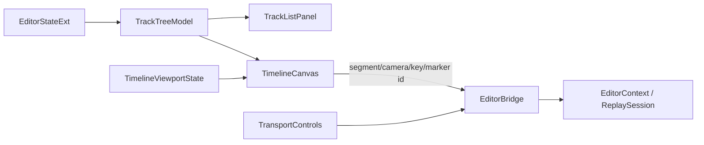

# UI 迁移 · Timeline 模块

> 目标模块：`src/playback/refactor/editor/panels/TimelinePanel.{h,cpp}` 及其拆分出的 Timeline UI 子组件。
>
> 迁移定位：实现嵌入式 UE5 Sequencer 四区工作区；轨道语义以 [09-video-editing-workflow.md](09-video-editing-workflow.md) 为准，视觉与布局约束以 [08-sequencer-timeline-ui.md](08-sequencer-timeline-ui.md) 为准。

## 需求

### 功能

- Timeline 固定嵌入 `EditMode` 分配的矩形，不创建 Dock、浮动 ImGui 窗口或独立位置状态。
- 模块固定包含 38px 顶工具栏、左侧轨道导航、右侧时间轴画布、34px 传输控制栏；用户可见文字不低于 14px，图标热区不小于 28×28px。
- 顶轨绘制连续覆盖全时长的 `SequenceSegment`；中轨绘制 `WorldActorSegment`；每个 Camera 行绘制该 Camera 的关键帧；Marker 作为独立可选行绘制垂线与标签。
- 左侧导航与画布只使用 TrackTree 的同一可见行快照、行高和垂直偏移。子Actor 不得出现在时间轴导航或画布中。
- 点击标尺/空白画布定位播放头；播放头贯穿标尺和所有可见行。缩放、水平滚动、吸附、片段拖动/trim、关键帧拖动和 Marker 操作沿用已有交互语义，但目标改为新模型稳定 id。
- 传输操作、撤销/重做、片段编辑、关键帧和 Marker 编辑必须通过 Bridge；无后端能力的循环等控件以禁用状态显示，不能伪造本地业务状态。
- Timeline 内部导航栏宽度只由 `trackListWidthRatio` 控制；外层 Details 宽度和 Timeline 高度分别继续由 `detailsWidthRatio`、`timelineHeightRatio` 控制，三个分隔条互不影响。

### 迁移约束

- 删除旧视频轨/相机轨/转场的绘制与命中分支，禁止继续以 `Track / Clip / Transition` 作为新 UI 的主数据源。
- 摄像机序列段之间只表达硬切；Timeline 不提供旧 Fade 或 CrossDissolve 的新增、编辑入口。
- 对未绑定 `cameraId` 的 Sequence 段显示“自动（首台摄像机）”状态；没有任何 Camera 时显示明确缺失状态，但不阻止 Sequence 行渲染或选择。
- 搜索、折叠和轨道状态显示由 TrackTree 管理；Timeline 只消费结果和转发用户意图。

## 架构

### 组件拆分

| 组件 | 责任 |
|---|---|
| `TimelinePanel` | 帧级编排、状态同步、四区矩形计算、内部宽度分隔条 |
| `TimelineViewportState` | `pixelsPerTick`、`horizontalScroll`、吸附、`trackListWidthRatio` 与局部拖动状态 |
| `TrackTreeModel` | 输出导航和画布共享的可见轨道行 |
| `TrackListPanel` | 搜索、折叠、轨道标题、可见/锁定状态与右键入口 |
| `TimelineCanvas` | 标尺、片段、关键帧、Marker、播放头、命中测试、裁剪和水平滚动 |
| `TransportControls` | 跳转、逐帧、播放/暂停、速度、循环能力展示 |

### 坐标与命令流

- 时间轴坐标统一为 `canvasLeft + tick * pixelsPerTick - horizontalScroll`；所有 tick 命中先通过相同公式反算，随后钳制到 `[0, totalTicks]`。
- 画布使用显式裁剪矩形；标尺、片段、关键帧、Marker 和播放头不得越过导航、工具栏、传输栏或外层面板。
- 拖动开始时记录稳定对象 id、原始边界与鼠标 tick；拖动结束时只提交一次 Bridge 命令，避免逐帧产生 Undo 项。

### 新旧 API 对照

| 旧 UI 意图 | 迁移后 Bridge 意图 |
|---|---|
| `splitClip` | `splitSequence` 或 `splitWorldActor`，由命中行类型决定 |
| `trimClip` | `trimSequence` 或 `trimWorldActor` |
| `deleteClip` | `deleteSequenceSegment` 或 `rippleDeleteWorldActor` |
| 旧相机轨关键帧操作 | `add/move/deleteCameraKeyframe` |
| 旧转场操作 | 移除，不迁移 |

## 执行

1. 提取 `TimelineViewportState`，迁移并持久化缩放、横向滚动、吸附和内部轨道栏宽度；为所有值设置合理钳制与缺省值。
2. 接入 TrackTree 快照，先完成左侧标题与右侧行的严格同步，再迁移各类画布绘制。
3. 依次实现 Sequence 段、WorldActor 段、Camera 关键帧和 Marker 的绘制、选择及命中，将旧 Track/Clip/Transition 分支完全替换。
4. 按行类型映射 split、trim、删除、绑定和关键帧命令，拖动期间只预览，释放鼠标后经 Bridge 原子提交。
5. 接入顶部撤销/重做、吸附和缩放，以及底部传输控制；无能力的循环控件保持禁用。
6. 验证裁剪、不同窗口尺寸、三个分隔条独立拖动、0/1/16 台 Camera、空绑定、折叠/搜索、缩放滚动、Undo/Redo 与重启后偏好恢复。

