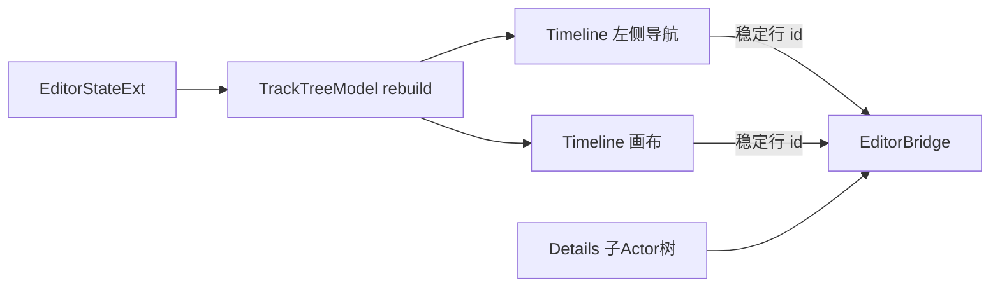

# UI 迁移 · TrackTree 模块

> 目标模块：`src/playback/refactor/editor/models/TrackTreeModel.{h,cpp}`
>
> 迁移定位：为 Timeline 左侧导航与右侧画布提供同一份只读可见行快照；工作流与数据含义以 [09-video-editing-workflow.md](09-video-editing-workflow.md) 为唯一权威。

## 需求

### 范围

- 将当前由 `TimelinePanel` 内部搜索、分组开关和旧 `Track / CameraTrack / Marker` 枚举驱动的行构造逻辑，迁移为独立的 `TrackTreeModel`。
- 可见行固定按 `Sequence → WorldActor → Cameras → Marker` 排序：前三者对应已确认的三条一级轨道模型，Marker 是独立可选轨，不作为第四条业务一级轨道。
- `Sequence` 与 `WorldActor` 始终各产生一行；`Cameras` 按 `EditorStateExt.cameras` 的数组顺序产生 0..16 行；`Marker` 仅在存在 Marker 或用户启用显示时产生一行。
- 搜索仅过滤 Camera 行，匹配摄像机名称或绑定子Actor名称；搜索不隐藏 Sequence、WorldActor，也不把子Actor展开为时间轴行。
- 分组折叠只影响 Cameras 和 Marker 的可见内容；Sequence、WorldActor 不允许折叠为零行。子Actor 的 `Default / Players / Creatures / Entities` 分类树只属于 Details 模块。
- 每一行输出稳定的 id、显示名称、类型、索引、锁定/激活/可见状态和固定行高，供 Timeline 左右区域逐行对齐并用于命中测试。

### 不变量与非目标

- 模型只投影 `EditorStateExt`，不持有可变业务状态，不直接调用 `EditorBridge`，不执行 ImGui 绘制。
- 一次 `rebuild` 产生的快照在该帧内不可变；导航栏与画布必须消费同一快照和同一垂直滚动偏移。
- 行 id 必须来自稳定业务 id：`sequence`、`worldActor`、`camera:<cameraId>`、`marker`；不得使用容易因筛选或重排变化的显示行号作为操作目标。
- 旧 `TrackKind`、`TrackDescriptor`、`CameraTrack` 和 `videoTracks/cameraTracks` 仅是待迁移兼容来源，不得成为新模块公共接口。

## 架构

### 职责边界

| 组件 | 责任 | 不负责 |
|---|---|---|
| `TrackTreeModel` | 由编辑器状态生成可见行快照、维护搜索与折叠 UI 状态 | 绘制、选择、命令提交、持久化业务数据 |
| `TimelinePanel` | 设置筛选条件、请求快照，并将其同时交给左侧列表和画布 | 重复拼装行序列 |
| `DetailsPanel` | 展开子Actor分类及详情编辑 | 向时间轴增加子Actor行 |
| `EditorBridge` | 根据稳定 id 执行轨道/片段/摄像机操作 | 推断当前 UI 可见性 |

### 建议接口

```cpp
enum class TrackRowKind { Sequence, WorldActor, Camera, Marker };

struct TrackTreeRow {
    TrackRowKind kind;
    std::string  id;
    std::string  name;
    int          cameraIndex{-1};
    float        height{};
    bool         active{};
    bool         locked{};
    bool         visible{true};
};

class TrackTreeModel {
public:
    void setSearch(std::string_view query);
    void setCamerasExpanded(bool expanded);
    void setMarkerExpanded(bool expanded);
    void rebuild(const EditorStateExt& state);
    [[nodiscard]] const std::vector<TrackTreeRow>& rows() const;
};
```

- `cameraIndex` 仅供 Timeline/Details 快速定位，所有跨模块编辑仍应携带 `id`。
- Camera 的匹配信息由 `bindingEntityUuid` 关联 `worldActor.subActors` 获取；找不到绑定对象时仍显示 Camera，不将数据不完整转化为隐藏行。
- 行高由模块统一定义并返回：Sequence 与 WorldActor 使用片段行高，Camera 使用关键帧行高，Marker 使用 Marker 行高。Timeline 不得在左右两侧分别计算。

### 数据流



## 执行

1. 已创建 `TrackTreeModel.{h,cpp}`，公开行类型、稳定 id、固定行高、搜索、折叠和只读快照 API，未引入额外依赖。
2. `rebuild` 已固定投影 Sequence、WorldActor、按 `EditorStateExt.cameras` 原有数组顺序排列的 Camera，以及受显示开关控制的 Marker。
3. 已实现 Camera 名称和绑定子Actor名称的大小写无关筛选；绑定目标缺失时，Camera 仍可通过自身名称被检索。Cameras 与 Marker 折叠不会影响常驻行。
4. 本次仅交付模型与测试构建接入；`TimelinePanel` 的完整渲染迁移由后续 UI 迁移任务消费该模型快照，避免将新模型与尚未迁移的旧 `videoTracks/cameraTracks` 绘制逻辑混用。
5. `ModelTests` 已覆盖空摄像机、无 Marker、绑定子Actor搜索、已删除绑定目标后的名称搜索、锁定/激活状态、固定行顺序和高度，以及双分组折叠；`refactor-model-tests` 已加入 `TrackTreeModel.cpp`。
