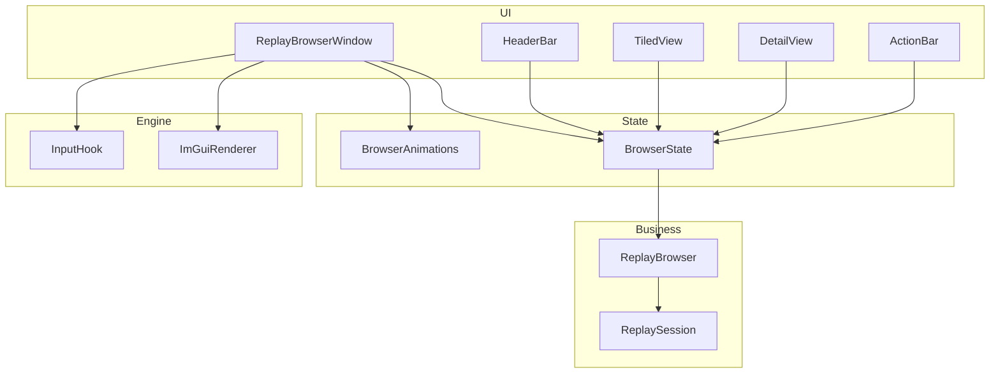

# 回放文件菜单（Replay Browser）UI 重构

> 入口：`src/playback/screen/`（业务层）+ 新增 `src/playback/refactor/replay-browser/`（ImGui UI 层）
> 角色：主菜单入口的**回放文件浏览器**。用户在此浏览、筛选、排序、预览并打开本地 `.playback` 回放文件。
> 与旧文档：复用旧 [ReplayBrowser](../screen/ReplayBrowser.md) 的列表加载/筛选/排序/打开逻辑；**替换**旧 `MainMenuHooks` 中基于 JSON UI 的弹窗为全新 ImGui 窗口。
> 与现有基础设施：复用 `refactor/editor/EditorTheme` 颜色板、`IconSystem` 图标字体、`InputHook` 输入分流、`ImGuiRenderer` D3D11/D3D12 渲染后端。

## 一、需求（Requirements）

### 1.1 功能性需求

| ID | 需求 | 优先级 |
|---|---|---|
| RB-1 | 以独立 ImGui 窗口覆盖整个游戏客户区，顶部仅保留单一导航栏，左侧显示「< 回放」返回入口，不显示标题或路径 | P0 |
| RB-2 | 单一导航栏右侧包含搜索框、导入按钮、排序下拉、设置按钮与视图切换（概况 / 详情） | P0 |
| RB-3 | 两种视图模式可通过右上角按钮切换：**平铺视图**（网格卡片）与**详细信息视图**（左侧列表 + 右侧预览/元数据） | P0 |
| RB-4 | 平铺视图：等宽卡片网格，每张卡片含缩略图、文件名、世界名、录制日期、时长、大小；支持多选（勾选框）与单选 | P0 |
| RB-5 | 详情视图：左侧纵向列表（小缩略图 + 核心信息），右侧大预览图 + 完整元数据表格 + 底部操作按钮 | P0 |
| RB-6 | 排序：日期、名称、世界、时长、文件大小；每种可升序/降序；下拉菜单显示当前排序项与方向 | P0 |
| RB-7 | 搜索：实时按文件名/世界名过滤；空结果显示空状态 | P0 |
| RB-8 | 选中项高亮：平铺视图显示蓝色外框；详情视图左侧列表项显示蓝色背景 | P0 |
| RB-9 | 平铺视图仅在存在选中项时显示底部操作栏：左侧仅显示文件名、大小、时长等简要文字，右侧显示打开/编辑/删除按钮；删除需二次确认 | P0 |
| RB-10 | 详情视图预览图使用静态 16:9 居中裁剪展示，不提供缩放、平移、重置或全屏控制按钮 | P1 |
| RB-11 | 文件卡片右上角「更多」菜单：打开/编辑/删除/在文件夹中显示 | P1 |
| RB-12 | 分页或虚拟滚动：文件较多时保持 60 FPS，不一次性实例化所有卡片 | P1 |
| RB-13 | 导入按钮：打开系统文件选择器，将选中的 `.playback` 文件复制到 replays 目录并刷新列表 | P2 |
| RB-14 | 设置按钮：预留入口，未来可切换显示字段、默认排序、缩略图质量 | P2 |

### 1.2 非功能性需求

- **全屏独占**：窗口占满整个游戏客户区，覆盖 3D 场景；不渲染游戏画面在背景中透出来
- **比例稳定**：平铺卡片缩略图固定为 4:3 裁剪容器，详情预览固定为 16:9 裁剪容器；均以居中裁剪填满容器，绝不拉伸
- **自适应布局**：平铺视图随窗口宽度自动重排列数；最小卡片宽度 240px，最大 360px；间距 16px。窄屏时降为双列或单列，详情视图改为列表在上、预览与元数据在下
- **动画流畅**：视图切换 200ms；选中高亮 150ms；按钮 hover 100ms；使用 ImGui 的 `ImLerp` 或动画状态机实现
- **输入分流**：与 `InputHook` 集成，浏览器打开时 MCBE 不接收键盘/鼠标；关闭后恢复
- **可发现性**：所有图标按钮 hover 0.3s 弹 tooltip（图标 + 文字 + 快捷键）
- **零 emoji**：所有图标使用 Lucide icon font（通过 `IconSystem`）
- **零外部样式**：颜色、圆角、间距统一走 `EditorTheme`
- **最小字号**：所有可见文本不小于 14px
- **可维护性**：每个子组件单一职责，可独立替换

### 1.3 与现有约束对齐

- 不破坏旧 `ReplayBrowser::loadReplays/sortReplays/filterReplays/openReplay` 业务接口
- 不破坏旧 `MainMenuHooks` 的入口：仍然通过主菜单「回放」按钮进入，只是弹窗改为 ImGui 窗口
- 复用 `ImGuiRenderer` 的 D3D11/D3D12 后端，不新增渲染管线
- 复用 `refactor/editor/IconSystem` 加载的 Lucide 字体（无需重新加载）
- 复用 `refactor/editor/EditorTheme` 颜色板；但浏览器窗口允许使用比编辑器更深的背景

## 二、架构（Architecture）

### 2.1 设计原则

| 项 | 旧设计 | 新设计 |
|---|---|---|
| 技术栈 | MCBE JSON UI + 数据绑定 | **ImGui v1.92.7** |
| 视图 | 单一列表 | **平铺 / 详情 双视图** |
| 预览 | 无 | **详情视图 16:9 大预览（无预览控制）** |
| 选择 | 单选 | **单选 + 多选** |
| 排序 UI | 按钮循环 + 方向按钮 | **下拉菜单** |
| 搜索 UI | 原生 TextEdit | **ImGui InputText** |
| 操作按钮 | 弹窗底部 | **底部固定操作栏** |
| 输入 | MCBE 内部处理 | **ImGui 捕获，MCBE 抑制** |

### 2.2 内部结构

```
playback/
├── screen/
│   ├── ReplayBrowser.h/.cpp          ← 已有：加载/筛选/排序/打开业务
│   └── MainMenuHooks.cpp             ← 修改：入口改为打开 ImGui 浏览器窗口
└── refactor/
    ├── replay-browser/               ← 新增模块
    │   ├── ReplayBrowserWindow.h/.cpp    ← 顶层窗口，持有状态，调度子组件
    │   ├── BrowserState.h/.cpp           ← 视图状态、选中、排序、搜索、动画参数
    │   ├── components/
    │   │   ├── HeaderBar.h/.cpp          ← 单导航栏、返回、搜索、导入、排序、设置、视图切换
    │   │   ├── SortDropdown.h/.cpp       ← 排序下拉菜单
    │   │   ├── TiledView.h/.cpp          ← 平铺网格
    │   │   ├── DetailView.h/.cpp         ← 详情视图（列表+预览）
    │   │   ├── FileCard.h/.cpp           ← 平铺卡片
    │   │   ├── FileListItem.h/.cpp       ← 详情列表行
    │   │   ├── PreviewPanel.h/.cpp       ← 16:9 大图预览
    │   │   ├── MetadataPanel.h/.cpp      ← 元数据键值表格
    │   │   └── ActionBar.h/.cpp          ← 底部操作栏
    │   └── animations/
    │       └── BrowserAnimations.h/.cpp  ← 视图切换、高亮、按钮反馈动画状态
    └── editor/                       ← 已有基础设施
        ├── EditorTheme.h/.cpp
        ├── IconSystem.h/.cpp
        ├── InputHook.h/.cpp
        └── renderer/ImGuiRenderer.cpp
```

### 2.3 整体布局（1920×1080 参考）

```
+-----------------------------------------------------------------------------+
| [< 回放]                         [搜索框] [导入] [排序 ▼] [设置] [概况|详情]|
|------------------------------------------------------------------------------|
| 共 12 个文件                                                                  |
|                                                                              |
|  +------------------------------------------------------------------------+  |
|  |                                                                        |  |
|  |   平铺视图：卡片网格   或   详情视图：左侧列表 + 右侧预览/元数据        |  |
|  |                                                                        |  |
|  |                                                                        |  |
|  |                                                                        |  |
|  |                                                                        |  |
|  |                                                                        |  |
|  |                                                                        |  |
|  +------------------------------------------------------------------------+  |
|                                                                              |
|------------------------------------------------------------------------------|
| [icon:file] 村庄扩建计划.replay   2.08 GB   00:42:18   [打开] [编辑] [删除] |
+-----------------------------------------------------------------------------+
```

**布局常量**（以 1080p 为基准，按 `scale` 等比缩放）：

```cpp
constexpr float kWindowPadding      = 24.0f;
constexpr float kNavigationHeight   = 56.0f;
constexpr float kCountTextHeight    = 24.0f;
constexpr float kActionBarHeight    = 64.0f;
constexpr float kCardMinWidth       = 240.0f;
constexpr float kCardMaxWidth       = 360.0f;
constexpr float kCardPreviewAspectRatio = 4.0f / 3.0f;
constexpr float kDetailPreviewAspectRatio = 16.0f / 9.0f;
constexpr float kCardGap            = 16.0f;
constexpr float kListWidthRatio     = 0.35f;   // 详情视图左侧列表默认占比
constexpr float kListMinWidth       = 280.0f;
constexpr float kListMaxWidth       = 0.50f;
constexpr float kPreviewMinHeight   = 200.0f;
```

**布局计算**：

1. 浏览器窗口占满 `io.DisplaySize`。
2. 顶部单一导航栏 + 计数行固定高度；导航栏左侧仅为「< 回放」，不显示路径或独立标题栏。
3. 平铺视图仅在存在选中项时显示底部操作栏；详情视图的操作按钮位于右侧元数据区底部。
4. 中间 `contentArea` = 窗口客户区 - 顶部 - 当前视图实际占用的底部操作区。
5. 平铺视图：在 `contentArea` 内以 `kCardMinWidth` 为列宽计算列数，按 `clamp(列数, 1, floor(contentArea.width / kCardMinWidth))`；卡片宽度 = `(contentArea.width - (列数-1)*gap) / 列数`，但不超过 `kCardMaxWidth`；若列宽 > max，则整体居中并减少列数或增大 gap。
6. 详情视图：宽度充足时左侧列表宽度 = `clamp(contentArea.width * kListWidthRatio, kListMinWidth, contentArea.width * kListMaxWidth)`，右侧为预览区 + 元数据区上下堆叠；低于布局断点时改为列表在上、预览与元数据在下。

### 2.4 视图模式详细说明

#### 2.4.1 平铺视图（Tiled View）

```
+-----------------------------------------------------------------------------+
|  [勾选]  [缩略图 4:3 裁剪]                                                   |
|              2024-05-20_冒险之旅.rpl                                        |
|  [icon:world] 樱花村庄                                                       |
|  [icon:calendar] 2024/05/20 22:15   [icon:clock] 01:28:47   1.25 GB         |
|  ···                                                                         |
+-----------------------------------------------------------------------------+
```

**卡片排版**（从上到下，左对齐）：

1. **缩略图区**：固定 4:3 裁剪容器，图片以居中裁剪填满且不拉伸；左上角显示多选勾选框；右上角显示「更多」按钮（三点竖向图标）。
2. **文件名**：缩略图下方 8px，14px 常规字重，单行截断。
3. **世界名**：文件名下方 4px，12px 次要色，前缀世界图标。
4. **元数据行**：世界名下方 8px，12px 次要色，横向排列日期、时长、大小，每项带图标，间距 12px。

**卡片状态**：

| 状态 | 视觉 |
|---|---|
| 默认 | 深灰背景，1px 深色边框 |
| Hover | 边框变亮，背景微亮，整体向上位移 2px（200ms ease-out） |
| 选中 | 2px 主题色（accent）外框，背景微泛主题色 |
| 多选勾选 | 勾选框内显示对勾，选中卡片整体同「选中」态 |
| 不可打开 | 缩略图降饱和/置灰，文件名前缀警告图标 |

**网格行为**：

- 列数随窗口宽度动态变化；重排时无动画。
- 竖向滚动：鼠标滚轮 / 滚动条；使用 `ImGui::BeginChild` + 虚拟滚动，仅渲染可见卡片。
- 空白区域：显示「暂无回放文件」+ 导入按钮。
- 右键空白：弹出「导入」、「刷新」菜单。

#### 2.4.2 详细信息视图（Detail View）

```
+-----------------------------------+-----------------------------------------+
| [缩略图] 最终之战.replay          |                                         |
| My World                          |          [大预览图 16:9]                |
| 2024/05/18 20:35   12:45          |                                         |
+-----------------------------------+-----------------------------------------+
| [缩略图] 村庄探索.replay          |  名称          最终之战.replay          |
| Survival World                    |  世界          My World                 |
| 2024/05/16 18:20   08:32          |  时间长度      12:45                    |
|                                   |  录制时间      2024/05/18 20:35         |
+-----------------------------------+  文件大小      128.7 MB                 |
| ...                               |  文件格式      .replay                  |
|                                   |  文件路径      .../最终之战.replay  [复制]|
|                                   |                                         |
|                                   |  [打开]  [编辑]  [删除]                 |
+-----------------------------------+-----------------------------------------+
```

**左侧列表**：

- 每一项高度 72px；左侧小缩略图 96×54px；右侧纵向堆叠文件名、世界名、日期/时长。
- 选中项：左侧 3px 主题色竖条 + 整体背景微亮。
- Hover：背景微亮。
- 滚动：独立滚动条。

**右侧区域**：

1. **预览区**：占右侧高度 55% ~ 65%；固定 16:9 裁剪容器，图片以居中裁剪填满且不拉伸；背景为深色。
2. **预览控制**：不提供缩放、平移、重置或全屏按钮；预览区右下角保持无控件。
3. **元数据表格**：预览区下方；两列（标签/值），行高 32px；标签右对齐次要色，值左对齐主色；文件路径末尾带复制按钮。
4. **底部按钮**：打开（主题色）、编辑（中性）、删除（危险色）。

### 2.5 组件说明

#### 2.5.1 `ReplayBrowserWindow`

```cpp
class ReplayBrowserWindow {
public:
    static ReplayBrowserWindow& getInstance();

    void open();
    void close();
    [[nodiscard]] bool isOpen() const;

    void draw();  // 每帧从 ImGuiRenderer 调用

private:
    bool mOpen{false};
    BrowserState mState;
    HeaderBar mHeaderBar;
    TiledView mTiledView;
    DetailView mDetailView;
    ActionBar mActionBar;
};
```

**生命周期**：

- `open()`：从 `MainMenuHooks` 调用；加载文件列表；设置 `mOpen = true`；请求 ImGui 输入捕获。
- `close()`：设置 `mOpen = false`；释放输入捕获。
- `draw()`：仅当 `mOpen` 时绘制；使用 `ImGui::Begin` 创建全屏窗口；调用各子组件 `draw`。

#### 2.5.2 `HeaderBar`

```cpp
class HeaderBar {
public:
    void draw(BrowserState& state, std::vector<EditorAction>& actions);
};
```

**元素从左到右**：

1. **返回入口**：导航栏左侧仅显示「< 回放」；不显示面包屑、路径或独立标题。
2. **搜索框**：导航栏右侧带搜索图标；实时过滤；清空按钮；占位文字「搜索回放文件」。
3. **导入按钮**：图标 + 文字；点击打开系统文件选择器。
4. **排序下拉**：按钮文字为当前排序项；下拉列出日期/名称/世界/时长/文件大小，每项右侧显示升/降箭头；分隔线后单独「升序」「降序」选项；底部显示「当前：日期 · 降序」。
5. **设置按钮**：图标按钮；点击弹出简易菜单（预留）。
6. **视图切换**：两个按钮「概况」「详情」；当前视图高亮；之间有 1px 分隔线。

#### 2.5.3 `TiledView`

```cpp
class TiledView {
public:
    void draw(BrowserState& state, std::vector<EditorAction>& actions);

private:
    void drawCard(const ReplaySummary& replay, size_t index, const ImVec2& pos, const ImVec2& size);
    int computeColumnCount(float availableWidth) const;
};
```

**实现要点**：

- 使用 `ImGui::BeginChild("##tiled-scroll", ...)` 创建滚动区。
- 仅当卡片进入可见区域时才绘制；用 `ImGui::GetScrollY()` 与卡片累计高度计算可见性。
- 缩略图使用 `ImTextureID`，占位图为纯色矩形；实际截图异步加载（P1）。
- 多选逻辑：`Ctrl + 单击` 切换选中；`Shift + 单击` 区间选择；勾选框单独响应。

#### 2.5.4 `DetailView`

```cpp
class DetailView {
public:
    void draw(BrowserState& state, std::vector<EditorAction>& actions);

private:
    MetadataPanel mMetadataPanel;
};
```

**实现要点**：

- 宽屏使用左右分栏，中间可拖拽分隔条调整列表宽度；窄屏切换为左侧列表在上、右侧预览和元数据在下的纵向排版。
- 左侧列表与右侧预览使用同步滚动：选中项变化时，左侧列表自动滚动到该项。
- 右侧预览区无选中时显示空状态提示。

#### 2.5.5 `PreviewPanel`

```cpp
class PreviewPanel {
public:
    void draw(const ReplaySummary* replay);
};
```

**交互**：

- 使用固定 16:9 裁剪容器，图片居中裁剪填满容器。
- 不响应滚轮缩放、拖拽平移、双击重置或全屏操作。
- 不在预览图右下角或其他位置渲染预览控制按钮。

#### 2.5.6 `MetadataPanel`

```cpp
class MetadataPanel {
public:
    void draw(const ReplaySummary& replay);
};
```

**字段**：

| 标签 | 值 | 备注 |
|---|---|---|
| 名称 | `replayName` / `replayId` | |
| 世界 | `worldName` | 空显示 `-` |
| 时间长度 | `formatDuration(totalTicks \| durationTicks)` | |
| 录制时间 | `formatLastModified(lastModified)` | |
| 文件大小 | `formatSize(fileSize)` + 原始字节数 | |
| 文件格式 | `.replay (Minecraft Replay Format)` | |
| 文件路径 | `path.string()` | 过长截断，末尾复制按钮 |

#### 2.5.7 `ActionBar`

```cpp
class ActionBar {
public:
    void draw(BrowserState& state, std::vector<EditorAction>& actions);
};
```

**布局**：

- 仅在平铺视图存在选中项时显示；详情视图不额外渲染该操作栏。
- 左侧：文件名 + 大小 + 时长等简要文字，不显示图片或文件图标。
- 右侧：打开（主题色主按钮）、编辑（次按钮）、删除（危险色按钮）。
- 多选时：左侧显示「已选择 N 个文件」，打开/编辑禁用，删除保留并提示批量删除。
- 无选中时：平铺视图隐藏整个操作栏。

### 2.6 动画与过渡

| 动画 | 时长 | 缓动 | 实现 |
|---|---|---|---|
| 视图切换（概况 ↔ 详情） | 200ms | ease-in-out | `BrowserAnimations::viewTransitionAlpha`；旧视图 alpha 1→0，新视图 alpha 0→1；内容水平位移 ±20px |
| 卡片 Hover 上浮 | 150ms | ease-out | 卡片绘制时 `y -= 2.0f * hoverFactor`，阴影 alpha 增加 |
| 选中高亮边框 | 150ms | ease-out | `BrowserAnimations::selectionPulse`；边框颜色从主题色渐变到高亮色 |
| 按钮 Hover | 100ms | linear | 背景色插值 |
| 排序下拉展开 | 150ms | ease-out | 高度从 0 到内容高度；alpha 0→1 |
| 空状态淡入 | 200ms | ease-out | alpha 0→1 |
| 删除确认弹窗 | 150ms | ease-out | 缩放 0.95→1.0 + alpha 0→1 |

**动画状态机**：

```cpp
struct BrowserAnimations {
    float viewTransitionAlpha{1.0f};
    float viewTransitionOffset{0.0f};
    float selectionPulse{0.0f};

    void update(float dt);
    void startViewSwitch(BrowserView target);
};
```

### 2.7 交互反馈

| 交互 | 反馈 |
|---|---|
| Hover 卡片 | 边框变亮，卡片上浮 2px，光标变手型 |
| Hover 按钮 | 背景色变亮；图标按钮显示 tooltip |
| 单击卡片 | 选中态立即出现；底部操作栏更新 |
| 双击卡片 | 直接打开回放 |
| Ctrl + 单击 | 切换多选；勾选框状态变化 |
| Shift + 单击 | 区间选中；中间卡片连续高亮 |
| 滚动列表 | 滚动条实时响应；卡片按需渲染 |
| 排序变更 | 列表/网格重新排列；当前排序项下拉显示高亮 |
| 搜索输入 | 200ms 防抖后过滤；无结果切换空状态 |
| 删除按钮 | 弹二次确认模态；确认后项移除并 toast 提示 |
| 导入成功 | 列表刷新，新文件高亮并滚动到可见 |
| 文件损坏 | 卡片显示警告图标；Hover tooltip 显示问题描述 |

### 2.8 ImGui 库与基础设施

**依赖**：

- `imgui v1.92.7`（xmake 已引入，dx11 + dx12 backend）
- `imgui_impl_dx11.h` / `imgui_impl_dx12.h`（渲染后端）
- `imgui_internal.h`（用于 `ImLerp`、控件矩形计算等内部工具）

**核心 ImGui API 使用**：

| 功能 | API |
|---|---|
| 全屏窗口 | `ImGui::SetNextWindowPos({0,0})` + `SetNextWindowSize(io.DisplaySize)` + `ImGuiWindowFlags_NoDecoration` |
| 子滚动区 | `ImGui::BeginChild` / `EndChild` |
| 按钮 | `ImGui::Button`、`ImGui::ImageButton` |
| 输入框 | `ImGui::InputText` |
| 下拉菜单 | `ImGui::BeginCombo` / `EndCombo` |
| 图片 | `ImGui::Image`、`ImDrawList::AddImage` |
| 自定义绘制 | `ImDrawList::AddRectFilled`、`AddRect`、`AddText`、`AddLine` |
| 动画 | `ImGui::GetIO().DeltaTime` + `ImLerp` |
| 剪贴板 | `ImGui::SetClipboardText` |

**复用基础设施**：

```cpp
// 主题
playback::refactor::editor::EditorTheme theme;
theme.apply();  // 每帧调用，保证风格一致

// 图标
#include "playback/refactor/editor/iconfont.h"
ImGui::Text(ICON_OPEN " 打开");
ImGui::Text(ICON_DELETE " 删除");
ImGui::Text(ICON_SEARCH " 搜索");

// 输入分流
playback::refactor::editor::InputHook::syncFrame();
// 浏览器开启时，WndProc 中由 ImGui 优先消费消息
```

**新增图标需求**（补充到 `iconfont.h` 或本地映射）：

| 用途 | Lucide 名 | 当前宏（若存在） |
|---|---|---|
| 导入 | upload | ICON_EXPORT |
| 排序 | arrow-up-down | 新增 ICON_SORT |
| 设置 | settings | 新增 ICON_SETTINGS |
| 网格视图 | layout-grid | 新增 ICON_VIEW_GRID |
| 列表视图 | list | 新增 ICON_VIEW_LIST |
| 日历 | calendar | 新增 ICON_CALENDAR |
| 时钟 | clock | 新增 ICON_CLOCK |
| 世界/地球 | globe | 新增 ICON_WORLD |
| 更多 | more-vertical | 新增 ICON_MORE |
| 复制 | copy | 新增 ICON_COPY |
| 文件夹打开 | folder-open | ICON_OPEN |
| 警告 | alert-triangle | 新增 ICON_WARNING |

### 2.9 数据流



**关键状态字段**：

```cpp
enum class BrowserView { Tiled, Detail };

struct BrowserState {
    BrowserView view{BrowserView::Tiled};
    BrowserView previousView{BrowserView::Tiled};

    std::vector<ReplaySummary> allReplays;
    std::vector<ReplaySummary> filteredReplays;

    std::string searchFilter;
    ReplaySort sort{ReplaySort::LastModified};
    bool sortDescending{true};

    std::unordered_set<size_t> selectedIndices; // 多选索引（基于 filteredReplays）
    std::optional<size_t> lastClickedIndex;

    bool requestScrollToSelection{false};
    std::optional<std::string> pendingToast;
};
```

## 三、执行（Execution）

### 3.1 任务拆分

| 步骤 | 文件 | 验证 |
|---|---|---|
| 1 | 在 `refactor/replay-browser/` 创建模块骨架 + `BrowserState` | 编译通过 |
| 2 | `ReplayBrowserWindow` 全屏窗口 + 生命周期 + `MainMenuHooks` 入口替换 | 主菜单按钮打开 ImGui 窗口 |
| 3 | `HeaderBar` 单导航栏（< 回放）/搜索/导入/排序/设置/视图切换 | 手动：不显示路径或第二条顶部栏，各控件可见、可交互 |
| 4 | `SortDropdown` 排序与方向选择 | 手动：排序变更后列表正确重排 |
| 5 | `TiledView` 网格布局 + 虚拟滚动 + `FileCard` | 手动：调整窗口宽度自动重排；滚动流畅 |
| 6 | `DetailView` 宽屏左右分栏、窄屏纵向重排 + `FileListItem` | 手动：各屏幕比例下列表可滚动，选中同步 |
| 7 | `PreviewPanel` 16:9 居中裁剪预览 | 手动：无缩放、平移、全屏或预览控制按钮，图片不拉伸 |
| 8 | `MetadataPanel` 元数据表格 + 复制路径 | 手动：字段正确，复制有效 |
| 9 | `ActionBar` 打开/编辑/删除 + 多选态 | 手动：单选/多选态按钮状态正确 |
| 10 | 选择模型（单选/多选/双击打开） | 手动：Ctrl/Shift/双击行为正确 |
| 11 | `BrowserAnimations` 视图切换 + hover + 选中动画 | 手动：动画流畅 |
| 12 | 输入分流集成：`InputHook` 在浏览器开启时抑制 MCBE | 单测/手动：MCBE 不收键盘鼠标 |
| 13 | 空状态、加载中、错误状态 | 手动：空文件夹/损坏文件展示正确 |
| 14 | 导入按钮：系统文件选择器 + 复制 + 刷新 | 手动：导入后新文件出现在列表 |
| 15 | 翻译 key 补充到 `zh_CN.json` 和 `en_US.json` | 手动：所有文本走翻译 |
| 16 | 性能验证：1000 个文件虚拟滚动保持 60 FPS | 手动/Profiler |

### 3.2 关键算法

**列数计算（平铺视图）**：

```cpp
int TiledView::computeColumnCount(float availableWidth) const {
    float minTotal = kCardMinWidth + kCardGap;
    int cols = std::max(1, static_cast<int>((availableWidth + kCardGap) / minTotal));
    float cellWidth = (availableWidth - (cols - 1) * kCardGap) / cols;
    if (cellWidth > kCardMaxWidth && cols > 1) {
        // 若单张太宽，尝试减少列数并重新检查
        while (cols > 1) {
            int nextCols = cols - 1;
            float nextCell = (availableWidth - (nextCols - 1) * kCardGap) / nextCols;
            if (nextCell < kCardMinWidth) break;
            cols = nextCols;
        }
    }
    return cols;
}
```

**虚拟滚动可见性**：

```cpp
void TiledView::draw(BrowserState& state, std::vector<EditorAction>& actions) {
    ImGui::BeginChild("##tiled-scroll", contentSize, false, ImGuiWindowFlags_AlwaysUseWindowPadding);
    float scrollY = ImGui::GetScrollY();
    float visibleMin = scrollY;
    float visibleMax = scrollY + contentSize.y;

    int cols = computeColumnCount(contentSize.x);
    float cellW = (contentSize.x - (cols - 1) * kCardGap) / cols;
    float cellH = cellW / kCardPreviewAspectRatio + kCardTextHeight;

    size_t rowCount = (state.filteredReplays.size() + cols - 1) / cols;
    float totalHeight = rowCount * cellH + (rowCount - 1) * kCardGap;
    ImGui::Dummy(ImVec2(0.0f, totalHeight));

    for (size_t i = 0; i < state.filteredReplays.size(); ++i) {
        int row = static_cast<int>(i / cols);
        int col = static_cast<int>(i % cols);
        float y = row * (cellH + kCardGap);
        if (y + cellH < visibleMin || y > visibleMax) continue;
        float x = col * (cellW + kCardGap);
        drawCard(state.filteredReplays[i], i, ImVec2(x, y), ImVec2(cellW, cellH));
    }
    ImGui::EndChild();
}
```

**视图切换动画**：

```cpp
void BrowserAnimations::startViewSwitch(BrowserView target) {
    mViewTransitionOffset = (target == BrowserView::Detail) ? 20.0f : -20.0f;
    mViewTransitionAlpha = 0.0f;
    mAnimating = true;
}

void BrowserAnimations::update(float dt) {
    if (!mAnimating) {
        mViewTransitionAlpha = ImLerp(mViewTransitionAlpha, 1.0f, dt * 10.0f);
        mViewTransitionOffset = ImLerp(mViewTransitionOffset, 0.0f, dt * 10.0f);
        if (std::abs(mViewTransitionAlpha - 1.0f) < 0.001f) mAnimating = false;
    }
}
```

**预览裁剪**：

```cpp
void PreviewPanel::draw(const ReplaySummary* replay) {
    ImVec2 avail = ImGui::GetContentRegionAvail();
    ImVec2 previewSize{avail.x, std::min(avail.y, avail.x / kDetailPreviewAspectRatio)};
    ImVec2 previewPos = ImGui::GetCursorScreenPos();
    ImRect clipRect{previewPos, previewPos + previewSize};
    auto* drawList = ImGui::GetWindowDrawList();
    drawList->AddRectFilled(clipRect.Min, clipRect.Max, kPreviewBg);
    if (replay && texture) {
        drawList->PushClipRect(clipRect.Min, clipRect.Max, true);
        drawList->AddImage(texture, clipRect.Min, clipRect.Max);
        drawList->PopClipRect();
    }
}
```

### 3.3 关键不变量

1. **浏览器开启 = MCBE 输入全抑制**（玩家不能动、不能转视角）
2. **浏览器关闭 = MCBE 输入恢复**
3. **两种视图共用同一份 `BrowserState` 状态**：切换视图后选中、排序、搜索保持不变
4. **所有可见文本走 `ll::i18n_literals` 翻译 key**：不硬编码中文或英文
5. **预览比例固定**：平铺缩略图使用 4:3、详情预览使用 16:9；均居中裁剪且不拉伸
6. **卡片宽度在 `[kCardMinWidth, kCardMaxWidth]` 范围内**：窗口极端尺寸时至少显示 1 列
7. **虚拟滚动**：无论文件数量多少，每帧绘制的卡片数不超过可见区域需要的数量
8. **删除必须二次确认**：防止误操作
9. **打开文件前检查 `canOpen`**：损坏文件给出明确提示
10. **所有按钮 hover 0.3s 弹 tooltip**
11. **零 emoji**：代码中不出现 emoji 字符
12. **颜色统一走 `EditorTheme`**：不局部硬编码颜色常量
13. **详情预览零控制**：不渲染缩放、平移、重置或全屏按钮，也不响应对应输入

### 3.4 测试用例

| ID | 用例 | 期望 |
|---|---|---|
| RB-T1 | 主菜单点击「回放文件」 | ImGui 浏览器窗口覆盖全屏，MCBE 输入被抑制 |
| RB-T2 | 调整窗口宽度和比例 | 平铺视图列数自适应，窄屏降为双列或单列；详情视图改为列表在上、预览和元数据在下 |
| RB-T3 | 平铺视图滚动 1000 个文件 | 帧率保持 60 FPS，仅可见卡片绘制 |
| RB-T4 | 搜索框输入「村庄」 | 列表实时过滤，仅显示匹配项 |
| RB-T5 | 排序切换为「名称 · 升序」 | 卡片按名称字母顺序排列 |
| RB-T6 | 单击卡片 | 卡片高亮，底部操作栏显示该文件信息 |
| RB-T7 | Ctrl + 单击多个卡片 | 多选集合增减，勾选框状态同步 |
| RB-T8 | Shift + 单击 | 区间选中，中间卡片全部高亮 |
| RB-T9 | 双击卡片 | 关闭浏览器并打开回放 |
| RB-T10 | 切换「详情」视图 | 左侧列表显示，右侧显示默认/当前选中预览 |
| RB-T11 | 详情视图点击列表项 | 右侧预览与元数据更新 |
| RB-T12 | 平铺与详情预览图 | 分别以 4:3、16:9 容器居中裁剪，图片不拉伸 |
| RB-T13 | 详情预览区滚轮、拖拽、双击 | 不缩放、不平移、不重置，且右下角无控制按钮 |
| RB-T14 | 点击删除按钮 | 弹出二次确认；确认后文件从列表移除 |
| RB-T15 | 点击打开按钮 | 调用 `ReplayBrowser::openReplay` 并关闭浏览器 |
| RB-T16 | 导入有效 `.playback` | 文件复制到 replays 目录，列表刷新，新文件可见 |
| RB-T17 | 损坏文件 | 卡片显示警告图标，不可打开 |
| RB-T18 | 浏览器开启时按 Esc | 关闭浏览器，MCBE 输入恢复 |
| RB-T19 | 空文件夹 | 显示空状态 + 导入按钮 |
| RB-T20 | 视图切换动画 | 200ms 内平滑过渡，无闪烁 |

### 3.5 风险与回退

| 风险 | 缓解 |
|---|---|
| ImGui 全屏窗口与 MCBE WndProc 冲突 | 复用 `InputHook` 机制；浏览器开启时强制抑制 MCBE 输入 |
| 大量文件导致渲染卡顿 | 强制虚拟滚动；每帧最多绘制可见区域卡片 |
| 缩略图/预览图异步加载复杂 | P0 阶段使用纯色占位 + 文件名首字母；P1 引入异步加载 |
| 系统文件选择器跨平台/兼容性问题 | P0 阶段导入按钮先实现为命令行入口或推迟；P1 接入平台 API |
| 字体未加载导致图标方块 | fallback 显示文字标签；console warning |
| 用户截图比例与容器不一致 | 平铺按 4:3、详情按 16:9 居中裁剪，保证不拉伸 |
| 选中状态在过滤/排序后失效 | 过滤/排序时保留按路径的选中集合；失效项自动移除 |
| 删除操作不可逆 | 二次确认弹窗；后续可接入回收站 |

## 四、模块关系

### 被谁调用（上游）

- **旧 `MainMenuHooks`**：点击主菜单「回放文件」按钮后调用 `ReplayBrowserWindow::open()`
- **旧 `ReplayUI` / `Editor` 的 File > Open Replay**：未来可复用同一窗口

### 调用谁（下游）

- **旧 `ReplayBrowser`**：加载、筛选、排序、打开文件
- **旧 `ReplaySession`**：打开回放后启动会话
- **`refactor/editor/ImGuiRenderer`**：每帧调用 `draw()`
- **`refactor/editor/InputHook`**：输入捕获/释放
- **`refactor/editor/EditorTheme`**：统一样式
- **`refactor/editor/IconSystem`**：图标字体

### 共享数据

- `BrowserState::filteredReplays` 与 `ReplayBrowser::loadReplays` 结果
- `ReplaySummary` 结构体（路径、名称、世界、时长、大小等）

### 事件订阅 / 发送

- `ReplayBrowserWindow::onOpen` → 触发列表加载
- `BrowserState::onSelectionChanged` → `ActionBar` / `PreviewPanel` / `MetadataPanel` 更新
- `BrowserState::onViewChanged` → `BrowserAnimations` 启动切换动画

## 五、阅读顺序

1. 本文件
2. [screen/replay-browser.md](../screen/replay-browser.md)（业务层 `ReplayBrowser`）
3. [editor/renderer.md](../editor/renderer.md)（ImGui 渲染后端）
4. [refactor/01-editor-architecture.md](../refactor/01-editor-architecture.md)（主题/图标/输入分流复用点）
